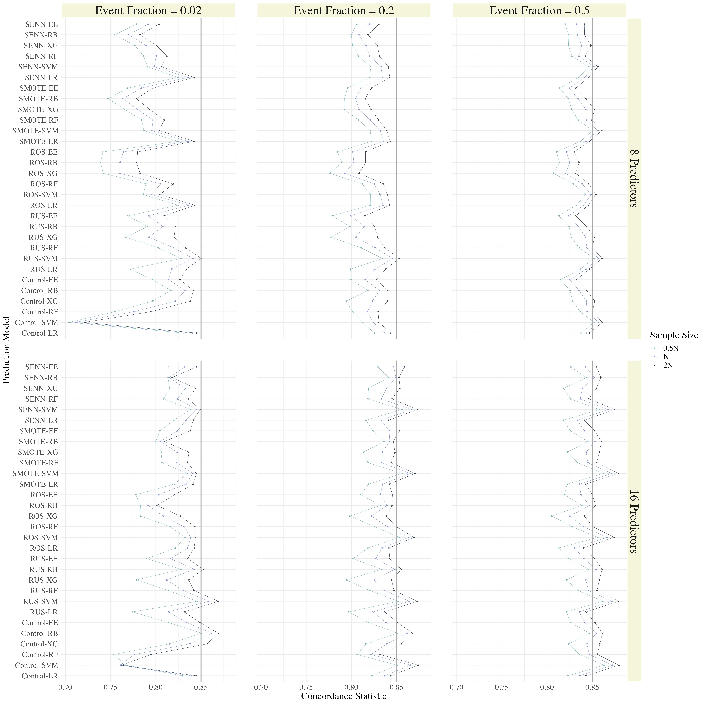
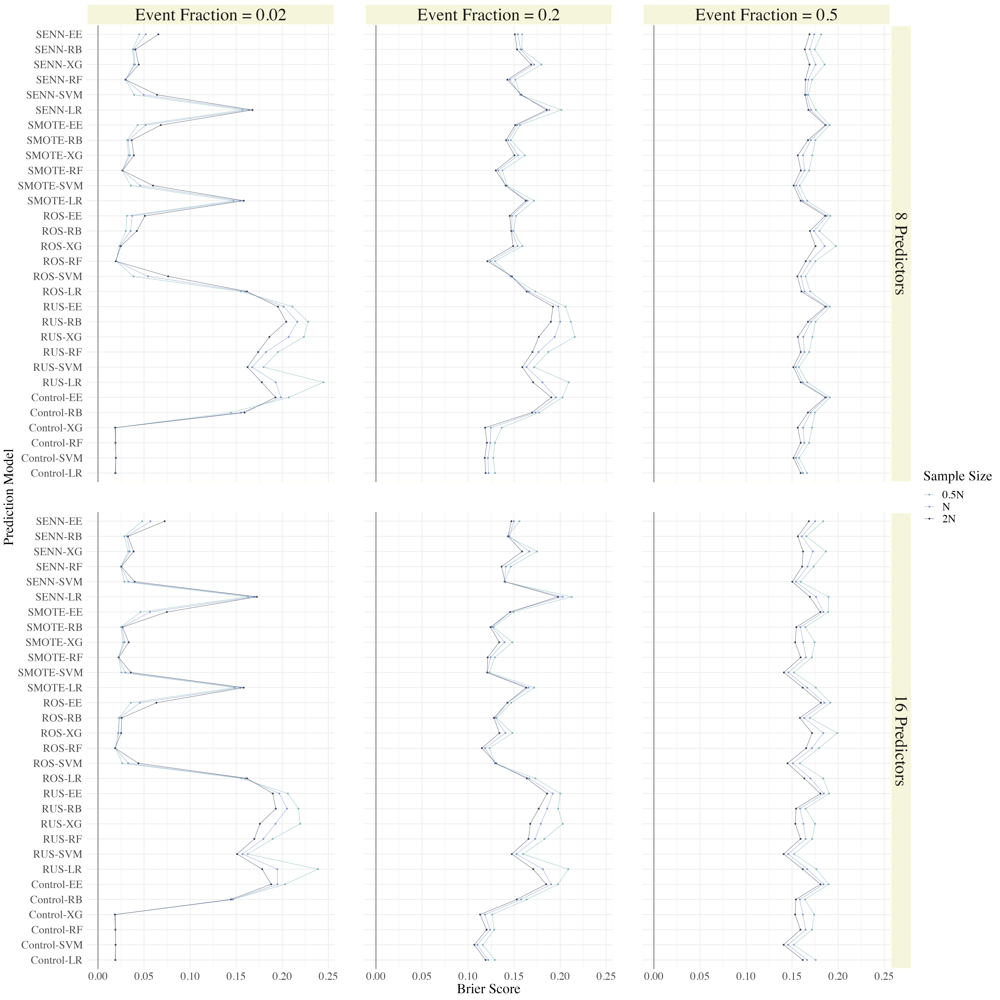
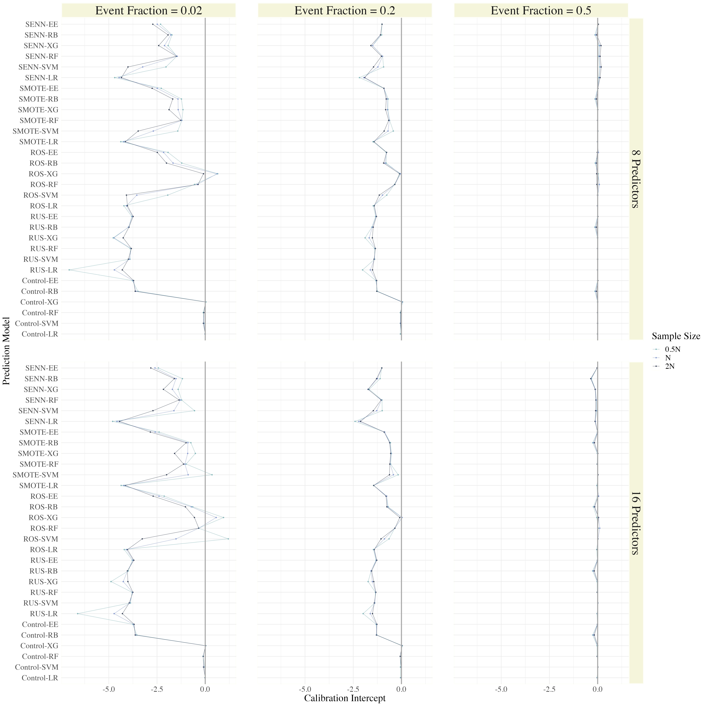
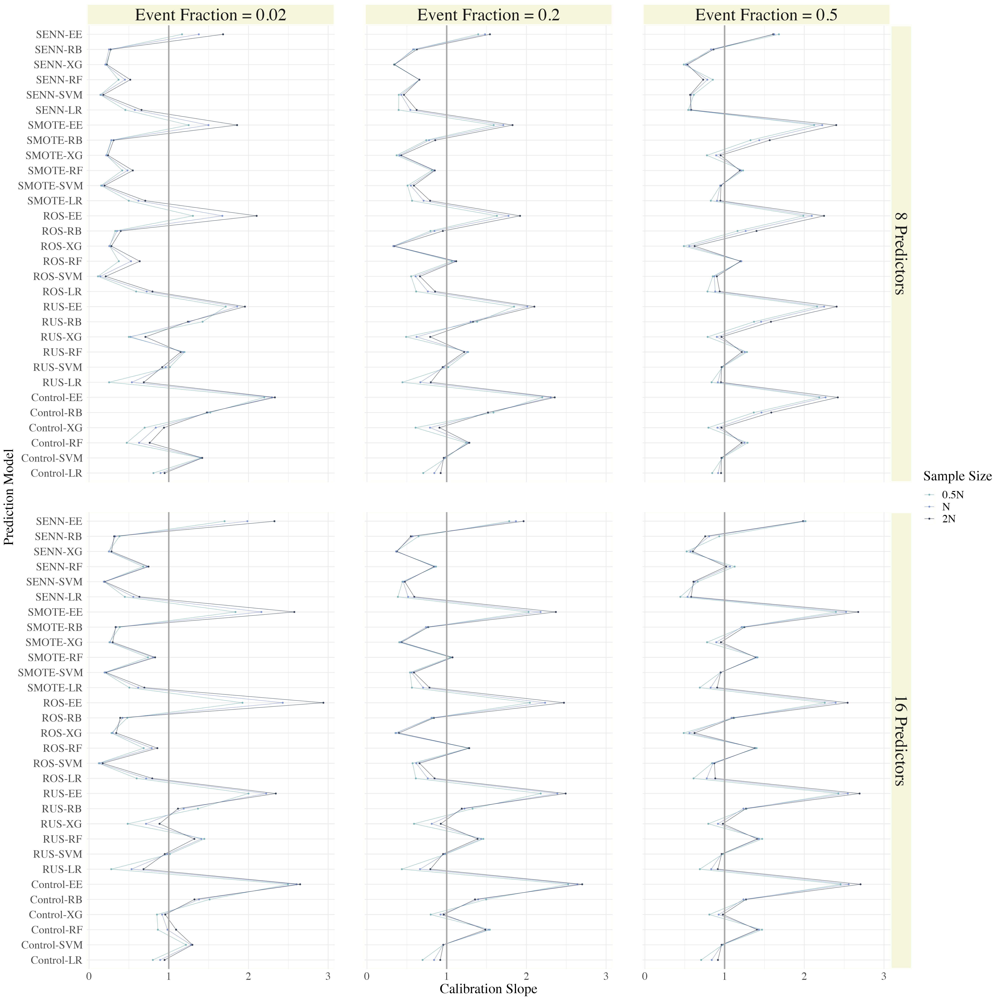

# The Article Header Information

YAML header:

```
output:
  rticles::sim_article:
    keep_tex: TRUE
```

Configure the YAML header including the following elements:

* `title`: Title

* `author`: List of author(s) containing `name` and `num`

* `address`: List containing `num` and `org` for defining `author` affiliations

* `presentaddress`: Not sure what they mean with this

* `corres`: Author and address for correspondence

* `authormark`: Short author list for header

* `received`, `revised`, `accepted`: dates of submission, revision, and acceptance of the manuscript

* `abstract`: Limited to 250 words

* `keywords`: Up to 6 keywords

* `bibliography`: BibTeX `.bib` file

* `classoption`: options of the `WileyNJD-v2` class

* `longtable`: set to `true` to include the `longtable` package, used by default from `pandoc` to convert markdown to \LaTeX code

## Remarks

1. In `authormark` use _et al._ if there are three or more authors.

2. Note the use of `num` to link names and addresses.

3. For submitting a double-spaced manuscript, add `doublespace` as an option to a `classoption` line in the YAML header: `classoption: doublespace`.

4. Keywords are separated by semicolons.

# The Body of the Article

## Mathematics

Use mathematics in Rmarkdown as usual.

## Figures and Tables

Figures are supported from R code:

...and can be referenced (Figure \ref{fig:plot}) by including the `\\label{}` tag in the `fig.cap` attribute of the R chunk: `fig.cap = "Fancy Caption\\label{fig:plot}"`. It is a quirky hack at the moment, see [here](https://github.com/yihui/knitr/issues/323).

Analogously, use Rmarkdown to produce tables as usual:

```{r, results = "asis"}
if (!require("xtable")) install.packages("xtable")
xt <- xtable(head(cars), caption = "A table", label = "tab:table")
print(xt, comment = FALSE)
```

Referenced via \ref{tab:table}. You can also use the YAML option `header-includes` to includes custom \LaTeX packages for tables (keep in mind that `pandoc` uses `longtables` by default, and it is hardcoded; some things may require including the package `longtable`). E.g., using `ctable`:
```
header-includes:
- \usepackage{ctable}
```
Then, just write straight-up \LaTeX code and reference is as usual (`\ref{tab:ctable}`):
```
\ctable[cap = {Short caption},
        caption = {A long, long, long, long, long caption for this table.},
        label={tab:ctable},]
        {cc}
        {
        \tnote[$\ast$]{Footnote 1}
        \tnote[$\dagger$]{Other footnote}
        \tnote[b]{Mistakes are possible.}
        }{
        \FL
        COL 1\tmark[a] & COL 2\tmark[$\ast$]
        \ML
        6.92\tmark[$\dagger$] & 0.09781 \\
        6.93\tmark[$\dagger$] & 0.09901 \\
        97 & 2000
        \LL
}
```

It is also possible to set the `YAML` option `longtable: true` and use markdown tables (or the `knitr::kable` function): `knitr::kable(head(cars))` produces the same table as the `xtable` example presented before.

## Cross-referencing

The use of the Rmarkdown equivalent of the \LaTeX cross-reference system
for figures, tables, equations, etc., is encouraged (using `[@<name>]`, equivalent of `\ref{<name>}` and `\label{<name>}`). That works well for citations in Rmarkdown, not so well for figures and tables. In that case, it is possible to revert to standard \LaTeX syntax.

## Double Spacing

If you need to double space your document for submission please use the `doublespace` option in the header.

# Bibliography

Link a `.bib` document via the YAML header, and bibliography will be printed at the very end (as usual). The default bibliography style is provided by Wiley as in `WileyNJD-AMA.bst`, do not delete that file.

Use the Rmarkdown equivalent of the \LaTeX citation system using `[@<name>]`. Example: [@Taylor1937], [@Knupp1999; @Kamm2000].

To include all citation from the `.bib` file, add `\nocite{*}` before the end of the document.

# Further information

All \LaTeX enviroments supported by the main template are supported here as well; see the `.tex` sample file [here](http://onlinelibrary.wiley.com/journal/10.1002/(ISSN)1097-0258/homepage/la_tex_class_file.htm) for more details and example.

# Another Heading 

\newpage 
.
\newpage
.
\newpage 
.
\newpage
.
\newpage 
.
\newpage
.
\newpage 
.
\newpage
.
\newpage 
.
\newpage
.
\newpage 
.
\newpage
.
\newpage
.
\newpage
.
\newpage
.
.


\newpage 
\
**APPENDIX**\
\
**A: Deriving Data Generating Parameters Based on Concordance Statistic**\
\
Under the assumption of normality for all predictors (in each class), the concordance statistic ($C$) of the data can be calculated directly, using equation ($A1$).  This equation is suitable when the covariance matrices of each class are *not* equivalent. For $p$ predictors, $\pmb{\Delta_\mu}$ is a $p$ x $1$ vector housing the differences in predictor means between class 0 and class 1. $\pmb{\Sigma_0}$ and $\pmb{\Sigma_1}$ represent the covariance matrices of class 0 and 1 respectively and $\Phi$ is the cumulative density function (cdf) of the standard normal distribution.\
\
\begin{equation} \tag{A1}
C = \Phi \left( \sqrt{\pmb{\Delta_\mu}{'}\  (\pmb{\Sigma_0} + \pmb{\Sigma_1})^{-1} \ \pmb{\Delta_{\mu}}} \right)
\end{equation}\
\
\
In our research, the differences in predictor means between the classes were equivalent. In other words, the elements of $\pmb{\Delta_\mu}$ were equivalent; denoted by $\delta_\mu$.  The differences in predictor variances between the classes were also equivalent.  The diagonal elements of $\pmb{\Sigma_0}$ were all zero, and the diagonal elements of $\pmb{\Sigma_1}$ were all equal to ($1- \delta_\Sigma$) as shown in section 2.1.  To ensure a unique solution, $\delta_\Sigma$ was fixed to $0.3$.  Then, equation ($A1$) was solved to determine the value of $\delta_\mu$ that yields a concordance statistic ($C$) of $0.85$. \
\
Let $\pmb{A} = (\pmb{\Sigma_0} + \pmb{\Sigma_1})^{-1}$,

\begin{align*}
(\Phi^{-1}(C))^2 &= \pmb{\Delta_\mu{'}}  \pmb{A} \  \pmb{\Delta_{\mu}}\\
(\Phi^{-1}(C))^2 &= 
\begin{bmatrix}
 \delta_\mu & \delta_\mu &   \dots &  \delta_\mu &  \delta_\mu
\end{bmatrix} \begin{bmatrix} 
    a_{11} & a_{12}  & \dots  & a_{1p}\\
    \vdots &         & \ddots & \\
    a_{p1} &  a_{p2} & \dots  & a_{pp} 
\end{bmatrix}\begin{bmatrix}
 \delta_\mu \\ \delta_\mu \\ \vdots \\ \delta_\mu \\ \delta_\mu
\end{bmatrix}\\
(\Phi^{-1}(C))^2 &= \delta_{\mu}^2 \sum_{j = 1}^{p} \sum_{i = 1}^{p} a_{ij}
\end{align*}
\
\
\
Based on a desired $C$ of $0.85$, \
\
\begin{equation} \tag{A2}
\delta_\mu = \frac{\Phi^{-1}(0.85)}{\sqrt{\sum_{j = 1}^{p} \sum_{i = 1}^{p} a_{ij}}}.
\end{equation}\
\
\
Equation ($A2$) was used to derive the appropriate $\delta_\mu$ for each simulation scenario. The R code used for implementation of this formula can be found on GitHub, in the directory `simulation_code`, sub-directory `data-generating-mechanism`: [https://github.com/alexcarriero/class_imbalance_project](https://github.com/alexcarriero/class_imbalance_project)
\
\
\
**B: Median Performance Measures Across 18/18 Simulation Scenarios.**\


\clearpage
```{r, echo = F, fig.align="center", out.width='90%', fig.cap = "Median concordance statistics for all prediction models in 18/18 simulation scenarios.\\label{fig:B1}"}

```

\clearpage

```{r, echo = F, fig.align="center", out.width='90%', fig.cap = "Median Brier scores for all prediction models in 18/18 simulation scenarios.\\label{fig:B2}"}

```

\clearpage

```{r, echo = F, fig.align="center", out.width='90%', fig.cap = "Median calibration intercepts for all prediction models in 18/18 simulation scenarios.\\label{fig:B3}"}

```

\clearpage

```{r, echo = F, fig.align="center", out.width='90%', fig.cap = "Median calibration slopes for all prediction models in 18/18 simulation scenarios.\\label{fig:B4}"}

```

\clearpage 

\newpage

