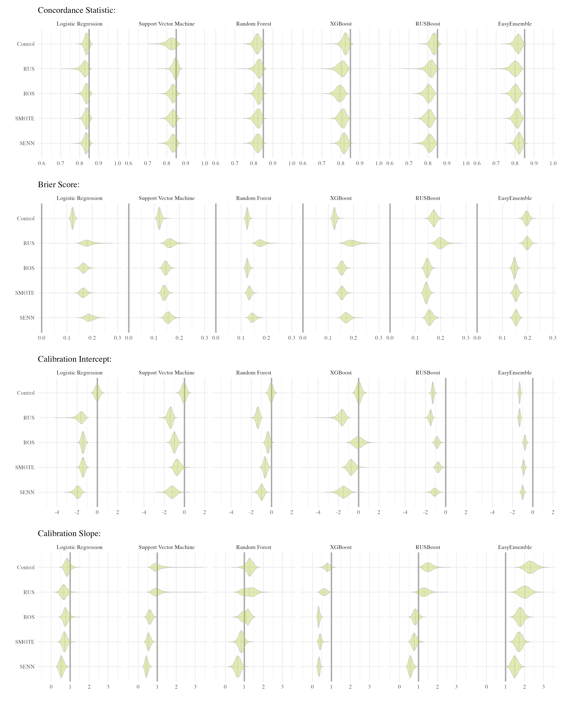
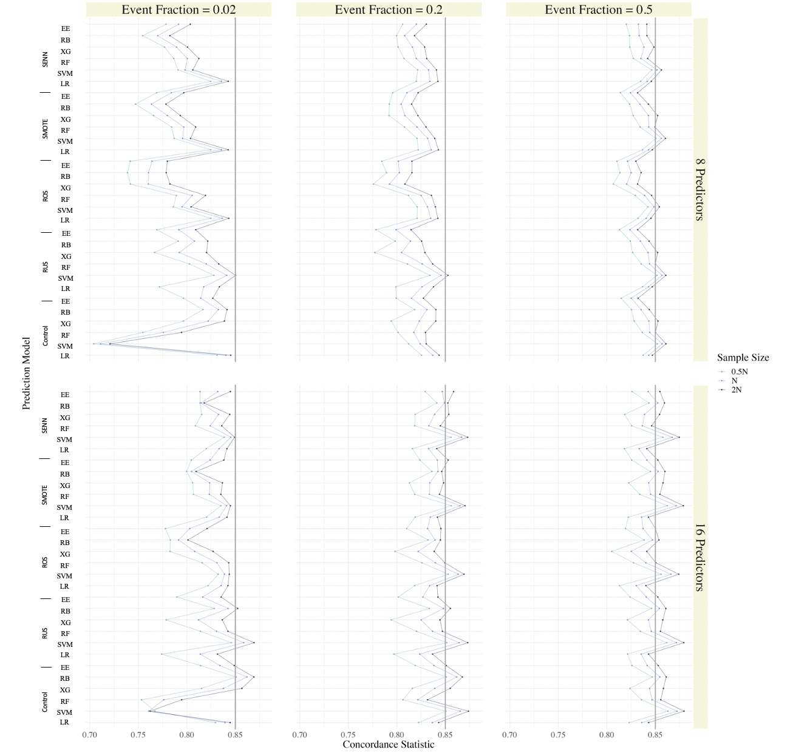
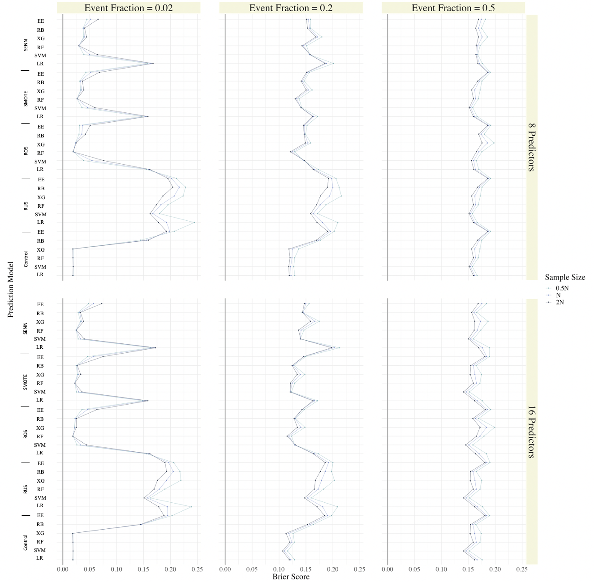
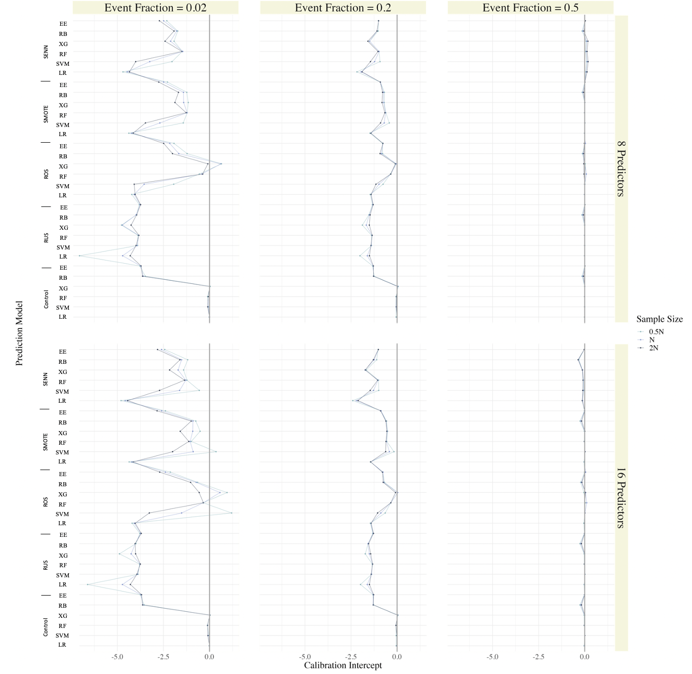
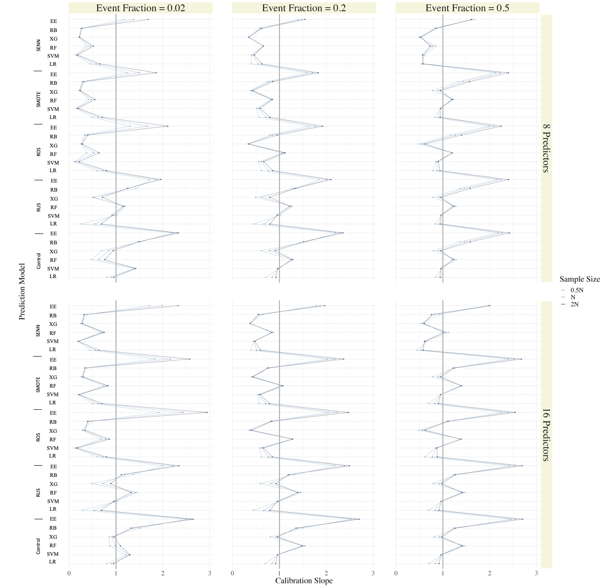

# Introduction

Prediction models are increasingly used in medical domains to aid in clinical decision making; for example, to help decide if a patient is a good candidate for surgery or to communicate a patient's risk of disease [@ewout_intro; @annals; @achilles]. As such, the purpose of a clinical prediction model is often to estimate a patient's risk of experiencing a particular event (e.g., successful surgery, disease). Due to the rarity of many diseases, data available to train clinical prediction models often exhibit class imbalance (i.e., observations from patients with vs. without the event of interest are not equally represented in the data).  As the number of observed events decreases, relative to a fixed total sample size,  prediction model performance is known to diminish [@maartens_paper]. Specifically, when observed events are too few relative to a given sample size and the dimensionality of the model (number of predictors), prediction models may not estimate risk accurately, and with sufficient precision to guide patient treatment decisions [@maartens_paper; @newpaper].  In machine learning literature, imbalance correction methodologies are commonly applied to mitigate the effects of class imbalance by artificially creating data that are more or perfectly balanced [@cip; @summary_m; @lp; @summary_h].\
\
While an abundance of imbalance correction methods exist [@summary_m; @lp; @summary_h], information regarding the effect of these imbalance corrections on model calibration is sparse.  Model calibration captures the reliability of individual risk predictions [@achilles].  In clinical applications, it is essential to assess model calibration, as when a prediction model is developed for clinical use, each patient's predicted risk is the entity that is used to inform clinical decisions. If a model is poorly calibrated, it may produce risk estimates that do not reflect a patient's true risk well [@achilles]. A poorly calibrated model may produce predicted risks that consistently over- or under-estimate true risk or that are too extreme (too close to 0 or 1) or too modest (too close to event prevalence) [@achilles]. This can lead to poor treatment decisions or to clinicians communicating false assurances to patients [@achilles; @12days; @bens_paper]. In case a clinician uses a poorly calibrated model to make a highly impactful decision (e.g., to determine if a patient should receive a bed in an intensive care unit), the costs of miscalibration to patients are real and far-reaching.\
\
So far only one study has assessed the impact of imbalance corrections on model calibration [@ruben]. In their study, the authors demonstrate that class imbalance corrections do more harm than good; implementing imbalance corrections resulted in dramatically deteriorated model calibration, to the point that no corrections were recommended [@ruben]. In this study, prediction models were developed using logistic regression or penalized logistic regression [@ruben]. In practice, prediction models developed for clinical applications increasingly use machine learning methods [@constanza]. A recent systematic review of clinical prediction models indicates that machine learning algorithms like support vector machine and tree-based learning with random forest, are especially common [@constanza]. The impact of imbalance corrections on model calibration is currently unknown for prediction models developed using these other machine learning algorithms.\
\
Building on the work of van den Goorbergh \emph{et al}. (2022) [@ruben], we assess the impact of imbalance corrections on model calibration for prediction models trained with a wide variety of machine learning algorithms including: logistic regression, support vector machine, random forest, XGBoost, RUSBoost and EasyEnsemble. This paper is structured as follows. We present the design of our simulation study in section 2 and the results in section 3.  A discussion of our findings and their implications for researchers developing prediction models in the presence of class imbalance is presented in section 4. We present our conclusions in section 5. 

#  Methods 

In our research, we focused on prediction models designed for dichotomous risk prediction. We implemented a simulation study to investigate the effects of imbalance correction methodologies across 18 unique data-generating scenarios (section 2.2).  For each scenario, we compared the out-of-sample predictive performance (i.e., model performance on data not used to train the model) of prediction models developed using a two-step procedure (section 2.3).  This procedure consisted of an imbalance correction step in which the data were pre-processed, and a model training step in which the pre-processed data were used to train a machine learning model. All code used to implement the simulation study, and process the results is made publicly available (section 2.6). Ethical approval for this research was granted by the Ethical Review Board of the Faculty of Social and Behavioural Sciences at Utrecht University and is filed under number 22-1809.

##  Data Generating Mechanism 
\
As we focused on dichotomous risk prediction, we generated data comprised of two classes.  We refer to the negative class (non-events) and positive class (events) as class 0 and class 1, respectively.  Data for each class were generated independently using distinct multivariate normal ($mvn$) distributions.  As shown in equations 1 and 2, we specified a distinct mean and covariance structure for each class. The mean structures for the classes are represented as $\pmb{\mu_0}$ and $\pmb{\mu_1}$ for class 0 and 1, respectively. The covariance matrices are represented as $\pmb{\Sigma_0}$ and $\pmb{\Sigma_1}$ for class 0 and 1, respectively.

\begin{align}
&\mathrm{Class \ \  0:} \mathbf{X} \sim mvn( \pmb{\mu_0}, \pmb{\Sigma_0}) = mvn(\pmb{0}, \pmb{\Sigma_0}), \\
&\mathrm{Class \ \  1:} \mathbf{X} \sim mvn( \pmb{\mu_1}, \pmb{\Sigma_1}) = mvn(\pmb{\Delta_\mu}, \pmb{\Sigma_0} - \pmb{\Delta_\Sigma})
\end{align}
\
As shown in equation 2, the differences in parameter values between the two classes are represented by $\pmb{\Delta_\mu}$ and $\pmb{\Delta_\Sigma}$; a vector and matrix comprised of the differences in predictor means, and variances/ covariances, between the classes, respectively.  We specified no variation in means among predictors within a class, making all elements in $\pmb{\Delta_\mu}$ equivalent; we denote these equivalent elements as $\delta_\mu$. Similarly, we specified no variation in predictor variances within a class, making all diagonal elements in the matrix $\pmb{\Delta_\Sigma}$ equivalent, denoted by $\delta_\Sigma$.\
\
For class 0, all predictor means were fixed to zero and all variances to 1. For class 1, all means were non-zero and are represented in the vector $\pmb{\Delta_\mu}$. Finally, in both classes, we allowed $75$% of the predictors to covary. All non-zero correlations among predictors in each class were set to $0.2$.  To ensure the correlation among predictors was not stronger in one class, we fixed the correlation matrices of the two classes to be equal.  This was accomplished by computing the off-diagonal elements of $\pmb{\Delta_\Sigma}$ such that the correlation matrices of the two classes were equivalent (as shown below).\
\
For instance, with 8 predictors, the mean and covariance structure for class 0 was,\

\begin{equation*}
\pmb{\mu_0} = \begin{bmatrix}
 0 \\ 0 \\ 0\\ 0 \\ 0 \\ 0 \\ 0 \\ 0
\end{bmatrix}, \pmb{\Sigma_0} = \begin{bmatrix}
1   & 0.2 & 0.2 & 0.2 & 0.2 & 0.2 & 0 & 0\\
0.2 & 1   & 0.2 & 0.2 & 0.2 & 0.2 & 0 & 0\\
0.2 & 0.2 & 1   & 0.2 & 0.2 & 0.2 & 0 & 0\\
0.2 & 0.2 & 0.2   & 1 & 0.2 & 0.2 & 0 & 0\\
0.2 & 0.2 & 0.2   & 0.2 & 1 & 0.2 & 0 & 0\\
0.2 & 0.2 & 0.2   & 0.2 & 0.2 & 1 & 0 & 0\\
0   & 0   & 0     &  0 & 0    & 0 & 1 & 0\\
0   & 0   & 0     &  0 & 0    & 0 & 0 & 1\\
\end{bmatrix}
\end{equation*}

\
\
and mean and covariance structure for class 1 was,\

\begin{equation*}
\pmb{\mu_1} = \begin{bmatrix}
 \delta_\mu \\ \delta_\mu \\ \delta_\mu \\ \delta_\mu \\ \delta_\mu \\ \delta_\mu \\ \delta_\mu \\ \delta_\mu
\end{bmatrix}, \pmb{\Sigma_1} = \begin{bmatrix}
1 - \delta_\Sigma   & z & z & z & z & z & 0 & 0\\
z & 1 - \delta_\Sigma   & z & z & z & z & 0 & 0\\
z & z & 1 - \delta_\Sigma   & z & z & z & 0 & 0\\
z & z & z   & 1 - \delta_\Sigma & z & z & 0 & 0\\
z & z & z   & z & 1 - \delta_\Sigma & z & 0 & 0\\
z & z & z   & z & z & 1 - \delta_\Sigma & 0 & 0\\
0   & 0   & 0     &  0 & 0    & 0 & 1 - \delta_\Sigma & 0\\
0   & 0   & 0     &  0 & 0    & 0 & 0 & 1 - \delta_\Sigma\\
\end{bmatrix}.
\end{equation*}\
\
Here, $z = (1-\delta_\Sigma)*0.2$, to ensure equivalent correlations between the two classes.\
\
In this simulation study, 18 unique data-generating scenarios were selected (see Section 2.2).  Parameter values for the data generating distributions ($\delta_\mu$ and $\delta_\Sigma$) of each scenario were selected to generate a concordance statistic ($C$) of $0.85$. Under the assumption of normality for all predictors (in each class), the concordance statistic of the data can be expressed as a function of $\pmb{\Delta_\mu}$, $\pmb{\Sigma_0}$ and $\pmb{\Sigma_1}$ [@mvauc]. Optimal values of $\delta_\mu$ and $\delta_\Sigma$ for each scenario were computed analytically, based on the following formula [@mvauc]:
\
\begin{equation}
C = \Phi \left( \sqrt{\pmb{\Delta_\mu}{'}\  (\pmb{\Sigma_0} + \pmb{\Sigma_1})^{-1} \ \pmb{\Delta_{\mu}}} \right).
\end{equation}
\
In equation (3), $\Phi$ represents the cumulative density function of the standard normal distribution; $\pmb{\Delta_\mu}$, $\pmb{\Sigma_0}$ and $\pmb{\Sigma_1}$ maintain their previous definitions. To ensure a unique solution, $\delta_\Sigma$ was fixed at 0.3 for each scenario, while equation (3) was solved to yield the appropriate value of $\delta_\mu$ in each scenario. The full analytical solution is provided in Appendix A. The parameter values for the data generating distributions in each simulation scenarios are presented in Table \ref{tab:sim_sets}.\
\
Finally, given that data for each class were generated independently, we had direct control over how many observations were generated under each class. The number of observations from the positive class ($n_1$) was sampled from the binomial distribution with probability equal to the specified event fraction. The number of observations in the negative class ($n_0$) was then computed as $n - n_1$, where $n$ is the specified sample size for a given scenario.

## Data Generating Scenarios 
\
In our simulation study, 18 ($3$ x $2$ x $3$) unique data-generating scenarios were implemented (Table \ref{tab:sim_sets}). This was achieved by varying the following three characteristics of the data: the event fraction (proportion of patients with an event), the number of predictors and sample size. Event fraction varied through the set {0.5, 0.2, 0.02} and number of predictors through the set {8, 16}. A class balanced scenario (event fraction = 0.5) was included to study the effects of imbalance corrections when they are tasked with correcting for chance imbalances in the simulated data.  In all scenarios, data were generated to yield an expected concordance statistic of $0.85$.  Given the number of predictors, the event fraction and expected concordance statistic, we computed the minimum required sample size for a prediction model (N) developed under these conditions.  Sample size calculations were carried out using the R package pmsampsize [@pmsampsize].  The sample size of data used to train the prediction models ($\mathrm{n}_{\mathrm{train}}$) was then varied through the set {$\frac{1}{2}$N, N, $2$N} implying half the required sample size, exactly the required samples size and double the required sample size, respectively.

\begin{table}[!h]

\caption{\label{tab:sim_sets}Summary of data-generating parameters for each of 18 simulation scenarios.}
\centering
\begin{tabular}[t]{ccccccccc}
\toprule
Scenario & No. Predictors & Sample Size & Event Fraction & $\mathrm{n}_{\mathrm{train}}$ & $\mathrm{n}_{\mathrm{validation}}$ & $\delta_\mu$ & $\delta_\Sigma$ & C\\
\midrule
1 & 8 & 0.5N & 0.50 & 193 & 1930 & 0.6043 & 0.3 & 0.85\\
2 & 8 & 0.5N & 0.20 & 124 & 1240 & 0.6043 & 0.3 & 0.85\\
3 & 8 & 0.5N & 0.02 & 899 & 8990 & 0.6043 & 0.3 & 0.85\\
4 & 8 & N & 0.50 & 385 & 3850 & 0.6043 & 0.3 & 0.85\\
5 & 8 & N & 0.20 & 247 & 2470 & 0.6043 & 0.3 & 0.85\\
6 & 8 & N & 0.02 & 1797 & 17970 & 0.6043 & 0.3 & 0.85\\
7 & 8 & 2N & 0.50 & 770 & 7700 & 0.6043 & 0.3 & 0.85\\
8 & 8 & 2N & 0.20 & 494 & 4940 & 0.6043 & 0.3 & 0.85\\
9 & 8 & 2N & 0.02 & 3594 & 35940 & 0.6043 & 0.3 & 0.85\\
10 & 16 & 0.5N & 0.50 & 193 & 1930 & 0.4854 & 0.3 & 0.85\\
11 & 16 & 0.5N & 0.20 & 247 & 2470 & 0.4854 & 0.3 & 0.85\\
12 & 16 & 0.5N & 0.02 & 1797 & 17970 & 0.4854 & 0.3 & 0.85\\
13 & 16 & N & 0.50 & 385 & 3850 & 0.4854 & 0.3 & 0.85\\
14 & 16 & N & 0.20 & 493 & 4930 & 0.4854 & 0.3 & 0.85\\
15 & 16 & N & 0.02 & 3593 & 35930 & 0.4854 & 0.3 & 0.85\\
16 & 16 & 2N & 0.50 & 770 & 7700 & 0.4854 & 0.3 & 0.85\\
17 & 16 & 2N & 0.20 & 986 & 9860 & 0.4854 & 0.3 & 0.85\\
18 & 16 & 2N & 0.02 & 7186 & 71860 & 0.4854 & 0.3 & 0.85\\
\bottomrule
\multicolumn{9}{l}{\rule{0pt}{1em}\textsuperscript{*} N: the minimum required sample size for a prediction model.}\\
\multicolumn{9}{l}{\rule{0pt}{1em}\textsuperscript{*} $\delta_{\mu}$: the difference in predictor means between the classes, for all predictors.}\\
\multicolumn{9}{l}{\rule{0pt}{1em}\textsuperscript{*} $\delta_{\Sigma}$: the difference in predictor variances between the classes, for all predictors.}\\
\multicolumn{9}{l}{\rule{0pt}{1em}\textsuperscript{*} $C$: the data-generating concordance statistic.}\\
\end{tabular}
\end{table}

## Model Development 
\
All prediction models were developed according to the following two-step procedure.  First, data were pre-processed using a class imbalance correction technique. Then, the resulting pseudo-balanced data were used to train a machine learning algorithm.\
\
We implemented a $5$ x $6$ full-factorial design to compare the out-of-sample predictive performance of prediction models developed with $5$ imbalance corrections ($1$ control and $4$ corrections) and $6$ machine learning algorithms. As a control, data were not corrected for imbalance and the uncorrected (imbalanced) data went on to train the machine learning algorithms. In total, we compare the performance of 30 prediction models, each comprised of a unique combination of imbalance correction and machine learning algorithm.

### Imbalance Corrections
\
The imbalance corrections studied in our simulation included: random under sampling (RUS), random over sampling (ROS), synthetic majority over sampling (SMOTE), synthetic majority over sampling with Wilson's Edited Nearest Neighbor Rule (SENN), and a control in which no correction was implemented.  As determined by a recent systematic review, RUS, ROS and SMOTE are the imbalance corrections that are commonly implemented when developing clinical prediction models, SMOTE being the most popular among them [@constanza].  We included SENN as well, given literature indicating that it can outperform SMOTE under certain conditions [@senn; @heart_failure_senn]. All imbalance corrections and the R packages used for their implementation in our simulation study are summarized in Table \ref{tab:corrections}.\
\
In our simulation, imbalance corrections were implemented to achieve artificially class balanced data (event fraction $\approx 0.5$). RUS achieves class balance by randomly disregarding observations from the majority class until a balance is achieved.  ROS achieves balance by randomly re-sampling from the minority class with replacement until a balance is achieved.  SMOTE generates artificial observations for the minority class by interpolating from the existing minority class observations [@chawla]. In our implementation, we specified the number of nearest neighbors for SMOTE ($k$) to be 5 (package default) [@iric]. In SENN, class balance is achieved by using a combination of SMOTE and Wilson's Edited Nearest Neighbor Rule (ENN) [@wilson]. SMOTE is implemented first, to generate synthetic data for the minority class and then ENN is implemented to remove any observation which has a different outcome than its nearest neighbors [@senn]. This added step is implemented to make it easier for a classifier to distinguish between the classes, as when synthetic observations are generated for the minority class using SMOTE, it may cause an increase in noise near the class boundary. In our implementation, we specified the number of nearest neighbors in the SMOTE step ($k_1$) to be 5, and the number of nearest neighbors in ENN step ($k_2$) to be 3 (software defaults) [@iric]. Finally, in the control condition, data were not corrected for imbalance and moved directly to the second step of model development untouched (i.e., the imbalanced data were used to train prediction models).\


\begin{table}[!h]

\caption{\label{tab:corrections} Summary of imbalance corrections included in the simulation study.}
\centering
\begin{tabular}[t]{llll}
\toprule
Method & Abbreviation & Hyperparameters & R Package\\
\midrule
Random Undesampling & RUS &  & ROSE \cite{rose}\\
\addlinespace
Random Oversampling & ROS &  & ROSE \cite{rose}\\
\addlinespace
Synthetic Majority Over Sampling & SMOTE & $k=5$ & IRIC \cite{iric}\\
\addlinespace
SMOTE - Edited Nearest Neighbours & SENN & $k1=5$, $k2 = 3$ & IRIC \cite{iric}\\
\bottomrule
\multicolumn{4}{l}{\rule{0pt}{1em}\textsuperscript{*      $k$: the number of nearest neighbors in implementation of SMOTE.}}\\
\multicolumn{4}{l}{\rule{0pt}{1em}\textsuperscript{*    $k1$: the number of nearest neighbors in the SMOTE step of SENN.}}\\
\multicolumn{4}{l}{\rule{0pt}{1em}\textsuperscript{*     $k2$: the number of nearest neighbors in the ENN step of SENN.}}\\
\end{tabular}
\end{table}

### Machine Learning Algorithms
\
Machine learning algorithms were selected based on a recent systematic review identifying common algorithms used to develop prediction models in a medical context [@constanza]. These algorithms include: logistic regression (LR), support vector machine (SVM), random forest (RF) and XGBoost (XG).  Additionally, based on literature summarizing common strategies to handle class imbalance [@summary_m; @lp; @kaur], we included two ensemble learning algorithms designed specifically to handle class imbalance: RUSBoost (RB) and EasyEnsemble (EE). While both of these algorithms use random undersampling internally, RUSBoost [@rusboost] is a boosting algorithm while EasyEnsemble [@ee] uses bagging. The hyperparameters selected for these machine learning algorithms, and the R packages used for algorithm implementation are summarized in Table \ref{tab:algs}.\
\
SVM, RF, XG and RB required the specification of model hyperparameters. Hyperparameter tuning was conducted using the R package `caret` for SVM, RF and XG [@caret]. The methods of implementation were `svmRadial`, `ranger` and `xgbTree` for SVM, RF and XG, respectively.  To select the hyperparameters, we implemented 5-fold cross-validation optimizing for model deviance on the training data. For SVM and XG, caret default tune grids and tune length were used.  For RF, we specified a custom tuning grid: mtry (the number of candidate splitting variables allowed at each node in a tree) was allowed to vary from 1 to the total number of predictors, min.node.size (the minimum number of observations allowed in a leaf node) was allowed to vary from 1 to 10 and we specified 'gini' as the splitrule (the split which minimizes Gini impurity).  Finally, in our implementation of RB we specified a support vector machine with a radial kernel as the weak classifier and an ensemble size of 10 (R `embc` package defaults) [@ebmc].\

\begin{table}[!h]

\caption{\label{tab:algs}Summary of machine learning algorithms included in the simulation study.}
\centering
\begin{tabular}[t]{llll}
\toprule
Method & Abbreviation & Hyperparameter Tuning Grid & R Package\\
\midrule
Logistic Regression & LR &  & base R \cite{r}\\
\addlinespace
Support Vector Machine & SVM & default grid search & caret \cite{caret}\\
\addlinespace
Random Forest & RF & mtry [1: all predictors], min.node.size [1:10], splitrule [gini] & caret \cite{caret}\\
\addlinespace
XGBoost & XG & default grid search & caret \cite{caret}\\
\addlinespace
RUSBoost & RB &  & ebmc \cite{ebmc}\\
\addlinespace
EasyEnsemmble & EE &  & IRIC \cite{iric}\\
\bottomrule
\multicolumn{4}{l}{\rule{0pt}{1em}\textsuperscript{* mtry[1: all predictors]: indicates that number of candidate splitting variables may take on any value from 1 to the total number of predictors.}}\\
\multicolumn{4}{l}{\rule{0pt}{1em}\textsuperscript{* min.node.size[1: 10]: indicates that the minimum number of observations allowed in a leaf node may take on any integer value from 1 to 10.}}\\
\multicolumn{4}{l}{\rule{0pt}{1em}\textsuperscript{* splitrule[gini]: indicates that all random forest models select the split which minimizes Gini impurity.}}\\
\end{tabular}
\end{table}

## Simulation Methods
\
Under each simulation scenario, $2000$ data sets were generated. Each data set was comprised of training and validation data. The training and validation data were generated independently using identical data generating mechanisms. Validation data sets were generated to be ten times larger than the training data sets. The sample sizes of the training ($\mathrm{n}_{\mathrm{train}}$) and validation ($\mathrm{n}_{\mathrm{validation}}$) data for each simulation scenario can be found in Table \ref{tab:sim_sets}.\
\
For each generated data set, 30 ($5$ x $6$) prediction models were developed (as described in section 2.3).  All prediction models were trained using the training data. Predictive performance was then assessed using the validation data.\
\
\
Since we expected many machine learning algorithms to exhibit miscalibration, especially in scenarios with low event fractions, we also conducted logistic (re-)calibration for all prediction models, using the following procedure. For each observation in the validation set, the predicted risk and corresponding observed outcome (0 or 1) were stored.  Then, the predicted risks were re-calibrated using the following logistic regression model:\
\
\begin{equation}
\mathrm{log} \left( \frac{P(Y_i = 1)}{1- P(Y_i = 1)} \right) = \beta_0 + \mathrm{log} \left( \frac{p_i}{1-p_i} \right)
\end{equation}\
\
Here, $Y_i$ represents the observed outcome for the $i$th observation in the validation set and $p_i$ represents the predicted risk for the $i$th observation in the validation set, from a given prediction model. The logarithms in equation (4) represent the natural logarithm.  This approach is similar to platt scaling [@platt], except, only an intercept term is estimated ($\beta_0$), while platt scaling typically includes the estimation of both an intercept and slope (i.e., a slope coefficient is estimated, rather than included as an offset) [@platt].\
\
In summary, we used logistic regression with the observed class (in the validation data) as the binary outcome, and the logit of the predicted risks included as the sole predictor (as an offset term), to yield a set of new predicted risks for every prediction model.  Out-of-sample predictive performance was assessed for both the raw predictions (no re-calibration) and the re-calibrated predictions.  


## Performance Metrics 
\
Out-of-sample predictive performance was assessed using measures of calibration, discrimination and overall performance. All performance metrics were computed using the raw predicted risks (resulting from the validation data) and subsequently, using the re-calibrated predictions, for each prediction model.\
\
Model calibration measures the agreement between predicted risks and observed proportions in the data [@achilles].  Calibration was assessed using both visual and empirical metrics.  We assessed calibration visually by means of flexible calibration curves; one flexible calibration curve was generated for each simulation iteration.  Coordinates for the calibration curves were calculated using loess regression; implemented using the R package `stats` [@r]. Calibration curves were then generated using `ggplot2` [@gg]. Additionally, calibration intercept and slope were calculated according to their respective definitions in Steyerberg \emph{et al}. (2010) [@epi].  In a flexible calibration curve, when predicted risks (x-axis) correspond well with the observed proportions in the data (y-axis), the curve follows a straight diagonal line ($y = x$) [@achilles].  With respect to calibration intercept and slope, ideal calibration is represented by values of 0 and 1, respectively [@epi].\
\
The concordance statistic (C) was used to measure model discrimination; computed using the R package pROC [@pROC]. This metric captures a model’s ability to yield higher risk estimates for patients in the positive class than for those in the negative class. For dichotomous risk prediction, it is equivalent to the area under the Receiver Operator Characteristic curve [@epi].  A model which perfectly discriminates between the classes will have C = 1; a model with no discriminative performance has C = 0.5 [@epi]. The data generating concordance statistic in our simulation was set to 0.85.\
\
Overall performance was measured by Brier score. This metric reflects both model discrimination and calibration and was calculated according to its definition in Steyerberg \emph{et al}. (2010) [@epi]. In an ideal model, predicted risks approximate the observed outcome well for all individuals; perfect prediction models produce a Brier score of zero.\
\
For empirical measures of model performance (concordance statistic, Brier score, calibration intercept and calibration slope), the median over the simulation iterations and corresponding Monte Carlo error were reported. The values of each performance measure across all 2000 simulation iterations were also visualized with violin plots, generated with `ggplot2` [@gg].

## Software and Error Handling
\
The simulation study was conducted using Utrecht University Medical Center's (UMCU) high performance computing (HPC).  This high performance computer uses two types of central processing units: Intel(R) Xeon (R) Silver and Intel(R) Xeon (R) Gold.  The simulation study and processing of results were conducted using R versions 4.2.2 and 4.1.2, respectively [@r].  For further details (e.g., R package versions, HPC specifications) please see Supplementary Materials (section A).  All code used to conduct the simulation study and process the results can be found on GitHub: [https://github.com/alexcarriero/class_imbalance_project](https://github.com/alexcarriero/class_imbalance_project).\
\
Any warnings or errors which occurred during the simulation study were carefully monitored and saved.  In case of an error produced by an imbalance correction, uncorrected data were allowed to proceed in the model development process (i.e., if an imbalance correction failed, the uncorrected data were used to train the machine learning algorithms). In case of a fatal error produced by a machine learning algorithm, predicted risks were saved as missing (NA).  Consequently, empirical performance metrics were stored as missing and no flexible calibration curve was generated. Please see Supplementary Materials (section B) for more details. 


# Results 

Results were homogeneous for most performance measures across the number of predictors and sample size settings considered.  We present the medians (over 2000 simulation iterations) for each performance measure, in every scenario in Appendix B (Figures B1-B4).  Overall, we found increasing sample size improved median model discrimination for all prediction models (Figure B1), meanwhile median brier score, calibration intercept and slope remained relatively unchanged (Figures B2-B4).  Similarly, increasing the number of predictors from 8 to 16 improved median model discrimination slightly for some prediction models (Figure B1), while the other performance metrics, again, remained unchanged.  For this reason, we present our results for three simulation scenarios, varying the event fraction, while holding the number of predictors and sample size constant. Simulation results for all simulation scenarios are included in the Supplementary Materials (section C) and are also displayed in an interactive manner via our Shiny App: [https://alex-carriero.shinyapps.io/class_imbalance/](https://alex-carriero.shinyapps.io/class_imbalance/).\
\
In next sections, we focus on the results for simulation scenarios with 8 predictors, sample size equivalent to the minimum required sample sample size (N) and, balanced (event fraction $= 0.5$), moderately imbalanced (event fraction $=0.2$) and strongly imbalanced (event fraction $=0.02$) data, simulation scenarios 4-6, respectively.

## Calibration 
\
For balanced data (event fraction = 0.5) all machine learning algorithms, except EE, were well calibrated when training data were pre-processed with the control, RUS or SMOTE (Figure \ref{fig:plot1});  this is reflected by calibration intercepts and slopes very near to 0 and 1, respectively (Figure \ref{fig:plot4}).  Interestingly, when training data were pre-processed with ROS, there was separation between the calibration curves (Figure \ref{fig:plot1}) for models using tree-based algorithms (RF, XG, EE).  This separation was reflected by separation in the calibration intercepts (Figure \ref{fig:plot4}).  The division among the flexible calibration curves and calibration intercepts occurred as a result of chance imbalance in the training data (approximately half the observed event fractions were > 0.5 while the other half were < 0.5).  The top-curves (calibration intercepts above 0) underestimated risk on average and were generated when chance imbalance favored non-events (i.e., more non-events than events).  Bottom-curves (calibration intercepts below 0) overestimated risk on average and were generated when chance imbalance favored events.  When SENN was used to pre-process the training data, LR, SVM and XG exhibited worse calibration than their controls, meanwhile RF, RB and EE remained as well calibrated (RF and RB) or slightly better calibrated (EE) than their controls.  With respect to EE, regardless of the data pre-processing method, the predicted risks were too moderate (calibration slopes > 1, Figure \ref{fig:plot4}).\
\
When data exhibited moderate imbalance (event fraction = 0.2), control models for LR, SVM, RF and XG were well calibrated, while control models for RB and EE were not (Figure \ref{fig:plot2}).  In the RB and EE control models, predicted risks consistently over-estimated true risk (Figure \ref{fig:plot2}); this miscalibration was characterized by median calibration intercepts below 0 (RB: -1.27, EE: -1.3) and median calibration slopes above 1 (RB: 1.52, EE: 2.31), as shown in Figure \ref{fig:plot5}.  Similarly, when training data were pre-processed with any imbalance correction, prediction models produced risk estimates which consistently over-estimated true risk, regardless of the machine learning algorithm used (Figure \ref{fig:plot2}). RF trained with ROS pre-processed data was protected against this general trend; for this one prediction model, model calibration was preserved (Figure \ref{fig:plot2}).\
\
When data were strongly imbalanced (event fraction = 0.02), all prediction models exhibited miscalibration (Figure \ref{fig:plot3}).  Without correcting for imbalance (control models), calibration curves for LR, SVM, RF and XG were unstable; there was large variation among the calibration curves produced over the simulation iterations.  Meanwhile, when trained with uncorrected data, RB and EE produced predicted risks which exhibited a specific pattern of miscalibration: all consistently over-estimated true risk, with very little variation among the calibration curves. Similarly, when training data were pre-processed with any imbalance correction, prediction models, again, produced risk estimates which largely over-estimated true risk. From Figure \ref{fig:plot6}, it is clear that in this scenario, only the models which did not attempt to correct for class imbalance (the control models for LR, SVM, RF and XG) had calibration intercepts centered around 0. With respect to calibration slope, oversampling corrections (ROS, SMOTE, SENN) caused a decrease in calibration slope compared to controls (Figure \ref{fig:plot6}); this worsened calibration slopes for all algorithms except EE. Meanwhile, RUS actually improved calibration slopes for SVM and RF compared to controls (Figure \ref{fig:plot6}).\
\
Overall, as imbalance between the classes was magnified, model calibration deteriorated for all prediction models.  All imbalance corrections affected model calibration in a very similar fashion. Correcting for imbalance using pre-processing methods (RUS, ROS, SMOTE, SENN) or by using an imbalance correcting algorithm (RB, EE) resulted in prediction models which consistently over-estimated risk. For any given machine learning algorithm, no model trained with imbalance corrected data outperformed the control model, with respect to model calibration. 

## Discrimination 
\
For class balanced data (event fraction = 0.5), when comparing models developed with the same machine learning algorithm, all models had equal or nearly equal discrimination; imbalance corrections had little or no effect on model discrimination (Figure \ref{fig:plot4}). SVM models had the highest discrimination: all five models built with SVM (regardless of the data pre-processing method used) had higher median discrimination than any other prediction models in this class balanced scenario (Table \ref{tab:results}).  Median concordance statistics in this simulation scenario ranged from [0.82, 0.86].\
\
For moderately imbalanced data (event fraction = 0.2), the effects of the imbalance corrections on model discrimination were highly dependent on the machine learning algorithm (Figure \ref{fig:plot5}). On average, RUS and ROS decreased discrimination for LR, XG, RB and EE compared to controls, meanwhile, on average, they improved discrimination for SVM and RF compared to controls.  SMOTE and SENN had, on average, no effect or worsened discrimination for LR, RF, XG, RB and EE, while they improved discrimination for SVM. These effects were small and are seen best by comparing the median concordance statistics (Table \ref{tab:results}).  Median concordance statistics in this simulation scenario ranged from [0.79, 0.85].\
\
Finally, with strong class imbalance (event fraction = 0.02), the effects of the imbalance corrections on discrimination were again, highly dependent on the machine learning algorithm (Figure \ref{fig:plot6}).  For LR, imbalance corrections had no effect on discrimination, with the exception of RUS, which decreased discrimination (Figure \ref{fig:plot6}). For SVM and RF, all imbalance corrections improved discrimination, meanwhile, for XG, RB, and EE, all imbalance corrections worsened discrimination (Figure \ref{fig:plot6}). Median concordance statistics in this simulation scenario ranged from [0.71, 0.84].\
\
Overall, as imbalance between the classes was magnified, discrimination worsened for all prediction models except LR-control (Table 4).  The effect of the data pre-processing corrections on model discrimination was highly dependent on the machine learning algorithm.  SVM benefited from all imbalance corrections, RF also benefited, but to a lesser extent.  Meanwhile, XG, RB, EE and LR-RUS all suffered.  The effects of imbalance corrections on model discrimination were most pronounced when class imbalance was strong.

## Overall Performance
\
As Brier score depends on event fraction, we only compared Brier scores for scenarios with the same event fraction. As event fraction decreases, it is easier for a prediction model to achieve a low Brier score. For instance, a trivial majority classifier (a model which produces the same predicted risk, 0, for all individuals) would achieve Brier scores of 0.50, 0.19 and 0.02 in scenarios 4, 5, and 6, respectfully.\
\
For balanced data (event fraction = 0.5), median Brier scores ranged from [0.15, 0.19]. For models built with LR or RF, class imbalance corrections had no noticeable effect on median Brier score (Figure \ref{fig:plot4}; Table \ref{tab:results}). For models built with SVM, XG, RB or EE, imbalance corrections had minimal effects; the largest difference in median Brier scores among prediction models built with the same algorithm was $0.1$ (Table \ref{tab:results}).\
\
For moderately imbalanced data (event fraction = 0.2), median Brier scores ranged from [0.12, 0.2]. Notably, the models which did not attempt to correct for imbalance (control models for LR, SVM, RF and XG) outperformed all other prediction models, with respect to brier score (Brier scores: 0.12). Again, with the exception of RF + ROS, which preformed equally as well as the aforementioned models (Brier Score: 0.12). In this scenario, models built with RUS had particularly poor performance relative to the others (Figure \ref{fig:plot5}); all RUS models had median brier scores of 0.2, worse than a trivial majority classifier, with the exception of RUS + SVM which preformed slightly better (Brier Score: 0.16).\
\
For data with strong imbalance (event fraction = 0.02), median Brier scores ranged from [0.02, 0.22]. Again, the models which did not attempt to correct for imbalance (control models for LR, SVM, RF and XG) outperformed all other prediction models (Brier scores: 0.02). In this scenario, ROS + RF and ROS + XG preformed just as well as the aforementioned control models (Brier scores: 0.02).  Models built with RUS had substantially worse Brier scores (ranging from [0.17, 0.22]) and with very large MCMC errors, compared to all other models (Figure \ref{fig:plot6}).  Finally, while imbalance corrections worsened median Brier score for all algorithms, the effect was most pronounced for LR (control: 0.02, RUS: 0.19, ROS: 0.16, SMOTE: 0.15, SENN: 0.16).\
\
Overall, imbalance corrections worsened the overall performance for all machine learning algorithms. Two models were robust against this effect: ROS-RF, ROS-XG. The effects of imbalance corrections on overall performance were most pronounced when class imbalance was strong.  

## Re-calibration
\
The effect of re-calibration on model performance was constant across all simulation scenarios, and prediction models.  Importantly, we observed that even after re-calibration, in class imbalanced scenarios, there were very few cases where, for a given machine learning algorithm, models trained with imbalance corrected data preformed better than when trained with uncorrected data, with respect to model calibration. These cases were restricted to RUS-(SVM, RF) and ROS-RF models, in scenarios with moderate or strong class imbalance.\
\
The re-calibration procedure adjusted calibration intercepts to be zero for all simulation iterations, while calibration slopes were unaffected.  Consequently, after re-calibration, the flexible calibration plots improved: there was less variability visible among the calibration curves and less over-estimation of predicted risks.  For the class balanced scenarios, the separation seen among the calibration curves disappeared.  This can be viewed clearly using our Shiny App.  With respect to discrimination, concordance statistics were relatively unaffected by re-calibration (Table \ref{tab:results}). Finally, differences among the prediction models with respect to Brier score were minimized after re-calibration such that all prediction models yielded comparable Brier scores (Table \ref{tab:results}).\
\
In summary, in scenarios where control-RF or control-SVM under-estimated risk, RUS-(SVM, RF) and ROS-RF models slightly improved model calibration, after re-calibration.  This was most commonly observed in simulation scenarios with 16 predictors (see Supplementary Materials section C).

```{r, echo = F, results = 'hide'}
# scenario 4
n <- 385 
pred <- rep(0, 385)
obs  <- c(rep(0, 192), rep(1, 193))

mean((obs - pred)^2)

# scenario 5
n <- 247 
pred <- rep(0, 247)
obs  <- c(rep(0, 198), rep(1, 49))

mean((obs - pred)^2)

# scenario 6
n <- 1797
pred <- rep(0,1797) 
obs <- c(rep(0, 1761), rep(1, 36))

mean((obs - pred)^2)
```

```{r, echo = F, fig.align="center", out.width= '90%', fig.cap = "Flexible calibration curves for each of 2000 simulation iterations in simulation scenario 4. This simulation scenario is characterized by 8 predictors, adequate sample size (N) and class balanced data (event fraction = 0.5). Flexible curves were generated using raw predicted risks; no re-calibration. Imbalance Corrections: RUS (random undersampling), ROS (random oversampling), SMOTE (synthetic majority oversampling), SENN (synthetic majority oversampling with Wilson's Edited Nearest Neighbour rule). \\label{fig:plot1}"}
knitr::include_graphics("./../figures/calibration_plot_manuscript_sc4.png")
```

```{r, echo = F, fig.align="center", out.width= '90%',fig.cap = "Flexible calibration curves for each of 2000 simulation iterations in simulation scenario 5. This simulation scenario is characterized by 8 predictors, adequate sample size (N) and moderately imbalanced data (event fraction = 0.2). Flexible curves were generated using raw predicted risks; no re-calibration. Imbalance Corrections: RUS (random undersampling), ROS (random oversampling), SMOTE (synthetic majority oversampling), SENN (synthetic majority oversampling with Wilson's Edited Nearest Neighbour rule). \\label{fig:plot2}"}
knitr::include_graphics("./../figures/calibration_plot_manuscript_sc5.png")
```

```{r, echo = F, fig.align="center", out.width= '90%',  fig.cap = "Flexible calibration curves for each of 2000 simulation iterations in simulation scenario 6. This simulation scenario is characterized by 8 predictors, adequate sample size (N) and strongly imbalanced data (event fraction = 0.02). Flexible curves were generated using raw predicted risks; no re-calibration. Imbalance Corrections: RUS (random undersampling), ROS (random oversampling), SMOTE (synthetic majority oversampling), SENN (synthetic majority oversampling with Wilson's Edited Nearest Neighbour rule). \\label{fig:plot3}"}
knitr::include_graphics("./../figures/calibration_plot_manuscript_sc6.png")
```

```{r, echo = F, fig.align="center", out.width= '90%', fig.cap = "Empirical performance metrics for each of 2000 simulation iterations in simulation scenario 4.  This simulation scenario is characterized by 8 predictors, adequate sample size (N) and class balanced data (event fraction = 0.5). Empirical performance metrics were computed with raw predicted risks; no re-calibration. The target value highlighted for concordance statistic reflects the data-generating concordance statstic, 0.85. Imbalance Corrections: RUS (random undersampling), ROS (random oversampling), SMOTE (synthetic majority oversampling), SENN (synthetic majority oversampling with Wilson's Edited Nearest Neighbour rule). \\label{fig:plot4}"}
knitr::include_graphics("./../figures/performance_metrics_manuscript_sc4.png")
```

```{r, echo = F, fig.align="center", out.width= '90%', fig.cap = "Empirical performance metrics for each of 2000 simulation iterations in simulation scenario 5.  This simulation scenario is characterized by 8 predictors, adequate sample size (N) and moderately imbalanced data (event fraction = 0.2). Empirical performance metrics were computed with raw predicted risks; no re-calibration. The target value highlighted for concordance statistic reflects the data-generating concordance statstic, 0.85. Imbalance Corrections: RUS (random undersampling), ROS (random oversampling), SMOTE (synthetic majority oversampling), SENN (synthetic majority oversampling with Wilson's Edited Nearest Neighbour rule). \\label{fig:plot5}"}

```

```{r, echo = F, fig.align="center", out.width= '90%', fig.cap = "Empirical performance metrics for each of 2000 simulation iterations in simulation scenario 6.  This simulation scenario is characterized by 8 predictors, adequate sample size (N) and strongly imbalanced data (event fraction = 0.02). Empirical performance metrics were computed with raw predicted risks; no re-calibration. The target value highlighted for concordance statistic reflects the data-generating concordance statstic, 0.85. Imbalance Corrections: RUS (random undersampling), ROS (random oversampling), SMOTE (synthetic majority oversampling), SENN (synthetic majority oversampling with Wilson's Edited Nearest Neighbour rule). \\label{fig:plot6}"}
knitr::include_graphics("./../figures/performance_metrics_manuscript_sc6.png")
```

\begin{sidewaystable}
\caption{\label{tab:results} Median performance measures and their Monte Carlo erros across 2000 simulations iterations for simulation scenarios 4-6.}
\centering
\resizebox{\linewidth}{!}{
\begin{tabular}[t]{lrrrrrrrrrrrrrrrrrrrrrrrrrrrrrr}
\toprule
\multicolumn{1}{c}{ } & \multicolumn{6}{c}{Control} & \multicolumn{6}{c}{RUS} & \multicolumn{6}{c}{ROS} & \multicolumn{6}{c}{SMOTE} & \multicolumn{6}{c}{SENN} \\
\cmidrule(l{3pt}r{3pt}){2-7} \cmidrule(l{3pt}r{3pt}){8-13} \cmidrule(l{3pt}r{3pt}){14-19} \cmidrule(l{3pt}r{3pt}){20-25} \cmidrule(l{3pt}r{3pt}){26-31}
  & LR & SVM & RF & XG & RB & EE & LR & SVM & RF & XG & RB & EE & LR & SVM & RF & XG & RB & EE & LR & SVM & RF & XG & RB & EE & LR & SVM & RF & XG & RB & EE\\
\midrule
\addlinespace[0.3em]
\multicolumn{31}{l}{\textbf{Scenario 4}}\\
\hspace{2em}\hspace{1em}Concordance Statistic & 0.84 & 0.86 & 0.84 & 0.84 & 0.84 & 0.83 & 0.84 & 0.86 & 0.84 & 0.84 & 0.83 & 0.82 & 0.84 & 0.85 & 0.84 & 0.82 & 0.83 & 0.82 & 0.84 & 0.86 & 0.84 & 0.84 & 0.83 & 0.82 & 0.84 & 0.85 & 0.84 & 0.84 & 0.83 & 0.83\\
\hspace{2em}\hspace{1em}MCMC Error & 0.01 & 0.01 & 0.01 & 0.01 & 0.01 & 0.01 & 0.01 & 0.01 & 0.01 & 0.01 & 0.01 & 0.01 & 0.01 & 0.01 & 0.01 & 0.01 & 0.01 & 0.01 & 0.01 & 0.01 & 0.01 & 0.01 & 0.01 & 0.01 & 0.01 & 0.01 & 0.01 & 0.01 & 0.01 & \vphantom{1} 0.01\\
\hspace{2em}\hspace{1em}Brier Score & 0.16 & 0.15 & 0.16 & 0.16 & 0.17 & 0.19 & 0.16 & 0.15 & 0.16 & 0.16 & 0.17 & 0.19 & 0.16 & 0.16 & 0.17 & 0.19 & 0.17 & 0.19 & 0.16 & 0.15 & 0.16 & 0.16 & 0.17 & 0.19 & 0.17 & 0.17 & 0.17 & 0.18 & 0.17 & 0.17\\
\hspace{2em}\hspace{1em}MCMC Error & <0.01 & <0.01 & <0.01 & 0.01 & <0.01 & <0.01 & <0.01 & <0.01 & <0.01 & 0.01 & 0.01 & <0.01 & <0.01 & 0.01 & 0.01 & 0.01 & 0.01 & 0.01 & <0.01 & <0.01 & <0.01 & 0.01 & 0.01 & <0.01 & 0.01 & 0.01 & 0.01 & 0.01 & 0.01 & 0.01\\
\hspace{2em}\hspace{1em}Calibration Intercept & <0.01 & <0.01 & <0.01 & <0.01 & <0.01 & <0.01 & <0.01 & <0.01 & <0.01 & <0.01 & <0.01 & <0.01 & <0.01 & <0.01 & <0.01 & <0.01 & <0.01 & <0.01 & <0.01 & <0.01 & <0.01 & <0.01 & <0.01 & <0.01 & <0.01 & <0.01 & <0.01 & <0.01 & <0.01 & \vphantom{5} <0.01\\
\hspace{2em}\hspace{1em}MCMC Error & 0.14 & 0.14 & 0.12 & 0.15 & 0.07 & 0.05 & 0.11 & 0.12 & 0.09 & 0.11 & 0.07 & 0.05 & 0.13 & 0.20 & 0.34 & 0.51 & 0.18 & 0.17 & 0.10 & 0.11 & 0.09 & 0.11 & 0.08 & 0.05 & 0.23 & 0.25 & 0.15 & 0.26 & 0.14 & 0.07\\
\hspace{2em}\hspace{1em}Calibration Slope & 0.92 & 0.96 & 1.25 & 0.91 & 1.46 & >10.0 & 0.92 & 0.96 & 1.25 & 0.90 & 1.46 & >10.0 & 0.88 & 0.87 & 1.21 & 0.56 & 1.26 & >10.0 & 0.90 & 0.94 & 1.21 & 0.89 & 1.43 & >10.0 & 0.57 & 0.58 & 0.78 & 0.52 & 0.83 & 1.62\\
\hspace{2em}\hspace{1em}MCMC Error & 0.10 & 0.11 & 0.18 & 0.12 & 0.17 & 0.17 & 0.11 & 0.11 & 0.18 & 0.12 & 0.17 & 0.17 & 0.12 & 0.11 & 0.19 & 0.10 & 0.15 & 0.16 & 0.10 & 0.11 & 0.18 & 0.12 & 0.16 & 0.16 & 0.19 & 0.20 & 0.27 & 0.21 & 0.33 & 0.34\\
\addlinespace \addlinespace[0.3em]
\multicolumn{31}{l}{\textbf{Scenario 5}}\\
\hspace{2em}\hspace{1em}Concordance Statistic & 0.84 & 0.82 & 0.82 & 0.82 & 0.83 & 0.82 & 0.83 & 0.85 & 0.83 & 0.80 & 0.81 & 0.80 & 0.83 & 0.83 & 0.83 & 0.79 & 0.80 & 0.80 & 0.84 & 0.83 & 0.82 & 0.81 & 0.80 & 0.81 & 0.83 & 0.83 & 0.82 & 0.82 & 0.81 & 0.82\\
\hspace{2em}\hspace{1em}MCMC Error & 0.01 & 0.03 & 0.02 & 0.02 & 0.02 & 0.02 & 0.02 & 0.01 & 0.02 & 0.02 & 0.02 & 0.02 & 0.01 & 0.02 & 0.02 & 0.02 & 0.02 & 0.02 & 0.01 & 0.02 & 0.02 & 0.02 & 0.02 & 0.02 & 0.01 & 0.02 & 0.02 & 0.02 & 0.02 & 0.02\\
\hspace{2em}\hspace{1em}Brier Score & 0.12 & 0.12 & 0.12 & 0.12 & 0.17 & 0.20 & 0.18 & 0.16 & 0.18 & 0.19 & 0.20 & 0.20 & 0.17 & 0.15 & 0.12 & 0.15 & 0.15 & 0.15 & 0.16 & 0.14 & 0.13 & 0.15 & 0.14 & 0.15 & 0.19 & 0.16 & 0.15 & 0.17 & 0.16 & 0.15\\
\hspace{2em}\hspace{1em}MCMC Error & 0.01 & 0.01 & 0.01 & 0.01 & 0.01 & 0.01 & 0.02 & 0.02 & 0.02 & 0.02 & 0.02 & 0.01 & 0.01 & 0.01 & 0.01 & 0.01 & 0.01 & 0.01 & 0.01 & 0.01 & 0.01 & 0.01 & 0.01 & 0.01 & 0.02 & 0.01 & 0.01 & 0.01 & 0.01 & 0.01\\
\hspace{2em}\hspace{1em}Calibration Intercept & <0.01 & <0.01 & <0.01 & <0.01 & <0.01 & <0.01 & <0.01 & <0.01 & <0.01 & <0.01 & <0.01 & <0.01 & <0.01 & <0.01 & <0.01 & <0.01 & <0.01 & <0.01 & <0.01 & <0.01 & <0.01 & <0.01 & <0.01 & <0.01 & <0.01 & <0.01 & <0.01 & <0.01 & <0.01 & \vphantom{4} <0.01\\
\hspace{2em}\hspace{1em}MCMC Error & 0.22 & 0.23 & 0.18 & 0.23 & 0.10 & 0.07 & 0.40 & 0.23 & 0.18 & 0.36 & 0.14 & 0.08 & 0.16 & 0.24 & 0.17 & 0.43 & 0.17 & 0.10 & 0.18 & 0.30 & 0.18 & 0.33 & 0.20 & 0.10 & 0.30 & 0.40 & 0.24 & 0.46 & 0.25 & 0.10\\
\hspace{2em}\hspace{1em}Calibration Slope & 0.85 & 0.97 & 1.27 & 0.79 & 1.52 & >10.0 & 0.67 & 0.96 & 1.26 & 0.62 & 1.30 & >10.0 & 0.76 & 0.61 & 1.10 & 0.33 & 0.85 & 1.78 & 0.71 & 0.55 & 0.84 & 0.41 & 0.78 & 1.71 & 0.54 & 0.43 & 0.66 & 0.35 & 0.58 & 1.48\\
\hspace{2em}\hspace{1em}MCMC Error & 0.14 & 0.55 & 0.20 & 0.13 & 0.24 & 0.27 & 0.17 & 0.26 & 0.31 & 0.14 & 0.24 & 0.27 & 0.14 & 0.11 & 0.20 & 0.05 & 0.13 & 0.18 & 0.13 & 0.10 & 0.15 & 0.07 & 0.13 & 0.17 & 0.12 & 0.08 & 0.15 & 0.05 & 0.10 & 0.16\\
\addlinespace \addlinespace[0.3em]
\multicolumn{31}{l}{\textbf{Scenario 6}}\\
\hspace{2em}\hspace{1em}Concordance Statistic & 0.84 & 0.71 & 0.78 & 0.82 & 0.83 & 0.81 & 0.82 & 0.84 & 0.82 & 0.79 & 0.81 & 0.79 & 0.84 & 0.80 & 0.81 & 0.76 & 0.76 & 0.76 & 0.84 & 0.80 & 0.80 & 0.78 & 0.76 & 0.78 & 0.84 & 0.80 & 0.80 & 0.79 & 0.77 & 0.79\\
\hspace{2em}\hspace{1em}MCMC Error & 0.01 & 0.04 & 0.02 & 0.02 & 0.02 & 0.02 & 0.03 & 0.02 & 0.02 & 0.03 & 0.03 & 0.03 & 0.01 & 0.02 & 0.02 & 0.02 & 0.03 & 0.02 & 0.01 & 0.02 & 0.02 & 0.02 & 0.02 & 0.02 & 0.01 & 0.02 & 0.02 & 0.02 & 0.02 & 0.02\\
\hspace{2em}\hspace{1em}Brier Score & 0.02 & 0.02 & 0.02 & 0.02 & 0.16 & 0.20 & 0.19 & 0.17 & 0.18 & 0.21 & 0.22 & 0.20 & 0.16 & 0.05 & 0.02 & 0.02 & 0.04 & 0.04 & 0.15 & 0.05 & 0.03 & 0.03 & 0.03 & 0.05 & 0.16 & 0.05 & 0.03 & 0.04 & 0.04 & 0.05\\
\hspace{2em}\hspace{1em}MCMC Error & <0.01 & <0.01 & <0.01 & <0.01 & 0.02 & 0.01 & 0.04 & 0.03 & 0.03 & 0.04 & 0.03 & 0.02 & 0.01 & 0.01 & <0.01 & <0.01 & <0.01 & <0.01 & 0.02 & 0.01 & <0.01 & <0.01 & <0.01 & 0.01 & 0.02 & 0.01 & <0.01 & <0.01 & <0.01 & 0.01\\
\hspace{2em}\hspace{1em}Calibration Intercept & <0.01 & <0.01 & <0.01 & <0.01 & <0.01 & <0.01 & <0.01 & <0.01 & <0.01 & <0.01 & <0.01 & <0.01 & <0.01 & <0.01 & <0.01 & <0.01 & <0.01 & <0.01 & <0.01 & <0.01 & <0.01 & <0.01 & <0.01 & <0.01 & <0.01 & <0.01 & <0.01 & <0.01 & <0.01 & \vphantom{3} <0.01\\
\hspace{2em}\hspace{1em}MCMC Error & <0.01 & <0.01 & <0.01 & <0.01 & <0.01 & <0.01 & <0.01 & <0.01 & <0.01 & <0.01 & <0.01 & <0.01 & <0.01 & <0.01 & >10.0 & <0.01 & <0.01 & <0.01 & <0.01 & <0.01 & <0.01 & <0.01 & <0.01 & <0.01 & <0.01 & <0.01 & <0.01 & <0.01 & <0.01 & <0.01\\
\hspace{2em}\hspace{1em}Calibration Slope & 0.90 & 1.41 & 0.63 & 0.84 & 1.49 & >10.0 & 0.54 & 0.96 & 1.18 & 0.52 & 1.26 & 1.86 & 0.72 & 0.14 & 0.53 & 0.25 & 0.35 & 1.67 & 0.62 & 0.16 & 0.48 & 0.22 & 0.28 & 1.50 & 0.57 & 0.15 & 0.45 & 0.20 & 0.25 & 1.38\\
\hspace{2em}\hspace{1em}MCMC Error & 0.12 & >10.0 & 0.20 & 0.13 & 0.28 & 0.30 & 0.18 & 0.66 & 0.32 & 0.12 & 0.26 & 0.28 & 0.13 & 0.04 & 0.18 & 0.02 & 0.06 & 0.17 & 0.11 & 0.03 & 0.12 & 0.02 & 0.05 & 0.13 & 0.11 & 0.03 & 0.11 & 0.02 & 0.04 & 0.12\\
\addlinespace \addlinespace[0.3em]
\multicolumn{31}{l}{\textbf{Scenario 4 Recalibrated}}\\
\hspace{2em}\hspace{1em}Concordance Statistic & 0.84 & 0.84 & 0.83 & 0.82 & 0.84 & 0.85 & 0.84 & 0.82 & 0.83 & 0.82 & 0.84 & 0.86 & 0.86 & 0.84 & 0.84 & 0.83 & 0.82 & 0.84 & 0.85 & 0.84 & 0.84 & 0.83 & 0.84 & 0.83 & 0.84 & 0.84 & 0.83 & 0.84 & 0.86 & 0.84\\
\hspace{2em}\hspace{1em}MCMC Error & 0.01 & 0.01 & 0.01 & 0.01 & 0.01 & 0.01 & 0.01 & 0.01 & 0.01 & 0.01 & 0.01 & 0.01 & 0.01 & 0.01 & 0.01 & 0.01 & 0.01 & 0.01 & 0.01 & 0.01 & 0.01 & 0.01 & 0.01 & 0.01 & 0.01 & 0.01 & 0.01 & 0.01 & 0.01 & 0.01\\
\hspace{2em}\hspace{1em}Brier Score & 0.16 & 0.16 & 0.17 & 0.19 & 0.16 & 0.16 & 0.17 & 0.18 & 0.17 & 0.19 & 0.16 & 0.15 & 0.15 & 0.16 & 0.16 & 0.17 & 0.19 & 0.17 & 0.16 & 0.17 & 0.17 & 0.17 & 0.16 & 0.17 & 0.16 & 0.17 & 0.19 & 0.16 & 0.15 & 0.16\\
\hspace{2em}\hspace{1em}MCMC Error & <0.01 & 0.01 & 0.01 & <0.01 & <0.01 & 0.01 & <0.01 & 0.01 & 0.01 & 0.01 & <0.01 & <0.01 & <0.01 & <0.01 & 0.01 & 0.01 & <0.01 & 0.01 & 0.01 & 0.01 & 0.01 & 0.01 & <0.01 & 0.01 & <0.01 & <0.01 & <0.01 & <0.01 & <0.01 & <0.01\\
\hspace{2em}\hspace{1em}Calibration Intercept & <0.01 & <0.01 & <0.01 & <0.01 & <0.01 & <0.01 & <0.01 & <0.01 & <0.01 & <0.01 & <0.01 & <0.01 & <0.01 & <0.01 & <0.01 & <0.01 & <0.01 & <0.01 & <0.01 & <0.01 & <0.01 & <0.01 & <0.01 & <0.01 & <0.01 & <0.01 & <0.01 & <0.01 & <0.01 & \vphantom{2} <0.01\\
\hspace{2em}\hspace{1em}MCMC Error & <0.01 & <0.01 & <0.01 & <0.01 & <0.01 & <0.01 & <0.01 & <0.01 & <0.01 & <0.01 & <0.01 & <0.01 & <0.01 & <0.01 & <0.01 & <0.01 & <0.01 & <0.01 & <0.01 & <0.01 & <0.01 & <0.01 & <0.01 & <0.01 & <0.01 & <0.01 & <0.01 & <0.01 & <0.01 & \vphantom{2} <0.01\\
\hspace{2em}\hspace{1em}Calibration Slope & 0.92 & 0.90 & 1.46 & >10.0 & 0.88 & 0.87 & 1.21 & 0.56 & 1.26 & >10.0 & 0.90 & 0.96 & 0.94 & 1.21 & 0.89 & 1.43 & >10.0 & 0.57 & 0.58 & 0.78 & 0.52 & 0.83 & 1.25 & 1.62 & 0.91 & 1.46 & >10.0 & 0.92 & 0.96 & 1.25\\
\hspace{2em}\hspace{1em}MCMC Error & 0.10 & 0.12 & 0.17 & 0.17 & 0.12 & 0.11 & 0.19 & 0.10 & 0.15 & 0.16 & 0.10 & 0.11 & 0.11 & 0.18 & 0.12 & 0.16 & 0.16 & 0.19 & 0.20 & 0.27 & 0.21 & 0.33 & 0.18 & 0.34 & 0.12 & 0.17 & 0.17 & 0.11 & 0.11 & 0.18\\
\addlinespace \addlinespace[0.3em]
\multicolumn{31}{l}{\textbf{Scenario 5 Recalibrated}}\\
\hspace{2em}\hspace{1em}Concordance Statistic & 0.84 & 0.80 & 0.81 & 0.80 & 0.83 & 0.83 & 0.83 & 0.79 & 0.80 & 0.80 & 0.84 & 0.82 & 0.83 & 0.82 & 0.81 & 0.80 & 0.81 & 0.83 & 0.83 & 0.82 & 0.82 & 0.81 & 0.82 & 0.82 & 0.82 & 0.83 & 0.82 & 0.83 & 0.85 & 0.83\\
\hspace{2em}\hspace{1em}MCMC Error & 0.01 & 0.02 & 0.02 & 0.02 & 0.01 & 0.02 & 0.02 & 0.02 & 0.02 & 0.02 & 0.01 & 0.03 & 0.02 & 0.02 & 0.02 & 0.02 & 0.02 & 0.01 & 0.02 & 0.02 & 0.02 & 0.02 & 0.02 & 0.02 & 0.02 & 0.02 & 0.02 & 0.02 & 0.01 & 0.02\\
\hspace{2em}\hspace{1em}Brier Score & 0.12 & 0.13 & 0.13 & 0.14 & 0.12 & 0.13 & 0.12 & 0.15 & 0.13 & 0.13 & 0.12 & 0.12 & 0.13 & 0.12 & 0.14 & 0.13 & 0.13 & 0.13 & 0.14 & 0.13 & 0.15 & 0.13 & 0.12 & 0.13 & 0.12 & 0.12 & 0.13 & 0.13 & 0.12 & 0.12\\
\hspace{2em}\hspace{1em}MCMC Error & 0.01 & 0.01 & 0.01 & 0.01 & 0.01 & 0.01 & 0.01 & 0.01 & 0.01 & <0.01 & 0.01 & 0.01 & 0.01 & 0.01 & 0.01 & 0.01 & <0.01 & 0.01 & 0.01 & 0.01 & 0.01 & 0.01 & <0.01 & 0.01 & 0.01 & 0.01 & <0.01 & 0.01 & 0.01 & 0.01\\
\hspace{2em}\hspace{1em}Calibration Intercept & <0.01 & <0.01 & <0.01 & <0.01 & <0.01 & <0.01 & <0.01 & <0.01 & <0.01 & <0.01 & <0.01 & <0.01 & <0.01 & <0.01 & <0.01 & <0.01 & <0.01 & <0.01 & <0.01 & <0.01 & <0.01 & <0.01 & <0.01 & <0.01 & <0.01 & <0.01 & <0.01 & <0.01 & <0.01 & \vphantom{1} <0.01\\
\hspace{2em}\hspace{1em}MCMC Error & <0.01 & <0.01 & <0.01 & <0.01 & <0.01 & <0.01 & <0.01 & <0.01 & <0.01 & <0.01 & <0.01 & <0.01 & <0.01 & <0.01 & <0.01 & <0.01 & <0.01 & <0.01 & <0.01 & <0.01 & <0.01 & <0.01 & <0.01 & <0.01 & <0.01 & <0.01 & <0.01 & <0.01 & <0.01 & \vphantom{1} <0.01\\
\hspace{2em}\hspace{1em}Calibration Slope & 0.85 & 0.62 & 1.30 & >10.0 & 0.76 & 0.61 & 1.10 & 0.33 & 0.85 & 1.78 & 0.71 & 0.97 & 0.55 & 0.84 & 0.41 & 0.78 & 1.71 & 0.54 & 0.43 & 0.66 & 0.35 & 0.58 & 1.27 & 1.48 & 0.79 & 1.52 & >10.0 & 0.67 & 0.96 & 1.26\\
\hspace{2em}\hspace{1em}MCMC Error & 0.14 & 0.14 & 0.24 & 0.27 & 0.14 & 0.11 & 0.20 & 0.05 & 0.13 & 0.18 & 0.13 & 0.55 & 0.10 & 0.15 & 0.07 & 0.13 & 0.17 & 0.12 & 0.08 & 0.15 & 0.05 & 0.10 & 0.20 & 0.16 & 0.13 & 0.24 & 0.27 & 0.17 & 0.26 & 0.31\\
\addlinespace \addlinespace[0.3em]
\multicolumn{31}{l}{\textbf{Scenario 6 Recalibrated}}\\
\hspace{2em}\hspace{1em}Concordance Statistic & 0.84 & 0.79 & 0.81 & 0.79 & 0.84 & 0.79 & 0.80 & 0.76 & 0.76 & 0.76 & 0.84 & 0.71 & 0.80 & 0.80 & 0.78 & 0.76 & 0.78 & 0.84 & 0.80 & 0.80 & 0.79 & 0.77 & 0.78 & 0.79 & 0.82 & 0.83 & 0.81 & 0.82 & 0.84 & 0.82\\
\hspace{2em}\hspace{1em}MCMC Error & 0.01 & 0.03 & 0.03 & 0.03 & 0.01 & 0.03 & 0.10 & 0.02 & 0.03 & 0.02 & 0.01 & 0.04 & 0.02 & 0.04 & 0.02 & 0.02 & 0.02 & 0.01 & 0.02 & 0.05 & 0.02 & 0.02 & 0.03 & 0.02 & 0.02 & 0.02 & 0.02 & 0.03 & 0.02 & 0.02\\
\hspace{2em}\hspace{1em}Brier Score & 0.02 & 0.02 & 0.02 & 0.02 & 0.02 & 0.03 & 0.02 & 0.03 & 0.02 & 0.02 & 0.02 & 0.02 & 0.03 & 0.02 & 0.03 & 0.02 & 0.02 & 0.02 & 0.03 & 0.02 & 0.03 & 0.02 & 0.02 & 0.02 & 0.02 & 0.02 & 0.02 & 0.02 & 0.02 & 0.02\\
\hspace{2em}\hspace{1em}MCMC Error & <0.01 & <0.01 & <0.01 & <0.01 & <0.01 & <0.01 & <0.01 & <0.01 & <0.01 & <0.01 & <0.01 & <0.01 & <0.01 & <0.01 & <0.01 & <0.01 & <0.01 & <0.01 & <0.01 & <0.01 & <0.01 & <0.01 & <0.01 & <0.01 & <0.01 & <0.01 & <0.01 & <0.01 & <0.01 & <0.01\\
\hspace{2em}\hspace{1em}Calibration Intercept & <0.01 & <0.01 & <0.01 & <0.01 & <0.01 & <0.01 & <0.01 & <0.01 & <0.01 & <0.01 & <0.01 & <0.01 & <0.01 & <0.01 & <0.01 & <0.01 & <0.01 & <0.01 & <0.01 & <0.01 & <0.01 & <0.01 & <0.01 & <0.01 & <0.01 & <0.01 & <0.01 & <0.01 & <0.01 & <0.01\\
\hspace{2em}\hspace{1em}MCMC Error & <0.01 & <0.01 & <0.01 & <0.01 & <0.01 & <0.01 & >10.0 & <0.01 & <0.01 & <0.01 & <0.01 & <0.01 & <0.01 & <0.01 & <0.01 & <0.01 & <0.01 & <0.01 & <0.01 & <0.01 & <0.01 & <0.01 & <0.01 & <0.01 & <0.01 & <0.01 & <0.01 & <0.01 & <0.01 & <0.01\\
\hspace{2em}\hspace{1em}Calibration Slope & 0.90 & 0.52 & 1.26 & 1.86 & 0.72 & 0.14 & 0.56 & 0.25 & 0.35 & 1.67 & 0.62 & 1.41 & 0.16 & 0.48 & 0.22 & 0.28 & 1.50 & 0.57 & 0.15 & 0.45 & 0.20 & 0.25 & 0.63 & 1.38 & 0.84 & 1.49 & >10.0 & 0.54 & 0.96 & 1.18\\
\hspace{2em}\hspace{1em}MCMC Error & 0.12 & 0.12 & 0.26 & 0.28 & 0.13 & 0.05 & 0.16 & 0.02 & 0.06 & 0.17 & 0.11 & >10.0 & 0.03 & 0.12 & 0.02 & 0.05 & 0.13 & 0.11 & 0.03 & 0.11 & 0.02 & 0.04 & 0.20 & 0.12 & 0.13 & 0.28 & 0.30 & 0.18 & 0.66 & 0.32\\
\bottomrule
\multicolumn{31}{l}{\rule{0pt}{1em}\textsuperscript{1} Imbalance Corrections: RUS (random undersampling), ROS (random oversampling), SMOTE (synthetic majority oversampling), SENN (synthetic majority oversampling with Wilson's Edited Nearest Neighbour rule)}\\
\multicolumn{31}{l}{\rule{0pt}{1em}\textsuperscript{2} Machine Learning Algorithms: LR (logistic regression), SVM (support vector machine), RF (random forest), XG (XGBoost), RB (RUSBoost), EE (EasyEnsemble)}\\
\multicolumn{31}{l}{\rule{0pt}{1em}\textsuperscript{3} Scenario 4: 8 predictors, minimum required sample size (N), class balanced data (event fraction = 0.5)}\\
\multicolumn{31}{l}{\rule{0pt}{1em}\textsuperscript{4} Scenario 5: 8 predictors, minimum required sample size (N), moderately imbalanced data (event fraction = 0.2)}\\
\multicolumn{31}{l}{\rule{0pt}{1em}\textsuperscript{5} Scenario 6: 8 predictors, minimum required sample size (N), strongly imbalanced data (event fraction = 0.02)}\\
\end{tabular}}
\end{sidewaystable}

\newpage

# Discussion

In this paper, we studied the impact of class imbalance corrections on the out-of-sample predictive performance of clinical prediction models developed with a variety of machine learning algorithms.  Based on the results of our Monte Carlo simulations, we observed that implementing imbalance corrections led to deteriorated model calibration and (consequently) overall performance.  Regardless of the data-generating scenario, we found that correcting for class imbalance with a data pre-processing technique (RUS, ROS, SMOTE, SENN) and/or an imbalance correcting algorithm (RB, EE) resulted in prediction models that consistently over-estimated risk. We noted one exception, ROS-RF models were often well calibrated.  Furthermore, the effect of imbalance corrections on model discrimination was often small (or null) and highly dependent on the machine learning algorithm. Some algorithms benefited (SVM, RF) while others suffered (LR, XG, RB, EE). Subsequent re-calibration of predicted risks improved model calibration and overall performance, yet, had no effect on discrimination. Even after re-calibration, there were very few instances where, for a given machine learning algorithm, models trained with imbalance corrected data preformed better than when trained with uncorrected data. These cases were restricted to RUS-(SVM, RF) and ROS-RF models in scenarios with moderate or strong class imbalance.\
\
Our findings are consistent with those of van den Goorbergh \emph{et al}. (2022) [@ruben].  In our simulation, pre-processing the data to correct for class imbalance had no noticeable benefit for model discrimination, and led to worse model calibration for all logistic regression models.  Therefore, for prediction models developed with logistic regression, we concur that imbalance corrections may do more harm than good. This finding did not hold, however, for every machine learning algorithm.  In particular, for models developed with SVM or RF, the findings were more nuanced.  While imbalance corrections did improve discrimination slightly, especially when data exhibited strong imbalance (event fraction = 0.02), this often came at the cost of model calibration.  Using imbalanced corrected data to train SVM or RF models resulted in such deteriorated model calibration that it often could not be repaired even after re-calibration.  That stated, after re-calibration, we noted three models where imbalance corrections conferred a slight benefit to both model discrimination and calibration: RUS-(SVM, RF) and ROS-RF.\
\
Our study had three limitations which warrant discussion.  Firstly, hyper parameter tuning for SVM and XG was not as extensive as it was for RF.  More extensive tuning could perhaps improve model performance in general, but would be unlikely to alter the effects seen as a consequence of the imbalance corrections. Extensive tuning was implemented for RF based on guidance from Probst \emph{et al} [@probst], no such guidance was available for the other models. Secondly, the data generating mechanism employed was idealistic; no interaction effects were included in our data-generating mechanism.  Tree-based methods are particularly adept at modeling interaction effects; if interaction effects were included, tree-based methods may have had improved performance relative to the other algorithms. Finally, our work focused on low dimensional settings (8 or 16 predictors) which are typical for clinical prediction model development.  Future research may asses the impact of imbalance corrections on machine learning models in higher dimensional settings.\
\
Based on our findings we offer four considerations for researchers developing prediction models in the presence of class imbalance.  (1) In low-dimensional settings, we found that correcting for class imbalance with a data pre-processing technique or imbalance correcting algorithm compromised model calibration, resulting in prediction models which over-estimated risk so severely that good calibration often could not be restored even after re-calibration.  (2)  We noted one exception: models developed with random oversampling and random forest were often well-calibrated.  In particular, if a random forest model is found to underestimate predicted risks when trained using uncorrected data, random oversampling could be considered to improve calibration. (3)  After re-calibration, we found that using random undersampling to pre-process training data for support vector machine and random forest models also conferred slight benefit to predictive performance.  In this case, we encourage researchers to consider the ethical implications of discarding (a potentially large proportion) of available data for what may be a subtle gain in predictive performance. (4) We wish to highlight that machine learning algorithms which did not innately correct for class imbalance (logistic regression, support vector machine, random forest and xgboost) models were well-calibrated when trained with class imbalanced data, in scenarios with moderate imbalance (event fraction = 0.2). 

# Conclusion

Data exhibiting class imbalance are common in medical settings when the modeled outcome is rare.  When observed events are too few, relative to the total sample size and the dimensionality of the model, prediction models may not estimate risk accurately, and with sufficient precision to be clinical useful.  If the goal of a clinical prediction model is to produce reliable predicted risks on an individual basis (i.e., to achieve good calibration), correcting for class imbalance with a data pre-processing technique and/or imbalance correcting algorithm may cause more harm than benefit, in low dimensional settings. Further research may focus on the effect of such imbalance correction in higher dimensional settings. 

\newpage

\appendix 

\section{:  Deriving Data Generating Parameters Based on Concordance Statistic}
\
Under the assumption of normality for all predictors (in each class), the concordance statistic ($C$) of the data can be calculated directly, using equation ($A1$).  This equation is suitable when the covariance matrices of each class are *not* equivalent. For $p$ predictors, $\pmb{\Delta_\mu}$ is a $p$ x $1$ vector housing the differences in predictor means between class 0 and class 1. $\pmb{\Sigma_0}$ and $\pmb{\Sigma_1}$ represent the covariance matrices of class 0 and 1 respectively and $\Phi$ is the cumulative density function (cdf) of the standard normal distribution.\
\
\begin{equation} \tag{A1}
C = \Phi \left( \sqrt{\pmb{\Delta_\mu}{'}\  (\pmb{\Sigma_0} + \pmb{\Sigma_1})^{-1} \ \pmb{\Delta_{\mu}}} \right)
\end{equation}\
\
\
In our research, the differences in predictor means between the classes were equivalent. In other words, the elements of $\pmb{\Delta_\mu}$ were equivalent; denoted by $\delta_\mu$.  The differences in predictor variances between the classes were also equivalent.  The diagonal elements of $\pmb{\Sigma_0}$ were all zero, and the diagonal elements of $\pmb{\Sigma_1}$ were all equal to ($1- \delta_\Sigma$) as shown in section 2.1.  To ensure a unique solution, $\delta_\Sigma$ was fixed to $0.3$.  Then, equation ($A1$) was solved to determine the value of $\delta_\mu$ that yields a concordance statistic ($C$) of $0.85$. \
\
Let $\pmb{A} = (\pmb{\Sigma_0} + \pmb{\Sigma_1})^{-1}$,

\begin{align*}
(\Phi^{-1}(C))^2 &= \pmb{\Delta_\mu{'}}  \pmb{A} \  \pmb{\Delta_{\mu}}\\
(\Phi^{-1}(C))^2 &= 
\begin{bmatrix}
 \delta_\mu & \delta_\mu &   \dots &  \delta_\mu &  \delta_\mu
\end{bmatrix} \begin{bmatrix} 
    a_{11} & a_{12}  & \dots  & a_{1p}\\
    \vdots &         & \ddots & \\
    a_{p1} &  a_{p2} & \dots  & a_{pp} 
\end{bmatrix}\begin{bmatrix}
 \delta_\mu \\ \delta_\mu \\ \vdots \\ \delta_\mu \\ \delta_\mu
\end{bmatrix}\\
(\Phi^{-1}(C))^2 &= \delta_{\mu}^2 \sum_{j = 1}^{p} \sum_{i = 1}^{p} a_{ij}
\end{align*}
\
\
\
Based on a desired $C$ of $0.85$, \
\
\begin{equation} \tag{A2}
\delta_\mu = \frac{\Phi^{-1}(0.85)}{\sqrt{\sum_{j = 1}^{p} \sum_{i = 1}^{p} a_{ij}}}.
\end{equation}\
\
\
Equation ($A2$) was used to derive the appropriate $\delta_\mu$ for each simulation scenario. The R code used for implementation of this formula can be found on GitHub, in the directory `simulation_code`, sub-directory `own_device > data-generating-mechanism`: [https://github.com/alexcarriero/class_imbalance_project](https://github.com/alexcarriero/class_imbalance_project)


\newpage 

\section{:  Median Performance Measures Across 18/18 Simulation Scenarios.}\
\
```{r, echo = F, fig.align = "center", out.width='95%', fig.cap = "Median concordance statistics for all prediction models in 18/18 simulation scenarios. The target value (gray line) reflects the data-generating concordance statistic, 0.85.  Sample Size: 0.5N represents half the required sample size, N represents the minimum required sample size, 2N represents double the required sample size. Imbalance Corrections: RUS (random undersampling), ROS (random oversampling), SMOTE (synthetic majority oversampling), SENN (synthetic majority oversampling with Wilson's Edited Nearest Neighbors).  Machine Learning Algorithms: LR (logistic regression), SVM (support vector machine), RF (random forest), XG (XGBoost), RB (RUSBoost), EE (EasyEnsemble). \\label{fig:B1}", fig.pos = "h"}

```

\clearpage

```{r, echo = F, fig.align="center", out.width='90%', fig.cap = "Median Brier scores for all prediction models in 18/18 simulation scenarios. Sample Size: 0.5N represents half the required sample size, N represents the minimum required sample size, 2N represents double the required sample size. Imbalance Corrections: RUS (random undersampling), ROS (random oversampling), SMOTE (synthetic majority oversampling), SENN (synthetic majority oversampling with Wilson's Edited Nearest Neighbors).  Machine Learning Algorithms: LR (logistic regression), SVM (support vector machine), RF (random forest), XG (XGBoost), RB (RUSBoost), EE (EasyEnsemble). \\label{fig:B2}"}

```

\clearpage

```{r, echo = F, fig.align="center", out.width='90%', fig.cap = "Median calibration intercepts for all prediction models in 18/18 simulation scenarios. Sample Size: 0.5N represents half the required sample size, N represents the minimum required sample size, 2N represents double the required sample size. Imbalance Corrections: RUS (random undersampling), ROS (random oversampling), SMOTE (synthetic majority oversampling), SENN (synthetic majority oversampling with Wilson's Edited Nearest Neighbors).  Machine Learning Algorithms: LR (logistic regression), SVM (support vector machine), RF (random forest), XG (XGBoost), RB (RUSBoost), EE (EasyEnsemble). \\label{fig:B3}"}

```

\clearpage

```{r, echo = F, fig.align="center", out.width='90%', fig.cap = "Median calibration slopes for all prediction models in 18/18 simulation scenarios. Sample Size: 0.5N represents half the required sample size, N represents the minimum required sample size, 2N represents double the required sample size. Imbalance Corrections: RUS (random undersampling), ROS (random oversampling), SMOTE (synthetic majority oversampling), SENN (synthetic majority oversampling with Wilson's Edited Nearest Neighbors).  Machine Learning Algorithms: LR (logistic regression), SVM (support vector machine), RF (random forest), XG (XGBoost), RB (RUSBoost), EE (EasyEnsemble).\\label{fig:B4}"}

```

\clearpage 
\newpage
