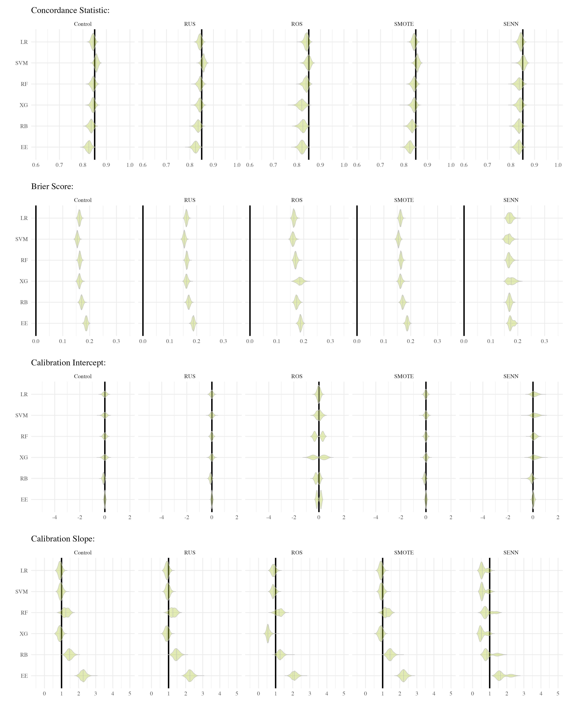
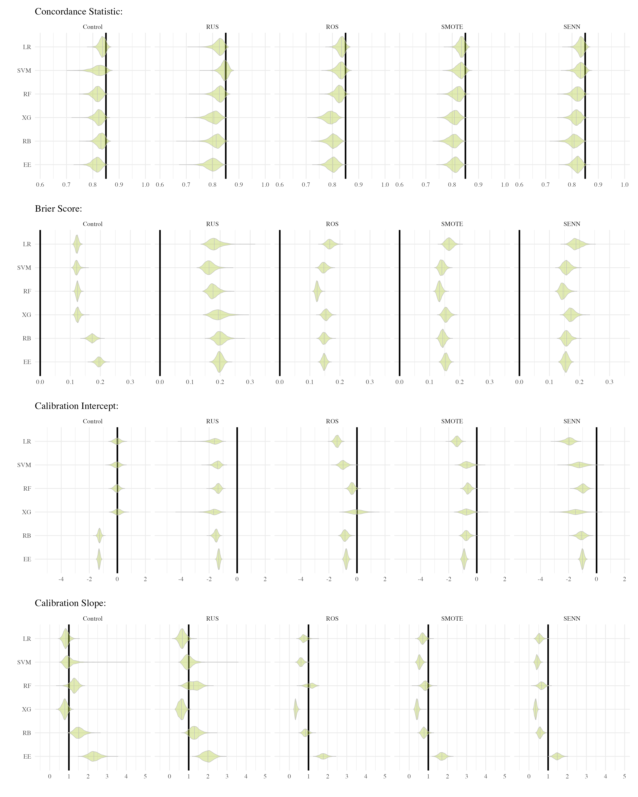
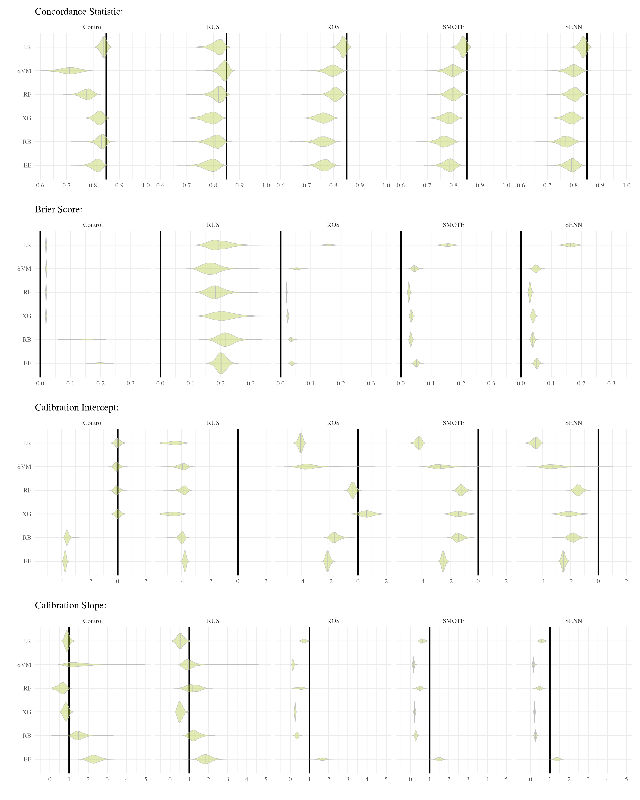
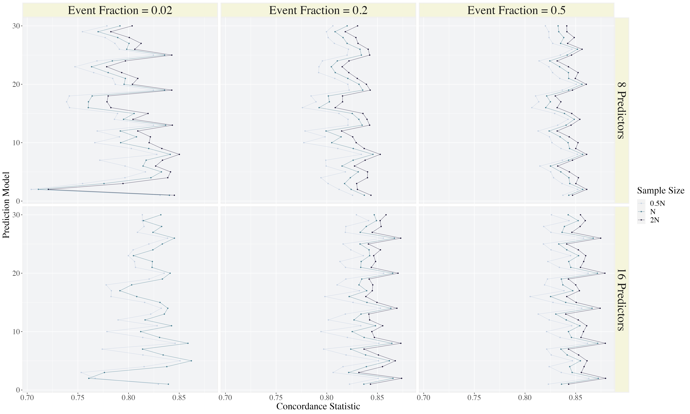
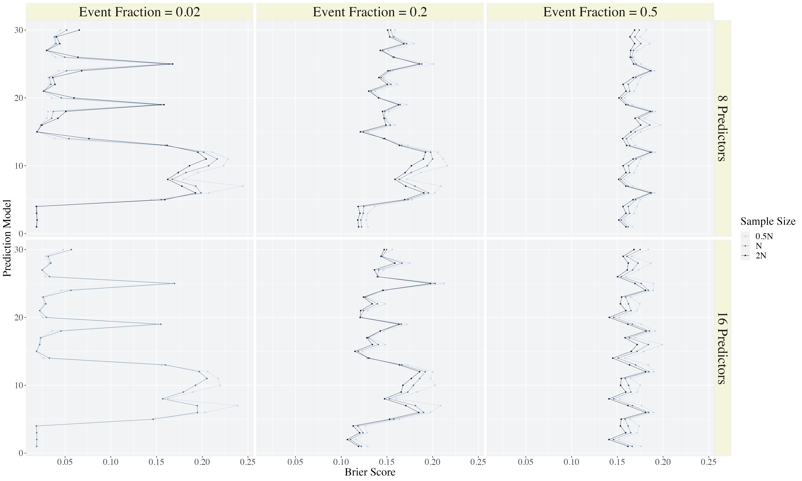
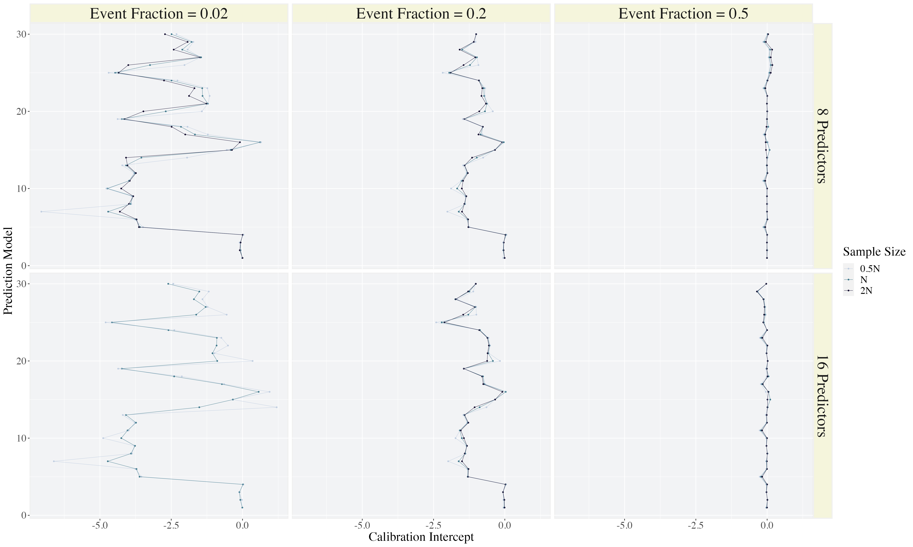
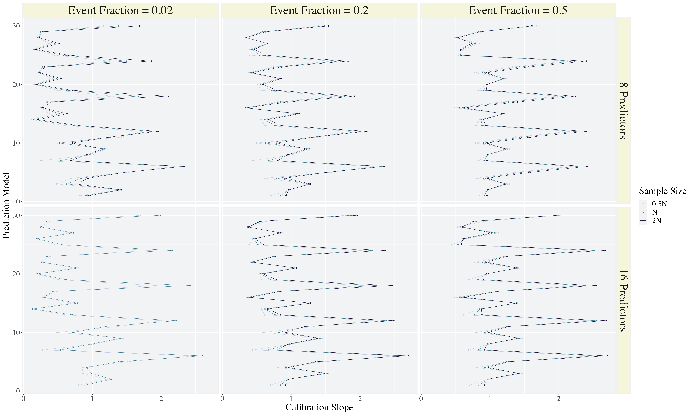

# Introduction

Prediction modelling is a useful tool in clinical medicine [@ewout_intro]. Prediction models can be used to aid in clinical decision making; for instance, to help decide if a patient is a good candidate for surgery [@annals; @achilles].  Most often, the purpose of a clinical prediction model is to estimate a patient's risk of experiencing a particular heath outcome (e.g., disease).  Due to the (thankfully) rare nature of many diseases, data available to train clinical prediction models often exhibit class imbalance (i.e., observations from patients with vs. without the event of interest are not equally represented in the data).  When prediction models are trained using imbalanced data, model performance is diminished; performance for the underrepresented class suffers the most [@cip; @lp2]. Consequently, class imbalance correction methodologies are proposed as a solution [@cip; @summary_m; @lp; @summary_h].\
\
While an abundance of imbalance correction methodologies are present (summarized here [@summary_m; @lp; @summary_h]) information regarding the effect of these imbalance corrections on model calibration is sparse.  Model calibration is a metric used to capture the reliability of individual risk predictions.  For clinical applications, it is essential to measure prediction model calibration. This is because, when a prediction models are developed for clinical use, each patient's predicted risk is the entity that is used to inform clinical decisions. If a model is poorly calibrated, it may produce risk estimates that are misleading [@achilles]. A poorly calibrated model may produce predicted risks that consistently over- or under-estimate true risk or that are too extreme (too close to 0 or 1) or too modest [@achilles]. This can lead to poor treatment decisions or to clinicians communicating false reassurance or hope to patients [@achilles; @12days].\
\
\
\
\
Only one study has assessed the impact of imbalance corrections on model calibration [@ruben]. In this study, the authors demonstrate that class imbalance corrections do more harm than good; implementing imbalance corrections resulted in dramatically deteriorated model calibration, to the point that no corrections were recommended [@ruben]. In this study, prediction models were developed using logistic regression or penalized logistic regression [@ruben]. In practice, most prediction models developed for clinical use do not use regression based methods [@constanza]. Rather, a recent systematic review of clinical prediction models indicated that other classification algorithms, like support vector machine and tree-based methods, are more common [@constanza]. The impact of imbalance corrections on model calibration is currently unknown for prediction models developed using these other classification algorithms.\
\
Motivated by the work of Goorbergh and colleagues [@ruben], we must ensure that the "cure" is not worse than the disease. In our research, we assess the impact of imbalance corrections on model calibration for prediction models trained with a wide variety of classification algorithms including: logistic regression, support vector machine, random forest, XGBoost RUSBoost and EasyEnsemble. Using Monte Carlo simulations, we answer the question: can implementing class imbalance corrections improve the out-of-sample predictive performance of clinical prediction models without compromising model calibration?

#  Methods 

In our research, we demonstrated the effects of common class imbalance correction methodologies, on the out-of-sample performance of clinical prediction models.  We focused on clinical prediction models designed for dichotomous risk prediction.  A simulation study was implemented to illustrate the effects of imbalance correction methodologies across 18 unique data-generating scenarios (section 2.2).  For each scenario, we compared the out-of-sample predictive performance (i.e., model performance on data not used to train the model) of models developed using a two-step procedure (section 2.3).  This procedure consisted of an imbalance correction step in which the data were pre-processed, and a model training step in which the pre-processed data were used to train a machine learning model. 

##  Data Generating Mechanism 

In this simulation study, we focused on prediction models for dichotomous risk prediction. Consequently, we generated data comprised of two classes.  We refer to the negative class (non-events) and positive class (events) as class 0 and class 1, respectively.  Data for each class were generated independently using distinct multivariate normal ($mvn$) distributions.  As shown in equations 1 and 2, we specified a distinct mean and covariance structure for each class. The mean structures for the classes are represented as $\mu_0$ and $\mu_1$ for class 0 and 1, respectively. The covariance matrices are represented as $\Sigma_0$ and $\Sigma_1$ for class 0 and 1, respectively.

\begin{align}
&\mathrm{Class \ \  0:} \mathbf{X} \sim mvn( \pmb{\mu_0}, \pmb{\Sigma_0}) = mvn(\pmb{0}, \pmb{\Sigma_0}) \\
&\mathrm{Class \ \  1:} \mathbf{X} \sim mvn( \pmb{\mu_1}, \pmb{\Sigma_1}) = mvn(\pmb{\Delta_\mu}, \pmb{\Sigma_0} - \pmb{\Delta_\Sigma})
\end{align}\
\
As shown in equation 2, the differences in parameter values between the two classes are represented by $\pmb{\Delta_\mu}$ and $\pmb{\Delta_\Sigma}$; a vector and matrix comprised of the differences in predictor means, and variances/ covariances, between the classes, respectively.  We specified no variation in means among predictors within a class, making all elements in $\pmb{\Delta_\mu}$ equivalent; we denote these equivalent elements as $\delta_\mu$. Similarly, we specified no variation in predictor variances within a class, making all diagonal elements in the matrix $\pmb{\Delta_\Sigma}$ equivalent, denoted by $\delta_\Sigma$.\
\
For class 0, all predictor means were fixed to zero and all variances to 1. For class 1, all means were non-zero and are represented in the vector $\pmb{\Delta_\mu}$. Finally, in both classes, we allowed $75$% of the predictors to covary. All non-zero correlations among predictors in each class were set to $0.2$.  To ensure the correlation among predictors was not stronger in one class, we fixed the correlation matrices of the two classes to be equal.  This was accomplished by computing the off-diagonal elements of $\pmb{\Delta_\Sigma}$ such that the correlation matrices of the two classes were equivalent (as shown below).\
\
For instance, with 8 predictors, the mean and covariance structure for class 0 is,\

\begin{equation*}
\pmb{\mu_0} = \begin{bmatrix}
 0 \\ 0 \\ 0\\ 0 \\ 0 \\ 0 \\ 0 \\ 0
\end{bmatrix}, \pmb{\Sigma_0} = \begin{bmatrix}
1   & 0.2 & 0.2 & 0.2 & 0.2 & 0.2 & 0 & 0\\
0.2 & 1   & 0.2 & 0.2 & 0.2 & 0.2 & 0 & 0\\
0.2 & 0.2 & 1   & 0.2 & 0.2 & 0.2 & 0 & 0\\
0.2 & 0.2 & 0.2   & 1 & 0.2 & 0.2 & 0 & 0\\
0.2 & 0.2 & 0.2   & 0.2 & 1 & 0.2 & 0 & 0\\
0.2 & 0.2 & 0.2   & 0.2 & 0.2 & 1 & 0 & 0\\
0   & 0   & 0     &  0 & 0    & 0 & 1 & 0\\
0   & 0   & 0     &  0 & 0    & 0 & 0 & 1\\
\end{bmatrix}
\end{equation*}

\
\
and mean and covariance structure for class 1 is,\

\begin{equation*}
\pmb{\mu_1} = \begin{bmatrix}
 \delta_\mu \\ \delta_\mu \\ \delta_\mu \\ \delta_\mu \\ \delta_\mu \\ \delta_\mu \\ \delta_\mu \\ \delta_\mu
\end{bmatrix}, \pmb{\Sigma_1} = \begin{bmatrix}
1 - \delta_\Sigma   & z & z & z & z & z & 0 & 0\\
z & 1 - \delta_\Sigma   & z & z & z & z & 0 & 0\\
z & z & 1 - \delta_\Sigma   & z & z & z & 0 & 0\\
z & z & z   & 1 - \delta_\Sigma & z & z & 0 & 0\\
z & z & z   & z & 1 - \delta_\Sigma & z & 0 & 0\\
z & z & z   & z & z & 1 - \delta_\Sigma & 0 & 0\\
0   & 0   & 0     &  0 & 0    & 0 & 1 - \delta_\Sigma & 0\\
0   & 0   & 0     &  0 & 0    & 0 & 0 & 1 - \delta_\Sigma\\
\end{bmatrix}.
\end{equation*}\
\
Here, $z = (1-\delta_\Sigma)*0.2$, to ensure equivalent correlation matrices between the two classes.  Note, the covariance matrices were *not* equivalent between the classes.\
\
In this simulation study, 18 unique data-generating scenarios were selected (see Section 2.2).  Parameter values for the data generating distributions ($\delta_\mu$ and $\delta_\Sigma$) of each scenario were selected to generate a concordance statistic ($C$) of $0.85$. Under the assumption of normality for all predictors (in each class), the concordance statistic of the data can be expressed as a function of $\pmb{\Delta_\mu}$, $\pmb{\Sigma_0}$ and $\pmb{\Sigma_1}$ [@mvauc]. Optimal values of $\delta_\mu$ and $\delta_\Sigma$ for each scenario were computed analytically, based on the following formula [@mvauc]:\
\
\begin{equation}
C = \Phi \left( \sqrt{\pmb{\Delta_\mu}{'}\  (\pmb{\Sigma_0} + \pmb{\Sigma_1})^{-1} \ \pmb{\Delta_{\mu}}} \right).
\end{equation}\
\
In equation (3), $\Phi$ represents the cumulative density function of the standard normal distribution; $\pmb{\Delta_\mu}$, $\pmb{\Sigma_0}$ and $\pmb{\Sigma_1}$ maintain their previous definitions. To ensure a unique solution, $\delta_\Sigma$ was fixed at 0.3 for each scenario, while equation (3) was solved to yield the appropriate value of $\delta_\mu$ in each scenario. The full analytical solution is provided in Appendix A. The parameter values for the data generating distributions of the simulation scenarios are presented in Table 1.\
\
Finally, given that data for each class were generated independently, we had direct control over how many observations were generated under each class. The number of observations from the positive class ($n_1$) was sampled from the binomial distribution with probability equal to the specified event fraction. The number of observations in the negative class ($n_0$) was then computed as $n - n_1$, where $n$ is the specified sample size for a given scenario.\

## Data Generating Scenarios 

In our simulation study, 18 ($3$ x $2$ x $3$) unique data-generating scenarios were implemented (Table \ref{tab:sim_sets}). This was achieved by varying the following three characteristics of the data: the event fraction (proportion of patients with an event), the number of predictors and sample size. Event fraction varied through the set {0.5, 0.2, 0.02} and number of predictors through the set {8, 16}. In all scenarios, data were generated to yield an expected concordance statistic ($C$) of $0.85$.  Given the number of predictors, the event fraction and expected concordance statistic, we computed the minimum required sample size for a prediction model developed under these conditions.  Sample size calculations were carried out using the R package pmsampsize [@pmsampsize].  The sample size of data used to train the prediction models ($\mathrm{n}_{\mathrm{train}}$) was then varied through the set {$\frac{1}{2}N$, $N$, $2N$} implying half the required sample size, adequate samples size and double the required sample size, respectively.

\begin{table}[!h]

\caption{\label{tab:tab:sim_sets}Summary of simulation scenarios.}
\centering
\begin{tabular}[t]{ccccccccc}
\toprule
Scenario & No. Predictors & Sample Size & Event Fraction & $\mathrm{n}_{\mathrm{train}}$ & $\mathrm{n}_{\mathrm{validation}}$ & $\delta_\mu$ & $\delta_\Sigma$ & C\\
\midrule
1 & 8 & 0.5N & 0.50 & 193 & 1930 & 0.6043 & 0.3 & 0.85\\
\addlinespace
2 & 8 & 0.5N & 0.20 & 124 & 1240 & 0.6043 & 0.3 & 0.85\\
\addlinespace
3 & 8 & 0.5N & 0.02 & 899 & 8990 & 0.6043 & 0.3 & 0.85\\
\addlinespace
4 & 8 & N & 0.50 & 385 & 3850 & 0.6043 & 0.3 & 0.85\\
\addlinespace
5 & 8 & N & 0.20 & 247 & 2470 & 0.6043 & 0.3 & 0.85\\
\addlinespace
6 & 8 & N & 0.02 & 1797 & 17970 & 0.6043 & 0.3 & 0.85\\
\addlinespace
7 & 8 & 2N & 0.50 & 770 & 7700 & 0.6043 & 0.3 & 0.85\\
\addlinespace
8 & 8 & 2N & 0.20 & 494 & 4940 & 0.6043 & 0.3 & 0.85\\
\addlinespace
9 & 8 & 2N & 0.02 & 3594 & 35940 & 0.6043 & 0.3 & 0.85\\
\addlinespace
10 & 16 & 0.5N & 0.50 & 193 & 1930 & 0.4854 & 0.3 & 0.85\\
\addlinespace
11 & 16 & 0.5N & 0.20 & 247 & 2470 & 0.4854 & 0.3 & 0.85\\
\addlinespace
12 & 16 & 0.5N & 0.02 & 1797 & 17970 & 0.4854 & 0.3 & 0.85\\
\addlinespace
13 & 16 & N & 0.50 & 385 & 3850 & 0.4854 & 0.3 & 0.85\\
\addlinespace
14 & 16 & N & 0.20 & 493 & 4930 & 0.4854 & 0.3 & 0.85\\
\addlinespace
15 & 16 & N & 0.02 & 3593 & 35930 & 0.4854 & 0.3 & 0.85\\
\addlinespace
16 & 16 & 2N & 0.50 & 770 & 7700 & 0.4854 & 0.3 & 0.85\\
\addlinespace
17 & 16 & 2N & 0.20 & 986 & 9860 & 0.4854 & 0.3 & 0.85\\
\addlinespace
18 & 16 & 2N & 0.02 & 7186 & 71860 & 0.4854 & 0.3 & 0.85\\
\bottomrule
\multicolumn{9}{l}{\rule{0pt}{1em}\textsuperscript{*} N is the minimum required sample size for the prediction model.}\\
\end{tabular}
\end{table}

## Model Development 

All prediction models in our research were developed according to the following two-step procedure.  First, data were pre-processed using a class imbalance correction technique. Then, the resulting pseudo-balanced data were used to train a machine learning algorithm.\
\
We implemented a $5$ x $6$ full-factorial design to compare the out-of-sample predictive performance of prediction models developed with $5$ imbalance corrections ($1$ control and $4$ imbalance corrections) and $6$ classification algorithms.  In total, we compare the performance of 30 prediction models, each comprised of a unique combination of an imbalance correction and machine learning algorithm. 


### Imbalance Corrections
\
The imbalance corrections studied in our simulation included: random under sampling (RUS), random over sampling (ROS), synthetic majority over sampling (SMOTE), synthetic majority over sampling with Wilson's Edited Nearest Neighbor Rule (SENN) and a control, in which no correction was implemented.  As determined by a recent systematic review, RUS, ROS and SMOTE are the imbalance corrections that are commonly implemented when developing clinical prediction models, SMOTE being the most prevalent [@constanza].  We included SMOTE-ENN as well, given literature indicating that SMOTE-ENN can outperform SMOTE under certain conditions [@senn; @heart_failure_senn]. All imbalance corrections and the R packages used for their implementation in our simulation study are summarized in Table 2.\
\
In our simulation, imbalance corrections were implemented to achieve artificially class balanced data (event fraction $\approx 0.5$). RUS achieves class balance by randomly disregarding observations from the majority class until a balance is achieved.  ROS achieves balance by randomly duplicating observations from the minority class (by randomly re-sampling from the minority class with replacement) until a balance is achieved.  SMOTE generates artificial observations for the minority class by interpolating from the existing minority class observations [@chawla]. In our implementation, we specified the number of nearest neighbors ($k$) for SMOTE to be 5 (package default) [@iric]. In SMOTE - ENN, class balance is achieved by using combination of SMOTE and Wilson's Edited Nearest Neighbor Rule (ENN) [@wilson]. SMOTE is implemented first, to generate synthetic data for the minority class and then ENN is implemented to remove any observation which is different than its nearest neighbors [@senn]. This added step is implemented to make it easier for a classifier to distinguish between the classes, as when artificial observations are generated for the minority class using SMOTE, it may cause an increase noise near the class boundary. In our implementation, we specified the number of nearest neighbors in the SMOTE step ($k_1$) to be 5, and the number of nearest neighbors in ENN step ($k_2$) to be 3, the software defaults [@iric]. Finally, in the control "correction", data were not corrected for imbalance, and moved to second step of model development untouched (i.e., the imbalanced data were used to train prediction models). 

\begin{table}[!h]

\caption{\label{tab:tab:table}Summary of imbalance corrections implementation}
\centering
\begin{tabular}[t]{llll}
\toprule
Method & Abbreviation & Hyperparameters & R Package\\
\midrule
Random Undesampling & RUS &  & ROSE \cite{rose}\\
\addlinespace
Random Oversampling & ROS &  & ROSE \cite{rose}\\
\addlinespace
Synthetic Majority Over Sampling & SMOTE & $k=5$ & IRIC \cite{iric}\\
\addlinespace
SMOTE - Edited Nearest Neighbours & SENN & $k1=5$, $k2 = 3$ & IRIC \cite{iric}\\
\bottomrule
\multicolumn{4}{l}{\rule{0pt}{1em}\textsuperscript{*}      $k$: the number of nearest neighbors in implementation of SMOTE.}\\
\multicolumn{4}{l}{\rule{0pt}{1em}\textsuperscript{*}     $k1$: the number of nearest neighbors in the SMOTE step of SMOTE-ENN.}\\
\multicolumn{4}{l}{\rule{0pt}{1em}\textsuperscript{*}     $k2$: the number of nearest neighbors in the ENN step of SMOTE-ENN.}\\
\end{tabular}
\end{table}

### Classification Algorithms

Classification algorithms were selected based on a systematic review identifying common algorithms used to develop prediction models in a medical context [@constanza]. These algorithms include: logistic regression, support vector machine, random forest and XGBoost.  Additionally, based on literature summarizing common strategies to handle class imbalance [@yu; @summary_m; @lp; @kaur], we included two ensemble learning algorithms designed specifically to handle class imbalance: RUSBoost and EasyEnsemble. While both of these algorithms utilize random under-sampling, RUSBoost is a boosting algorithm while EasyEnsemble utilizes bagging. The hyperparameters selected for these classification algorithms, and the R packages used for algorithm implementation are summarized in Table 2.\
\
Four classification algorithms required the specification of model hyperparameters: support vector machine (SVM), random forest (RF), xgboost (XG) and RUSBoost(RB).   Hyperparameter tuning was implemented for SVM, RF and XG, using the R package `caret` [@caret]. The methods of implementation were `svmRadial`, `ranger` and `xgbTree` for SVM, RF and XG, respectively.  To select the hyper-parameters, we implemented 5-fold cross-validation, optimizing for model deviance. For SVM and XG, caret default tune grids and tune length were used.  For RF, we specified a custom tuning grid: mtry (the number of candidate splitting variables allowed at each node in a tree) was allowed to vary from 1 to the total number of predictors, min.node.size (the minimum number of observations allowed in a leaf node) was allowed to vary from 1 to 10 and we specified `gini` as the splitrule (we select the split which minimizes Gini impurity).  Finally, in our implementation of RB we specified a support vector machine with a radial kernel as the weak classifier and an ensemble size of 10 (package defaults) [@ebmc].  

\begin{table}[!h]

\caption{\label{tab:tab:table}Summary of classification algorithm implementation}
\centering
\begin{tabular}[t]{llll}
\toprule
Method & Abbreviation & Hyperparameters & R Package\\
\midrule
Logistic Regression & LR &  & base R \cite{r}\\
\addlinespace
Support Vector Machine & SVM & tune grid = $A$ & caret \cite{caret}\\
\addlinespace
Random Forest & RF & tune grid = $B$ & caret \cite{caret}\\
\addlinespace
XGBoost & XG & tune grid = $C$ & caret \cite{caret}\\
\addlinespace
RUSBoost & RB &  & ebmc \cite{ebmc}\\
\addlinespace
EasyEnsemble & EE &  & IRIC \cite{iric}\\
\bottomrule
\multicolumn{4}{l}{\rule{0pt}{1em}\textsuperscript{*}     $A$ : caret default grid.}\\
\multicolumn{4}{l}{\rule{0pt}{1em}\textsuperscript{*}     $B$ : mtry [1: all predictors], min.node.size [1:10], splitrule ['gini'].}\\
\multicolumn{4}{l}{\rule{0pt}{1em}\textsuperscript{*}     $C$ : caret default grid.}\\
\end{tabular}
\end{table}


## Simulation Methods

Under each simulation scenario, $2000$ data sets were generated. Each data set was comprised of training and validation data. The training and validation data were generated independently using identical data generating mechanisms. Validation data sets were generated to be ten times larger than the training data sets. The sample sizes of the training ($\mathrm{n}_{\mathrm{train}}$) and validation ($\mathrm{n}_{\mathrm{validation}}$) data for each simulation scenario can be found in Table 1.\
\
For each generated data set, 30 ($5$ x $6$) prediction models were developed (as described in section 2.3).  All prediction models were trained using the training data. Out-of-sample performance was then assessed using the validation data.\
\
Finally, since we expect many machine learning algorithms to exhibit miscalibration, we implemented a re-calibration procedure for all prediction models using the following procedure. First, predicted risks, from the validation data were stored as output from the simulation.  Then, these predicted risks were recalibrated using logistic regression.  Predicted risks were used as input for the logistic regression model specified in equation 4: 

\begin{equation}
log \left( \frac{P(Y_i = 1)}{1- P(Y_i = 1)} \right) = \beta_0 + log \left( \frac{p_i}{1-p_i} \right)
\end{equation}\
\
Here, $Y_i$ represents the observed outcome (0 or 1) for the $i$th observation in the validation set and $p_i$ represents the predicted risk for the $i$th observation in the validation set, from a given prediction model. Since logistic regression produces well calibrated predictions, we used logistic regression, implemented with the true class of the validation data as the outcome, and the logit of the predicted risks included as the sole predictor (as an offset term), to yield a set of new predicted risks for each algorithm.  Out-of-sample predictive performance was assessed using both the raw predictions (no re-calibration) and the re-calibrated predictions.  


## Performance Metrics 

Out-of-sample predictive performance was assessed using measures of calibration, discrimination and overall performance. All performance metrics were computed using the raw predictions (resulting from the validation data) and subsequently, using the re-calibrated predictions, from each prediction model.\
\
Calibration was measured using visual and empirical metrics.  We assessed calibration visually by means of flexible calibration curves.  For each simulation iteration, a flexible calibration curve was generated.  Coordinates for the calibration curve were calculated using loess regression; implemented using the R package `stats` [@loess]. Calibration curves were then generated using `ggplot2` [@gg]. Additionally, calibration intercept and slope were calculated according to their respective definitions in Steyerberg et al. (2010) [@epi]. In a flexible calibration curve, when predicted risks (x-axis) correspond well with the observed proportions in the data (y-axis), the curve follows a straight diagonal line ($y = x$) [@achilles].  With respect to calibration intercept and slope, ideal calibration is represented by values of 0 and 1, respectively [@epi].\
\
The concordance statistic was used to measure model discrimination; computed using the R package pROC [@pROC]. This metric captures a model’s ability to yield higher risk estimates for patients in the positive class than for those in the negative class. For dichotomous risk prediction, it is equivalent to the area under the Receiver Operator Characteristic curve [@epi].  A model which perfectly discriminates between the classes will have a concordance statistic of 1; the minimum value for this statistic is 0.5 [@epi].\
\
Overall performance was measured by Brier score. This metric reflects both model discrimination and calibration and was calculated according to the following formula [@epi]: 

\begin{equation}
\mathrm{Brier \ Score} = \frac{1}{N} \sum^{N}_{i = 1} (Y_i - p_i)^2,
\end{equation}\
\
where $N$ is the sample size, $Y_i$ represents the observed outcome (0 or 1) for the $i$th observation in the validation set and $p_i$ represents the predicted risk for the $i$th observation in the validation set.  In an ideal model, predicted risks approximate the observed outcome well for all individuals; ideal models produce a Brier score near to zero.\
\
For empirical measures of model performance (concordance statistic, Brier score, calibration intercept and calibration slope), the median over the simulation iterations and corresponding Monte Carlo error were reported.

## Software and Error Handling

The simulation study was conducted using Utrecht University Medical Center's (UMCU) high performance computing.  This high performance computer utilized two types of central processing units: Intel(R) Xeon (R) Silver and Intel(R) Xeon (R) Gold.  The simulation study and processing of results were conducted using R version 4.2.2 [@r].  All code used to conduct the simulation study and process the results can be found on [GitHub](https://github.com/alexcarriero/masters_thesis).\
\
Any warnings and errors which occured during the simulation study were carefully monitored and stored.  Please see Appendix A for details. 


\newpage

# Results 

All results from our simulation study are displayed in a Shiny App: [https://alex-carriero.shinyapps.io/shiny_app/](https://alex-carriero.shinyapps.io/shiny_app/).\
\
Across the 18 data generating scenarios, the results did not differ greatly when the number of predictors or sample size varied.  In general, from Figures 7-10, we see that, across all prediction models, an increase in sample size improved model discrimination, meanwhile, brier score, calibration intercept and slope were relatively unaffected.  Similarly, increasing the number of predictors from 8 to 16 improved model discrimination slightly, while the other performance metrics remained unchanged.  For this reason, we present the results for three simulation scenarios, varying event fraction, while holding the number of predictors and sample size constant.\
\
In this paper, we present calibration plots and summarize the performance metrics for simulation scenarios with 8 predictors, adequate sample sample size ($N$) and: balanced (event fraction $= 0.5$), moderately imbalanced (event fraction $=0.2$) and extremely imbalanced (event fraction $=0.02$) data, simulation scenarios 4-6, respectively. In Figures 1-3 we present the flexible calibration curves for all prediction models across scenarios 4-6, respectively; performance metrics for these simulation scenarios are summarized in Table \ref{tab:results}.

## Calibration 

For balanced data (Figure \ref{fig:plot1}) all algorithms, except EE, were well calibrated when training data were pre-processed with the control, RUS and SMOTE. Regardless of the pre-processing technique, EE produced predicted risks which were too moderate (calibration slopes > 1, Table \ref{tab:results}). Specifically, for EE, predicted risks $>0.5$ underestimated true risk, while predicted risks $<0.5$ over estimated true risk (Figure \ref{fig:plot1}).  Interestingly, when training data were pre-processed with ROS, we see separation in the calibration curves, for models using tree-based algorithms (RF, XG, EE).  This division among the curves reflects the direction of the chance imbalance in the training data:  top-curves were generated when chance imbalance favored the non-events, and bottom-curves when chance imbalance favored the events. (**should I show the two-colored plot in an appendix?**).  Finally, when SENN was used to pre-process the training data, LR, SVM and XG exhibited worse calibration than with the control, while RF, RB and EE remained as well calibrated as with the control (RF and RB) or slightly better calibrated (EE).\
\
When data exhibited moderate imbalance (Figure \ref{fig:plot2}) all algorithms, except RB and EE, were well calibrated with the control (no pre-processing).  Without pre-processing, RB and EE consistently over-estimated risk.  Similarly, regardless of the algorithm, all pre-processing techniques worsened model calibration, resulting in predicted risks which largely over-estimated true risk.  Interestingly, random forest, trained with ROS pre-processed data, was protected against this general trend; for this one prediction model, model calibration did not worsen, with the imbalance correction.\
\
When data were extremely imbalanced (Figure 3), all algorithms exhibited miscalibration.  Without correcting for imbalance, calibration curves for LR, SVM, RF and XG were unstable; there was large variation among the calibration curves produced over the simulation iterations.  Meanwhile, without data pre-processing, for RB and EE, the calibration curves did not vary much across the iterations, rather, they exhibited a specific pattern of miscalibration: all predicted risks over-estimated true risk. Similarly, regardless of the algorithm used to develop the prediction model, pre-processing the data with an imbalance correction resulted in worse model calibration (Figure \ref{fig:plot3}).\
\
- Overall, as imbalance between the classes was magnified, model calibration deteriorated for all algorithms.\
- Interestingly, imbalance corrections affected model calibration the same way, regardless of the algorithm: all yield predicted risk which are overestimates.\
- No imbalance correction + alogrithm out-performed its control, with respect to model calibration. \
\
**need to add info about cal intercept, slope and re-calibration**\

\newpage

Random Forest Notes:\

- random forest is design to increase model variance (DT has high bias, need to increase variance).
- random forest sways towards under vs. over fitting ... calibration slopes are often below 1, highlighting this under-fitting.  
- like the other imbalance corrections, ROS still shifts calibration curves to the right
- for some scenarios (when control rf is under-fitting) adding ROS results in good calibration 
- for other scenarios (when rf is well calibrated) ROS shifts the calibration curves such that they over-estimate risk 
- ROS shifts the curves to the right less than the other imbalance corrections\
\
WHY:\
- random forest uses bagging -- so with random over sampling -- better chance that each tree sees enough real observations from the minority
- each of these bagged samples could technically have occurred by sampling the uncorrected data with replacement (would just be very unlikely)

## Discrimination 

- Balanced data: SVM always the best (SVM with any correction > than the others).  For all algorithms, control had best discrimination. Control SVM highest overall. 
- Moderate Imbalance: some imbalance corrections improved discrimination -- depends on the algorithm. No correction improved performance for all algorithms. RUS SVM highest overall. 
- Extreme  imbalance: LR is the best for every correction -- except RUS (SVM wins that one). Control LR highest overall. 

## Overall Performance  

**is it better to have separate sections for the performance metrics -- or include them all in one section**?

```{r, echo = F, fig.align="center", out.width= '90%', fig.cap = "Flexible Calibration Curves.  Scenario 4.\\label{fig:plot1}"}
knitr::include_graphics("./../results/calibration_plot_manuscript_sc4.png")
```

```{r, echo = F, fig.align="center", out.width= '90%',fig.cap = "Flexible Calibration Curves.  Scenario 5.\\label{fig:plot2}"}
knitr::include_graphics("./../results/calibration_plot_manuscript_sc5.png")
```

```{r, echo = F, fig.align="center", out.width= '90%',  fig.cap = "Flexible Calibration Curves.  Scenario 6.\\label{fig:plot3}"}
knitr::include_graphics("./../results/calibration_plot_manuscript_sc6.png")
```

```{r, echo = F, fig.align="center", out.width= '90%', fig.cap = "Empirical Performance Metrics.  Scenario 4.\\label{fig:plot}"}

```

```{r, echo = F, fig.align="center", out.width= '90%', fig.cap = "Empirical Performance Metrics.  Scenario 5.\\label{fig:plot}"}

```

```{r, echo = F, fig.align="center", out.width= '90%', fig.cap = "Empirical Performance Metrics.  Scenario 6.\\label{fig:plot}"}

```

```{r, echo = F, fig.align="center", out.width= '90%', fig.cap = "Median concordance statistics across the simulation scenarios.\\label{fig:plot}"}

```

```{r, echo = F, fig.align="center", out.width= '90%', fig.cap = "Median Brier score across the simulation scenarios.\\label{fig:plot}"}

```

```{r, echo = F, fig.align="center", out.width= '90%', fig.cap = "Median calibration intercepts across the simulation scenarios.\\label{fig:plot}"}

```

```{r, echo = F, fig.align="center", out.width= '90%', fig.cap = "Median calibration slope across the simulation scenarios.\\label{fig:plot}"}

```

\begin{sidewaystable}

\caption{\label{tab:results}Results Table}
\centering
\resizebox{\linewidth}{!}{
\begin{tabular}[t]{lcccccccccccccccccccccccccccccc}
\toprule
\multicolumn{1}{c}{ } & \multicolumn{6}{c}{Control} & \multicolumn{6}{c}{RUS} & \multicolumn{6}{c}{ROS} & \multicolumn{6}{c}{SMOTE} & \multicolumn{6}{c}{SENN} \\
\cmidrule(l{3pt}r{3pt}){2-7} \cmidrule(l{3pt}r{3pt}){8-13} \cmidrule(l{3pt}r{3pt}){14-19} \cmidrule(l{3pt}r{3pt}){20-25} \cmidrule(l{3pt}r{3pt}){26-31}
  & LR & SVM & RF & XG & RB & EE & LR & SVM & RF & XG & RB & EE & LR & SVM & RF & XG & RB & EE & LR & SVM & RF & XG & RB & EE & LR & SVM & RF & XG & RB & EE\\
\midrule
\addlinespace[0.3em]
\multicolumn{31}{l}{\textbf{8 Predictors,  Event Fraction = 0.5}}\\
\addlinespace
\hspace{2em}\hspace{1em}Concordance Statistic & 0.84 & 0.86 & 0.84 & 0.84 & 0.84 & 0.83 & 0.84 & 0.86 & 0.84 & 0.84 & 0.83 & 0.82 & 0.84 & 0.85 & 0.84 & 0.82 & 0.83 & 0.82 & 0.84 & 0.86 & 0.84 & 0.84 & 0.83 & 0.82 & 0.84 & 0.85 & 0.84 & 0.84 & 0.83 & 0.83\\
\addlinespace
\hspace{2em}\hspace{1em}MCMC Error & 0.01 & 0.01 & 0.01 & 0.01 & 0.01 & 0.01 & 0.01 & 0.01 & 0.01 & 0.01 & 0.01 & 0.01 & 0.01 & 0.01 & 0.01 & 0.01 & 0.01 & 0.01 & 0.01 & 0.01 & 0.01 & 0.01 & 0.01 & 0.01 & 0.01 & 0.01 & 0.01 & 0.01 & 0.01 & 0.01\\
\addlinespace
\hspace{2em}\hspace{1em}Brier Score & 0.16 & 0.15 & 0.16 & 0.16 & 0.17 & 0.19 & 0.16 & 0.15 & 0.16 & 0.16 & 0.17 & 0.19 & 0.16 & 0.16 & 0.17 & 0.19 & 0.17 & 0.19 & 0.16 & 0.15 & 0.16 & 0.16 & 0.17 & 0.19 & 0.17 & 0.17 & 0.17 & 0.18 & 0.17 & 0.17\\
\addlinespace
\hspace{2em}\hspace{1em}MCMC Error & 0 & 0 & 0 & 0.01 & 0 & 0 & 0 & 0 & 0 & 0.01 & 0.01 & 0 & 0 & 0.01 & 0.01 & 0.01 & 0.01 & 0.01 & 0 & 0 & 0 & 0.01 & 0.01 & 0 & 0.01 & 0.01 & 0.01 & 0.01 & 0.01 & 0.01\\
\addlinespace
\hspace{2em}\hspace{1em}Calibration Intercept & 0 & 0 & -0.01 & 0 & -0.11 & 0 & -0.01 & 0 & -0.01 & 0 & -0.11 & 0 & -0.01 & 0 & 0.09 & 0 & -0.09 & 0.04 & -0.01 & 0 & -0.01 & 0.01 & -0.1 & 0 & 0.08 & 0.13 & 0.08 & 0.11 & -0.1 & 0.02\\
\addlinespace
\hspace{2em}\hspace{1em}MCMC Error & 0.14 & 0.14 & 0.12 & 0.15 & 0.07 & 0.05 & 0.11 & 0.12 & 0.09 & 0.11 & 0.07 & 0.05 & 0.13 & 0.2 & 0.34 & 0.51 & 0.18 & 0.17 & 0.1 & 0.11 & 0.09 & 0.11 & 0.08 & 0.05 & 0.23 & 0.25 & 0.15 & 0.26 & 0.14 & 0.07\\
\addlinespace
\hspace{2em}\hspace{1em}Calibration Slope & 0.92 & 0.96 & 1.25 & 0.91 & 1.46 & 2.27 & 0.92 & 0.96 & 1.25 & 0.9 & 1.46 & 2.25 & 0.88 & 0.87 & 1.21 & 0.56 & 1.26 & 2.09 & 0.9 & 0.94 & 1.21 & 0.89 & 1.43 & 2.22 & 0.57 & 0.58 & 0.78 & 0.52 & 0.83 & 1.62\\
\addlinespace
\hspace{2em}\hspace{1em}MCMC Error & 0.1 & 0.11 & 0.18 & 0.12 & 0.17 & 0.17 & 0.11 & 0.11 & 0.18 & 0.12 & 0.17 & 0.17 & 0.12 & 0.11 & 0.19 & 0.1 & 0.15 & 0.16 & 0.1 & 0.11 & 0.18 & 0.12 & 0.16 & 0.16 & 0.19 & 0.2 & 0.27 & 0.21 & 0.33 & 0.34\\
\addlinespace \addlinespace[0.3em]
\multicolumn{31}{l}{\textbf{8 Predictors,  Event Fraction = 0.2}}\\
\addlinespace
\hspace{2em}\hspace{1em}Concordance Statistic & 0.84 & 0.82 & 0.82 & 0.82 & 0.83 & 0.82 & 0.83 & 0.85 & 0.83 & 0.8 & 0.81 & 0.8 & 0.83 & 0.83 & 0.83 & 0.79 & 0.8 & 0.8 & 0.84 & 0.83 & 0.82 & 0.81 & 0.8 & 0.81 & 0.83 & 0.83 & 0.82 & 0.82 & 0.81 & 0.82\\
\addlinespace
\hspace{2em}\hspace{1em}MCMC Error & 0.01 & 0.03 & 0.02 & 0.02 & 0.02 & 0.02 & 0.02 & 0.01 & 0.02 & 0.02 & 0.02 & 0.02 & 0.01 & 0.02 & 0.02 & 0.02 & 0.02 & 0.02 & 0.01 & 0.02 & 0.02 & 0.02 & 0.02 & 0.02 & 0.01 & 0.02 & 0.02 & 0.02 & 0.02 & 0.02\\
\addlinespace
\hspace{2em}\hspace{1em}Brier Score & 0.12 & 0.12 & 0.12 & 0.12 & 0.17 & 0.2 & 0.18 & 0.16 & 0.18 & 0.19 & 0.2 & 0.2 & 0.17 & 0.15 & 0.12 & 0.15 & 0.15 & 0.15 & 0.16 & 0.14 & 0.13 & 0.15 & 0.14 & 0.15 & 0.19 & 0.16 & 0.15 & 0.17 & 0.16 & 0.15\\
\addlinespace
\hspace{2em}\hspace{1em}MCMC Error & 0.01 & 0.01 & 0.01 & 0.01 & 0.01 & 0.01 & 0.02 & 0.02 & 0.02 & 0.02 & 0.02 & 0.01 & 0.01 & 0.01 & 0.01 & 0.01 & 0.01 & 0.01 & 0.01 & 0.01 & 0.01 & 0.01 & 0.01 & 0.01 & 0.02 & 0.01 & 0.01 & 0.01 & 0.01 & 0.01\\
\addlinespace
\hspace{2em}\hspace{1em}Calibration Intercept & -0.01 & -0.05 & -0.04 & 0.04 & -1.27 & -1.3 & -1.62 & -1.4 & -1.36 & -1.67 & -1.51 & -1.31 & -1.41 & -0.98 & -0.35 & -0.04 & -0.85 & -0.77 & -1.42 & -0.7 & -0.63 & -0.73 & -0.74 & -0.9 & -1.95 & -1.22 & -0.98 & -1.49 & -1.09 & -1\\
\addlinespace
\hspace{2em}\hspace{1em}MCMC Error & 0.22 & 0.23 & 0.18 & 0.23 & 0.1 & 0.07 & 0.4 & 0.23 & 0.18 & 0.36 & 0.14 & 0.08 & 0.16 & 0.24 & 0.17 & 0.43 & 0.17 & 0.1 & 0.18 & 0.3 & 0.18 & 0.33 & 0.2 & 0.1 & 0.3 & 0.4 & 0.24 & 0.46 & 0.25 & 0.1\\
\addlinespace
\hspace{2em}\hspace{1em}Calibration Slope & 0.85 & 0.97 & 1.27 & 0.79 & 1.52 & 2.31 & 0.67 & 0.96 & 1.26 & 0.62 & 1.3 & 2.01 & 0.76 & 0.61 & 1.1 & 0.33 & 0.85 & 1.78 & 0.71 & 0.55 & 0.84 & 0.41 & 0.78 & 1.71 & 0.54 & 0.43 & 0.66 & 0.35 & 0.58 & 1.48\\
\addlinespace
\hspace{2em}\hspace{1em}MCMC Error & 0.14 & 0.55 & 0.2 & 0.13 & 0.24 & 0.27 & 0.17 & 0.26 & 0.31 & 0.14 & 0.24 & 0.27 & 0.14 & 0.11 & 0.2 & 0.05 & 0.13 & 0.18 & 0.13 & 0.1 & 0.15 & 0.07 & 0.13 & 0.17 & 0.12 & 0.08 & 0.15 & 0.05 & 0.1 & 0.16\\
\addlinespace \addlinespace[0.3em]
\multicolumn{31}{l}{\textbf{8 Predictors,  Event Fraction = 0.02}}\\
\addlinespace
\hspace{2em}\hspace{1em}Concordance Statistic & 0.84 & 0.71 & 0.78 & 0.82 & 0.83 & 0.81 & 0.82 & 0.84 & 0.82 & 0.79 & 0.81 & 0.79 & 0.84 & 0.8 & 0.81 & 0.76 & 0.76 & 0.76 & 0.84 & 0.8 & 0.8 & 0.78 & 0.76 & 0.78 & 0.84 & 0.8 & 0.8 & 0.79 & 0.77 & 0.79\\
\addlinespace
\hspace{2em}\hspace{1em}MCMC Error & 0.01 & 0.04 & 0.02 & 0.02 & 0.02 & 0.02 & 0.03 & 0.02 & 0.02 & 0.03 & 0.03 & 0.03 & 0.01 & 0.02 & 0.02 & 0.02 & 0.03 & 0.02 & 0.01 & 0.02 & 0.02 & 0.02 & 0.02 & 0.02 & 0.01 & 0.02 & 0.02 & 0.02 & 0.02 & 0.02\\
\addlinespace
\hspace{2em}\hspace{1em}Brier Score & 0.02 & 0.02 & 0.02 & 0.02 & 0.16 & 0.2 & 0.19 & 0.17 & 0.18 & 0.21 & 0.22 & 0.2 & 0.16 & 0.05 & 0.02 & 0.02 & 0.04 & 0.04 & 0.15 & 0.05 & 0.03 & 0.03 & 0.03 & 0.05 & 0.16 & 0.05 & 0.03 & 0.04 & 0.04 & 0.05\\
\addlinespace
\hspace{2em}\hspace{1em}MCMC Error & 0 & 0 & 0 & 0 & 0.02 & 0.01 & 0.04 & 0.03 & 0.03 & 0.04 & 0.03 & 0.02 & 0.01 & 0.01 & 0 & 0 & 0 & 0 & 0.02 & 0.01 & 0 & 0 & 0 & 0.01 & 0.02 & 0.01 & 0 & 0 & 0 & 0.01\\
\addlinespace
\hspace{2em}\hspace{1em}Calibration Intercept & -0.01 & -0.07 & -0.07 & 0.01 & -3.6 & -3.74 & -4.71 & -3.93 & -3.84 & -4.73 & -3.98 & -3.77 & -4.09 & -3.55 & -0.41 & 0.61 & -1.67 & -2.16 & -4.24 & -2.69 & -1.22 & -1.4 & -1.41 & -2.49 & -4.47 & -3.24 & -1.45 & -2.11 & -1.78 & -2.49\\
\addlinespace
\hspace{2em}\hspace{1em}MCMC Error & 0.2 & 0.19 & BIG & 0.2 & BIG & 0.08 & BIG & 0.34 & 0.28 & 0.62 & 0.17 & 0.09 & 0.16 & 0.77 & BIG & 0.46 & 0.31 & 0.15 & 0.19 & 0.67 & BIG & 0.47 & 0.29 & 0.13 & 0.24 & 0.75 & BIG & 0.56 & 0.3 & 0.13\\
\addlinespace
\hspace{2em}\hspace{1em}Calibration Slope & 0.9 & 1.41 & 0.63 & 0.84 & 1.49 & 2.29 & 0.54 & 0.96 & 1.18 & 0.52 & 1.26 & 1.86 & 0.72 & 0.14 & 0.53 & 0.25 & 0.35 & 1.67 & 0.62 & 0.16 & 0.48 & 0.22 & 0.28 & 1.5 & 0.57 & 0.15 & 0.45 & 0.2 & 0.25 & 1.38\\
\addlinespace
\hspace{2em}\hspace{1em}MCMC Error & 0.12 & 6.07 & 0.2 & 0.13 & 0.28 & 0.3 & 0.18 & 0.66 & 0.32 & 0.12 & 0.26 & 0.28 & 0.13 & 0.04 & 0.18 & 0.02 & 0.06 & 0.17 & 0.11 & 0.03 & 0.12 & 0.02 & 0.05 & 0.13 & 0.11 & 0.03 & 0.11 & 0.02 & 0.04 & 0.12\\
\bottomrule
\end{tabular}}
\end{sidewaystable}

# Discussion


\newpage

<div id="refs"></div>

# Appendix Section 

## Appendix A: Deriving Data Generating Parameters Based on Concordance Statistic


Under the assumption of normality for all predictors (in each class), the concordance statistic ($C$) of the data can be calculated directly, using equation ($A.1$) [@mvauc].  This equation is suitable when the covariance matrices of each class are *not* equivalent. For $p$ predictors, $\pmb{\Delta_\mu}$ is a $p$ x $1$ vector housing the differences in predictor means between class 0 and class 1. $\pmb{\Sigma_0}$ and $\pmb{\Sigma_1}$ represent the covariance matrices of class 0 and 1 respectively and $\Phi$ is the cumulative density function (cdf) of the standard normal distribution.\

\begin{equation} \tag{A.1}
C = \Phi \left( \sqrt{\pmb{\Delta_\mu}{'}\  (\pmb{\Sigma_0} + \pmb{\Sigma_1})^{-1} \ \pmb{\Delta_{\mu}}} \right)
\end{equation}
\
\
In our research, the differences in predictor means between the classes were equivalent. In other words, the elements of $\pmb{\Delta_\mu}$ were equivalent; denoted by $\delta_\mu$.  The differences in predictor variances between the classes were also equivalent.  The diagonal elements of $\pmb{\Sigma_0}$ were all zero, and the diagonal elements of $\pmb{\Sigma_1}$ were all equal to ($1- \delta_\Sigma$) as shown in section 2.1.  To ensure a unique solution, $\delta_\Sigma$ was fixed to $0.3$.  Then, equation ($A1$) was solved to determine the value of $\delta_\mu$ that yields a concordance statistic ($C$) of $0.85$. \
\
Let $\pmb{A} = (\pmb{\Sigma_0} + \pmb{\Sigma_1})^{-1}$,

\begin{align*}
(\Phi^{-1}(C))^2 &= \pmb{\Delta_\mu{'}}  \pmb{A} \  \pmb{\Delta_{\mu}}\\
(\Phi^{-1}(C))^2 &= 
\begin{bmatrix}
 \delta_\mu & \delta_\mu &   \dots &  \delta_\mu &  \delta_\mu
\end{bmatrix} \begin{bmatrix} 
    a_{11} & a_{12}  & \dots  & a_{1p}\\
    \vdots &         & \ddots & \\
    a_{p1} &  a_{p2} & \dots  & a_{pp} 
\end{bmatrix}\begin{bmatrix}
 \delta_\mu \\ \delta_\mu \\ \vdots \\ \delta_\mu \\ \delta_\mu
\end{bmatrix}\\
(\Phi^{-1}(C))^2 &= \delta_{\mu}^2 \sum_{j = 1}^{p} \sum_{i = 1}^{p} a_{ij}
\end{align*}
\
\
\
Based on a desired $C$ of $0.85$, 

\begin{equation} \tag{A.2}
\delta_\mu = \frac{\Phi^{-1}(0.85)}{\sqrt{\sum_{j = 1}^{p} \sum_{i = 1}^{p} a_{ij}}}.
\end{equation}\
\

Equation ($A.2$) was used to derive the appropriate $\delta_\mu$ for each simulation scenario.\
\


\newpage 

## Appendix B: Error Handling


Errors and warnings were carefully monitored throughout our simulation.  We used the tryCatch.W.E function from `simsalapar` to save all warning and error messages [@simsalapar].  These messages were stored in a data file for each simulation scenario and, along with the raw simulation results, are available upon request.\
\
Under scenarios where training data were class balanced (event fraction $= 0.5$), imbalance correction methodologies did not preform reliably.  For instance, if the classes are exactly balanced there is nothing to over or under sample, and the algorithm returns an error. In the event of an error with imbalance corrections, the uncorrected data were allowed to proceed to train the classification algorithms. Errors resulting from the imbalance corrections are presented in Table B1.\
\
Conversely, when data were extremely imbalanced (event fraction $= 0.02$) and sample size was small ($0.5N$) some classification algorithms returned an error. In this case, predicted risks were stored as `NA`. Errors resulting from the classification algorithms are presented in Table B2.  Throughout the simulation, no errors occurred for logistic regression, support vector machine, random forest, or XGBoost.\
\
In case of data separation, warnings messages were stored and predicted risks were saved as usual. Finally, under extreme imbalance, the algorithm RUSBoost produced impossible predicted risks (i.e., outside the range $[0,1]$), in these instances, predicted risks below zero and above one were set to $1^{-10}$ and $1 - 1^{-10}$, respectively.\


\begin{table}[!h] 
\renewcommand\thetable{B1} 
\caption{Errors: Imbalance Corrections}
\centering
\begin{tabular}[t]{ccccccccc}
\toprule
Scenario & No. Predictors & Sample Size & Event Fraction & Control & RUS & ROS & SMOTE & SENN\\
\midrule
1 & 8 & 0.5N & 0.50 & 0 & 0 & 251 & 680 & 680\\
 
3 & 8 & 0.5N & 0.02 & 0 & 0 & 0 & 1 & 1\\
 
4 & 8 & N & 0.50 & 0 & 0 & 288 & 488 & 488\\
 
7 & 8 & 2N & 0.50 & 0 & 72 & 331 & 310 & 310\\
 
10 & 16 & 0.5N & 0.50 & 0 & 0 & 265 & 692 & 692\\
 
13 & 16 & N & 0.50 & 0 & 0 & 282 & 502 & 502\\
 
16 & 16 & 2N & 0.50 & 0 & 51 & 326 & 291 & 291\\
\bottomrule
\end{tabular}
\end{table}

\begin{table}[!h] 
\renewcommand\thetable{B2} 
\caption{Errors: Classification Algorithms}
\centering
\begin{tabular}[t]{ccccccccc}
\toprule
Scenario & No. Predictors & Sample Size & Event Fraction & Control & RUS & ROS & SMOTE & SENN\\
\midrule
\addlinespace[0.3em]
\multicolumn{9}{l}{\textbf{RUSBoost:}}\\
\addlinespace
\hspace{2em}\hspace{1em}2 & 8 & 0.5N & 0.20 & 0 & 1 & 0 & 0 & 0\\
\hspace{2em}\hspace{1em}3 & 8 & 0.5N & 0.02 & 59 & 9 & 0 & 1 & 1\\
\addlinespace[0.3em]
\multicolumn{9}{l}{\textbf{EasyEnsemble:}}\\
\addlinespace
\hspace{2em}\hspace{1em}2 & 8 & 0.5N & 0.20 & 1 & 1 & 0 & 0 & 0\\
\hspace{2em}\hspace{1em}3 & 8 & 0.5N & 0.02 & 19 & 29 & 0 & 0 & 0\\
\bottomrule
\end{tabular}
\end{table}

