# Supplementary Material 

## Error Handling\

Errors and warnings were carefully monitored throughout our simulation.  We used the tryCatch.W.E function from the R package `simsalapar` to save any warning or error messages.  These messages were stored in a data frame, along with the raw simulation results, and are available upon request.\
\
Under scenarios where training data were class balanced (event fraction $= 0.5$), imbalance correction methodologies used in the pre-processing step of model development did not preform reliably. For simulation iterations with very little observed imbalance (i.e., observed event fractions too close to 0.5), some imbalance corrections returned a fatal error.  In the event of such an error, we allowed the original (uncorrected) data set to to be used as training data in the next step of model development (i.e., machine learning algorithms were trained with uncorrected data). In Table \ref{tab:S1}, we present the frequency with which errors occurred as a consequence of imbalance corrections, for all simulation scenarios.\
\
Conversely, when data were extremely imbalanced (event fraction $= 0.02$) and sample size was small ($0.5N$) some machine learning algorithms returned a fatal error. In this case, we saved predicted risks as NA, since no predicted risks were generated by the model. Consequently, all empirical performance measures were saved as NA and no flexible calibration curve was generated.  In Table \ref{tab:S2}, we present the frequency with which errors occurred as a consequence of machine learning algorithms, for all simulation scenarios. Importantly, recall that for each iteration of the simulation, a given machine learning algorithm was used to create 5 different prediction models, each trained with unique data  (resulting from the control, RUS, ROS, SMOTE and SENN imbalance corrections, respectively). Therefore, in Table \ref{tab:S2} we present errors resulting from each distinct model.\
\
For prediction models built with logistic regression, the `glm` function in `base R` provided a warning if separation occurred (i.e., all predicted risks were either 0 or 1). In case of separation, predicted risks were saved as usual and an indication of the warning was saved. Data separation was most common when random under sampling was used. The frequency of data separation for logistic regression models, in all simulation scenarios, is presented in Table \ref{tab:S3}.\
\
Finally, we found that in some simulation scenarios, the algorithm RUSBoost produced impossible predicted risks (i.e., outside the range $[0,1]$).  In these instances, predicted risks below zero and above one were set to $1^{-10}$ and $1 - 1^{-10}$, respectively, and an indication of this behavior was saved.  The number of prediction models built with RUSBoost that resulted in impossible predicted risks, in all simulation scenarios, is presented in Table \ref{tab:S4}. \
\
\
\begin{table}[!h]
\renewcommand\thetable{S1} 
\caption{\label{tab:S1} Frequency of fatal errors produced by imbalance corrections in the pre-processing stop of model development in 18/18 simulation scenarios.  Scenarios with zero errors are omitted.}
\centering
\begin{tabular}[t]{ccccccccc}
\toprule
Scenario & No. Predictors & Sample Size & Event Fraction & Control & RUS & ROS & SMOTE & SENN\\
\midrule
1 & 8 & 0.5N & 0.50 & 0 & 0 & 251 & 680 & 680\\
 
3 & 8 & 0.5N & 0.02 & 0 & 0 & 0 & 1 & 1\\
 
4 & 8 & N & 0.50 & 0 & 0 & 288 & 488 & 488\\
 
7 & 8 & 2N & 0.50 & 0 & 72 & 331 & 310 & 310\\
 
10 & 16 & 0.5N & 0.50 & 0 & 0 & 265 & 692 & 692\\
 
13 & 16 & N & 0.50 & 0 & 0 & 282 & 502 & 502\\
 
16 & 16 & 2N & 0.50 & 0 & 51 & 326 & 291 & 291\\
\bottomrule
\end{tabular}
\end{table}

\newpage

\begin{table}[!h]
\renewcommand\thetable{S2} 
\caption{\label{tab:S2}Frequency of fatal errors produced by machine learning algorithms in 18/18 simulation scenarios. Scenarios with zero errors are omitted. No errors were observed with logistic regression, support vector machine, random forest or xgboost.}
\centering
\begin{tabular}[t]{ccccccccc}
\toprule
Scenario & No. Predictors & Sample Size & Event Fraction & Control & RUS & ROS & SMOTE & SENN\\
\midrule
\addlinespace[0.3em]
\multicolumn{9}{l}{\textbf{RUSBoost:}}\\
\addlinespace
\hspace{2em}\hspace{1em}2 & 8 & 0.5N & 0.20 & 0 & 1 & 0 & 0 & 0\\
\hspace{2em}\hspace{1em}3 & 8 & 0.5N & 0.02 & 59 & 9 & 0 & 1 & 1\\
\addlinespace[0.3em]
\multicolumn{9}{l}{\textbf{EasyEnsemble:}}\\
\addlinespace
\hspace{2em}\hspace{1em}2 & 8 & 0.5N & 0.20 & 1 & 1 & 0 & 0 & 0\\
\hspace{2em}\hspace{1em}3 & 8 & 0.5N & 0.02 & 19 & 29 & 0 & 0 & 0\\
\bottomrule
\end{tabular}
\end{table}\
\
\begin{table}[!h]
\renewcommand\thetable{S3} 
\caption{\label{tab:S3} Frequency of simulation iterations in which a data separation warning was produced by logistic regression. Scenarios with zero obsevations are omitted.}
\centering
\begin{tabular}[t]{ccccccccc}
\toprule
Scenario & No. Predictors & Sample Size & Event Fraction & Control & RUS & ROS & SMOTE & SENN\\
\midrule
1 & 8 & 0.5N & 0.50 & 0 & 0 & 0 & 0 & 1\\
 
2 & 8 & 0.5N & 0.20 & 0 & 99 & 0 & 0 & 36\\
 
3 & 8 & 0.5N & 0.02 & 0 & 501 & 1 & 2 & 2\\
 
5 & 8 & N & 0.20 & 0 & 1 & 0 & 0 & 0\\
 
6 & 8 & N & 0.02 & 0 & 5 & 0 & 0 & 0\\
 
10 & 16 & 0.5N & 0.50 & 0 & 0 & 0 & 0 & 13\\
 
11 & 16 & 0.5N & 0.20 & 0 & 19 & 0 & 0 & 3\\
 
12 & 16 & 0.5N & 0.02 & 0 & 232 & 0 & 0 & 0\\
\bottomrule
\end{tabular}
\end{table}\
\
\begin{table}[!h]
\renewcommand\thetable{S4} 
\caption{\label{tab:S4} Frequency of simulation iterations in which RUSBoost produced invalid probabilities in 18/18 simulation scenarios. Scenarios with zero observations are omitted.}
\centering
\begin{tabular}[t]{ccccccccc}
\toprule
Scenario & No. Predictors & Sample Size & Event Fraction & Control & RUS & ROS & SMOTE & SENN\\
\midrule
2 & 8 & 0.5N & 0.20 & 2 & 0 & 0 & 0 & 0\\
 
3 & 8 & 0.5N & 0.02 & 188 & 0 & 1 & 0 & 3\\
 
6 & 8 & N & 0.02 & 22 & 0 & 0 & 0 & 0\\
 
9 & 8 & 2N & 0.02 & 2 & 0 & 0 & 0 & 0\\
 
12 & 16 & 0.5N & 0.02 & 44 & 0 & 3 & 1 & 1\\
 
15 & 16 & N & 0.02 & 1 & 0 & 0 & 0 & 1\\
\bottomrule
\end{tabular}
\end{table}

```{r, echo = F, results = 'hide'}
# a <-readRDS("./../visualize_results/results/results_sc1.RData")
# 
# a <- a$overall_dataframe %>% mutate(obs_ef= as.numeric(obs_ef))
# 
# min(a$obs_ef)
# max(a$obs_ef)
# 
# b <- a$overall_dataframe %>% 
#   filter(c_err != "0") %>% 
#   filter(correction == "sen") %>% 
#   mutate(obs_ef = as.numeric(obs_ef))
# 
# min(b$obs_ef)
# max(b$obs_ef)

# Error in sample.int(length(x), size, replace, prob): cannot take a sample larger than the population when 'replace = FALSE'\n
# Error in nn2(numerMatrix, numerMatrix, k + 1): Cannot find more nearest neighbours than there are points\n
# Error in nn2(numerMatrix, numerMatrix, k + 1): Cannot find more nearest neighbours than there are points\n
```


## Results Tables\ 

In Tables S5-10, median performance measures and their Monte Carlo errors across 2000 simulation iterations are presented for all 18 simulation scenarios. 

\begin{sidewaystable}
\renewcommand\thetable{S5} 
\caption{Median performance measures and their Monte Carlo erros across 2000 simulations iterations for simulation scenarios 1-3.}
\centering
\resizebox{\linewidth}{!}{
\begin{tabular}[t]{lcccccccccccccccccccccccccccccc}
\toprule
\multicolumn{1}{c}{ } & \multicolumn{6}{c}{Control} & \multicolumn{6}{c}{RUS} & \multicolumn{6}{c}{ROS} & \multicolumn{6}{c}{SMOTE} & \multicolumn{6}{c}{SENN} \\
\cmidrule(l{3pt}r{3pt}){2-7} \cmidrule(l{3pt}r{3pt}){8-13} \cmidrule(l{3pt}r{3pt}){14-19} \cmidrule(l{3pt}r{3pt}){20-25} \cmidrule(l{3pt}r{3pt}){26-31}
  & LR & SVM & RF & XG & RB & EE & LR & SVM & RF & XG & RB & EE & LR & SVM & RF & XG & RB & EE & LR & SVM & RF & XG & RB & EE & LR & SVM & RF & XG & RB & EE\\
\midrule
\addlinespace[0.3em]
\multicolumn{31}{l}{\textbf{Scenario 1}}\\
\hspace{2em}\hspace{1em}Concordance Statistic & 0.84 & 0.85 & 0.84 & 0.83 & 0.83 & 0.81 & 0.84 & 0.85 & 0.84 & 0.83 & 0.82 & 0.81 & 0.83 & 0.84 & 0.83 & 0.81 & 0.81 & 0.81 & 0.84 & 0.85 & 0.83 & 0.83 & 0.82 & 0.81 & 0.83 & 0.85 & 0.83 & 0.82 & 0.82 & 0.82\\
\hspace{2em}\hspace{1em}MCMC Error & 0.01 & 0.01 & 0.01 & 0.01 & 0.01 & 0.01 & 0.01 & 0.01 & 0.01 & 0.01 & 0.02 & 0.02 & 0.01 & 0.01 & 0.01 & 0.02 & 0.02 & 0.02 & 0.01 & 0.01 & 0.01 & 0.01 & 0.02 & 0.01 & 0.01 & 0.01 & 0.02 & 0.02 & 0.02 & 0.02\\
\hspace{2em}\hspace{1em}Brier Score & 0.17 & 0.16 & 0.17 & 0.17 & 0.17 & 0.19 & 0.17 & 0.16 & 0.17 & 0.17 & 0.18 & 0.19 & 0.17 & 0.16 & 0.18 & 0.2 & 0.18 & 0.19 & 0.17 & 0.16 & 0.17 & 0.17 & 0.18 & 0.19 & 0.18 & 0.17 & 0.17 & 0.19 & 0.17 & 0.18\\
\hspace{2em}\hspace{1em}MCMC Error & 0.01 & 0.01 & 0.01 & 0.01 & 0.01 & 0.01 & 0.01 & 0.01 & 0.01 & 0.01 & 0.01 & 0.01 & 0.01 & 0.01 & 0.01 & 0.02 & 0.01 & 0.01 & 0.01 & 0.01 & 0.01 & 0.01 & 0.01 & 0.01 & 0.01 & 0.01 & 0.01 & 0.02 & 0.01 & 0.01\\
\hspace{2em}\hspace{1em}Calibration Intercept & -0.01 & 0 & 0 & 0 & -0.14 & 0 & -0.01 & 0.01 & -0.01 & -0.01 & -0.15 & 0 & -0.01 & 0.01 & 0.08 & 0.03 & -0.13 & 0.03 & -0.01 & 0.01 & -0.01 & 0 & -0.14 & 0 & 0.06 & 0.11 & 0.05 & 0.08 & -0.14 & 0.01\\
\hspace{2em}\hspace{1em}MCMC Error & 0.21 & 0.2 & 0.17 & 0.23 & 0.11 & 0.06 & 0.17 & 0.16 & 0.12 & 0.18 & 0.11 & 0.07 & 0.21 & 0.3 & 0.37 & 0.65 & 0.24 & 0.19 & 0.15 & 0.17 & 0.13 & 0.18 & 0.12 & 0.07 & 0.35 & 0.32 & 0.19 & 0.36 & 0.18 & 0.09\\
\hspace{2em}\hspace{1em}Calibration Slope & 0.84 & 0.97 & 1.29 & 0.8 & 1.37 & 2.19 & 0.84 & 0.97 & 1.28 & 0.79 & 1.37 & 2.16 & 0.78 & 0.85 & 1.21 & 0.49 & 1.16 & 1.99 & 0.83 & 0.95 & 1.23 & 0.78 & 1.32 & 2.12 & 0.54 & 0.61 & 0.85 & 0.49 & 0.86 & 1.68\\
\hspace{2em}\hspace{1em}MCMC Error & 0.14 & 0.16 & 0.24 & 0.13 & 0.21 & 0.22 & 0.14 & 0.16 & 0.25 & 0.13 & 0.21 & 0.22 & 0.16 & 0.16 & 0.24 & 0.12 & 0.19 & 0.21 & 0.14 & 0.16 & 0.24 & 0.14 & 0.21 & 0.21 & 0.22 & 0.24 & 0.32 & 0.2 & 0.33 & 0.36\\
\addlinespace \addlinespace[0.3em]
\multicolumn{31}{l}{\textbf{Scenario 2}}\\
\hspace{2em}\hspace{1em}Concordance Statistic & 0.83 & 0.81 & 0.8 & 0.79 & 0.82 & 0.8 & 0.8 & 0.83 & 0.81 & 0.78 & 0.8 & 0.78 & 0.82 & 0.82 & 0.81 & 0.78 & 0.79 & 0.78 & 0.82 & 0.82 & 0.81 & 0.79 & 0.79 & 0.8 & 0.82 & 0.82 & 0.81 & 0.8 & 0.8 & 0.81\\
\hspace{2em}\hspace{1em}MCMC Error & 0.02 & 0.04 & 0.03 & 0.03 & 0.02 & 0.03 & 0.04 & 0.02 & 0.03 & 0.04 & 0.04 & 0.04 & 0.02 & 0.03 & 0.02 & 0.03 & 0.03 & 0.03 & 0.02 & 0.03 & 0.03 & 0.03 & 0.03 & 0.03 & 0.02 & 0.03 & 0.03 & 0.02 & 0.03 & 0.02\\
\hspace{2em}\hspace{1em}Brier Score & 0.13 & 0.13 & 0.13 & 0.14 & 0.18 & 0.2 & 0.21 & 0.17 & 0.19 & 0.22 & 0.21 & 0.21 & 0.17 & 0.15 & 0.13 & 0.16 & 0.15 & 0.15 & 0.17 & 0.14 & 0.14 & 0.16 & 0.15 & 0.16 & 0.2 & 0.16 & 0.15 & 0.18 & 0.16 & 0.16\\
\hspace{2em}\hspace{1em}MCMC Error & 0.01 & 0.01 & 0.01 & 0.01 & 0.02 & 0.01 & 0.05 & 0.03 & 0.02 & 0.03 & 0.02 & 0.01 & 0.02 & 0.01 & 0.01 & 0.01 & 0.01 & 0.01 & 0.02 & 0.01 & 0.01 & 0.01 & 0.01 & 0.01 & 0.02 & 0.02 & 0.02 & 0.02 & 0.02 & 0.01\\
\hspace{2em}\hspace{1em}Calibration Intercept & -0.06 & -0.06 & -0.06 & 0.06 & -1.25 & -1.33 & -2.02 & -1.39 & -1.39 & -1.88 & -1.53 & -1.34 & -1.46 & -0.76 & -0.36 & -0.07 & -0.79 & -0.79 & -1.47 & -0.42 & -0.61 & -0.7 & -0.69 & -0.91 & -2.18 & -0.93 & -0.98 & -1.5 & -1.03 & -1.01\\
\hspace{2em}\hspace{1em}MCMC Error & 0.35 & 0.34 & 0.25 & 0.39 & 0.15 & 0.1 & BIG & 0.33 & 0.26 & 0.49 & 0.18 & 0.11 & 0.29 & 0.47 & 0.25 & 0.57 & 0.27 & 0.14 & 0.32 & 0.57 & 0.27 & 0.5 & 0.3 & 0.14 & BIG & 0.68 & 0.34 & 0.64 & 0.37 & 0.15\\
\hspace{2em}\hspace{1em}Calibration Slope & 0.71 & 0.99 & 1.24 & 0.61 & 1.59 & 2.2 & 0.45 & 1.02 & 1.27 & 0.49 & 1.38 & 1.85 & 0.62 & 0.55 & 1.06 & 0.33 & 0.8 & 1.63 & 0.57 & 0.51 & 0.81 & 0.37 & 0.74 & 1.59 & 0.4 & 0.4 & 0.66 & 0.34 & 0.59 & 1.4\\
\hspace{2em}\hspace{1em}MCMC Error & 0.19 & 2.94 & 0.28 & 0.14 & 0.33 & 0.37 & 0.21 & 4.88 & 0.39 & 0.12 & 0.31 & 0.37 & 0.17 & 0.15 & 0.26 & 0.06 & 0.16 & 0.24 & 0.16 & 0.13 & 0.21 & 0.08 & 0.15 & 0.23 & 0.14 & 0.09 & 0.19 & 0.06 & 0.11 & 0.21\\
\addlinespace \addlinespace[0.3em]
\multicolumn{31}{l}{\textbf{Scenario 3}}\\
\hspace{2em}\hspace{1em}Concordance Statistic & 0.83 & 0.7 & 0.75 & 0.8 & 0.82 & 0.8 & 0.77 & 0.83 & 0.8 & 0.77 & 0.79 & 0.77 & 0.82 & 0.79 & 0.79 & 0.74 & 0.74 & 0.74 & 0.82 & 0.79 & 0.78 & 0.77 & 0.75 & 0.77 & 0.82 & 0.79 & 0.79 & 0.78 & 0.75 & 0.78\\
\hspace{2em}\hspace{1em}MCMC Error & 0.02 & 0.05 & 0.03 & 0.03 & 0.04 & 0.03 & 0.06 & 0.03 & 0.03 & 0.04 & 0.04 & 0.04 & 0.02 & 0.03 & 0.03 & 0.04 & 0.04 & 0.03 & 0.02 & 0.03 & 0.03 & 0.03 & 0.04 & 0.03 & 0.02 & 0.03 & 0.03 & 0.03 & 0.04 & 0.03\\
\hspace{2em}\hspace{1em}Brier Score & 0.02 & 0.02 & 0.02 & 0.02 & 0.14 & 0.21 & 0.24 & 0.18 & 0.2 & 0.22 & 0.23 & 0.21 & 0.16 & 0.04 & 0.02 & 0.02 & 0.03 & 0.03 & 0.15 & 0.04 & 0.03 & 0.03 & 0.03 & 0.04 & 0.16 & 0.04 & 0.03 & 0.04 & 0.04 & 0.04\\
\hspace{2em}\hspace{1em}MCMC Error & 0 & 0 & 0 & 0 & BIG & 0.02 & 0.09 & 0.05 & 0.04 & 0.06 & 0.04 & 0.02 & 0.02 & 0.01 & 0 & 0 & 0 & 0 & 0.02 & 0.01 & 0 & 0 & 0 & 0.01 & 0.03 & 0.01 & 0 & 0.01 & 0.01 & 0.01\\
\hspace{2em}\hspace{1em}Calibration Intercept & -0.02 & -0.06 & -0.1 & 0.04 & -3.49 & -3.78 & -7.06 & -3.9 & -3.89 & -4.77 & -3.97 & -3.81 & -4.22 & -1.94 & -0.55 & 0.65 & -1.22 & -1.93 & -4.38 & -1.43 & -1.21 & -1.15 & -1.23 & -2.28 & -4.69 & -2.04 & -1.48 & -1.93 & -1.73 & -2.32\\
\hspace{2em}\hspace{1em}MCMC Error & 0.28 & 0.27 & BIG & 0.32 & BIG & 0.11 & BIG & 0.47 & BIG & 0.62 & 0.2 & 0.13 & 0.28 & 1.59 & BIG & 0.53 & 0.49 & 0.19 & 0.33 & 1.21 & BIG & 0.65 & 0.41 & 0.19 & 0.42 & 1.2 & BIG & 0.76 & 0.5 & 0.19\\
\hspace{2em}\hspace{1em}Calibration Slope & 0.81 & 1.4 & 0.47 & 0.7 & 1.52 & 2.2 & 0.25 & 1.01 & 1.2 & 0.5 & 1.42 & 1.71 & 0.59 & 0.11 & 0.37 & 0.26 & 0.33 & 1.3 & 0.5 & 0.15 & 0.42 & 0.22 & 0.28 & 1.25 & 0.46 & 0.14 & 0.37 & 0.21 & 0.27 & 1.17\\
\hspace{2em}\hspace{1em}MCMC Error & 0.16 & BIG & 0.24 & 0.13 & 0.44 & 0.41 & 0.21 & BIG & 0.46 & 0.22 & 0.4 & 0.4 & 0.16 & 0.04 & 0.21 & 0.03 & 0.07 & 0.22 & 0.13 & 0.04 & 0.16 & 0.03 & 0.05 & 0.16 & 0.13 & 0.03 & 0.14 & 0.03 & 0.05 & 0.14\\
\addlinespace \addlinespace[0.3em]
\multicolumn{31}{l}{\textbf{Scenario 1 Recalibrated}}\\
\hspace{2em}\hspace{1em}Concordance Statistic & 0.84 & 0.83 & 0.82 & 0.81 & 0.83 & 0.84 & 0.83 & 0.81 & 0.81 & 0.81 & 0.84 & 0.85 & 0.85 & 0.83 & 0.83 & 0.82 & 0.81 & 0.83 & 0.85 & 0.83 & 0.82 & 0.82 & 0.84 & 0.82 & 0.83 & 0.83 & 0.81 & 0.84 & 0.85 & 0.84\\
\hspace{2em}\hspace{1em}MCMC Error & 0.01 & 0.01 & 0.02 & 0.02 & 0.01 & 0.01 & 0.01 & 0.02 & 0.02 & 0.02 & 0.01 & 0.01 & 0.01 & 0.01 & 0.01 & 0.02 & 0.01 & 0.01 & 0.01 & 0.02 & 0.02 & 0.02 & 0.01 & 0.02 & 0.01 & 0.01 & 0.01 & 0.01 & 0.01 & 0.01\\
\hspace{2em}\hspace{1em}Brier Score & 0.17 & 0.17 & 0.17 & 0.19 & 0.17 & 0.16 & 0.17 & 0.19 & 0.18 & 0.19 & 0.17 & 0.16 & 0.16 & 0.17 & 0.17 & 0.17 & 0.19 & 0.17 & 0.17 & 0.17 & 0.18 & 0.17 & 0.17 & 0.18 & 0.17 & 0.17 & 0.19 & 0.17 & 0.16 & 0.17\\
\hspace{2em}\hspace{1em}MCMC Error & 0.01 & 0.01 & 0.01 & 0.01 & 0.01 & 0.01 & 0.01 & 0.01 & 0.01 & 0.01 & 0.01 & 0.01 & 0.01 & 0.01 & 0.01 & 0.01 & 0.01 & 0.01 & 0.01 & 0.01 & 0.02 & 0.01 & 0.01 & 0.01 & 0.01 & 0.01 & 0.01 & 0.01 & 0.01 & 0.01\\
\hspace{2em}\hspace{1em}Calibration Intercept & 0 & 0 & 0 & 0 & 0 & 0 & 0 & 0 & 0 & 0 & 0 & 0 & 0 & 0 & 0 & 0 & 0 & 0 & 0 & 0 & 0 & 0 & 0 & 0 & 0 & 0 & 0 & 0 & 0 & \vphantom{2} 0\\
\hspace{2em}\hspace{1em}MCMC Error & 0 & 0 & 0 & 0 & 0 & 0 & 0 & 0 & 0 & 0 & 0 & 0 & 0 & 0 & 0 & 0 & 0 & 0 & 0 & 0 & 0 & 0 & 0 & 0 & 0 & 0 & 0 & 0 & 0 & 0\\
\hspace{2em}\hspace{1em}Calibration Slope & 0.84 & 0.79 & 1.37 & 2.16 & 0.78 & 0.85 & 1.21 & 0.49 & 1.16 & 1.99 & 0.83 & 0.97 & 0.95 & 1.23 & 0.78 & 1.32 & 2.12 & 0.54 & 0.61 & 0.85 & 0.49 & 0.86 & 1.29 & 1.68 & 0.8 & 1.37 & 2.19 & 0.84 & 0.97 & 1.28\\
\hspace{2em}\hspace{1em}MCMC Error & 0.14 & 0.13 & 0.21 & 0.22 & 0.16 & 0.16 & 0.24 & 0.12 & 0.19 & 0.21 & 0.14 & 0.16 & 0.16 & 0.24 & 0.14 & 0.21 & 0.21 & 0.22 & 0.24 & 0.32 & 0.2 & 0.33 & 0.24 & 0.36 & 0.13 & 0.21 & 0.22 & 0.14 & 0.16 & 0.25\\
\addlinespace \addlinespace[0.3em]
\multicolumn{31}{l}{\textbf{Scenario 2 Recalibrated}}\\
\hspace{2em}\hspace{1em}Concordance Statistic & 0.83 & 0.78 & 0.8 & 0.78 & 0.82 & 0.82 & 0.81 & 0.78 & 0.79 & 0.78 & 0.82 & 0.81 & 0.82 & 0.81 & 0.79 & 0.79 & 0.8 & 0.82 & 0.82 & 0.81 & 0.8 & 0.8 & 0.8 & 0.81 & 0.79 & 0.82 & 0.8 & 0.8 & 0.83 & 0.81\\
\hspace{2em}\hspace{1em}MCMC Error & 0.02 & 0.04 & 0.04 & 0.04 & 0.02 & 0.03 & 0.02 & 0.03 & 0.03 & 0.03 & 0.02 & 0.04 & 0.03 & 0.03 & 0.03 & 0.03 & 0.03 & 0.03 & 0.03 & 0.03 & 0.02 & 0.03 & 0.03 & 0.02 & 0.03 & 0.02 & 0.03 & 0.07 & 0.02 & 0.03\\
\hspace{2em}\hspace{1em}Brier Score & 0.13 & 0.14 & 0.13 & 0.14 & 0.13 & 0.13 & 0.13 & 0.16 & 0.13 & 0.13 & 0.13 & 0.13 & 0.14 & 0.13 & 0.15 & 0.13 & 0.13 & 0.14 & 0.14 & 0.13 & 0.15 & 0.14 & 0.13 & 0.13 & 0.14 & 0.13 & 0.14 & 0.15 & 0.12 & 0.13\\
\hspace{2em}\hspace{1em}MCMC Error & 0.01 & 0.01 & 0.01 & 0.01 & 0.01 & 0.01 & 0.01 & 0.01 & 0.01 & 0.01 & 0.01 & 0.01 & 0.01 & 0.01 & 0.01 & 0.01 & 0.01 & 0.02 & 0.01 & 0.01 & 0.01 & 0.01 & 0.01 & 0.01 & 0.01 & 0.01 & 0.01 & 0.02 & 0.01 & 0.01\\
\hspace{2em}\hspace{1em}Calibration Intercept & 0 & 0 & 0 & 0 & 0 & 0 & 0 & 0 & 0 & 0 & 0 & 0 & 0 & 0 & 0 & 0 & 0 & 0 & 0 & 0 & 0 & 0 & 0 & 0 & 0 & 0 & 0 & 0 & 0 & \vphantom{1} 0\\
\hspace{2em}\hspace{1em}MCMC Error & 0 & 0 & 0 & 0 & 0 & 0 & 0 & 0 & 0 & 0 & 0 & 0 & 0 & 0 & 0 & 0 & 0 & 1.73 & 0 & 0 & 0 & 0 & 0 & 0 & 0 & 0 & 0 & BIG & 0 & 0\\
\hspace{2em}\hspace{1em}Calibration Slope & 0.71 & 0.49 & 1.38 & 1.85 & 0.62 & 0.55 & 1.06 & 0.33 & 0.8 & 1.63 & 0.57 & 0.99 & 0.51 & 0.81 & 0.37 & 0.74 & 1.59 & 0.4 & 0.4 & 0.66 & 0.34 & 0.59 & 1.24 & 1.4 & 0.61 & 1.59 & 2.2 & 0.45 & 1.02 & 1.27\\
\hspace{2em}\hspace{1em}MCMC Error & 0.19 & 0.12 & 0.31 & 0.37 & 0.17 & 0.15 & 0.26 & 0.06 & 0.16 & 0.24 & 0.16 & 2.94 & 0.13 & 0.21 & 0.08 & 0.15 & 0.23 & 0.14 & 0.09 & 0.19 & 0.06 & 0.11 & 0.28 & 0.21 & 0.14 & 0.33 & 0.37 & 0.2 & 4.88 & 0.39\\
\addlinespace \addlinespace[0.3em]
\multicolumn{31}{l}{\textbf{Scenario 3 Recalibrated}}\\
\hspace{2em}\hspace{1em}Concordance Statistic & 0.83 & 0.77 & 0.79 & 0.77 & 0.82 & 0.78 & 0.78 & 0.74 & 0.74 & 0.74 & 0.82 & 0.7 & 0.79 & 0.78 & 0.77 & 0.75 & 0.77 & 0.82 & 0.79 & 0.78 & 0.78 & 0.75 & 0.75 & 0.78 & 0.8 & 0.82 & 0.8 & 0.77 & 0.83 & 0.8\\
\hspace{2em}\hspace{1em}MCMC Error & 0.02 & 0.04 & 0.04 & 0.04 & 0.02 & 0.04 & 0.13 & 0.04 & 0.04 & 0.03 & 0.02 & 0.05 & 0.03 & 0.08 & 0.03 & 0.04 & 0.03 & 0.02 & 0.03 & 0.09 & 0.03 & 0.04 & 0.06 & 0.03 & 0.03 & 0.06 & 0.03 & 0.12 & 0.03 & 0.04\\
\hspace{2em}\hspace{1em}Brier Score & 0.02 & 0.02 & 0.02 & 0.02 & 0.02 & 0.03 & 0.02 & 0.03 & 0.02 & 0.02 & 0.02 & 0.02 & 0.03 & 0.02 & 0.03 & 0.02 & 0.02 & 0.02 & 0.03 & 0.02 & 0.03 & 0.02 & 0.02 & 0.02 & 0.02 & 0.02 & 0.02 & 0.02 & 0.02 & 0.02\\
\hspace{2em}\hspace{1em}MCMC Error & 0 & 0 & 0 & 0 & 0 & 0.01 & 0 & 0.01 & 0 & 0 & 0 & 0 & 0.01 & 0 & 0.01 & 0 & 0 & 0 & 0.01 & 0 & 0.01 & 0.01 & 0 & 0 & 0 & 0 & 0 & 0.01 & 0 & 0\\
\hspace{2em}\hspace{1em}Calibration Intercept & 0 & 0 & 0 & 0 & 0 & 0 & 0 & 0 & 0 & 0 & 0 & 0 & 0 & 0 & 0 & 0 & 0 & 0 & 0 & 0 & 0 & 0 & 0 & 0 & 0 & 0 & 0 & 0 & 0 & 0\\
\hspace{2em}\hspace{1em}MCMC Error & 0 & 0 & 0 & 0 & 0 & 0 & BIG & 0 & 0 & 0 & 0 & 0 & 0 & 9.09 & 0 & 0 & 0 & 0 & 0 & BIG & 0 & 0 & 6.67 & 0 & 0 & 4.94 & 0 & BIG & 0 & 0.72\\
\hspace{2em}\hspace{1em}Calibration Slope & 0.81 & 0.5 & 1.42 & 1.71 & 0.59 & 0.11 & 0.47 & 0.26 & 0.33 & 1.3 & 0.5 & 1.4 & 0.15 & 0.43 & 0.22 & 0.28 & 1.25 & 0.46 & 0.14 & 0.4 & 0.21 & 0.27 & 0.49 & 1.17 & 0.7 & 1.53 & 2.2 & 0.32 & 1.01 & 1.2\\
\hspace{2em}\hspace{1em}MCMC Error & 0.16 & 0.22 & 0.4 & 0.4 & 0.16 & 0.04 & 0.19 & 0.03 & 0.07 & 0.22 & 0.13 & BIG & 0.04 & 0.15 & 0.03 & 0.05 & 0.16 & 0.13 & 0.03 & 0.13 & 0.03 & 0.05 & 0.23 & 0.14 & 0.13 & 0.39 & 0.41 & 0.19 & BIG & 0.46\\
\bottomrule
\end{tabular}}
\end{sidewaystable}

\begin{sidewaystable}
\renewcommand\thetable{S6} 
\caption{Median performance measures and their Monte Carlo erros across 2000 simulations iterations for simulation scenarios 4-6.}
\centering
\resizebox{\linewidth}{!}{
\begin{tabular}[t]{lcccccccccccccccccccccccccccccc}
\toprule
\multicolumn{1}{c}{ } & \multicolumn{6}{c}{Control} & \multicolumn{6}{c}{RUS} & \multicolumn{6}{c}{ROS} & \multicolumn{6}{c}{SMOTE} & \multicolumn{6}{c}{SENN} \\
\cmidrule(l{3pt}r{3pt}){2-7} \cmidrule(l{3pt}r{3pt}){8-13} \cmidrule(l{3pt}r{3pt}){14-19} \cmidrule(l{3pt}r{3pt}){20-25} \cmidrule(l{3pt}r{3pt}){26-31}
  & LR & SVM & RF & XG & RB & EE & LR & SVM & RF & XG & RB & EE & LR & SVM & RF & XG & RB & EE & LR & SVM & RF & XG & RB & EE & LR & SVM & RF & XG & RB & EE\\
\midrule
\addlinespace[0.3em]
\multicolumn{31}{l}{\textbf{Scenario 4}}\\
\hspace{2em}\hspace{1em}Concordance Statistic & 0.84 & 0.86 & 0.84 & 0.84 & 0.84 & 0.83 & 0.84 & 0.86 & 0.84 & 0.84 & 0.83 & 0.82 & 0.84 & 0.85 & 0.84 & 0.82 & 0.83 & 0.82 & 0.84 & 0.86 & 0.84 & 0.84 & 0.83 & 0.82 & 0.84 & 0.85 & 0.84 & 0.84 & 0.83 & 0.83\\
\hspace{2em}\hspace{1em}MCMC Error & 0.01 & 0.01 & 0.01 & 0.01 & 0.01 & 0.01 & 0.01 & 0.01 & 0.01 & 0.01 & 0.01 & 0.01 & 0.01 & 0.01 & 0.01 & 0.01 & 0.01 & 0.01 & 0.01 & 0.01 & 0.01 & 0.01 & 0.01 & 0.01 & 0.01 & 0.01 & 0.01 & 0.01 & 0.01 & \vphantom{1} 0.01\\
\hspace{2em}\hspace{1em}Brier Score & 0.16 & 0.15 & 0.16 & 0.16 & 0.17 & 0.19 & 0.16 & 0.15 & 0.16 & 0.16 & 0.17 & 0.19 & 0.16 & 0.16 & 0.17 & 0.19 & 0.17 & 0.19 & 0.16 & 0.15 & 0.16 & 0.16 & 0.17 & 0.19 & 0.17 & 0.17 & 0.17 & 0.18 & 0.17 & 0.17\\
\hspace{2em}\hspace{1em}MCMC Error & 0 & 0 & 0 & 0.01 & 0 & 0 & 0 & 0 & 0 & 0.01 & 0.01 & 0 & 0 & 0.01 & 0.01 & 0.01 & 0.01 & 0.01 & 0 & 0 & 0 & 0.01 & 0.01 & 0 & 0.01 & 0.01 & 0.01 & 0.01 & 0.01 & 0.01\\
\hspace{2em}\hspace{1em}Calibration Intercept & 0 & 0 & -0.01 & 0 & -0.11 & 0 & -0.01 & 0 & -0.01 & 0 & -0.11 & 0 & -0.01 & 0 & 0.09 & 0 & -0.09 & 0.04 & -0.01 & 0 & -0.01 & 0.01 & -0.1 & 0 & 0.08 & 0.13 & 0.08 & 0.11 & -0.1 & 0.02\\
\hspace{2em}\hspace{1em}MCMC Error & 0.14 & 0.14 & 0.12 & 0.15 & 0.07 & 0.05 & 0.11 & 0.12 & 0.09 & 0.11 & 0.07 & 0.05 & 0.13 & 0.2 & 0.34 & 0.51 & 0.18 & 0.17 & 0.1 & 0.11 & 0.09 & 0.11 & 0.08 & 0.05 & 0.23 & 0.25 & 0.15 & 0.26 & 0.14 & 0.07\\
\hspace{2em}\hspace{1em}Calibration Slope & 0.92 & 0.96 & 1.25 & 0.91 & 1.46 & 2.27 & 0.92 & 0.96 & 1.25 & 0.9 & 1.46 & 2.25 & 0.88 & 0.87 & 1.21 & 0.56 & 1.26 & 2.09 & 0.9 & 0.94 & 1.21 & 0.89 & 1.43 & 2.22 & 0.57 & 0.58 & 0.78 & 0.52 & 0.83 & 1.62\\
\hspace{2em}\hspace{1em}MCMC Error & 0.1 & 0.11 & 0.18 & 0.12 & 0.17 & 0.17 & 0.11 & 0.11 & 0.18 & 0.12 & 0.17 & 0.17 & 0.12 & 0.11 & 0.19 & 0.1 & 0.15 & 0.16 & 0.1 & 0.11 & 0.18 & 0.12 & 0.16 & 0.16 & 0.19 & 0.2 & 0.27 & 0.21 & 0.33 & 0.34\\
\addlinespace \addlinespace[0.3em]
\multicolumn{31}{l}{\textbf{Scenario 5}}\\
\hspace{2em}\hspace{1em}Concordance Statistic & 0.84 & 0.82 & 0.82 & 0.82 & 0.83 & 0.82 & 0.83 & 0.85 & 0.83 & 0.8 & 0.81 & 0.8 & 0.83 & 0.83 & 0.83 & 0.79 & 0.8 & 0.8 & 0.84 & 0.83 & 0.82 & 0.81 & 0.8 & 0.81 & 0.83 & 0.83 & 0.82 & 0.82 & 0.81 & 0.82\\
\hspace{2em}\hspace{1em}MCMC Error & 0.01 & 0.03 & 0.02 & 0.02 & 0.02 & 0.02 & 0.02 & 0.01 & 0.02 & 0.02 & 0.02 & 0.02 & 0.01 & 0.02 & 0.02 & 0.02 & 0.02 & 0.02 & 0.01 & 0.02 & 0.02 & 0.02 & 0.02 & 0.02 & 0.01 & 0.02 & 0.02 & 0.02 & 0.02 & 0.02\\
\hspace{2em}\hspace{1em}Brier Score & 0.12 & 0.12 & 0.12 & 0.12 & 0.17 & 0.2 & 0.18 & 0.16 & 0.18 & 0.19 & 0.2 & 0.2 & 0.17 & 0.15 & 0.12 & 0.15 & 0.15 & 0.15 & 0.16 & 0.14 & 0.13 & 0.15 & 0.14 & 0.15 & 0.19 & 0.16 & 0.15 & 0.17 & 0.16 & 0.15\\
\hspace{2em}\hspace{1em}MCMC Error & 0.01 & 0.01 & 0.01 & 0.01 & 0.01 & 0.01 & 0.02 & 0.02 & 0.02 & 0.02 & 0.02 & 0.01 & 0.01 & 0.01 & 0.01 & 0.01 & 0.01 & 0.01 & 0.01 & 0.01 & 0.01 & 0.01 & 0.01 & 0.01 & 0.02 & 0.01 & 0.01 & 0.01 & 0.01 & 0.01\\
\hspace{2em}\hspace{1em}Calibration Intercept & -0.01 & -0.05 & -0.04 & 0.04 & -1.27 & -1.3 & -1.62 & -1.4 & -1.36 & -1.67 & -1.51 & -1.31 & -1.41 & -0.98 & -0.35 & -0.04 & -0.85 & -0.77 & -1.42 & -0.7 & -0.63 & -0.73 & -0.74 & -0.9 & -1.95 & -1.22 & -0.98 & -1.49 & -1.09 & -1\\
\hspace{2em}\hspace{1em}MCMC Error & 0.22 & 0.23 & 0.18 & 0.23 & 0.1 & 0.07 & 0.4 & 0.23 & 0.18 & 0.36 & 0.14 & 0.08 & 0.16 & 0.24 & 0.17 & 0.43 & 0.17 & 0.1 & 0.18 & 0.3 & 0.18 & 0.33 & 0.2 & 0.1 & 0.3 & 0.4 & 0.24 & 0.46 & 0.25 & 0.1\\
\hspace{2em}\hspace{1em}Calibration Slope & 0.85 & 0.97 & 1.27 & 0.79 & 1.52 & 2.31 & 0.67 & 0.96 & 1.26 & 0.62 & 1.3 & 2.01 & 0.76 & 0.61 & 1.1 & 0.33 & 0.85 & 1.78 & 0.71 & 0.55 & 0.84 & 0.41 & 0.78 & 1.71 & 0.54 & 0.43 & 0.66 & 0.35 & 0.58 & 1.48\\
\hspace{2em}\hspace{1em}MCMC Error & 0.14 & 0.55 & 0.2 & 0.13 & 0.24 & 0.27 & 0.17 & 0.26 & 0.31 & 0.14 & 0.24 & 0.27 & 0.14 & 0.11 & 0.2 & 0.05 & 0.13 & 0.18 & 0.13 & 0.1 & 0.15 & 0.07 & 0.13 & 0.17 & 0.12 & 0.08 & 0.15 & 0.05 & 0.1 & 0.16\\
\addlinespace \addlinespace[0.3em]
\multicolumn{31}{l}{\textbf{Scenario 6}}\\
\hspace{2em}\hspace{1em}Concordance Statistic & 0.84 & 0.71 & 0.78 & 0.82 & 0.83 & 0.81 & 0.82 & 0.84 & 0.82 & 0.79 & 0.81 & 0.79 & 0.84 & 0.8 & 0.81 & 0.76 & 0.76 & 0.76 & 0.84 & 0.8 & 0.8 & 0.78 & 0.76 & 0.78 & 0.84 & 0.8 & 0.8 & 0.79 & 0.77 & 0.79\\
\hspace{2em}\hspace{1em}MCMC Error & 0.01 & 0.04 & 0.02 & 0.02 & 0.02 & 0.02 & 0.03 & 0.02 & 0.02 & 0.03 & 0.03 & 0.03 & 0.01 & 0.02 & 0.02 & 0.02 & 0.03 & 0.02 & 0.01 & 0.02 & 0.02 & 0.02 & 0.02 & 0.02 & 0.01 & 0.02 & 0.02 & 0.02 & 0.02 & 0.02\\
\hspace{2em}\hspace{1em}Brier Score & 0.02 & 0.02 & 0.02 & 0.02 & 0.16 & 0.2 & 0.19 & 0.17 & 0.18 & 0.21 & 0.22 & 0.2 & 0.16 & 0.05 & 0.02 & 0.02 & 0.04 & 0.04 & 0.15 & 0.05 & 0.03 & 0.03 & 0.03 & 0.05 & 0.16 & 0.05 & 0.03 & 0.04 & 0.04 & 0.05\\
\hspace{2em}\hspace{1em}MCMC Error & 0 & 0 & 0 & 0 & 0.02 & 0.01 & 0.04 & 0.03 & 0.03 & 0.04 & 0.03 & 0.02 & 0.01 & 0.01 & 0 & 0 & 0 & 0 & 0.02 & 0.01 & 0 & 0 & 0 & 0.01 & 0.02 & 0.01 & 0 & 0 & 0 & 0.01\\
\hspace{2em}\hspace{1em}Calibration Intercept & -0.01 & -0.07 & -0.07 & 0.01 & -3.6 & -3.74 & -4.71 & -3.93 & -3.84 & -4.73 & -3.98 & -3.77 & -4.09 & -3.55 & -0.41 & 0.61 & -1.67 & -2.16 & -4.24 & -2.69 & -1.22 & -1.4 & -1.41 & -2.49 & -4.47 & -3.24 & -1.45 & -2.11 & -1.78 & -2.49\\
\hspace{2em}\hspace{1em}MCMC Error & 0.2 & 0.19 & BIG & 0.2 & BIG & 0.08 & BIG & 0.34 & 0.28 & 0.62 & 0.17 & 0.09 & 0.16 & 0.77 & BIG & 0.46 & 0.31 & 0.15 & 0.19 & 0.67 & BIG & 0.47 & 0.29 & 0.13 & 0.24 & 0.75 & BIG & 0.56 & 0.3 & 0.13\\
\hspace{2em}\hspace{1em}Calibration Slope & 0.9 & 1.41 & 0.63 & 0.84 & 1.49 & 2.29 & 0.54 & 0.96 & 1.18 & 0.52 & 1.26 & 1.86 & 0.72 & 0.14 & 0.53 & 0.25 & 0.35 & 1.67 & 0.62 & 0.16 & 0.48 & 0.22 & 0.28 & 1.5 & 0.57 & 0.15 & 0.45 & 0.2 & 0.25 & 1.38\\
\hspace{2em}\hspace{1em}MCMC Error & 0.12 & 6.07 & 0.2 & 0.13 & 0.28 & 0.3 & 0.18 & 0.66 & 0.32 & 0.12 & 0.26 & 0.28 & 0.13 & 0.04 & 0.18 & 0.02 & 0.06 & 0.17 & 0.11 & 0.03 & 0.12 & 0.02 & 0.05 & 0.13 & 0.11 & 0.03 & 0.11 & 0.02 & 0.04 & 0.12\\
\addlinespace \addlinespace[0.3em]
\multicolumn{31}{l}{\textbf{Scenario 4 Recalibrated}}\\
\hspace{2em}\hspace{1em}Concordance Statistic & 0.84 & 0.84 & 0.83 & 0.82 & 0.84 & 0.85 & 0.84 & 0.82 & 0.83 & 0.82 & 0.84 & 0.86 & 0.86 & 0.84 & 0.84 & 0.83 & 0.82 & 0.84 & 0.85 & 0.84 & 0.84 & 0.83 & 0.84 & 0.83 & 0.84 & 0.84 & 0.83 & 0.84 & 0.86 & 0.84\\
\hspace{2em}\hspace{1em}MCMC Error & 0.01 & 0.01 & 0.01 & 0.01 & 0.01 & 0.01 & 0.01 & 0.01 & 0.01 & 0.01 & 0.01 & 0.01 & 0.01 & 0.01 & 0.01 & 0.01 & 0.01 & 0.01 & 0.01 & 0.01 & 0.01 & 0.01 & 0.01 & 0.01 & 0.01 & 0.01 & 0.01 & 0.01 & 0.01 & 0.01\\
\hspace{2em}\hspace{1em}Brier Score & 0.16 & 0.16 & 0.17 & 0.19 & 0.16 & 0.16 & 0.17 & 0.18 & 0.17 & 0.19 & 0.16 & 0.15 & 0.15 & 0.16 & 0.16 & 0.17 & 0.19 & 0.17 & 0.16 & 0.17 & 0.17 & 0.17 & 0.16 & 0.17 & 0.16 & 0.17 & 0.19 & 0.16 & 0.15 & 0.16\\
\hspace{2em}\hspace{1em}MCMC Error & 0 & 0.01 & 0.01 & 0 & 0 & 0.01 & 0 & 0.01 & 0.01 & 0.01 & 0 & 0 & 0 & 0 & 0.01 & 0.01 & 0 & 0.01 & 0.01 & 0.01 & 0.01 & 0.01 & 0 & 0.01 & 0 & 0 & 0 & 0 & 0 & 0\\
\hspace{2em}\hspace{1em}Calibration Intercept & 0 & 0 & 0 & 0 & 0 & 0 & 0 & 0 & 0 & 0 & 0 & 0 & 0 & 0 & 0 & 0 & 0 & 0 & 0 & 0 & 0 & 0 & 0 & 0 & 0 & 0 & 0 & 0 & 0 & \vphantom{2} 0\\
\hspace{2em}\hspace{1em}MCMC Error & 0 & 0 & 0 & 0 & 0 & 0 & 0 & 0 & 0 & 0 & 0 & 0 & 0 & 0 & 0 & 0 & 0 & 0 & 0 & 0 & 0 & 0 & 0 & 0 & 0 & 0 & 0 & 0 & 0 & \vphantom{2} 0\\
\hspace{2em}\hspace{1em}Calibration Slope & 0.92 & 0.9 & 1.46 & 2.25 & 0.88 & 0.87 & 1.21 & 0.56 & 1.26 & 2.09 & 0.9 & 0.96 & 0.94 & 1.21 & 0.89 & 1.43 & 2.22 & 0.57 & 0.58 & 0.78 & 0.52 & 0.83 & 1.25 & 1.62 & 0.91 & 1.46 & 2.27 & 0.92 & 0.96 & 1.25\\
\hspace{2em}\hspace{1em}MCMC Error & 0.1 & 0.12 & 0.17 & 0.17 & 0.12 & 0.11 & 0.19 & 0.1 & 0.15 & 0.16 & 0.1 & 0.11 & 0.11 & 0.18 & 0.12 & 0.16 & 0.16 & 0.19 & 0.2 & 0.27 & 0.21 & 0.33 & 0.18 & 0.34 & 0.12 & 0.17 & 0.17 & 0.11 & 0.11 & 0.18\\
\addlinespace \addlinespace[0.3em]
\multicolumn{31}{l}{\textbf{Scenario 5 Recalibrated}}\\
\hspace{2em}\hspace{1em}Concordance Statistic & 0.84 & 0.8 & 0.81 & 0.8 & 0.83 & 0.83 & 0.83 & 0.79 & 0.8 & 0.8 & 0.84 & 0.82 & 0.83 & 0.82 & 0.81 & 0.8 & 0.81 & 0.83 & 0.83 & 0.82 & 0.82 & 0.81 & 0.82 & 0.82 & 0.82 & 0.83 & 0.82 & 0.83 & 0.85 & 0.83\\
\hspace{2em}\hspace{1em}MCMC Error & 0.01 & 0.02 & 0.02 & 0.02 & 0.01 & 0.02 & 0.02 & 0.02 & 0.02 & 0.02 & 0.01 & 0.03 & 0.02 & 0.02 & 0.02 & 0.02 & 0.02 & 0.01 & 0.02 & 0.02 & 0.02 & 0.02 & 0.02 & 0.02 & 0.02 & 0.02 & 0.02 & 0.02 & 0.01 & 0.02\\
\hspace{2em}\hspace{1em}Brier Score & 0.12 & 0.13 & 0.13 & 0.14 & 0.12 & 0.13 & 0.12 & 0.15 & 0.13 & 0.13 & 0.12 & 0.12 & 0.13 & 0.12 & 0.14 & 0.13 & 0.13 & 0.13 & 0.14 & 0.13 & 0.15 & 0.13 & 0.12 & 0.13 & 0.12 & 0.12 & 0.13 & 0.13 & 0.12 & 0.12\\
\hspace{2em}\hspace{1em}MCMC Error & 0.01 & 0.01 & 0.01 & 0.01 & 0.01 & 0.01 & 0.01 & 0.01 & 0.01 & 0 & 0.01 & 0.01 & 0.01 & 0.01 & 0.01 & 0.01 & 0 & 0.01 & 0.01 & 0.01 & 0.01 & 0.01 & 0 & 0.01 & 0.01 & 0.01 & 0 & 0.01 & 0.01 & 0.01\\
\hspace{2em}\hspace{1em}Calibration Intercept & 0 & 0 & 0 & 0 & 0 & 0 & 0 & 0 & 0 & 0 & 0 & 0 & 0 & 0 & 0 & 0 & 0 & 0 & 0 & 0 & 0 & 0 & 0 & 0 & 0 & 0 & 0 & 0 & 0 & \vphantom{1} 0\\
\hspace{2em}\hspace{1em}MCMC Error & 0 & 0 & 0 & 0 & 0 & 0 & 0 & 0 & 0 & 0 & 0 & 0 & 0 & 0 & 0 & 0 & 0 & 0 & 0 & 0 & 0 & 0 & 0 & 0 & 0 & 0 & 0 & 0 & 0 & \vphantom{1} 0\\
\hspace{2em}\hspace{1em}Calibration Slope & 0.85 & 0.62 & 1.3 & 2.01 & 0.76 & 0.61 & 1.1 & 0.33 & 0.85 & 1.78 & 0.71 & 0.97 & 0.55 & 0.84 & 0.41 & 0.78 & 1.71 & 0.54 & 0.43 & 0.66 & 0.35 & 0.58 & 1.27 & 1.48 & 0.79 & 1.52 & 2.31 & 0.67 & 0.96 & 1.26\\
\hspace{2em}\hspace{1em}MCMC Error & 0.14 & 0.14 & 0.24 & 0.27 & 0.14 & 0.11 & 0.2 & 0.05 & 0.13 & 0.18 & 0.13 & 0.55 & 0.1 & 0.15 & 0.07 & 0.13 & 0.17 & 0.12 & 0.08 & 0.15 & 0.05 & 0.1 & 0.2 & 0.16 & 0.13 & 0.24 & 0.27 & 0.17 & 0.26 & 0.31\\
\addlinespace \addlinespace[0.3em]
\multicolumn{31}{l}{\textbf{Scenario 6 Recalibrated}}\\
\hspace{2em}\hspace{1em}Concordance Statistic & 0.84 & 0.79 & 0.81 & 0.79 & 0.84 & 0.79 & 0.8 & 0.76 & 0.76 & 0.76 & 0.84 & 0.71 & 0.8 & 0.8 & 0.78 & 0.76 & 0.78 & 0.84 & 0.8 & 0.8 & 0.79 & 0.77 & 0.78 & 0.79 & 0.82 & 0.83 & 0.81 & 0.82 & 0.84 & 0.82\\
\hspace{2em}\hspace{1em}MCMC Error & 0.01 & 0.03 & 0.03 & 0.03 & 0.01 & 0.03 & 0.1 & 0.02 & 0.03 & 0.02 & 0.01 & 0.04 & 0.02 & 0.04 & 0.02 & 0.02 & 0.02 & 0.01 & 0.02 & 0.05 & 0.02 & 0.02 & 0.03 & 0.02 & 0.02 & 0.02 & 0.02 & 0.03 & 0.02 & 0.02\\
\hspace{2em}\hspace{1em}Brier Score & 0.02 & 0.02 & 0.02 & 0.02 & 0.02 & 0.03 & 0.02 & 0.03 & 0.02 & 0.02 & 0.02 & 0.02 & 0.03 & 0.02 & 0.03 & 0.02 & 0.02 & 0.02 & 0.03 & 0.02 & 0.03 & 0.02 & 0.02 & 0.02 & 0.02 & 0.02 & 0.02 & 0.02 & 0.02 & 0.02\\
\hspace{2em}\hspace{1em}MCMC Error & 0 & 0 & 0 & 0 & 0 & 0 & 0 & 0 & 0 & 0 & 0 & 0 & 0 & 0 & 0 & 0 & 0 & 0 & 0 & 0 & 0 & 0 & 0 & 0 & 0 & 0 & 0 & 0 & 0 & 0\\
\hspace{2em}\hspace{1em}Calibration Intercept & 0 & 0 & 0 & 0 & 0 & 0 & 0 & 0 & 0 & 0 & 0 & 0 & 0 & 0 & 0 & 0 & 0 & 0 & 0 & 0 & 0 & 0 & 0 & 0 & 0 & 0 & 0 & 0 & 0 & 0\\
\hspace{2em}\hspace{1em}MCMC Error & 0 & 0 & 0 & 0 & 0 & 0 & BIG & 0 & 0 & 0 & 0 & 0 & 0 & 3.57 & 0 & 0 & 0 & 0 & 0 & 4.82 & 0 & 0 & 2.77 & 0 & 0 & 1.43 & 0 & 1.01 & 0 & 0\\
\hspace{2em}\hspace{1em}Calibration Slope & 0.9 & 0.52 & 1.26 & 1.86 & 0.72 & 0.14 & 0.56 & 0.25 & 0.35 & 1.67 & 0.62 & 1.41 & 0.16 & 0.48 & 0.22 & 0.28 & 1.5 & 0.57 & 0.15 & 0.45 & 0.2 & 0.25 & 0.63 & 1.38 & 0.84 & 1.49 & 2.29 & 0.54 & 0.96 & 1.18\\
\hspace{2em}\hspace{1em}MCMC Error & 0.12 & 0.12 & 0.26 & 0.28 & 0.13 & 0.05 & 0.16 & 0.02 & 0.06 & 0.17 & 0.11 & 6.07 & 0.03 & 0.12 & 0.02 & 0.05 & 0.13 & 0.11 & 0.03 & 0.11 & 0.02 & 0.04 & 0.2 & 0.12 & 0.13 & 0.28 & 0.3 & 0.18 & 0.66 & 0.32\\
\bottomrule
\end{tabular}}
\end{sidewaystable}

\begin{sidewaystable}
\renewcommand\thetable{S7} 
\caption{Median performance measures and their Monte Carlo erros across 2000 simulations iterations for simulation scenarios 7-9.}
\centering
\resizebox{\linewidth}{!}{
\begin{tabular}[t]{lcccccccccccccccccccccccccccccc}
\toprule
\multicolumn{1}{c}{ } & \multicolumn{6}{c}{Control} & \multicolumn{6}{c}{RUS} & \multicolumn{6}{c}{ROS} & \multicolumn{6}{c}{SMOTE} & \multicolumn{6}{c}{SENN} \\
\cmidrule(l{3pt}r{3pt}){2-7} \cmidrule(l{3pt}r{3pt}){8-13} \cmidrule(l{3pt}r{3pt}){14-19} \cmidrule(l{3pt}r{3pt}){20-25} \cmidrule(l{3pt}r{3pt}){26-31}
  & LR & SVM & RF & XG & RB & EE & LR & SVM & RF & XG & RB & EE & LR & SVM & RF & XG & RB & EE & LR & SVM & RF & XG & RB & EE & LR & SVM & RF & XG & RB & EE\\
\midrule
\addlinespace[0.3em]
\multicolumn{31}{l}{\textbf{Scenario 7}}\\
\hspace{2em}\hspace{1em}Concordance Statistic & 0.85 & 0.86 & 0.85 & 0.85 & 0.84 & 0.83 & 0.85 & 0.86 & 0.85 & 0.85 & 0.84 & 0.83 & 0.85 & 0.85 & 0.85 & 0.83 & 0.84 & 0.83 & 0.85 & 0.86 & 0.85 & 0.85 & 0.84 & 0.83 & 0.85 & 0.86 & 0.84 & 0.85 & 0.84 & 0.84\\
\hspace{2em}\hspace{1em}MCMC Error & 0 & 0 & 0.01 & 0.01 & 0.01 & 0.01 & 0 & 0 & 0.01 & 0.01 & 0.01 & 0.01 & 0.01 & 0.01 & 0.01 & 0.01 & 0.01 & 0.01 & 0 & 0 & 0.01 & 0.01 & 0.01 & 0.01 & 0 & 0.01 & 0.01 & 0.01 & 0.01 & 0.01\\
\hspace{2em}\hspace{1em}Brier Score & 0.16 & 0.15 & 0.16 & 0.16 & 0.17 & 0.19 & 0.16 & 0.15 & 0.16 & 0.16 & 0.17 & 0.19 & 0.16 & 0.16 & 0.16 & 0.18 & 0.17 & 0.19 & 0.16 & 0.15 & 0.16 & 0.16 & 0.17 & 0.19 & 0.17 & 0.16 & 0.16 & 0.17 & 0.16 & 0.17\\
\hspace{2em}\hspace{1em}MCMC Error & 0 & 0 & 0 & 0 & 0 & 0 & 0 & 0 & 0 & 0 & 0 & 0 & 0 & 0 & 0 & 0.01 & 0 & 0 & 0 & 0 & 0 & 0 & 0 & 0 & 0.01 & 0.01 & 0.01 & 0.01 & 0 & 0.01\\
\hspace{2em}\hspace{1em}Calibration Intercept & -0.01 & -0.01 & -0.01 & 0 & -0.07 & 0.01 & 0 & 0 & 0 & 0 & -0.07 & 0.01 & -0.01 & -0.01 & -0.04 & -0.05 & -0.07 & -0.02 & 0 & 0 & -0.01 & 0 & -0.06 & 0.01 & 0.13 & 0.18 & 0.13 & 0.18 & -0.04 & 0.04\\
\hspace{2em}\hspace{1em}MCMC Error & 0.1 & 0.1 & 0.09 & 0.1 & 0.05 & 0.03 & 0.07 & 0.08 & 0.06 & 0.08 & 0.05 & 0.03 & 0.08 & 0.14 & 0.32 & 0.4 & 0.13 & 0.15 & 0.06 & 0.08 & 0.06 & 0.07 & 0.05 & 0.03 & 0.16 & 0.19 & 0.12 & 0.18 & 0.1 & 0.05\\
\hspace{2em}\hspace{1em}Calibration Slope & 0.96 & 0.96 & 1.21 & 0.96 & 1.59 & 2.42 & 0.95 & 0.96 & 1.22 & 0.96 & 1.58 & 2.41 & 0.94 & 0.9 & 1.2 & 0.62 & 1.4 & 2.25 & 0.95 & 0.95 & 1.19 & 0.95 & 1.57 & 2.4 & 0.58 & 0.57 & 0.73 & 0.53 & 0.86 & 1.61\\
\hspace{2em}\hspace{1em}MCMC Error & 0.08 & 0.08 & 0.14 & 0.1 & 0.13 & 0.14 & 0.08 & 0.08 & 0.14 & 0.1 & 0.13 & 0.13 & 0.09 & 0.08 & 0.14 & 0.11 & 0.13 & 0.13 & 0.08 & 0.08 & 0.13 & 0.1 & 0.13 & 0.13 & 0.16 & 0.16 & 0.22 & 0.18 & 0.3 & 0.33\\
\addlinespace \addlinespace[0.3em]
\multicolumn{31}{l}{\textbf{Scenario 8}}\\
\hspace{2em}\hspace{1em}Concordance Statistic & 0.84 & 0.83 & 0.83 & 0.84 & 0.84 & 0.83 & 0.84 & 0.85 & 0.84 & 0.83 & 0.83 & 0.81 & 0.84 & 0.84 & 0.84 & 0.81 & 0.82 & 0.82 & 0.84 & 0.84 & 0.83 & 0.82 & 0.82 & 0.82 & 0.84 & 0.84 & 0.83 & 0.83 & 0.82 & 0.83\\
\hspace{2em}\hspace{1em}MCMC Error & 0.01 & 0.02 & 0.01 & 0.01 & 0.01 & 0.01 & 0.01 & 0.01 & 0.01 & 0.01 & 0.01 & 0.01 & 0.01 & 0.01 & 0.01 & 0.01 & 0.01 & 0.01 & 0.01 & 0.01 & 0.01 & 0.01 & 0.01 & 0.01 & 0.01 & 0.01 & 0.01 & 0.01 & 0.01 & 0.01\\
\hspace{2em}\hspace{1em}Brier Score & 0.12 & 0.12 & 0.12 & 0.12 & 0.17 & 0.19 & 0.17 & 0.16 & 0.17 & 0.18 & 0.19 & 0.19 & 0.16 & 0.15 & 0.12 & 0.15 & 0.15 & 0.15 & 0.16 & 0.14 & 0.13 & 0.15 & 0.14 & 0.15 & 0.19 & 0.16 & 0.14 & 0.17 & 0.15 & 0.15\\
\hspace{2em}\hspace{1em}MCMC Error & 0 & 0 & 0 & 0 & 0.01 & 0.01 & 0.01 & 0.01 & 0.01 & 0.01 & 0.01 & 0.01 & 0.01 & 0.01 & 0 & 0.01 & 0.01 & 0 & 0.01 & 0.01 & 0.01 & 0.01 & 0.01 & 0.01 & 0.01 & 0.01 & 0.01 & 0.01 & 0.01 & 0.01\\
\hspace{2em}\hspace{1em}Calibration Intercept & -0.01 & -0.04 & -0.04 & 0.02 & -1.28 & -1.29 & -1.5 & -1.42 & -1.35 & -1.51 & -1.46 & -1.3 & -1.41 & -1.15 & -0.34 & -0.1 & -0.92 & -0.77 & -1.43 & -0.9 & -0.66 & -0.82 & -0.79 & -0.91 & -1.9 & -1.45 & -1.04 & -1.59 & -1.09 & -1.01\\
\hspace{2em}\hspace{1em}MCMC Error & 0.15 & 0.15 & 0.12 & 0.15 & 0.07 & 0.05 & 0.19 & 0.17 & 0.13 & 0.21 & 0.11 & 0.06 & 0.11 & 0.15 & 0.12 & 0.31 & 0.11 & 0.07 & 0.13 & 0.19 & 0.13 & 0.23 & 0.13 & 0.07 & 0.2 & 0.27 & 0.18 & 0.35 & 0.18 & 0.08\\
\hspace{2em}\hspace{1em}Calibration Slope & 0.92 & 0.96 & 1.28 & 0.91 & 1.52 & 2.36 & 0.8 & 0.95 & 1.22 & 0.79 & 1.33 & 2.1 & 0.85 & 0.66 & 1.12 & 0.34 & 0.95 & 1.92 & 0.79 & 0.59 & 0.85 & 0.43 & 0.86 & 1.83 & 0.62 & 0.46 & 0.66 & 0.34 & 0.63 & 1.54\\
\hspace{2em}\hspace{1em}MCMC Error & 0.11 & 0.19 & 0.15 & 0.12 & 0.18 & 0.2 & 0.13 & 0.15 & 0.23 & 0.13 & 0.2 & 0.2 & 0.11 & 0.08 & 0.16 & 0.04 & 0.11 & 0.14 & 0.1 & 0.07 & 0.1 & 0.07 & 0.1 & 0.13 & 0.09 & 0.06 & 0.11 & 0.06 & 0.09 & 0.13\\
\addlinespace \addlinespace[0.3em]
\multicolumn{31}{l}{\textbf{Scenario 9}}\\
\hspace{2em}\hspace{1em}Concordance Statistic & 0.85 & 0.72 & 0.79 & 0.84 & 0.84 & 0.83 & 0.83 & 0.85 & 0.83 & 0.82 & 0.82 & 0.81 & 0.84 & 0.8 & 0.82 & 0.78 & 0.78 & 0.78 & 0.84 & 0.8 & 0.81 & 0.79 & 0.78 & 0.8 & 0.84 & 0.81 & 0.81 & 0.8 & 0.78 & 0.8\\
\hspace{2em}\hspace{1em}MCMC Error & 0.01 & 0.03 & 0.01 & 0.01 & 0.01 & 0.01 & 0.01 & 0.01 & 0.01 & 0.02 & 0.02 & 0.02 & 0.01 & 0.02 & 0.01 & 0.02 & 0.02 & 0.02 & 0.01 & 0.02 & 0.01 & 0.02 & 0.02 & 0.01 & 0.01 & 0.02 & 0.01 & 0.02 & 0.02 & 0.01\\
\hspace{2em}\hspace{1em}Brier Score & 0.02 & 0.02 & 0.02 & 0.02 & 0.16 & 0.19 & 0.18 & 0.16 & 0.17 & 0.19 & 0.2 & 0.2 & 0.16 & 0.08 & 0.02 & 0.02 & 0.04 & 0.05 & 0.16 & 0.06 & 0.03 & 0.04 & 0.04 & 0.07 & 0.17 & 0.06 & 0.03 & 0.04 & 0.04 & 0.07\\
\hspace{2em}\hspace{1em}MCMC Error & 0 & 0 & 0 & 0 & 0.01 & 0.01 & 0.02 & 0.02 & 0.02 & 0.02 & 0.02 & 0.01 & 0.01 & 0.01 & 0 & 0 & 0 & 0 & 0.01 & 0.01 & 0 & 0 & 0 & 0.01 & 0.01 & 0.01 & 0 & 0 & 0 & 0.01\\
\hspace{2em}\hspace{1em}Calibration Intercept & 0 & -0.1 & -0.07 & 0.01 & -3.63 & -3.72 & -4.3 & -3.99 & -3.83 & -4.25 & -3.95 & -3.74 & -4.04 & -4.09 & -0.37 & -0.09 & -2.01 & -2.49 & -4.15 & -3.48 & -1.27 & -1.88 & -1.69 & -2.75 & -4.35 & -4.01 & -1.49 & -2.41 & -1.93 & -2.72\\
\hspace{2em}\hspace{1em}MCMC Error & 0.13 & 0.12 & BIG & 0.13 & 0.08 & 0.06 & 0.41 & 0.26 & 0.21 & 0.42 & 0.15 & 0.07 & 0.1 & 0.27 & BIG & 0.35 & 0.18 & 0.09 & 0.12 & 0.3 & BIG & 0.3 & 0.19 & 0.09 & 0.15 & 0.34 & BIG & 0.34 & 0.2 & 0.09\\
\hspace{2em}\hspace{1em}Calibration Slope & 0.95 & 1.42 & 0.76 & 0.94 & 1.48 & 2.33 & 0.69 & 0.92 & 1.15 & 0.71 & 1.24 & 1.96 & 0.8 & 0.21 & 0.64 & 0.28 & 0.4 & 2.1 & 0.71 & 0.19 & 0.55 & 0.24 & 0.31 & 1.86 & 0.66 & 0.18 & 0.52 & 0.22 & 0.27 & 1.68\\
\hspace{2em}\hspace{1em}MCMC Error & 0.09 & 0.64 & 0.14 & 0.12 & 0.2 & 0.22 & 0.13 & 0.17 & 0.26 & 0.13 & 0.21 & 0.21 & 0.1 & 0.04 & 0.14 & 0.02 & 0.05 & 0.13 & 0.09 & 0.03 & 0.08 & 0.02 & 0.04 & 0.12 & 0.09 & 0.03 & 0.07 & 0.02 & 0.03 & 0.11\\
\addlinespace \addlinespace[0.3em]
\multicolumn{31}{l}{\textbf{Scenario 7 Recalibrated}}\\
\hspace{2em}\hspace{1em}Concordance Statistic & 0.85 & 0.85 & 0.84 & 0.83 & 0.85 & 0.85 & 0.85 & 0.83 & 0.84 & 0.83 & 0.85 & 0.86 & 0.86 & 0.85 & 0.85 & 0.84 & 0.83 & 0.85 & 0.86 & 0.84 & 0.85 & 0.84 & 0.85 & 0.84 & 0.85 & 0.84 & 0.83 & 0.85 & 0.86 & 0.85\\
\hspace{2em}\hspace{1em}MCMC Error & 0 & 0.01 & 0.01 & 0.01 & 0.01 & 0.01 & 0.01 & 0.01 & 0.01 & 0.01 & 0 & 0 & 0 & 0.01 & 0.01 & 0.01 & 0.01 & 0 & 0.01 & 0.01 & 0.01 & 0.01 & 0.01 & 0.01 & 0.01 & 0.01 & 0.01 & 0 & 0 & 0.01\\
\hspace{2em}\hspace{1em}Brier Score & 0.16 & 0.16 & 0.17 & 0.19 & 0.16 & 0.16 & 0.16 & 0.17 & 0.17 & 0.18 & 0.16 & 0.15 & 0.15 & 0.16 & 0.16 & 0.17 & 0.19 & 0.17 & 0.16 & 0.16 & 0.17 & 0.16 & 0.16 & 0.17 & 0.16 & 0.17 & 0.19 & 0.16 & 0.15 & 0.16\\
\hspace{2em}\hspace{1em}MCMC Error & 0 & 0 & 0 & 0 & 0 & 0 & 0 & 0.01 & 0 & 0 & 0 & 0 & 0 & 0 & 0 & 0 & 0 & 0.01 & 0.01 & 0 & 0.01 & 0 & 0 & 0.01 & 0 & 0 & 0 & 0 & 0 & 0\\
\hspace{2em}\hspace{1em}Calibration Intercept & 0 & 0 & 0 & 0 & 0 & 0 & 0 & 0 & 0 & 0 & 0 & 0 & 0 & 0 & 0 & 0 & 0 & 0 & 0 & 0 & 0 & 0 & 0 & 0 & 0 & 0 & 0 & 0 & 0 & \vphantom{2} 0\\
\hspace{2em}\hspace{1em}MCMC Error & 0 & 0 & 0 & 0 & 0 & 0 & 0 & 0 & 0 & 0 & 0 & 0 & 0 & 0 & 0 & 0 & 0 & 0 & 0 & 0 & 0 & 0 & 0 & 0 & 0 & 0 & 0 & 0 & 0 & \vphantom{2} 0\\
\hspace{2em}\hspace{1em}Calibration Slope & 0.96 & 0.96 & 1.58 & 2.41 & 0.94 & 0.9 & 1.2 & 0.62 & 1.4 & 2.25 & 0.95 & 0.96 & 0.95 & 1.19 & 0.95 & 1.57 & 2.4 & 0.58 & 0.57 & 0.73 & 0.53 & 0.86 & 1.21 & 1.61 & 0.96 & 1.59 & 2.42 & 0.95 & 0.96 & 1.22\\
\hspace{2em}\hspace{1em}MCMC Error & 0.08 & 0.1 & 0.13 & 0.13 & 0.09 & 0.08 & 0.14 & 0.11 & 0.13 & 0.13 & 0.08 & 0.08 & 0.08 & 0.13 & 0.1 & 0.13 & 0.13 & 0.16 & 0.16 & 0.22 & 0.18 & 0.3 & 0.14 & 0.33 & 0.1 & 0.13 & 0.14 & 0.08 & 0.08 & 0.14\\
\addlinespace \addlinespace[0.3em]
\multicolumn{31}{l}{\textbf{Scenario 8 Recalibrated}}\\
\hspace{2em}\hspace{1em}Concordance Statistic & 0.84 & 0.83 & 0.83 & 0.81 & 0.84 & 0.84 & 0.84 & 0.81 & 0.82 & 0.82 & 0.84 & 0.83 & 0.84 & 0.83 & 0.82 & 0.82 & 0.82 & 0.84 & 0.84 & 0.83 & 0.83 & 0.82 & 0.83 & 0.83 & 0.84 & 0.84 & 0.83 & 0.84 & 0.85 & 0.84\\
\hspace{2em}\hspace{1em}MCMC Error & 0.01 & 0.01 & 0.01 & 0.01 & 0.01 & 0.01 & 0.01 & 0.01 & 0.01 & 0.01 & 0.01 & 0.02 & 0.01 & 0.01 & 0.01 & 0.01 & 0.01 & 0.01 & 0.01 & 0.01 & 0.01 & 0.01 & 0.01 & 0.01 & 0.01 & 0.01 & 0.01 & 0.01 & 0.01 & 0.01\\
\hspace{2em}\hspace{1em}Brier Score & 0.12 & 0.12 & 0.12 & 0.13 & 0.12 & 0.12 & 0.12 & 0.15 & 0.12 & 0.13 & 0.12 & 0.12 & 0.13 & 0.12 & 0.14 & 0.13 & 0.13 & 0.12 & 0.13 & 0.12 & 0.14 & 0.13 & 0.12 & 0.12 & 0.12 & 0.12 & 0.13 & 0.12 & 0.11 & 0.12\\
\hspace{2em}\hspace{1em}MCMC Error & 0 & 0.01 & 0 & 0 & 0 & 0.01 & 0 & 0.01 & 0 & 0 & 0 & 0 & 0.01 & 0 & 0.01 & 0 & 0 & 0 & 0.01 & 0.01 & 0.01 & 0.01 & 0 & 0 & 0 & 0 & 0 & 0 & 0 & 0\\
\hspace{2em}\hspace{1em}Calibration Intercept & 0 & 0 & 0 & 0 & 0 & 0 & 0 & 0 & 0 & 0 & 0 & 0 & 0 & 0 & 0 & 0 & 0 & 0 & 0 & 0 & 0 & 0 & 0 & 0 & 0 & 0 & 0 & 0 & 0 & \vphantom{1} 0\\
\hspace{2em}\hspace{1em}MCMC Error & 0 & 0 & 0 & 0 & 0 & 0 & 0 & 0 & 0 & 0 & 0 & 0 & 0 & 0 & 0 & 0 & 0 & 0 & 0 & 0 & 0 & 0 & 0 & 0 & 0 & 0 & 0 & 0 & 0 & \vphantom{1} 0\\
\hspace{2em}\hspace{1em}Calibration Slope & 0.92 & 0.79 & 1.33 & 2.1 & 0.85 & 0.66 & 1.12 & 0.34 & 0.95 & 1.92 & 0.79 & 0.96 & 0.59 & 0.85 & 0.43 & 0.86 & 1.83 & 0.62 & 0.46 & 0.66 & 0.34 & 0.63 & 1.28 & 1.54 & 0.91 & 1.52 & 2.36 & 0.8 & 0.95 & 1.22\\
\hspace{2em}\hspace{1em}MCMC Error & 0.11 & 0.13 & 0.2 & 0.2 & 0.11 & 0.08 & 0.16 & 0.04 & 0.11 & 0.14 & 0.1 & 0.19 & 0.07 & 0.1 & 0.07 & 0.1 & 0.13 & 0.09 & 0.06 & 0.11 & 0.06 & 0.09 & 0.15 & 0.13 & 0.12 & 0.18 & 0.2 & 0.13 & 0.15 & 0.23\\
\addlinespace \addlinespace[0.3em]
\multicolumn{31}{l}{\textbf{Scenario 9 Recalibrated}}\\
\hspace{2em}\hspace{1em}Concordance Statistic & 0.85 & 0.82 & 0.82 & 0.81 & 0.84 & 0.8 & 0.82 & 0.78 & 0.78 & 0.78 & 0.84 & 0.72 & 0.8 & 0.81 & 0.79 & 0.78 & 0.8 & 0.84 & 0.81 & 0.81 & 0.8 & 0.78 & 0.79 & 0.8 & 0.84 & 0.84 & 0.83 & 0.83 & 0.85 & 0.83\\
\hspace{2em}\hspace{1em}MCMC Error & 0.01 & 0.02 & 0.02 & 0.02 & 0.01 & 0.02 & 0.06 & 0.02 & 0.02 & 0.02 & 0.01 & 0.03 & 0.02 & 0.01 & 0.02 & 0.02 & 0.01 & 0.01 & 0.02 & 0.02 & 0.02 & 0.02 & 0.02 & 0.01 & 0.01 & 0.01 & 0.01 & 0.01 & 0.01 & 0.01\\
\hspace{2em}\hspace{1em}Brier Score & 0.02 & 0.02 & 0.02 & 0.02 & 0.02 & 0.02 & 0.02 & 0.02 & 0.02 & 0.02 & 0.02 & 0.02 & 0.03 & 0.02 & 0.02 & 0.02 & 0.02 & 0.02 & 0.03 & 0.02 & 0.03 & 0.02 & 0.02 & 0.02 & 0.02 & 0.02 & 0.02 & 0.02 & 0.02 & 0.02\\
\hspace{2em}\hspace{1em}MCMC Error & 0 & 0 & 0 & 0 & 0 & 0 & 0 & 0 & 0 & 0 & 0 & 0 & 0 & 0 & 0 & 0 & 0 & 0 & 0 & 0 & 0 & 0 & 0 & 0 & 0 & 0 & 0 & 0 & 0 & 0\\
\hspace{2em}\hspace{1em}Calibration Intercept & 0 & 0 & 0 & 0 & 0 & 0 & 0 & 0 & 0 & 0 & 0 & 0 & 0 & 0 & 0 & 0 & 0 & 0 & 0 & 0 & 0 & 0 & 0 & 0 & 0 & 0 & 0 & 0 & 0 & 0\\
\hspace{2em}\hspace{1em}MCMC Error & 0 & 0 & 0 & 0 & 0 & 0 & 6.45 & 0 & 0 & 0 & 0 & 0 & 0 & 0.72 & 0 & 0 & 0 & 0 & 0 & 1.24 & 0 & 0 & 1.02 & 0 & 0 & 0 & 0 & 0 & 0 & 0\\
\hspace{2em}\hspace{1em}Calibration Slope & 0.95 & 0.71 & 1.24 & 1.96 & 0.8 & 0.21 & 0.64 & 0.28 & 0.4 & 2.1 & 0.71 & 1.42 & 0.19 & 0.55 & 0.24 & 0.31 & 1.86 & 0.66 & 0.18 & 0.52 & 0.22 & 0.27 & 0.76 & 1.68 & 0.94 & 1.48 & 2.33 & 0.69 & 0.92 & 1.15\\
\hspace{2em}\hspace{1em}MCMC Error & 0.09 & 0.13 & 0.21 & 0.21 & 0.1 & 0.05 & 0.12 & 0.02 & 0.05 & 0.13 & 0.09 & 0.64 & 0.03 & 0.08 & 0.02 & 0.04 & 0.12 & 0.09 & 0.03 & 0.07 & 0.02 & 0.03 & 0.14 & 0.11 & 0.12 & 0.2 & 0.22 & 0.13 & 0.17 & 0.26\\
\bottomrule
\end{tabular}}
\end{sidewaystable}

\begin{sidewaystable}
\renewcommand\thetable{S8} 
\caption{Median performance measures and their Monte Carlo erros across 2000 simulations iterations for simulation scenarios 10-12.}
\centering
\resizebox{\linewidth}{!}{
\begin{tabular}[t]{lcccccccccccccccccccccccccccccc}
\toprule
\multicolumn{1}{c}{ } & \multicolumn{6}{c}{Control} & \multicolumn{6}{c}{RUS} & \multicolumn{6}{c}{ROS} & \multicolumn{6}{c}{SMOTE} & \multicolumn{6}{c}{SENN} \\
\cmidrule(l{3pt}r{3pt}){2-7} \cmidrule(l{3pt}r{3pt}){8-13} \cmidrule(l{3pt}r{3pt}){14-19} \cmidrule(l{3pt}r{3pt}){20-25} \cmidrule(l{3pt}r{3pt}){26-31}
  & LR & SVM & RF & XG & RB & EE & LR & SVM & RF & XG & RB & EE & LR & SVM & RF & XG & RB & EE & LR & SVM & RF & XG & RB & EE & LR & SVM & RF & XG & RB & EE\\
\midrule
\addlinespace[0.3em]
\multicolumn{31}{l}{\textbf{Scenario 10}}\\
\hspace{2em}\hspace{1em}Concordance Statistic & 0.82 & 0.86 & 0.84 & 0.82 & 0.85 & 0.83 & 0.82 & 0.86 & 0.83 & 0.82 & 0.85 & 0.82 & 0.81 & 0.86 & 0.83 & 0.81 & 0.84 & 0.82 & 0.82 & 0.86 & 0.83 & 0.82 & 0.84 & 0.83 & 0.82 & 0.86 & 0.83 & 0.82 & 0.84 & 0.83\\
\hspace{2em}\hspace{1em}MCMC Error & 0.01 & 0.01 & 0.02 & 0.01 & 0.01 & 0.01 & 0.01 & 0.01 & 0.02 & 0.02 & 0.01 & 0.01 & 0.02 & 0.01 & 0.02 & 0.02 & 0.02 & 0.02 & 0.01 & 0.01 & 0.02 & 0.02 & 0.01 & 0.01 & 0.02 & 0.01 & 0.02 & 0.02 & 0.02 & 0.01\\
\hspace{2em}\hspace{1em}Brier Score & 0.18 & 0.15 & 0.17 & 0.17 & 0.16 & 0.19 & 0.18 & 0.15 & 0.17 & 0.17 & 0.16 & 0.19 & 0.18 & 0.16 & 0.18 & 0.2 & 0.17 & 0.19 & 0.18 & 0.15 & 0.17 & 0.17 & 0.16 & 0.19 & 0.19 & 0.16 & 0.17 & 0.19 & 0.17 & 0.18\\
\hspace{2em}\hspace{1em}MCMC Error & 0.01 & 0.01 & 0.01 & 0.01 & 0.01 & 0.01 & 0.01 & 0.01 & 0.01 & 0.01 & 0.01 & 0.01 & 0.01 & 0.01 & 0.01 & 0.02 & 0.01 & 0.01 & 0.01 & 0.01 & 0.01 & 0.01 & 0.01 & 0.01 & 0.02 & 0.01 & 0.01 & 0.02 & 0.01 & 0.01\\
\hspace{2em}\hspace{1em}Calibration Intercept & -0.03 & 0.01 & -0.03 & -0.03 & -0.26 & -0.02 & -0.03 & 0.01 & -0.03 & -0.03 & -0.26 & -0.02 & -0.05 & 0.01 & 0.03 & -0.04 & -0.22 & -0.01 & -0.04 & 0.02 & -0.03 & -0.02 & -0.25 & -0.01 & -0.13 & -0.05 & -0.07 & -0.12 & -0.32 & -0.03\\
\hspace{2em}\hspace{1em}MCMC Error & 0.23 & 0.2 & 0.16 & 0.22 & 0.13 & 0.06 & 0.19 & 0.17 & 0.11 & 0.18 & 0.12 & 0.06 & 0.27 & 0.38 & 0.35 & 0.69 & 0.32 & 0.18 & 0.17 & 0.18 & 0.12 & 0.18 & 0.14 & 0.07 & 0.43 & 0.3 & 0.15 & 0.33 & 0.19 & 0.08\\
\hspace{2em}\hspace{1em}Calibration Slope & 0.71 & 0.98 & 1.47 & 0.81 & 1.27 & 2.45 & 0.69 & 0.98 & 1.47 & 0.8 & 1.28 & 2.43 & 0.61 & 0.84 & 1.4 & 0.49 & 1.12 & 2.26 & 0.69 & 0.95 & 1.41 & 0.78 & 1.23 & 2.4 & 0.44 & 0.66 & 1.13 & 0.52 & 0.93 & 2.02\\
\hspace{2em}\hspace{1em}MCMC Error & 0.12 & 0.16 & 0.28 & 0.15 & 0.17 & 0.24 & 0.12 & 0.17 & 0.29 & 0.15 & 0.17 & 0.24 & 0.12 & 0.15 & 0.31 & 0.12 & 0.15 & 0.24 & 0.12 & 0.15 & 0.27 & 0.15 & 0.17 & 0.24 & 0.19 & 0.23 & 0.31 & 0.21 & 0.24 & 0.35\\
\addlinespace \addlinespace[0.3em]
\multicolumn{31}{l}{\textbf{Scenario 11}}\\
\hspace{2em}\hspace{1em}Concordance Statistic & 0.82 & 0.85 & 0.81 & 0.82 & 0.85 & 0.82 & 0.8 & 0.85 & 0.82 & 0.79 & 0.83 & 0.8 & 0.82 & 0.85 & 0.83 & 0.8 & 0.83 & 0.81 & 0.82 & 0.86 & 0.82 & 0.81 & 0.84 & 0.82 & 0.82 & 0.86 & 0.82 & 0.82 & 0.84 & 0.83\\
\hspace{2em}\hspace{1em}MCMC Error & 0.01 & 0.02 & 0.02 & 0.02 & 0.01 & 0.02 & 0.03 & 0.01 & 0.02 & 0.02 & 0.02 & 0.02 & 0.02 & 0.01 & 0.02 & 0.02 & 0.02 & 0.02 & 0.02 & 0.01 & 0.02 & 0.02 & 0.02 & 0.01 & 0.02 & 0.01 & 0.02 & 0.02 & 0.02 & 0.01\\
\hspace{2em}\hspace{1em}Brier Score & 0.13 & 0.12 & 0.13 & 0.13 & 0.16 & 0.2 & 0.21 & 0.16 & 0.18 & 0.2 & 0.2 & 0.2 & 0.17 & 0.13 & 0.12 & 0.15 & 0.13 & 0.15 & 0.17 & 0.12 & 0.13 & 0.15 & 0.13 & 0.15 & 0.21 & 0.14 & 0.15 & 0.17 & 0.14 & 0.16\\
\hspace{2em}\hspace{1em}MCMC Error & 0.01 & 0.01 & 0.01 & 0.01 & 0.01 & 0.01 & 0.03 & 0.02 & 0.01 & 0.02 & 0.02 & 0.01 & 0.01 & 0.01 & 0.01 & 0.01 & 0.01 & 0.01 & 0.01 & 0.01 & 0.01 & 0.01 & 0.01 & 0.01 & 0.02 & 0.01 & 0.01 & 0.02 & 0.01 & 0.01\\
\hspace{2em}\hspace{1em}Calibration Intercept & -0.05 & -0.05 & -0.06 & 0.05 & -1.28 & -1.31 & -1.99 & -1.38 & -1.35 & -1.73 & -1.57 & -1.32 & -1.45 & -0.64 & -0.35 & 0.03 & -0.69 & -0.77 & -1.45 & -0.17 & -0.56 & -0.52 & -0.57 & -0.88 & -2.41 & -1 & -1.01 & -1.67 & -1.11 & -1.03\\
\hspace{2em}\hspace{1em}MCMC Error & 0.24 & 0.24 & 0.17 & 0.23 & 0.12 & 0.07 & BIG & 0.24 & 0.15 & 0.38 & 0.15 & 0.08 & 0.19 & 0.33 & 0.16 & 0.43 & 0.21 & 0.1 & 0.21 & 0.42 & 0.17 & 0.35 & 0.24 & 0.09 & 0.45 & 0.5 & 0.21 & 0.47 & 0.3 & 0.1\\
\hspace{2em}\hspace{1em}Calibration Slope & 0.7 & 0.96 & 1.54 & 0.8 & 1.5 & 2.52 & 0.44 & 0.99 & 1.46 & 0.59 & 1.32 & 2.18 & 0.61 & 0.57 & 1.27 & 0.36 & 0.83 & 2.04 & 0.56 & 0.54 & 1.04 & 0.4 & 0.77 & 2.03 & 0.39 & 0.44 & 0.87 & 0.36 & 0.65 & 1.78\\
\hspace{2em}\hspace{1em}MCMC Error & 0.12 & 0.28 & 0.29 & 0.15 & 0.21 & 0.28 & 0.15 & 0.26 & 0.39 & 0.15 & 0.21 & 0.28 & 0.12 & 0.1 & 0.27 & 0.05 & 0.1 & 0.21 & 0.11 & 0.09 & 0.2 & 0.06 & 0.09 & 0.19 & 0.1 & 0.07 & 0.19 & 0.05 & 0.07 & 0.2\\
\addlinespace \addlinespace[0.3em]
\multicolumn{31}{l}{\textbf{Scenario 12}}\\
\hspace{2em}\hspace{1em}Concordance Statistic & 0.83 & 0.77 & 0.75 & 0.82 & 0.85 & 0.81 & 0.77 & 0.85 & 0.81 & 0.78 & 0.83 & 0.79 & 0.82 & 0.83 & 0.82 & 0.78 & 0.78 & 0.78 & 0.82 & 0.84 & 0.81 & 0.81 & 0.8 & 0.8 & 0.82 & 0.84 & 0.81 & 0.82 & 0.81 & 0.81\\
\hspace{2em}\hspace{1em}MCMC Error & 0.01 & 0.03 & 0.02 & 0.02 & 0.02 & 0.02 & 0.04 & 0.02 & 0.02 & 0.03 & 0.02 & 0.03 & 0.02 & 0.02 & 0.02 & 0.02 & 0.03 & 0.02 & 0.02 & 0.02 & 0.02 & 0.02 & 0.02 & 0.02 & 0.02 & 0.02 & 0.02 & 0.02 & 0.02 & 0.02\\
\hspace{2em}\hspace{1em}Brier Score & 0.02 & 0.02 & 0.02 & 0.02 & 0.15 & 0.2 & 0.24 & 0.16 & 0.19 & 0.22 & 0.22 & 0.21 & 0.16 & 0.03 & 0.02 & 0.02 & 0.02 & 0.04 & 0.15 & 0.03 & 0.02 & 0.03 & 0.02 & 0.05 & 0.16 & 0.03 & 0.02 & 0.03 & 0.03 & 0.05\\
\hspace{2em}\hspace{1em}MCMC Error & 0 & 0 & 0 & 0 & 0.02 & 0.01 & 0.06 & 0.03 & 0.03 & 0.04 & 0.03 & 0.01 & 0.01 & 0 & 0 & 0 & 0 & 0 & 0.02 & 0 & 0 & 0 & 0 & 0 & 0.02 & 0 & 0 & 0 & 0 & 0.01\\
\hspace{2em}\hspace{1em}Calibration Intercept & -0.02 & -0.02 & -0.12 & 0.03 & -3.55 & -3.75 & -6.62 & -3.88 & -3.79 & -4.89 & -3.99 & -3.78 & -4.2 & 1.2 & -0.35 & 0.95 & -0.65 & -2.13 & -4.36 & 0.35 & -0.99 & -0.51 & -0.74 & -2.39 & -4.8 & -0.56 & -1.22 & -1.4 & -1.18 & -2.43\\
\hspace{2em}\hspace{1em}MCMC Error & 0.2 & 0.19 & 0.18 & 0.2 & 0.14 & 0.08 & BIG & 0.32 & 0.2 & 0.62 & 0.16 & 0.09 & 0.18 & 1.69 & BIG & 0.41 & 0.42 & 0.14 & 0.21 & 0.89 & 0.22 & 0.46 & 0.36 & 0.12 & 0.3 & 0.87 & 0.25 & 0.55 & 0.53 & 0.12\\
\hspace{2em}\hspace{1em}Calibration Slope & 0.8 & 1.22 & 0.86 & 0.85 & 1.51 & 2.5 & 0.28 & 1.01 & 1.45 & 0.48 & 1.37 & 2 & 0.6 & 0.12 & 0.69 & 0.28 & 0.48 & 1.93 & 0.51 & 0.19 & 0.74 & 0.26 & 0.39 & 1.84 & 0.45 & 0.19 & 0.68 & 0.25 & 0.38 & 1.7\\
\hspace{2em}\hspace{1em}MCMC Error & 0.11 & 0.52 & 0.2 & 0.14 & 0.23 & 0.29 & 0.15 & 0.62 & 0.42 & 0.12 & 0.23 & 0.29 & 0.11 & 0.02 & 0.2 & 0.02 & 0.06 & 0.21 & 0.09 & 0.03 & 0.13 & 0.02 & 0.04 & 0.16 & 0.09 & 0.02 & 0.12 & 0.02 & 0.05 & 0.15\\
\addlinespace \addlinespace[0.3em]
\multicolumn{31}{l}{\textbf{Scenario 10 Recalibrated}}\\
\hspace{2em}\hspace{1em}Concordance Statistic & 0.82 & 0.82 & 0.85 & 0.82 & 0.81 & 0.86 & 0.83 & 0.81 & 0.84 & 0.82 & 0.82 & 0.86 & 0.86 & 0.83 & 0.82 & 0.84 & 0.83 & 0.82 & 0.86 & 0.83 & 0.82 & 0.84 & 0.84 & 0.83 & 0.82 & 0.85 & 0.83 & 0.82 & 0.86 & 0.83\\
\hspace{2em}\hspace{1em}MCMC Error & 0.01 & 0.02 & 0.01 & 0.01 & 0.02 & 0.01 & 0.02 & 0.02 & 0.02 & 0.02 & 0.01 & 0.01 & 0.01 & 0.02 & 0.02 & 0.01 & 0.01 & 0.02 & 0.01 & 0.02 & 0.02 & 0.02 & 0.02 & 0.01 & 0.01 & 0.01 & 0.01 & 0.01 & 0.01 & 0.02\\
\hspace{2em}\hspace{1em}Brier Score & 0.17 & 0.17 & 0.16 & 0.19 & 0.18 & 0.16 & 0.17 & 0.19 & 0.16 & 0.19 & 0.18 & 0.15 & 0.15 & 0.17 & 0.17 & 0.16 & 0.19 & 0.19 & 0.16 & 0.17 & 0.19 & 0.16 & 0.17 & 0.18 & 0.17 & 0.16 & 0.19 & 0.18 & 0.15 & 0.17\\
\hspace{2em}\hspace{1em}MCMC Error & 0.01 & 0.01 & 0.01 & 0.01 & 0.01 & 0.01 & 0.01 & 0.01 & 0.01 & 0.01 & 0.01 & 0.01 & 0.01 & 0.01 & 0.01 & 0.01 & 0.01 & 0.02 & 0.01 & 0.01 & 0.02 & 0.01 & 0.01 & 0.01 & 0.01 & 0.01 & 0.01 & 0.01 & 0.01 & 0.01\\
\hspace{2em}\hspace{1em}Calibration Intercept & 0 & 0 & 0 & 0 & 0 & 0 & 0 & 0 & 0 & 0 & 0 & 0 & 0 & 0 & 0 & 0 & 0 & 0 & 0 & 0 & 0 & 0 & 0 & 0 & 0 & 0 & 0 & 0 & 0 & \vphantom{2} 0\\
\hspace{2em}\hspace{1em}MCMC Error & 0 & 0 & 0 & 0 & 0 & 0 & 0 & 0 & 0 & 0 & 0 & 0 & 0 & 0 & 0 & 0 & 0 & 0 & 0 & 0 & 0 & 0 & 0 & 0 & 0 & 0 & 0 & 0 & 0 & \vphantom{1} 0\\
\hspace{2em}\hspace{1em}Calibration Slope & 0.71 & 0.8 & 1.28 & 2.43 & 0.61 & 0.84 & 1.4 & 0.49 & 1.12 & 2.26 & 0.69 & 0.98 & 0.95 & 1.41 & 0.78 & 1.23 & 2.4 & 0.44 & 0.66 & 1.13 & 0.52 & 0.93 & 1.47 & 2.02 & 0.81 & 1.27 & 2.45 & 0.69 & 0.98 & 1.47\\
\hspace{2em}\hspace{1em}MCMC Error & 0.12 & 0.15 & 0.17 & 0.24 & 0.12 & 0.15 & 0.31 & 0.12 & 0.15 & 0.24 & 0.12 & 0.16 & 0.15 & 0.27 & 0.15 & 0.17 & 0.24 & 0.19 & 0.23 & 0.31 & 0.21 & 0.24 & 0.28 & 0.35 & 0.15 & 0.17 & 0.24 & 0.12 & 0.17 & 0.29\\
\addlinespace \addlinespace[0.3em]
\multicolumn{31}{l}{\textbf{Scenario 11 Recalibrated}}\\
\hspace{2em}\hspace{1em}Concordance Statistic & 0.82 & 0.79 & 0.83 & 0.8 & 0.82 & 0.85 & 0.83 & 0.8 & 0.83 & 0.81 & 0.82 & 0.85 & 0.86 & 0.82 & 0.81 & 0.84 & 0.82 & 0.82 & 0.86 & 0.82 & 0.82 & 0.84 & 0.81 & 0.83 & 0.82 & 0.85 & 0.82 & 0.8 & 0.85 & 0.82\\
\hspace{2em}\hspace{1em}MCMC Error & 0.01 & 0.02 & 0.02 & 0.02 & 0.02 & 0.01 & 0.02 & 0.02 & 0.02 & 0.02 & 0.02 & 0.02 & 0.01 & 0.02 & 0.02 & 0.02 & 0.01 & 0.02 & 0.01 & 0.02 & 0.02 & 0.02 & 0.02 & 0.01 & 0.02 & 0.01 & 0.02 & 0.03 & 0.01 & 0.02\\
\hspace{2em}\hspace{1em}Brier Score & 0.13 & 0.14 & 0.12 & 0.14 & 0.13 & 0.12 & 0.12 & 0.15 & 0.12 & 0.13 & 0.13 & 0.12 & 0.12 & 0.12 & 0.14 & 0.12 & 0.13 & 0.14 & 0.13 & 0.12 & 0.14 & 0.12 & 0.13 & 0.13 & 0.13 & 0.12 & 0.13 & 0.15 & 0.11 & 0.12\\
\hspace{2em}\hspace{1em}MCMC Error & 0.01 & 0.01 & 0.01 & 0.01 & 0.01 & 0.01 & 0.01 & 0.01 & 0.01 & 0 & 0.01 & 0.01 & 0.01 & 0.01 & 0.01 & 0.01 & 0 & 0.01 & 0.01 & 0.01 & 0.01 & 0.01 & 0 & 0 & 0.01 & 0.01 & 0 & 0.02 & 0.01 & 0.01\\
\hspace{2em}\hspace{1em}Calibration Intercept & 0 & 0 & 0 & 0 & 0 & 0 & 0 & 0 & 0 & 0 & 0 & 0 & 0 & 0 & 0 & 0 & 0 & 0 & 0 & 0 & 0 & 0 & 0 & 0 & 0 & 0 & 0 & 0 & 0 & \vphantom{1} 0\\
\hspace{2em}\hspace{1em}MCMC Error & 0 & 0 & 0 & 0 & 0 & 0 & 0 & 0 & 0 & 0 & 0 & 0 & 0 & 0 & 0 & 0 & 0 & 0 & 0 & 0 & 0 & 0 & 0 & 0 & 0 & 0 & 0 & 2.32 & 0 & 0\\
\hspace{2em}\hspace{1em}Calibration Slope & 0.7 & 0.59 & 1.32 & 2.18 & 0.61 & 0.57 & 1.27 & 0.36 & 0.83 & 2.04 & 0.56 & 0.96 & 0.54 & 1.04 & 0.4 & 0.77 & 2.03 & 0.39 & 0.44 & 0.87 & 0.36 & 0.65 & 1.54 & 1.78 & 0.8 & 1.5 & 2.52 & 0.44 & 0.99 & 1.46\\
\hspace{2em}\hspace{1em}MCMC Error & 0.12 & 0.15 & 0.21 & 0.28 & 0.12 & 0.1 & 0.27 & 0.05 & 0.1 & 0.21 & 0.11 & 0.28 & 0.09 & 0.2 & 0.06 & 0.09 & 0.19 & 0.1 & 0.07 & 0.19 & 0.05 & 0.07 & 0.29 & 0.2 & 0.15 & 0.21 & 0.28 & 0.15 & 0.26 & 0.39\\
\addlinespace \addlinespace[0.3em]
\multicolumn{31}{l}{\textbf{Scenario 12 Recalibrated}}\\
\hspace{2em}\hspace{1em}Concordance Statistic & 0.83 & 0.78 & 0.83 & 0.79 & 0.82 & 0.81 & 0.82 & 0.78 & 0.78 & 0.78 & 0.82 & 0.77 & 0.84 & 0.81 & 0.81 & 0.8 & 0.8 & 0.82 & 0.84 & 0.81 & 0.82 & 0.81 & 0.75 & 0.81 & 0.82 & 0.85 & 0.81 & 0.77 & 0.85 & 0.81\\
\hspace{2em}\hspace{1em}MCMC Error & 0.01 & 0.03 & 0.02 & 0.03 & 0.02 & 0.04 & 0.04 & 0.02 & 0.03 & 0.02 & 0.02 & 0.03 & 0.02 & 0.02 & 0.02 & 0.02 & 0.02 & 0.02 & 0.02 & 0.02 & 0.02 & 0.02 & 0.02 & 0.02 & 0.02 & 0.02 & 0.02 & 0.09 & 0.02 & 0.02\\
\hspace{2em}\hspace{1em}Brier Score & 0.02 & 0.02 & 0.02 & 0.02 & 0.02 & 0.03 & 0.02 & 0.02 & 0.02 & 0.02 & 0.02 & 0.02 & 0.03 & 0.02 & 0.02 & 0.02 & 0.02 & 0.02 & 0.03 & 0.02 & 0.03 & 0.02 & 0.02 & 0.02 & 0.02 & 0.02 & 0.02 & 0.02 & 0.02 & 0.02\\
\hspace{2em}\hspace{1em}MCMC Error & 0 & 0 & 0 & 0 & 0 & 0 & 0 & 0 & 0 & 0 & 0 & 0 & 0 & 0 & 0 & 0 & 0 & 0 & 0 & 0 & 0 & 0 & 0 & 0 & 0 & 0 & 0 & 0 & 0 & 0\\
\hspace{2em}\hspace{1em}Calibration Intercept & 0 & 0 & 0 & 0 & 0 & 0 & 0 & 0 & 0 & 0 & 0 & 0 & 0 & 0 & 0 & 0 & 0 & 0 & 0 & 0 & 0 & 0 & 0 & 0 & 0 & 0 & 0 & 0 & 0 & 0\\
\hspace{2em}\hspace{1em}MCMC Error & 0 & 0 & 0 & 0 & 0 & 0 & 4.04 & 0 & 0 & 0 & 0 & 0 & 0 & 0 & 0 & 0 & 0 & 0 & 0 & 0 & 0 & 0 & 0 & 0 & 0 & 0 & 0 & BIG & 0 & 0\\
\hspace{2em}\hspace{1em}Calibration Slope & 0.8 & 0.48 & 1.37 & 2 & 0.6 & 0.12 & 0.69 & 0.28 & 0.48 & 1.93 & 0.51 & 1.22 & 0.19 & 0.74 & 0.26 & 0.39 & 1.84 & 0.45 & 0.19 & 0.68 & 0.25 & 0.38 & 0.86 & 1.7 & 0.85 & 1.51 & 2.5 & 0.29 & 1.01 & 1.45\\
\hspace{2em}\hspace{1em}MCMC Error & 0.11 & 0.12 & 0.23 & 0.29 & 0.11 & 0.02 & 0.19 & 0.02 & 0.06 & 0.21 & 0.09 & 0.52 & 0.03 & 0.13 & 0.02 & 0.04 & 0.15 & 0.09 & 0.02 & 0.12 & 0.02 & 0.05 & 0.2 & 0.15 & 0.14 & 0.23 & 0.29 & 0.13 & 0.62 & 0.42\\
\bottomrule
\end{tabular}}
\end{sidewaystable}


\begin{sidewaystable}
\renewcommand\thetable{S9} 
\caption{Median performance measures and their Monte Carlo erros across 2000 simulations iterations for simulation scenarios 13-15.}
\centering
\resizebox{\linewidth}{!}{
\begin{tabular}[t]{lcccccccccccccccccccccccccccccc}
\toprule
\multicolumn{1}{c}{ } & \multicolumn{6}{c}{Control} & \multicolumn{6}{c}{RUS} & \multicolumn{6}{c}{ROS} & \multicolumn{6}{c}{SMOTE} & \multicolumn{6}{c}{SENN} \\
\cmidrule(l{3pt}r{3pt}){2-7} \cmidrule(l{3pt}r{3pt}){8-13} \cmidrule(l{3pt}r{3pt}){14-19} \cmidrule(l{3pt}r{3pt}){20-25} \cmidrule(l{3pt}r{3pt}){26-31}
  & LR & SVM & RF & XG & RB & EE & LR & SVM & RF & XG & RB & EE & LR & SVM & RF & XG & RB & EE & LR & SVM & RF & XG & RB & EE & LR & SVM & RF & XG & RB & EE\\
\midrule
\addlinespace[0.3em]
\multicolumn{31}{l}{\textbf{Scenario 13}}\\
\hspace{2em}\hspace{1em}Concordance Statistic & 0.84 & 0.87 & 0.85 & 0.84 & 0.85 & 0.84 & 0.84 & 0.87 & 0.85 & 0.84 & 0.85 & 0.84 & 0.83 & 0.87 & 0.84 & 0.83 & 0.85 & 0.84 & 0.84 & 0.87 & 0.85 & 0.84 & 0.85 & 0.84 & 0.83 & 0.87 & 0.84 & 0.84 & 0.85 & 0.84\\
\hspace{2em}\hspace{1em}MCMC Error & 0.01 & 0.01 & 0.01 & 0.01 & 0.01 & 0.01 & 0.01 & 0.01 & 0.01 & 0.01 & 0.01 & 0.01 & 0.01 & 0.01 & 0.01 & 0.01 & 0.01 & 0.01 & 0.01 & 0.01 & 0.01 & 0.01 & 0.01 & 0.01 & 0.01 & 0.01 & 0.01 & 0.01 & 0.01 & \vphantom{3} 0.01\\
\hspace{2em}\hspace{1em}Brier Score & 0.17 & 0.15 & 0.16 & 0.16 & 0.16 & 0.18 & 0.17 & 0.15 & 0.16 & 0.16 & 0.16 & 0.18 & 0.17 & 0.15 & 0.17 & 0.18 & 0.16 & 0.19 & 0.17 & 0.15 & 0.16 & 0.16 & 0.16 & 0.18 & 0.18 & 0.15 & 0.17 & 0.17 & 0.16 & 0.18\\
\hspace{2em}\hspace{1em}MCMC Error & 0 & 0 & 0 & 0.01 & 0.01 & 0 & 0.01 & 0 & 0 & 0.01 & 0.01 & 0 & 0.01 & 0.01 & 0.01 & 0.01 & 0.01 & 0 & 0.01 & 0 & 0 & 0.01 & 0.01 & 0 & 0.01 & 0.01 & 0.01 & 0.01 & 0.01 & 0.01\\
\hspace{2em}\hspace{1em}Calibration Intercept & -0.02 & 0.01 & -0.02 & -0.01 & -0.22 & -0.01 & -0.02 & 0.01 & -0.02 & -0.01 & -0.22 & -0.01 & -0.02 & 0.02 & 0.11 & 0.05 & -0.19 & 0.05 & -0.02 & 0.02 & -0.02 & 0 & -0.21 & -0.01 & -0.12 & -0.07 & -0.08 & -0.12 & -0.34 & -0.03\\
\hspace{2em}\hspace{1em}MCMC Error & 0.15 & 0.15 & 0.11 & 0.14 & 0.09 & 0.04 & 0.12 & 0.12 & 0.08 & 0.11 & 0.09 & 0.04 & 0.15 & 0.28 & 0.33 & 0.57 & 0.28 & 0.17 & 0.11 & 0.12 & 0.08 & 0.11 & 0.1 & 0.05 & 0.25 & 0.24 & 0.12 & 0.26 & 0.18 & 0.06\\
\hspace{2em}\hspace{1em}Calibration Slope & 0.84 & 0.97 & 1.43 & 0.93 & 1.24 & 2.56 & 0.83 & 0.96 & 1.43 & 0.92 & 1.24 & 2.55 & 0.78 & 0.85 & 1.38 & 0.56 & 1.09 & 2.39 & 0.82 & 0.95 & 1.4 & 0.9 & 1.21 & 2.52 & 0.53 & 0.63 & 1.07 & 0.57 & 0.81 & 1.99\\
\hspace{2em}\hspace{1em}MCMC Error & 0.1 & 0.11 & 0.2 & 0.14 & 0.13 & 0.19 & 0.1 & 0.12 & 0.2 & 0.14 & 0.13 & 0.19 & 0.11 & 0.11 & 0.23 & 0.1 & 0.12 & 0.18 & 0.1 & 0.11 & 0.19 & 0.14 & 0.13 & 0.18 & 0.17 & 0.19 & 0.24 & 0.21 & 0.23 & 0.32\\
\addlinespace \addlinespace[0.3em]
\multicolumn{31}{l}{\textbf{Scenario 14}}\\
\hspace{2em}\hspace{1em}Concordance Statistic & 0.84 & 0.87 & 0.82 & 0.84 & 0.86 & 0.84 & 0.82 & 0.86 & 0.84 & 0.83 & 0.85 & 0.83 & 0.83 & 0.86 & 0.84 & 0.82 & 0.84 & 0.83 & 0.83 & 0.87 & 0.83 & 0.83 & 0.84 & 0.84 & 0.83 & 0.87 & 0.83 & 0.84 & 0.85 & 0.85\\
\hspace{2em}\hspace{1em}MCMC Error & 0.01 & 0.01 & 0.01 & 0.01 & 0.01 & 0.01 & 0.01 & 0.01 & 0.01 & 0.01 & 0.01 & 0.01 & 0.01 & 0.01 & 0.01 & 0.01 & 0.01 & 0.01 & 0.01 & 0.01 & 0.01 & 0.01 & 0.01 & 0.01 & 0.01 & 0.01 & 0.01 & 0.01 & 0.01 & \vphantom{2} 0.01\\
\hspace{2em}\hspace{1em}Brier Score & 0.12 & 0.11 & 0.12 & 0.12 & 0.16 & 0.19 & 0.18 & 0.15 & 0.17 & 0.18 & 0.19 & 0.19 & 0.17 & 0.13 & 0.12 & 0.14 & 0.13 & 0.14 & 0.17 & 0.12 & 0.12 & 0.14 & 0.13 & 0.15 & 0.2 & 0.14 & 0.14 & 0.17 & 0.14 & 0.15\\
\hspace{2em}\hspace{1em}MCMC Error & 0 & 0 & 0 & 0 & 0.01 & 0.01 & 0.01 & 0.01 & 0.01 & 0.01 & 0.01 & 0.01 & 0.01 & 0.01 & 0 & 0.01 & 0.01 & 0 & 0.01 & 0.01 & 0 & 0.01 & 0.01 & 0.01 & 0.01 & 0.01 & 0.01 & 0.01 & 0.01 & 0.01\\
\hspace{2em}\hspace{1em}Calibration Intercept & -0.02 & -0.02 & -0.06 & 0.03 & -1.3 & -1.29 & -1.62 & -1.39 & -1.34 & -1.51 & -1.58 & -1.3 & -1.42 & -0.88 & -0.34 & 0.03 & -0.73 & -0.76 & -1.44 & -0.42 & -0.58 & -0.53 & -0.6 & -0.87 & -2.21 & -1.28 & -1.03 & -1.74 & -1.24 & -1.02\\
\hspace{2em}\hspace{1em}MCMC Error & 0.15 & 0.16 & 0.12 & 0.15 & 0.09 & 0.05 & 0.23 & 0.18 & 0.11 & 0.21 & 0.12 & 0.05 & 0.11 & 0.19 & 0.12 & 0.32 & 0.15 & 0.07 & 0.14 & 0.26 & 0.12 & 0.26 & 0.17 & 0.07 & 0.25 & 0.33 & 0.16 & 0.36 & 0.24 & 0.07\\
\hspace{2em}\hspace{1em}Calibration Slope & 0.84 & 0.96 & 1.53 & 0.92 & 1.4 & 2.64 & 0.67 & 0.98 & 1.43 & 0.81 & 1.22 & 2.39 & 0.76 & 0.62 & 1.28 & 0.36 & 0.81 & 2.23 & 0.7 & 0.56 & 1.07 & 0.42 & 0.74 & 2.18 & 0.52 & 0.45 & 0.85 & 0.37 & 0.57 & 1.87\\
\hspace{2em}\hspace{1em}MCMC Error & 0.1 & 0.15 & 0.23 & 0.15 & 0.15 & 0.21 & 0.11 & 0.16 & 0.27 & 0.15 & 0.16 & 0.21 & 0.1 & 0.08 & 0.19 & 0.04 & 0.08 & 0.16 & 0.09 & 0.07 & 0.14 & 0.06 & 0.08 & 0.15 & 0.08 & 0.06 & 0.14 & 0.06 & 0.06 & 0.15\\
\addlinespace \addlinespace[0.3em]
\multicolumn{31}{l}{\textbf{Scenario 15}}\\
\hspace{2em}\hspace{1em}Concordance Statistic & 0.84 & 0.76 & 0.78 & 0.84 & 0.86 & 0.83 & 0.81 & 0.86 & 0.83 & 0.81 & 0.84 & 0.82 & 0.84 & 0.84 & 0.83 & 0.81 & 0.79 & 0.8 & 0.83 & 0.84 & 0.82 & 0.82 & 0.8 & 0.82 & 0.83 & 0.85 & 0.82 & 0.83 & 0.81 & 0.83\\
\hspace{2em}\hspace{1em}MCMC Error & 0.01 & 0.02 & 0.01 & 0.01 & 0.01 & 0.01 & 0.02 & 0.01 & 0.02 & 0.02 & 0.01 & 0.02 & 0.01 & 0.01 & 0.01 & 0.01 & 0.02 & 0.01 & 0.01 & 0.01 & 0.01 & 0.01 & 0.01 & 0.01 & 0.01 & 0.01 & 0.01 & 0.01 & 0.01 & 0.01\\
\hspace{2em}\hspace{1em}Brier Score & 0.02 & 0.02 & 0.02 & 0.02 & 0.15 & 0.19 & 0.19 & 0.16 & 0.18 & 0.19 & 0.21 & 0.2 & 0.16 & 0.03 & 0.02 & 0.02 & 0.02 & 0.05 & 0.15 & 0.03 & 0.02 & 0.03 & 0.03 & 0.06 & 0.17 & 0.03 & 0.02 & 0.03 & 0.03 & 0.06\\
\hspace{2em}\hspace{1em}MCMC Error & 0 & 0 & 0 & 0 & 0.01 & 0.01 & 0.03 & 0.02 & 0.02 & 0.03 & 0.02 & 0.01 & 0.01 & 0 & 0 & 0 & 0 & 0 & 0.01 & 0 & 0 & 0 & 0 & 0 & 0.01 & 0 & 0 & 0 & 0 & 0\\
\hspace{2em}\hspace{1em}Calibration Intercept & -0.01 & -0.08 & -0.11 & 0.02 & -3.61 & -3.72 & -4.72 & -3.91 & -3.77 & -4.25 & -4.03 & -3.73 & -4.09 & -1.52 & -0.33 & 0.57 & -0.72 & -2.4 & -4.23 & -0.89 & -1.05 & -0.91 & -0.9 & -2.6 & -4.58 & -1.62 & -1.29 & -1.71 & -1.52 & -2.61\\
\hspace{2em}\hspace{1em}MCMC Error & 0.14 & 0.13 & 0.13 & 0.13 & 0.09 & 0.05 & 0.66 & 0.25 & 0.15 & 0.46 & 0.16 & 0.06 & 0.11 & 1.13 & BIG & 0.37 & 0.2 & 0.09 & 0.13 & 0.62 & 0.15 & 0.34 & 0.21 & 0.08 & 0.18 & 0.66 & 0.17 & 0.39 & 0.29 & 0.08\\
\hspace{2em}\hspace{1em}Calibration Slope & 0.89 & 1.28 & 0.98 & 0.92 & 1.38 & 2.6 & 0.53 & 0.98 & 1.41 & 0.71 & 1.19 & 2.22 & 0.72 & 0.13 & 0.79 & 0.3 & 0.42 & 2.43 & 0.62 & 0.2 & 0.8 & 0.26 & 0.34 & 2.16 & 0.56 & 0.19 & 0.73 & 0.25 & 0.33 & 1.99\\
\hspace{2em}\hspace{1em}MCMC Error & 0.08 & 0.3 & 0.14 & 0.13 & 0.16 & 0.22 & 0.12 & 0.19 & 0.31 & 0.15 & 0.17 & 0.21 & 0.08 & 0.02 & 0.12 & 0.02 & 0.03 & 0.15 & 0.07 & 0.02 & 0.09 & 0.02 & 0.03 & 0.12 & 0.07 & 0.02 & 0.08 & 0.02 & 0.03 & 0.11\\
\addlinespace \addlinespace[0.3em]
\multicolumn{31}{l}{\textbf{Scenario 13 Recalibrated}}\\
\hspace{2em}\hspace{1em}Concordance Statistic & 0.84 & 0.84 & 0.85 & 0.84 & 0.83 & 0.87 & 0.84 & 0.83 & 0.85 & 0.84 & 0.84 & 0.87 & 0.87 & 0.85 & 0.84 & 0.85 & 0.84 & 0.83 & 0.87 & 0.84 & 0.84 & 0.85 & 0.85 & 0.84 & 0.84 & 0.85 & 0.84 & 0.84 & 0.87 & 0.85\\
\hspace{2em}\hspace{1em}MCMC Error & 0.01 & 0.01 & 0.01 & 0.01 & 0.01 & 0.01 & 0.01 & 0.01 & 0.01 & 0.01 & 0.01 & 0.01 & 0.01 & 0.01 & 0.01 & 0.01 & 0.01 & 0.01 & 0.01 & 0.01 & 0.01 & 0.01 & 0.01 & 0.01 & 0.01 & 0.01 & 0.01 & 0.01 & 0.01 & \vphantom{1} 0.01\\
\hspace{2em}\hspace{1em}Brier Score & 0.17 & 0.16 & 0.16 & 0.18 & 0.17 & 0.15 & 0.17 & 0.18 & 0.16 & 0.18 & 0.17 & 0.15 & 0.15 & 0.16 & 0.16 & 0.16 & 0.18 & 0.18 & 0.15 & 0.17 & 0.17 & 0.16 & 0.16 & 0.17 & 0.16 & 0.16 & 0.18 & 0.17 & 0.15 & 0.16\\
\hspace{2em}\hspace{1em}MCMC Error & 0 & 0.01 & 0.01 & 0 & 0.01 & 0.01 & 0 & 0.01 & 0.01 & 0 & 0.01 & 0 & 0 & 0 & 0.01 & 0.01 & 0 & 0.01 & 0.01 & 0.01 & 0.01 & 0.01 & 0 & 0.01 & 0.01 & 0.01 & 0 & 0.01 & 0 & 0\\
\hspace{2em}\hspace{1em}Calibration Intercept & 0 & 0 & 0 & 0 & 0 & 0 & 0 & 0 & 0 & 0 & 0 & 0 & 0 & 0 & 0 & 0 & 0 & 0 & 0 & 0 & 0 & 0 & 0 & 0 & 0 & 0 & 0 & 0 & 0 & \vphantom{2} 0\\
\hspace{2em}\hspace{1em}MCMC Error & 0 & 0 & 0 & 0 & 0 & 0 & 0 & 0 & 0 & 0 & 0 & 0 & 0 & 0 & 0 & 0 & 0 & 0 & 0 & 0 & 0 & 0 & 0 & 0 & 0 & 0 & 0 & 0 & 0 & \vphantom{2} 0\\
\hspace{2em}\hspace{1em}Calibration Slope & 0.84 & 0.92 & 1.24 & 2.55 & 0.78 & 0.85 & 1.38 & 0.56 & 1.09 & 2.39 & 0.82 & 0.97 & 0.95 & 1.4 & 0.9 & 1.21 & 2.52 & 0.53 & 0.63 & 1.07 & 0.57 & 0.81 & 1.43 & 1.99 & 0.93 & 1.24 & 2.56 & 0.83 & 0.96 & 1.43\\
\hspace{2em}\hspace{1em}MCMC Error & 0.1 & 0.14 & 0.13 & 0.19 & 0.11 & 0.11 & 0.23 & 0.1 & 0.12 & 0.18 & 0.1 & 0.11 & 0.11 & 0.19 & 0.14 & 0.13 & 0.18 & 0.17 & 0.19 & 0.24 & 0.21 & 0.23 & 0.2 & 0.32 & 0.14 & 0.13 & 0.19 & 0.1 & 0.12 & 0.2\\
\addlinespace \addlinespace[0.3em]
\multicolumn{31}{l}{\textbf{Scenario 14 Recalibrated}}\\
\hspace{2em}\hspace{1em}Concordance Statistic & 0.84 & 0.83 & 0.85 & 0.83 & 0.83 & 0.86 & 0.84 & 0.82 & 0.84 & 0.83 & 0.83 & 0.87 & 0.87 & 0.83 & 0.83 & 0.84 & 0.84 & 0.83 & 0.87 & 0.83 & 0.84 & 0.85 & 0.82 & 0.85 & 0.84 & 0.86 & 0.84 & 0.82 & 0.86 & 0.84\\
\hspace{2em}\hspace{1em}MCMC Error & 0.01 & 0.01 & 0.01 & 0.01 & 0.01 & 0.01 & 0.01 & 0.01 & 0.01 & 0.01 & 0.01 & 0.01 & 0.01 & 0.01 & 0.01 & 0.01 & 0.01 & 0.01 & 0.01 & 0.01 & 0.01 & 0.01 & 0.01 & 0.01 & 0.01 & 0.01 & 0.01 & 0.01 & 0.01 & 0.01\\
\hspace{2em}\hspace{1em}Brier Score & 0.12 & 0.12 & 0.12 & 0.13 & 0.12 & 0.12 & 0.12 & 0.14 & 0.12 & 0.13 & 0.12 & 0.11 & 0.12 & 0.12 & 0.13 & 0.12 & 0.13 & 0.13 & 0.12 & 0.12 & 0.13 & 0.12 & 0.12 & 0.12 & 0.12 & 0.11 & 0.13 & 0.13 & 0.11 & 0.12\\
\hspace{2em}\hspace{1em}MCMC Error & 0 & 0.01 & 0 & 0 & 0 & 0.01 & 0 & 0.01 & 0 & 0 & 0 & 0 & 0.01 & 0 & 0.01 & 0 & 0 & 0.01 & 0.01 & 0 & 0.01 & 0.01 & 0 & 0 & 0 & 0 & 0 & 0.01 & 0 & 0\\
\hspace{2em}\hspace{1em}Calibration Intercept & 0 & 0 & 0 & 0 & 0 & 0 & 0 & 0 & 0 & 0 & 0 & 0 & 0 & 0 & 0 & 0 & 0 & 0 & 0 & 0 & 0 & 0 & 0 & 0 & 0 & 0 & 0 & 0 & 0 & \vphantom{1} 0\\
\hspace{2em}\hspace{1em}MCMC Error & 0 & 0 & 0 & 0 & 0 & 0 & 0 & 0 & 0 & 0 & 0 & 0 & 0 & 0 & 0 & 0 & 0 & 0 & 0 & 0 & 0 & 0 & 0 & 0 & 0 & 0 & 0 & 0 & 0 & \vphantom{1} 0\\
\hspace{2em}\hspace{1em}Calibration Slope & 0.84 & 0.81 & 1.22 & 2.39 & 0.76 & 0.62 & 1.28 & 0.36 & 0.81 & 2.23 & 0.7 & 0.96 & 0.56 & 1.07 & 0.42 & 0.74 & 2.18 & 0.52 & 0.45 & 0.85 & 0.37 & 0.57 & 1.53 & 1.87 & 0.92 & 1.4 & 2.64 & 0.67 & 0.98 & 1.43\\
\hspace{2em}\hspace{1em}MCMC Error & 0.1 & 0.15 & 0.16 & 0.21 & 0.1 & 0.08 & 0.19 & 0.04 & 0.08 & 0.16 & 0.09 & 0.15 & 0.07 & 0.14 & 0.06 & 0.08 & 0.15 & 0.08 & 0.06 & 0.14 & 0.06 & 0.06 & 0.23 & 0.15 & 0.15 & 0.15 & 0.21 & 0.11 & 0.16 & 0.27\\
\addlinespace \addlinespace[0.3em]
\multicolumn{31}{l}{\textbf{Scenario 15 Recalibrated}}\\
\hspace{2em}\hspace{1em}Concordance Statistic & 0.84 & 0.81 & 0.84 & 0.82 & 0.84 & 0.83 & 0.83 & 0.81 & 0.79 & 0.8 & 0.83 & 0.76 & 0.84 & 0.82 & 0.82 & 0.8 & 0.82 & 0.83 & 0.85 & 0.82 & 0.83 & 0.81 & 0.78 & 0.83 & 0.84 & 0.86 & 0.83 & 0.81 & 0.86 & 0.83\\
\hspace{2em}\hspace{1em}MCMC Error & 0.01 & 0.02 & 0.01 & 0.02 & 0.01 & 0.02 & 0.01 & 0.01 & 0.02 & 0.01 & 0.01 & 0.02 & 0.01 & 0.01 & 0.01 & 0.01 & 0.01 & 0.01 & 0.01 & 0.01 & 0.01 & 0.01 & 0.01 & 0.01 & 0.01 & 0.01 & 0.01 & 0.02 & 0.01 & 0.02\\
\hspace{2em}\hspace{1em}Brier Score & 0.02 & 0.02 & 0.02 & 0.02 & 0.02 & 0.03 & 0.02 & 0.02 & 0.02 & 0.02 & 0.02 & 0.02 & 0.03 & 0.02 & 0.02 & 0.02 & 0.02 & 0.02 & 0.03 & 0.02 & 0.02 & 0.02 & 0.02 & 0.02 & 0.02 & 0.02 & 0.02 & 0.02 & 0.02 & 0.02\\
\hspace{2em}\hspace{1em}MCMC Error & 0 & 0 & 0 & 0 & 0 & 0 & 0 & 0 & 0 & 0 & 0 & 0 & 0 & 0 & 0 & 0 & 0 & 0 & 0 & 0 & 0 & 0 & 0 & 0 & 0 & 0 & 0 & 0 & 0 & 0\\
\hspace{2em}\hspace{1em}Calibration Intercept & 0 & 0 & 0 & 0 & 0 & 0 & 0 & 0 & 0 & 0 & 0 & 0 & 0 & 0 & 0 & 0 & 0 & 0 & 0 & 0 & 0 & 0 & 0 & 0 & 0 & 0 & 0 & 0 & 0 & 0\\
\hspace{2em}\hspace{1em}MCMC Error & 0 & 0 & 0 & 0 & 0 & 0 & 0.72 & 0 & 0 & 0 & 0 & 0 & 0 & 0 & 0 & 0 & 0 & 0 & 0 & 0 & 0 & 0 & 0 & 0 & 0 & 0 & 0 & 0 & 0 & 0\\
\hspace{2em}\hspace{1em}Calibration Slope & 0.89 & 0.71 & 1.19 & 2.22 & 0.72 & 0.13 & 0.79 & 0.3 & 0.42 & 2.43 & 0.62 & 1.28 & 0.2 & 0.8 & 0.26 & 0.34 & 2.16 & 0.56 & 0.19 & 0.73 & 0.25 & 0.33 & 0.98 & 1.99 & 0.92 & 1.38 & 2.6 & 0.53 & 0.98 & 1.41\\
\hspace{2em}\hspace{1em}MCMC Error & 0.08 & 0.15 & 0.17 & 0.21 & 0.08 & 0.02 & 0.12 & 0.02 & 0.03 & 0.15 & 0.07 & 0.3 & 0.02 & 0.09 & 0.02 & 0.03 & 0.12 & 0.07 & 0.02 & 0.08 & 0.02 & 0.03 & 0.14 & 0.11 & 0.13 & 0.16 & 0.22 & 0.12 & 0.19 & 0.31\\
\bottomrule
\end{tabular}}
\end{sidewaystable}


\begin{sidewaystable}
\renewcommand\thetable{S10} 
\caption{Median performance measures and their Monte Carlo erros across 2000 simulations iterations for simulation scenarios 16-18.}
\centering
\resizebox{\linewidth}{!}{
\begin{tabular}[t]{lcccccccccccccccccccccccccccccc}
\toprule
\multicolumn{1}{c}{ } & \multicolumn{6}{c}{Control} & \multicolumn{6}{c}{RUS} & \multicolumn{6}{c}{ROS} & \multicolumn{6}{c}{SMOTE} & \multicolumn{6}{c}{SENN} \\
\cmidrule(l{3pt}r{3pt}){2-7} \cmidrule(l{3pt}r{3pt}){8-13} \cmidrule(l{3pt}r{3pt}){14-19} \cmidrule(l{3pt}r{3pt}){20-25} \cmidrule(l{3pt}r{3pt}){26-31}
  & LR & SVM & RF & XG & RB & EE & LR & SVM & RF & XG & RB & EE & LR & SVM & RF & XG & RB & EE & LR & SVM & RF & XG & RB & EE & LR & SVM & RF & XG & RB & EE\\
\midrule
\addlinespace[0.3em]
\multicolumn{31}{l}{\textbf{Scenario 16}}\\
\hspace{2em}\hspace{1em}Concordance Statistic & 0.84 & 0.88 & 0.86 & 0.86 & 0.86 & 0.85 & 0.84 & 0.88 & 0.86 & 0.86 & 0.86 & 0.85 & 0.84 & 0.87 & 0.85 & 0.84 & 0.85 & 0.85 & 0.84 & 0.88 & 0.85 & 0.86 & 0.86 & 0.85 & 0.84 & 0.87 & 0.85 & 0.85 & 0.86 & 0.85\\
\hspace{2em}\hspace{1em}MCMC Error & 0.01 & 0 & 0.01 & 0.01 & 0.01 & 0.01 & 0.01 & 0 & 0.01 & 0.01 & 0.01 & 0.01 & 0.01 & 0.01 & 0.01 & 0.01 & 0.01 & 0.01 & 0.01 & 0.01 & 0.01 & 0.01 & 0.01 & 0.01 & 0.01 & 0.01 & 0.01 & 0.01 & 0.01 & 0.01\\
\hspace{2em}\hspace{1em}Brier Score & 0.16 & 0.14 & 0.16 & 0.15 & 0.15 & 0.18 & 0.16 & 0.14 & 0.16 & 0.15 & 0.15 & 0.18 & 0.16 & 0.15 & 0.17 & 0.17 & 0.16 & 0.18 & 0.16 & 0.14 & 0.16 & 0.15 & 0.15 & 0.18 & 0.17 & 0.15 & 0.16 & 0.16 & 0.16 & 0.17\\
\hspace{2em}\hspace{1em}MCMC Error & 0 & 0 & 0 & 0 & 0 & 0 & 0 & 0 & 0 & 0 & 0 & 0 & 0 & 0 & 0 & 0.01 & 0.01 & 0 & 0 & 0 & 0 & 0 & 0 & 0 & 0.01 & 0.01 & 0 & 0.01 & 0 & 0.01\\
\hspace{2em}\hspace{1em}Calibration Intercept & -0.01 & 0.01 & -0.02 & 0 & -0.17 & -0.01 & -0.01 & 0 & -0.02 & 0 & -0.18 & -0.01 & -0.01 & 0.01 & 0.01 & 0.04 & -0.15 & 0.01 & -0.01 & 0.02 & -0.02 & 0.01 & -0.17 & 0 & -0.13 & -0.11 & -0.09 & -0.13 & -0.36 & -0.03\\
\hspace{2em}\hspace{1em}MCMC Error & 0.1 & 0.11 & 0.08 & 0.1 & 0.06 & 0.03 & 0.08 & 0.09 & 0.06 & 0.08 & 0.06 & 0.03 & 0.09 & 0.2 & 0.31 & 0.48 & 0.24 & 0.16 & 0.07 & 0.09 & 0.06 & 0.08 & 0.07 & 0.03 & 0.17 & 0.19 & 0.1 & 0.18 & 0.15 & 0.04\\
\hspace{2em}\hspace{1em}Calibration Slope & 0.92 & 0.96 & 1.41 & 0.98 & 1.27 & 2.71 & 0.91 & 0.96 & 1.41 & 0.98 & 1.27 & 2.69 & 0.88 & 0.87 & 1.38 & 0.62 & 1.11 & 2.54 & 0.91 & 0.95 & 1.39 & 0.95 & 1.25 & 2.68 & 0.58 & 0.61 & 1.02 & 0.6 & 0.76 & 1.98\\
\hspace{2em}\hspace{1em}MCMC Error & 0.07 & 0.08 & 0.14 & 0.11 & 0.1 & 0.14 & 0.07 & 0.08 & 0.14 & 0.11 & 0.1 & 0.15 & 0.08 & 0.08 & 0.16 & 0.1 & 0.1 & 0.15 & 0.07 & 0.08 & 0.13 & 0.11 & 0.1 & 0.14 & 0.14 & 0.15 & 0.18 & 0.16 & 0.21 & 0.3\\
\addlinespace \addlinespace[0.3em]
\multicolumn{31}{l}{\textbf{Scenario 17}}\\
\hspace{2em}\hspace{1em}Concordance Statistic & 0.84 & 0.87 & 0.83 & 0.85 & 0.87 & 0.85 & 0.84 & 0.87 & 0.85 & 0.84 & 0.86 & 0.84 & 0.84 & 0.87 & 0.85 & 0.84 & 0.84 & 0.85 & 0.84 & 0.87 & 0.84 & 0.85 & 0.85 & 0.85 & 0.84 & 0.87 & 0.84 & 0.85 & 0.85 & 0.86\\
\hspace{2em}\hspace{1em}MCMC Error & 0.01 & 0.01 & 0.01 & 0.01 & 0.01 & 0.01 & 0.01 & 0.01 & 0.01 & 0.01 & 0.01 & 0.01 & 0.01 & 0.01 & 0.01 & 0.01 & 0.01 & 0.01 & 0.01 & 0.01 & 0.01 & 0.01 & 0.01 & 0.01 & 0.01 & 0.01 & 0.01 & 0.01 & 0.01 & \vphantom{3} 0.01\\
\hspace{2em}\hspace{1em}Brier Score & 0.12 & 0.11 & 0.12 & 0.11 & 0.15 & 0.18 & 0.17 & 0.15 & 0.17 & 0.17 & 0.18 & 0.19 & 0.16 & 0.13 & 0.12 & 0.13 & 0.13 & 0.14 & 0.16 & 0.12 & 0.12 & 0.13 & 0.12 & 0.15 & 0.2 & 0.14 & 0.14 & 0.16 & 0.14 & 0.15\\
\hspace{2em}\hspace{1em}MCMC Error & 0 & 0 & 0 & 0 & 0.01 & 0 & 0.01 & 0.01 & 0.01 & 0.01 & 0.01 & 0.01 & 0.01 & 0 & 0 & 0 & 0 & 0 & 0.01 & 0 & 0 & 0 & 0 & 0 & 0.01 & 0.01 & 0.01 & 0.01 & 0.01 & 0\\
\hspace{2em}\hspace{1em}Calibration Intercept & -0.01 & -0.02 & -0.06 & 0.02 & -1.29 & -1.27 & -1.5 & -1.41 & -1.33 & -1.43 & -1.55 & -1.28 & -1.41 & -1.06 & -0.34 & -0.09 & -0.76 & -0.8 & -1.44 & -0.62 & -0.6 & -0.56 & -0.61 & -0.9 & -2.12 & -1.46 & -1.05 & -1.72 & -1.29 & -1.02\\
\hspace{2em}\hspace{1em}MCMC Error & 0.1 & 0.12 & 0.09 & 0.1 & 0.06 & 0.03 & 0.13 & 0.13 & 0.08 & 0.13 & 0.1 & 0.04 & 0.07 & 0.12 & 0.08 & 0.21 & 0.1 & 0.04 & 0.1 & 0.16 & 0.09 & 0.18 & 0.11 & 0.04 & 0.17 & 0.22 & 0.12 & 0.27 & 0.17 & 0.05\\
\hspace{2em}\hspace{1em}Calibration Slope & 0.92 & 0.96 & 1.48 & 0.96 & 1.36 & 2.7 & 0.79 & 0.95 & 1.39 & 0.93 & 1.19 & 2.49 & 0.85 & 0.66 & 1.28 & 0.4 & 0.84 & 2.47 & 0.78 & 0.59 & 1.07 & 0.43 & 0.77 & 2.37 & 0.59 & 0.47 & 0.84 & 0.38 & 0.55 & 1.96\\
\hspace{2em}\hspace{1em}MCMC Error & 0.07 & 0.09 & 0.16 & 0.11 & 0.12 & 0.16 & 0.09 & 0.1 & 0.19 & 0.14 & 0.12 & 0.17 & 0.07 & 0.06 & 0.13 & 0.04 & 0.07 & 0.13 & 0.07 & 0.05 & 0.1 & 0.04 & 0.06 & 0.12 & 0.06 & 0.04 & 0.1 & 0.04 & 0.05 & 0.12\\
\addlinespace \addlinespace[0.3em]
\multicolumn{31}{l}{\textbf{Scenario 18}}\\
\hspace{2em}\hspace{1em}Concordance Statistic & 0.84 & 0.76 & 0.79 & 0.86 & 0.87 & 0.85 & 0.83 & 0.87 & 0.84 & 0.84 & 0.85 & 0.84 & 0.84 & 0.84 & 0.84 & 0.83 & 0.8 & 0.82 & 0.84 & 0.84 & 0.84 & 0.84 & 0.81 & 0.84 & 0.84 & 0.85 & 0.84 & 0.84 & 0.82 & 0.84\\
\hspace{2em}\hspace{1em}MCMC Error & 0.01 & 0.01 & 0.01 & 0.01 & 0.01 & 0.01 & 0.01 & 0.01 & 0.01 & 0.01 & 0.01 & 0.01 & 0.01 & 0.01 & 0.01 & 0.01 & 0.01 & 0.01 & 0.01 & 0.01 & 0.01 & 0.01 & 0.01 & 0.01 & 0.01 & 0.01 & 0.01 & 0.01 & 0.01 & \vphantom{2} 0.01\\
\hspace{2em}\hspace{1em}Brier Score & 0.02 & 0.02 & 0.02 & 0.02 & 0.14 & 0.19 & 0.18 & 0.15 & 0.17 & 0.18 & 0.19 & 0.19 & 0.16 & 0.04 & 0.02 & 0.03 & 0.03 & 0.06 & 0.16 & 0.04 & 0.02 & 0.03 & 0.03 & 0.07 & 0.17 & 0.04 & 0.03 & 0.04 & 0.03 & 0.07\\
\hspace{2em}\hspace{1em}MCMC Error & 0 & 0 & 0 & 0 & 0.01 & 0.01 & 0.02 & 0.01 & 0.01 & 0.02 & 0.01 & 0.01 & 0.01 & 0 & 0 & 0 & 0 & 0 & 0.01 & 0 & 0 & 0 & 0 & 0 & 0.01 & 0 & 0 & 0 & 0 & 0\\
\hspace{2em}\hspace{1em}Calibration Intercept & 0 & -0.09 & -0.1 & 0.01 & -3.63 & -3.69 & -4.29 & -3.94 & -3.75 & -4.01 & -4.04 & -3.7 & -4.03 & -3.27 & -0.34 & -0.56 & -1.03 & -2.7 & -4.15 & -2 & -1.12 & -1.59 & -0.99 & -2.85 & -4.44 & -2.71 & -1.36 & -2.17 & -1.6 & -2.82\\
\hspace{2em}\hspace{1em}MCMC Error & 0.1 & 0.09 & 0.09 & 0.1 & 0.06 & 0.04 & 0.28 & 0.19 & 0.11 & 0.23 & 0.14 & 0.04 & 0.07 & 0.42 & 0.1 & 0.26 & 0.19 & 0.06 & 0.09 & 0.35 & 0.11 & 0.22 & 0.14 & 0.06 & 0.12 & 0.38 & 0.12 & 0.24 & 0.18 & 0.06\\
\hspace{2em}\hspace{1em}Calibration Slope & 0.95 & 1.3 & 1.09 & 0.96 & 1.32 & 2.65 & 0.68 & 0.95 & 1.32 & 0.88 & 1.12 & 2.34 & 0.79 & 0.17 & 0.86 & 0.34 & 0.39 & 2.94 & 0.69 & 0.21 & 0.83 & 0.3 & 0.33 & 2.58 & 0.63 & 0.2 & 0.75 & 0.28 & 0.31 & 2.33\\
\hspace{2em}\hspace{1em}MCMC Error & 0.06 & 0.21 & 0.11 & 0.09 & 0.11 & 0.17 & 0.1 & 0.13 & 0.22 & 0.15 & 0.13 & 0.17 & 0.07 & 0.02 & 0.08 & 0.02 & 0.03 & 0.13 & 0.06 & 0.02 & 0.07 & 0.02 & 0.02 & 0.11 & 0.06 & 0.02 & 0.06 & 0.02 & 0.02 & 0.11\\
\addlinespace \addlinespace[0.3em]
\multicolumn{31}{l}{\textbf{Scenario 16 Recalibrated}}\\
\hspace{2em}\hspace{1em}Concordance Statistic & 0.84 & 0.86 & 0.86 & 0.85 & 0.84 & 0.87 & 0.85 & 0.84 & 0.85 & 0.85 & 0.84 & 0.88 & 0.88 & 0.85 & 0.86 & 0.86 & 0.85 & 0.84 & 0.87 & 0.85 & 0.85 & 0.86 & 0.86 & 0.85 & 0.86 & 0.86 & 0.85 & 0.84 & 0.88 & 0.86\\
\hspace{2em}\hspace{1em}MCMC Error & 0.01 & 0.01 & 0.01 & 0.01 & 0.01 & 0.01 & 0.01 & 0.01 & 0.01 & 0.01 & 0.01 & 0 & 0.01 & 0.01 & 0.01 & 0.01 & 0.01 & 0.01 & 0.01 & 0.01 & 0.01 & 0.01 & 0.01 & 0.01 & 0.01 & 0.01 & 0.01 & 0.01 & 0 & 0.01\\
\hspace{2em}\hspace{1em}Brier Score & 0.16 & 0.15 & 0.15 & 0.18 & 0.16 & 0.14 & 0.16 & 0.17 & 0.16 & 0.18 & 0.16 & 0.14 & 0.14 & 0.16 & 0.15 & 0.15 & 0.18 & 0.17 & 0.15 & 0.16 & 0.16 & 0.15 & 0.16 & 0.17 & 0.15 & 0.15 & 0.18 & 0.16 & 0.14 & 0.16\\
\hspace{2em}\hspace{1em}MCMC Error & 0 & 0 & 0 & 0 & 0 & 0 & 0 & 0.01 & 0 & 0 & 0 & 0 & 0 & 0 & 0 & 0 & 0 & 0.01 & 0.01 & 0 & 0.01 & 0 & 0 & 0.01 & 0 & 0 & 0 & 0 & 0 & 0\\
\hspace{2em}\hspace{1em}Calibration Intercept & 0 & 0 & 0 & 0 & 0 & 0 & 0 & 0 & 0 & 0 & 0 & 0 & 0 & 0 & 0 & 0 & 0 & 0 & 0 & 0 & 0 & 0 & 0 & 0 & 0 & 0 & 0 & 0 & 0 & \vphantom{2} 0\\
\hspace{2em}\hspace{1em}MCMC Error & 0 & 0 & 0 & 0 & 0 & 0 & 0 & 0 & 0 & 0 & 0 & 0 & 0 & 0 & 0 & 0 & 0 & 0 & 0 & 0 & 0 & 0 & 0 & 0 & 0 & 0 & 0 & 0 & 0 & \vphantom{4} 0\\
\hspace{2em}\hspace{1em}Calibration Slope & 0.92 & 0.98 & 1.27 & 2.69 & 0.88 & 0.87 & 1.38 & 0.62 & 1.11 & 2.54 & 0.91 & 0.96 & 0.95 & 1.39 & 0.95 & 1.25 & 2.68 & 0.58 & 0.61 & 1.02 & 0.6 & 0.76 & 1.41 & 1.98 & 0.98 & 1.27 & 2.71 & 0.91 & 0.96 & 1.41\\
\hspace{2em}\hspace{1em}MCMC Error & 0.07 & 0.11 & 0.1 & 0.15 & 0.08 & 0.08 & 0.16 & 0.1 & 0.1 & 0.15 & 0.07 & 0.08 & 0.08 & 0.13 & 0.11 & 0.1 & 0.14 & 0.14 & 0.15 & 0.18 & 0.16 & 0.21 & 0.14 & 0.3 & 0.11 & 0.1 & 0.14 & 0.07 & 0.08 & 0.14\\
\addlinespace \addlinespace[0.3em]
\multicolumn{31}{l}{\textbf{Scenario 17 Recalibrated}}\\
\hspace{2em}\hspace{1em}Concordance Statistic & 0.84 & 0.84 & 0.86 & 0.84 & 0.84 & 0.87 & 0.85 & 0.84 & 0.84 & 0.85 & 0.84 & 0.87 & 0.87 & 0.84 & 0.85 & 0.85 & 0.85 & 0.84 & 0.87 & 0.84 & 0.85 & 0.85 & 0.83 & 0.86 & 0.85 & 0.87 & 0.85 & 0.84 & 0.87 & 0.85\\
\hspace{2em}\hspace{1em}MCMC Error & 0.01 & 0.01 & 0.01 & 0.01 & 0.01 & 0.01 & 0.01 & 0.01 & 0.01 & 0.01 & 0.01 & 0.01 & 0.01 & 0.01 & 0.01 & 0.01 & 0.01 & 0.01 & 0.01 & 0.01 & 0.01 & 0.01 & 0.01 & 0.01 & 0.01 & 0.01 & 0.01 & 0.01 & 0.01 & \vphantom{1} 0.01\\
\hspace{2em}\hspace{1em}Brier Score & 0.12 & 0.12 & 0.11 & 0.13 & 0.12 & 0.11 & 0.11 & 0.13 & 0.12 & 0.13 & 0.12 & 0.11 & 0.11 & 0.11 & 0.13 & 0.12 & 0.13 & 0.13 & 0.12 & 0.12 & 0.13 & 0.12 & 0.12 & 0.12 & 0.11 & 0.11 & 0.13 & 0.12 & 0.11 & 0.12\\
\hspace{2em}\hspace{1em}MCMC Error & 0 & 0 & 0 & 0 & 0 & 0 & 0 & 0 & 0 & 0 & 0 & 0 & 0 & 0 & 0 & 0 & 0 & 0 & 0 & 0 & 0 & 0 & 0 & 0 & 0 & 0 & 0 & 0 & 0 & \vphantom{3} 0\\
\hspace{2em}\hspace{1em}Calibration Intercept & 0 & 0 & 0 & 0 & 0 & 0 & 0 & 0 & 0 & 0 & 0 & 0 & 0 & 0 & 0 & 0 & 0 & 0 & 0 & 0 & 0 & 0 & 0 & 0 & 0 & 0 & 0 & 0 & 0 & \vphantom{1} 0\\
\hspace{2em}\hspace{1em}MCMC Error & 0 & 0 & 0 & 0 & 0 & 0 & 0 & 0 & 0 & 0 & 0 & 0 & 0 & 0 & 0 & 0 & 0 & 0 & 0 & 0 & 0 & 0 & 0 & 0 & 0 & 0 & 0 & 0 & 0 & \vphantom{2} 0\\
\hspace{2em}\hspace{1em}Calibration Slope & 0.92 & 0.93 & 1.19 & 2.49 & 0.85 & 0.66 & 1.28 & 0.4 & 0.84 & 2.47 & 0.78 & 0.96 & 0.59 & 1.07 & 0.43 & 0.77 & 2.37 & 0.59 & 0.47 & 0.84 & 0.38 & 0.55 & 1.48 & 1.96 & 0.96 & 1.36 & 2.7 & 0.79 & 0.95 & 1.39\\
\hspace{2em}\hspace{1em}MCMC Error & 0.07 & 0.14 & 0.12 & 0.17 & 0.07 & 0.06 & 0.13 & 0.04 & 0.07 & 0.13 & 0.07 & 0.09 & 0.05 & 0.1 & 0.04 & 0.06 & 0.12 & 0.06 & 0.04 & 0.1 & 0.04 & 0.05 & 0.16 & 0.12 & 0.11 & 0.12 & 0.16 & 0.09 & 0.1 & 0.19\\
\addlinespace \addlinespace[0.3em]
\multicolumn{31}{l}{\textbf{Scenario 18 Recalibrated}}\\
\hspace{2em}\hspace{1em}Concordance Statistic & 0.84 & 0.84 & 0.85 & 0.84 & 0.84 & 0.84 & 0.84 & 0.83 & 0.8 & 0.82 & 0.84 & 0.76 & 0.84 & 0.84 & 0.84 & 0.81 & 0.84 & 0.84 & 0.85 & 0.84 & 0.84 & 0.82 & 0.79 & 0.84 & 0.86 & 0.87 & 0.85 & 0.83 & 0.87 & 0.84\\
\hspace{2em}\hspace{1em}MCMC Error & 0.01 & 0.01 & 0.01 & 0.01 & 0.01 & 0.01 & 0.01 & 0.01 & 0.01 & 0.01 & 0.01 & 0.01 & 0.01 & 0.01 & 0.01 & 0.01 & 0.01 & 0.01 & 0.01 & 0.01 & 0.01 & 0.01 & 0.01 & 0.01 & 0.01 & 0.01 & 0.01 & 0.01 & 0.01 & 0.01\\
\hspace{2em}\hspace{1em}Brier Score & 0.02 & 0.02 & 0.02 & 0.02 & 0.02 & 0.03 & 0.02 & 0.02 & 0.02 & 0.02 & 0.02 & 0.02 & 0.03 & 0.02 & 0.02 & 0.02 & 0.02 & 0.02 & 0.03 & 0.02 & 0.02 & 0.02 & 0.02 & 0.02 & 0.02 & 0.02 & 0.02 & 0.02 & 0.02 & 0.02\\
\hspace{2em}\hspace{1em}MCMC Error & 0 & 0 & 0 & 0 & 0 & 0 & 0 & 0 & 0 & 0 & 0 & 0 & 0 & 0 & 0 & 0 & 0 & 0 & 0 & 0 & 0 & 0 & 0 & 0 & 0 & 0 & 0 & 0 & 0 & \vphantom{1} 0\\
\hspace{2em}\hspace{1em}Calibration Intercept & 0 & 0 & 0 & 0 & 0 & 0 & 0 & 0 & 0 & 0 & 0 & 0 & 0 & 0 & 0 & 0 & 0 & 0 & 0 & 0 & 0 & 0 & 0 & 0 & 0 & 0 & 0 & 0 & 0 & 0\\
\hspace{2em}\hspace{1em}MCMC Error & 0 & 0 & 0 & 0 & 0 & 0 & 0 & 0 & 0 & 0 & 0 & 0 & 0 & 0 & 0 & 0 & 0 & 0 & 0 & 0 & 0 & 0 & 0 & 0 & 0 & 0 & 0 & 0 & 0 & 0\\
\hspace{2em}\hspace{1em}Calibration Slope & 0.95 & 0.88 & 1.12 & 2.34 & 0.79 & 0.17 & 0.86 & 0.34 & 0.39 & 2.94 & 0.69 & 1.3 & 0.21 & 0.83 & 0.3 & 0.33 & 2.58 & 0.63 & 0.2 & 0.75 & 0.28 & 0.31 & 1.09 & 2.33 & 0.96 & 1.32 & 2.65 & 0.68 & 0.95 & 1.32\\
\hspace{2em}\hspace{1em}MCMC Error & 0.06 & 0.15 & 0.13 & 0.17 & 0.07 & 0.03 & 0.08 & 0.02 & 0.03 & 0.13 & 0.06 & 0.21 & 0.02 & 0.07 & 0.02 & 0.02 & 0.11 & 0.06 & 0.02 & 0.06 & 0.02 & 0.02 & 0.11 & 0.11 & 0.09 & 0.11 & 0.17 & 0.1 & 0.13 & 0.22\\
\bottomrule
\end{tabular}}
\end{sidewaystable}


\clearpage 

## Calibration Plots (no re-calibration)

```{r, echo = F, fig.align="center", out.height= '70%', fig.cap = "Flexible calibration curves for each of 2000 simulation iterations in simulation scenario 1. This simulation scenario is characterized by 8 predictors, half the required sample size (0.5N) and class balanced data (event fraction = 0.5). Flexible curves were generated using raw predicted risks; no re-calibration. \\label{fig:cal_1}", results = 'asis'}
knitr::include_graphics("./results/calibration_plot_manuscript_sc1.png")
```

```{r, echo = F, fig.align="center", out.height= '70%', fig.cap = "Flexible calibration curves for each of 2000 simulation iterations in simulation scenario 2. This simulation scenario is characterized by 8 predictors, half the required sample size (0.5N) and moderately imbalanced data (event fraction = 0.2). Flexible curves were generated using raw predicted risks; no re-calibration. \\label{fig:cal_2}"}
knitr::include_graphics("./results/calibration_plot_manuscript_sc2.png")
```

```{r, echo = F, fig.align="center", out.height= '70%', fig.cap = "Flexible calibration curves for each of 2000 simulation iterations in simulation scenario 3. This simulation scenario is characterized by 8 predictors, half the required sample size (0.5N) and extremely imbalanced data (event fraction = 0.02). Flexible curves were generated using raw predicted risks; no re-calibration. \\label{fig:cal_3}"}
knitr::include_graphics("./results/calibration_plot_manuscript_sc3.png")
```

```{r, echo = F, fig.align="center", out.height= '70%', fig.cap = "Flexible calibration curves for each of 2000 simulation iterations in simulation scenario 4. This simulation scenario is characterized by 8 predictors, adequate sample size (N) and class balanced data (event fraction = 0.5). Flexible curves were generated using raw predicted risks; no re-calibration. \\label{fig:cal_4}"}
knitr::include_graphics("./results/calibration_plot_manuscript_sc4.png")
```

```{r, echo = F, fig.align="center", out.height= '70%',fig.cap = "Flexible calibration curves for each of 2000 simulation iterations in simulation scenario 5. This simulation scenario is characterized by 8 predictors, adequate sample size (N) and moderately imbalanced data (event fraction = 0.2). Flexible curves were generated using raw predicted risks; no re-calibration. \\label{fig:cal_5}"}
knitr::include_graphics("./results/calibration_plot_manuscript_sc5.png")
```

```{r, echo = F, fig.align="center", out.height= '70%',fig.cap = "Flexible calibration curves for each of 2000 simulation iterations in simulation scenario 6. This simulation scenario is characterized by 8 predictors, adequate sample size (N) and extremely imbalanced data (event fraction = 0.02). Flexible curves were generated using raw predicted risks; no re-calibration.\\label{fig:cal_6}"}
knitr::include_graphics("./results/calibration_plot_manuscript_sc6.png")
```

```{r, echo = F, fig.align="center", out.height= '70%', fig.cap = "Flexible calibration curves for each of 2000 simulation iterations in simulation scenario 7. This simulation scenario is characterized by 8 predictors, double the required sample size (2N) and class balanced data (event fraction = 0.5). Flexible curves were generated using raw predicted risks; no re-calibration. \\label{fig:cal_7}"}
knitr::include_graphics("./results/calibration_plot_manuscript_sc7.png")
```

```{r, echo = F, fig.align="center", out.height= '70%', fig.cap = "Flexible calibration curves for each of 2000 simulation iterations in simulation scenario 8. This simulation scenario is characterized by 8 predictors, double the required sample size (2N) and moderately imbalanced data (event fraction = 0.2). Flexible curves were generated using raw predicted risks; no re-calibration. \\label{fig:cal_8}"}
knitr::include_graphics("./results/calibration_plot_manuscript_sc8.png")
```

```{r, echo = F, fig.align="center", out.height= '70%', fig.cap = "Flexible calibration curves for each of 2000 simulation iterations in simulation scenario 9. This simulation scenario is characterized by 8 predictors, double the required sample size (2N) and extremely imbalanced data (event fraction = 0.02). Flexible curves were generated using raw predicted risks; no re-calibration. \\label{fig:cal_9}"}
knitr::include_graphics("./results/calibration_plot_manuscript_sc9.png")
```

```{r, echo = F, fig.align="center", out.height= '70%', fig.cap = "Flexible calibration curves for each of 2000 simulation iterations in simulation scenario 10. This simulation scenario is characterized by 16 predictors, half the required sample size (0.5N) and class balanced data (event fraction = 0.5). Flexible curves were generated using raw predicted risks; no re-calibration. \\label{fig:cal_10}"}
knitr::include_graphics("./results/calibration_plot_manuscript_sc10.png")
```

```{r, echo = F, fig.align="center", out.height= '70%', fig.cap = "Flexible calibration curves for each of 2000 simulation iterations in simulation scenario 11. This simulation scenario is characterized by 16 predictors, half the required sample size (0.5N) and moderately imbalanced data (event fraction = 0.2). Flexible curves were generated using raw predicted risks; no re-calibration. \\label{fig:cal_11}"}
knitr::include_graphics("./results/calibration_plot_manuscript_sc11.png")
```

```{r, echo = F, fig.align="center", out.height= '70%', fig.cap = "Flexible calibration curves for each of 2000 simulation iterations in simulation scenario 12. This simulation scenario is characterized by 16 predictors, half the required sample size (0.5N) and extremely imbalanced data (event fraction = 0.02). Flexible curves were generated using raw predicted risks; no re-calibration. \\label{fig:cal_12}"}
knitr::include_graphics("./results/calibration_plot_manuscript_sc12.png")
```

```{r, echo = F, fig.align="center", out.height= '70%', fig.cap = "Flexible calibration curves for each of 2000 simulation iterations in simulation scenario 13. This simulation scenario is characterized by 16 predictors, adequate sample size (N) and class balanced data (event fraction = 0.5). Flexible curves were generated using raw predicted risks; no re-calibration. \\label{fig:cal_13}"}
knitr::include_graphics("./results/calibration_plot_manuscript_sc13.png")
```

```{r, echo = F, fig.align="center", out.height= '70%',fig.cap = "Flexible calibration curves for each of 2000 simulation iterations in simulation scenario 14. This simulation scenario is characterized by 16 predictors, adequate sample size (N) and moderately imbalanced data (event fraction = 0.2). Flexible curves were generated using raw predicted risks; no re-calibration. \\label{fig:cal_14}"}
knitr::include_graphics("./results/calibration_plot_manuscript_sc14.png")
```

```{r, echo = F, fig.align="center", out.height= '70%',fig.cap = "Flexible calibration curves for each of 2000 simulation iterations in simulation scenario 15. This simulation scenario is characterized by 16 predictors, adequate sample size (N) and extremely imbalanced data (event fraction = 0.02). Flexible curves were generated using raw predicted risks; no re-calibration. \\label{fig:cal_15}"}
knitr::include_graphics("./results/calibration_plot_manuscript_sc15.png")
```

```{r, echo = F, fig.align="center", out.height= '70%', fig.cap = "Flexible calibration curves for each of 2000 simulation iterations in simulation scenario 16. This simulation scenario is characterized by 16 predictors, double the required sample size (2N) and class balanced data (event fraction = 0.5). Flexible curves were generated using raw predicted risks; no re-calibration. \\label{fig:cal_16}"}
knitr::include_graphics("./results/calibration_plot_manuscript_sc16.png")
```

```{r, echo = F, fig.align="center", out.height= '70%', fig.cap = "Flexible calibration curves for each of 2000 simulation iterations in simulation scenario 17. This simulation scenario is characterized by 16 predictors, double the required sample size (2N) and moderately imbalanced data (event fraction = 0.2). Flexible curves were generated using raw predicted risks; no re-calibration. \\label{fig:cal_17}"}
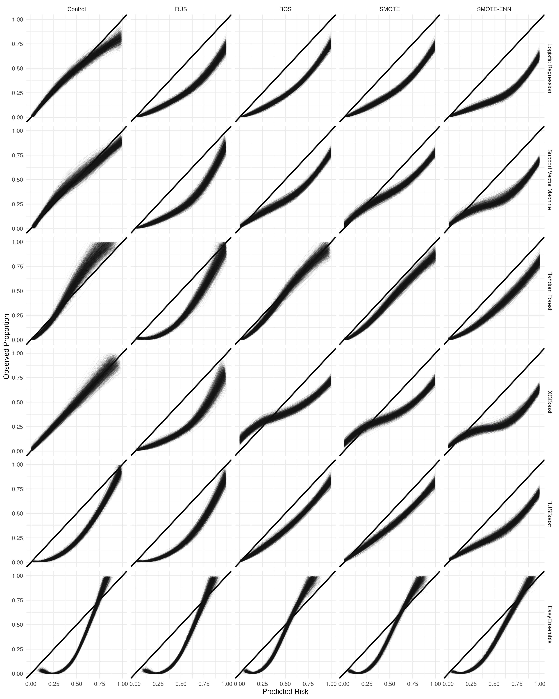
```

```{r, echo = F, fig.align="center", out.height= '70%', fig.cap = "Flexible calibration curves for each of 2000 simulation iterations in simulation scenario 18. This simulation scenario is characterized by 16 predictors, double the required sample size (2N) and extremely imbalanced data (event fraction = 0.02). Flexible curves were generated using raw predicted risks; no re-calibration. \\label{fig:cal_18}"}
knitr::include_graphics("./results/calibration_plot_manuscript_sc18.png")
```

\clearpage  

## Calibration Plots (after re-calibration)


```{r, echo = F, fig.align="center", out.height= '70%', fig.cap = "Flexible calibration curves for each of 2000 simulation iterations in simulation scenario 1. This simulation scenario is characterized by 8 predictors, half the required sample size (0.5N) and class balanced data (event fraction = 0.5). Flexible curves were generated using re-calibrated predicted risks.\\label{fig:recal_1}"}
knitr::include_graphics("./results/calibration_plot_manuscript_sc1_recalibrated.png")
```

```{r, echo = F, fig.align="center", out.height= '70%', fig.cap = "Flexible calibration curves for each of 2000 simulation iterations in simulation scenario 2. This simulation scenario is characterized by 8 predictors, half the required sample size (0.5N) and moderately imbalanced data (event fraction = 0.2). Flexible curves were generated using re-calibrated predicted risks. \\label{fig:recal_2}"}
knitr::include_graphics("./results/calibration_plot_manuscript_sc2_recalibrated.png")
```

```{r, echo = F, fig.align="center", out.height= '70%', fig.cap = "Flexible calibration curves for each of 2000 simulation iterations in simulation scenario 3. This simulation scenario is characterized by 8 predictors, half the required sample size (0.5N) and extremely imbalanced data (event fraction = 0.02). Flexible curves were generated using re-calibrated predicted risks.\\label{fig:recal_3}"}
knitr::include_graphics("./results/calibration_plot_manuscript_sc3_recalibrated.png")
```

```{r, echo = F, fig.align="center", out.height= '70%', fig.cap = "Flexible calibration curves for each of 2000 simulation iterations in simulation scenario 4. This simulation scenario is characterized by 8 predictors, adequate sample size (N) and class balanced data (event fraction = 0.5). Flexible curves were generated using re-calibrated predicted risks. \\label{fig:recal_4}"}
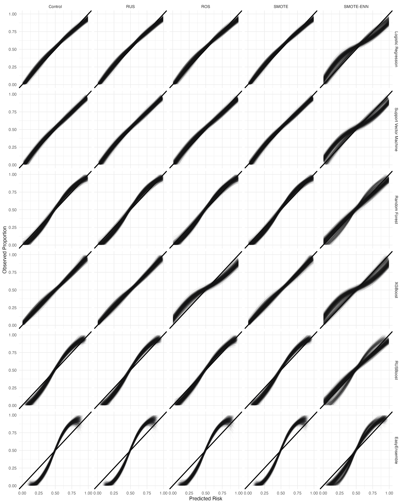
```

```{r, echo = F, fig.align="center", out.height= '70%',fig.cap = "Flexible calibration curves for each of 2000 simulation iterations in simulation scenario 5. This simulation scenario is characterized by 8 predictors, adequate sample size (N) and moderately imbalanced data (event fraction = 0.2). Flexible curves were generated using re-calibrated predicted risks. \\label{fig:recal_5}"}
knitr::include_graphics("./results/calibration_plot_manuscript_sc5_recalibrated.png")
```

```{r, echo = F, fig.align="center", out.height= '70%',fig.cap = "Flexible calibration curves for each of 2000 simulation iterations in simulation scenario 6. This simulation scenario is characterized by 8 predictors, adequate sample size (N) and extremely imbalanced data (event fraction = 0.02). Flexible curves were generated using re-calibrated predicted risks. \\label{fig:recal_6}"}
knitr::include_graphics("./results/calibration_plot_manuscript_sc6_recalibrated.png")
```

```{r, echo = F, fig.align="center", out.height= '70%', fig.cap = "Flexible calibration curves for each of 2000 simulation iterations in simulation scenario 7. This simulation scenario is characterized by 8 predictors, double the required sample size (2N) and class balanced data (event fraction = 0.5). Flexible curves were generated using re-calibrated predicted risks. \\label{fig:recal_7}"}
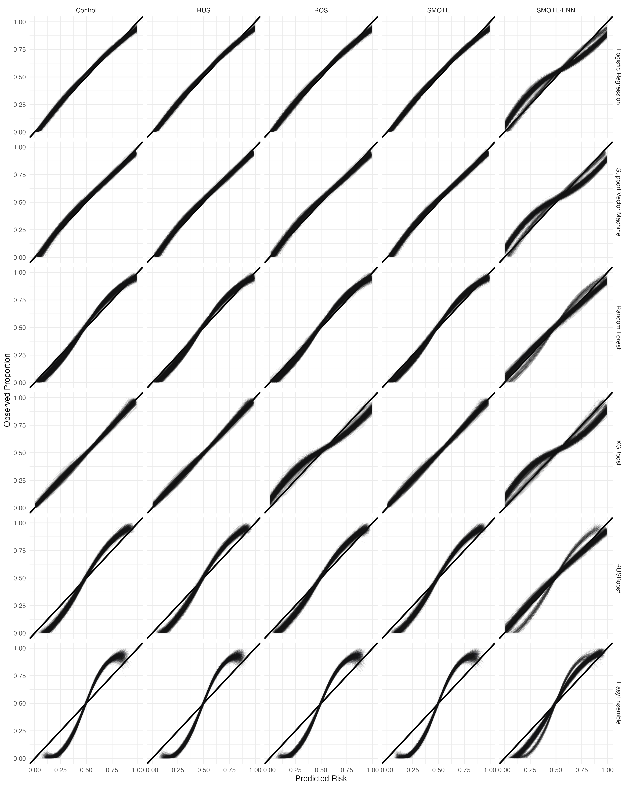
```

```{r, echo = F, fig.align="center", out.height= '70%', fig.cap = "Flexible calibration curves for each of 2000 simulation iterations in simulation scenario 8. This simulation scenario is characterized by 8 predictors, double the required sample size (2N) and moderately imbalanced data (event fraction = 0.2). Flexible curves were generated using re-calibrated predicted risks. \\label{fig:recal_8}"}
knitr::include_graphics("./results/calibration_plot_manuscript_sc8_recalibrated.png")
```

```{r, echo = F, fig.align="center", out.height= '70%', fig.cap = "Flexible calibration curves for each of 2000 simulation iterations in simulation scenario 9. This simulation scenario is characterized by 8 predictors, double the required sample size (2N) and extremely imbalanced data (event fraction = 0.02). Flexible curves were generated using re-calibrated predicted risks. \\label{fig:recal_9}"}
knitr::include_graphics("./results/calibration_plot_manuscript_sc9_recalibrated.png")
```

```{r, echo = F, fig.align="center", out.height= '70%', fig.cap = "Flexible calibration curves for each of 2000 simulation iterations in simulation scenario 10. This simulation scenario is characterized by 16 predictors, half the required sample size (0.5N) and class balanced data (event fraction = 0.5). Flexible curves were generated using re-calibrated predicted risks. \\label{fig:recal_10}"}
knitr::include_graphics("./results/calibration_plot_manuscript_sc10_recalibrated.png")
```

```{r, echo = F, fig.align="center", out.height= '70%', fig.cap = "Flexible calibration curves for each of 2000 simulation iterations in simulation scenario 11. This simulation scenario is characterized by 16 predictors, half the required sample size (0.5N) and moderately imbalanced data (event fraction = 0.2). Flexible curves were generated using re-calibrated predicted risks. \\label{fig:recal_11}"}
knitr::include_graphics("./results/calibration_plot_manuscript_sc11_recalibrated.png")
```

```{r, echo = F, fig.align="center", out.height= '70%', fig.cap = "Flexible calibration curves for each of 2000 simulation iterations in simulation scenario 12. This simulation scenario is characterized by 16 predictors, half the required sample size (0.5N) and extremely imbalanced data (event fraction = 0.02). Flexible curves were generated using re-calibrated predicted risks. \\label{fig:recal_12}"}
knitr::include_graphics("./results/calibration_plot_manuscript_sc12_recalibrated.png")
```

```{r, echo = F, fig.align="center", out.height= '70%', fig.cap = "Flexible calibration curves for each of 2000 simulation iterations in simulation scenario 13. This simulation scenario is characterized by 16 predictors, adequate sample size (N) and class balanced data (event fraction = 0.5). Flexible curves were generated using re-calibrated predicted risks. \\label{fig:recal_13}"}
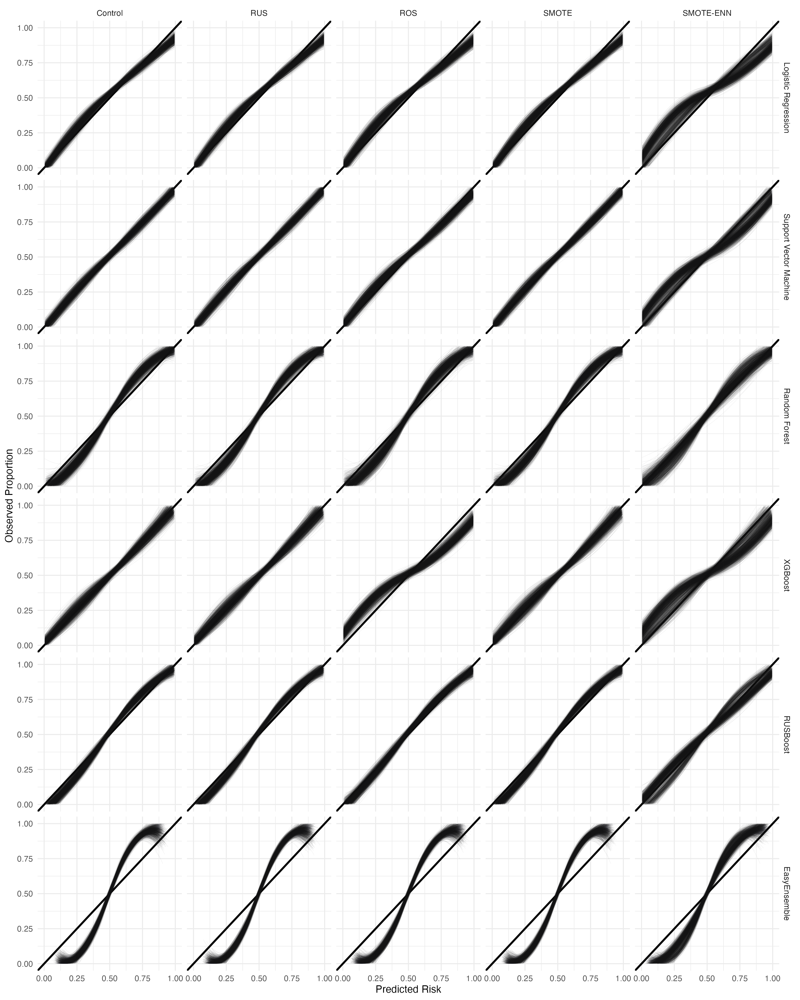
```

```{r, echo = F, fig.align="center", out.height= '70%',fig.cap = "Flexible calibration curves for each of 2000 simulation iterations in simulation scenario 14. This simulation scenario is characterized by 16 predictors, adequate sample size (N) and moderately imbalanced data (event fraction = 0.2). Flexible curves were generated using re-calibrated predicted risks. \\label{fig:recal_14}"}
knitr::include_graphics("./results/calibration_plot_manuscript_sc14_recalibrated.png")
```

```{r, echo = F, fig.align="center", out.height= '70%',fig.cap = "Flexible calibration curves for each of 2000 simulation iterations in simulation scenario 15. This simulation scenario is characterized by 16 predictors, adequate sample size (N) and extremely imbalanced data (event fraction = 0.02). Flexible curves were generated using re-calibrated predicted risks. \\label{fig:recal_15}"}
knitr::include_graphics("./results/calibration_plot_manuscript_sc15_recalibrated.png")
```

```{r, echo = F, fig.align="center", out.height= '70%', fig.cap = "Flexible calibration curves for each of 2000 simulation iterations in simulation scenario 16. This simulation scenario is characterized by 16 predictors, double the required sample size (2N) and class balanced data (event fraction = 0.5). Flexible curves were generated using re-calibrated predicted risks. \\label{fig:recal_16}"}
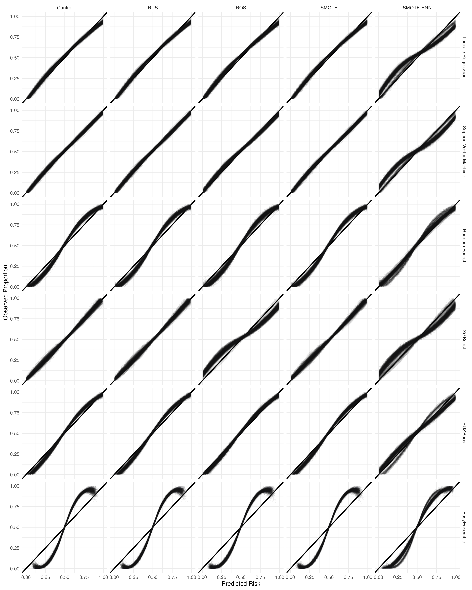
```

```{r, echo = F, fig.align="center", out.height= '70%', fig.cap = "Flexible calibration curves for each of 2000 simulation iterations in simulation scenario 17. This simulation scenario is characterized by 16 predictors, double the required sample size (2N) and moderately imbalanced data (event fraction = 0.2). Flexible curves were generated using re-calibrated predicted risks. \\label{fig:recal_17}"}
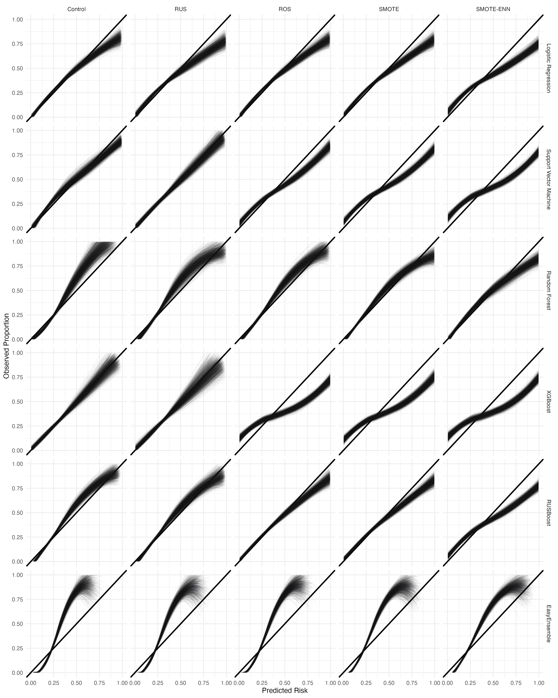
```

```{r, echo = F, fig.align="center", out.height= '70%', fig.cap = "Flexible calibration curves for each of 2000 simulation iterations in simulation scenario 18. This simulation scenario is characterized by 16 predictors, double the required sample size (2N) and extremely imbalanced data (event fraction = 0.02). Flexible curves were generated using re-calibrated predicted risks. \\label{fig:recal_18}"}
knitr::include_graphics("./results/calibration_plot_manuscript_sc18_recalibrated.png")
```

\clearpage 

## Violin Plots (no re-calibration)

```{r, echo = F, fig.align="center", out.height= '70%', fig.cap = "Empirical performance metrics for each of 2000 simulation iterations in simulation scenario 1.  This simulation scenario is characterized by 8 predictors, half the required sample size (0.5N) and class balanced data (event fraction = 0.5). Empirical performance metrics were computed with raw predicted risks; no re-calibration.\\label{fig:violin_1}"}
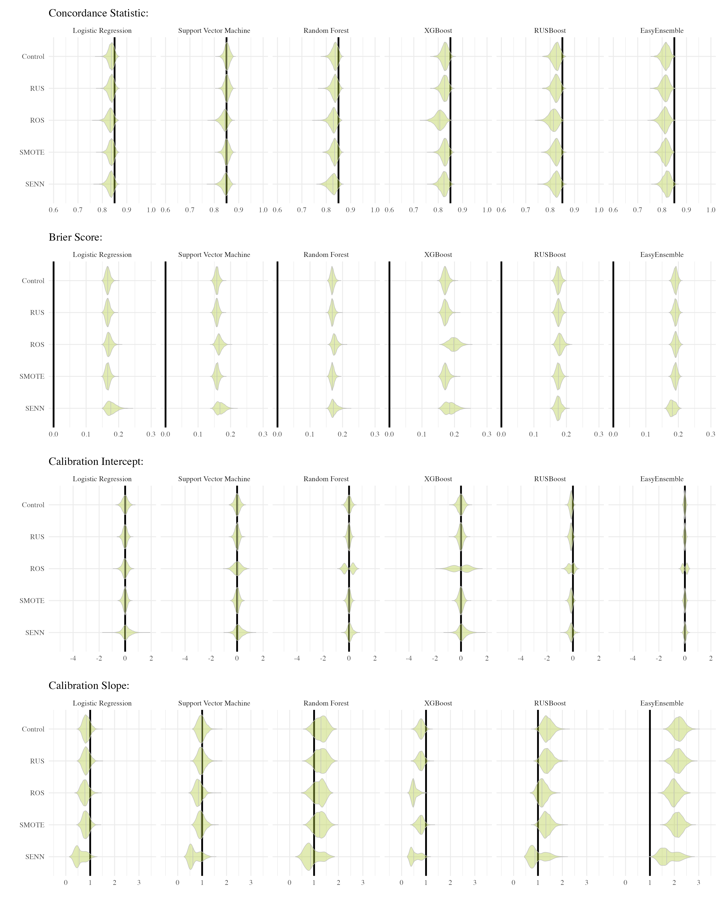
```

```{r, echo = F, fig.align="center", out.height= '70%', fig.cap = "Empirical performance metrics for each of 2000 simulation iterations in simulation scenario 2.  This simulation scenario is characterized by 8 predictors, half the required sample size (0.5N) and moderately imbalanced data (event fraction = 0.2). Empirical performance metrics were computed with raw predicted risks; no re-calibration. \\label{fig:violin_2}"}
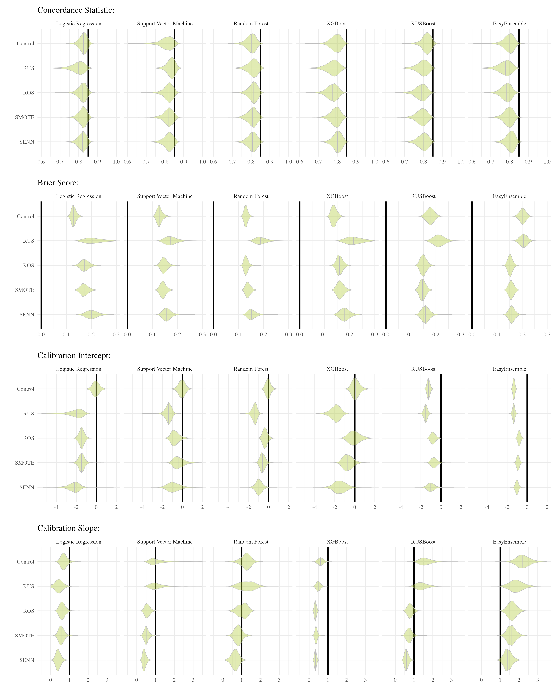
```

```{r, echo = F, fig.align="center", out.height= '70%', fig.cap = "Empirical performance metrics for each of 2000 simulation iterations in simulation scenario 3.  This simulation scenario is characterized by 8 predictors, half the required sample size (0.5N) and extremely imbalanced data (event fraction = 0.02). Empirical performance metrics were computed with raw predicted risks; no re-calibration. \\label{fig:violin_3}"}
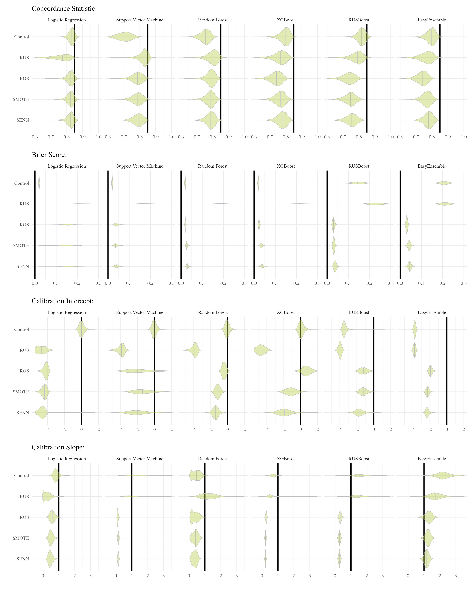
```

```{r, echo = F, fig.align="center", out.height= '70%', fig.cap = "Empirical performance metrics for each of 2000 simulation iterations in simulation scenario 4.  This simulation scenario is characterized by 8 predictors, adequate sample size (N) and class balanced data (event fraction = 0.5). Empirical performance metrics were computed with raw predicted risks; no re-calibration. \\label{fig:violin_4}"}
knitr::include_graphics("./results/performance_metrics_manuscript_sc4.png")
```

```{r, echo = F, fig.align="center", out.height= '70%', fig.cap = "Empirical performance metrics for each of 2000 simulation iterations in simulation scenario 5.  This simulation scenario is characterized by 8 predictors, adequate sample size (N) and moderately imbalanced data (event fraction = 0.2). Empirical performance metrics were computed with raw predicted risks; no re-calibration. \\label{fig:violin_5}"}
knitr::include_graphics("./results/performance_metrics_manuscript_sc5.png")
```

```{r, echo = F, fig.align="center", out.height= '70%', fig.cap = "Empirical performance metrics for each of 2000 simulation iterations in simulation scenario 6.  This simulation scenario is characterized by 8 predictors, adequate sample size (N) and extremely imbalanced data (event fraction = 0.02). Empirical performance metrics were computed with raw predicted risks; no re-calibration. \\label{fig:violin_6}"}
knitr::include_graphics("./results/performance_metrics_manuscript_sc6.png")
```

```{r, echo = F, fig.align="center", out.height= '70%', fig.cap = "Empirical performance metrics for each of 2000 simulation iterations in simulation scenario 7.  This simulation scenario is characterized by 8 predictors, double the required sample size (2N) and class balanced data (event fraction = 0.5). Empirical performance metrics were computed with raw predicted risks; no re-calibration. \\label{fig:violin_7}"}
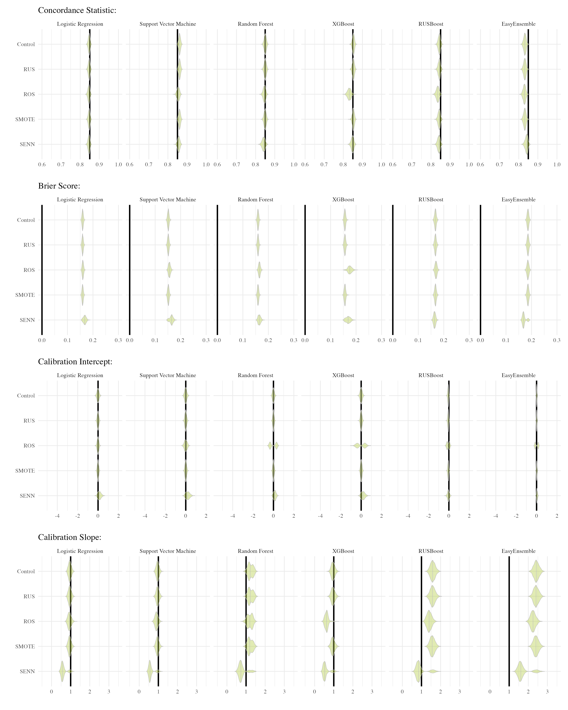
```

```{r, echo = F, fig.align="center", out.height= '70%', fig.cap = "Empirical performance metrics for each of 2000 simulation iterations in simulation scenario 8.  This simulation scenario is characterized by 8 predictors, double the required sample size (2N) and moderately imbalanced data (event fraction = 0.2).  Empirical performance metrics were computed with raw predicted risks; no re-calibration. \\label{fig:violin_8}"}
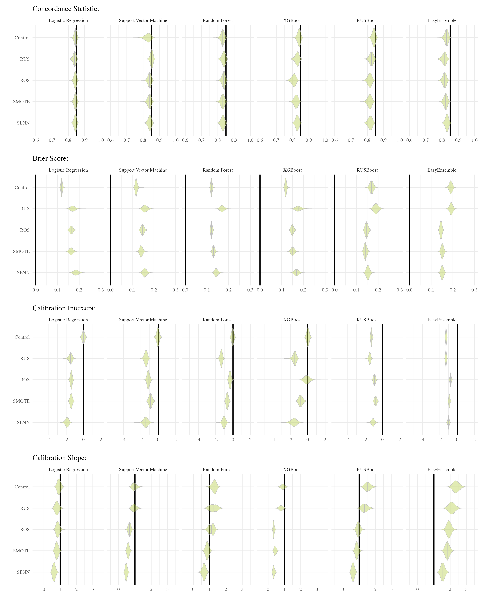
```

```{r, echo = F, fig.align="center", out.height= '70%', fig.cap = "Empirical performance metrics for each of 2000 simulation iterations in simulation scenario 9.  This simulation scenario is characterized by 8 predictors, double the required sample size (2N) and extremely imbalanced data (event fraction = 0.02). Empirical performance metrics were computed with raw predicted risks; no re-calibration.\\label{fig:violin_9}"}
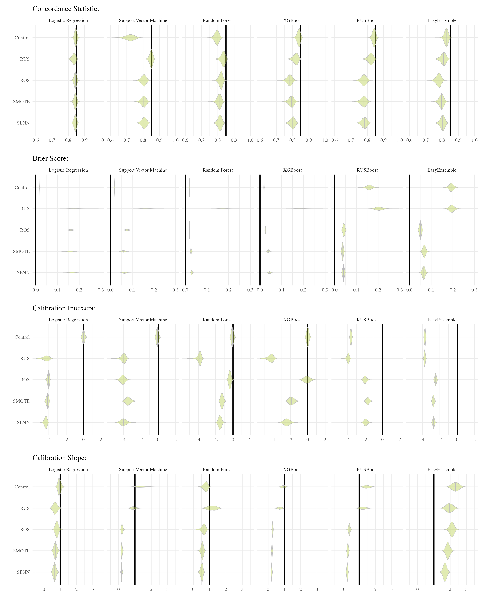
```

```{r, echo = F, fig.align="center", out.height= '70%', fig.cap = "Empirical performance metrics for each of 2000 simulation iterations in simulation scenario 10.  This simulation scenario is characterized by 8 predictors, half the required sample size (0.5N) and class balanced data (event fraction = 0.5). Empirical performance metrics were computed with raw predicted risks; no re-calibration. \\label{fig:violin_10}"}
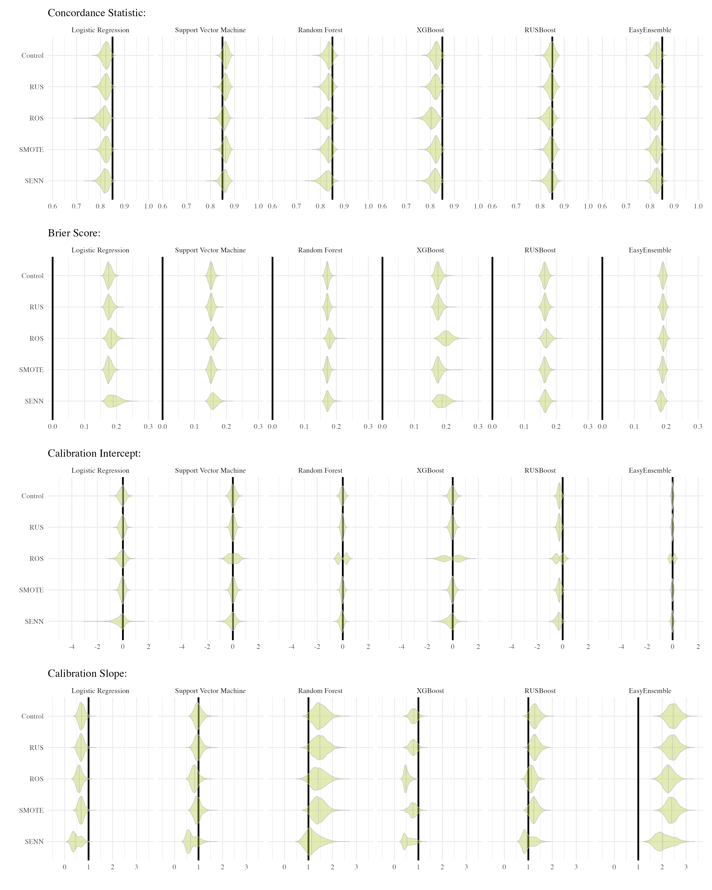
```

```{r, echo = F, fig.align="center", out.height= '70%', fig.cap = "Empirical performance metrics for each of 2000 simulation iterations in simulation scenario 11.  This simulation scenario is characterized by 8 predictors, half the required sample size (0.5N) and moderately imbalanced data (event fraction = 0.2). Empirical performance metrics were computed with raw predicted risks; no re-calibration. \\label{fig:violin_11}"}
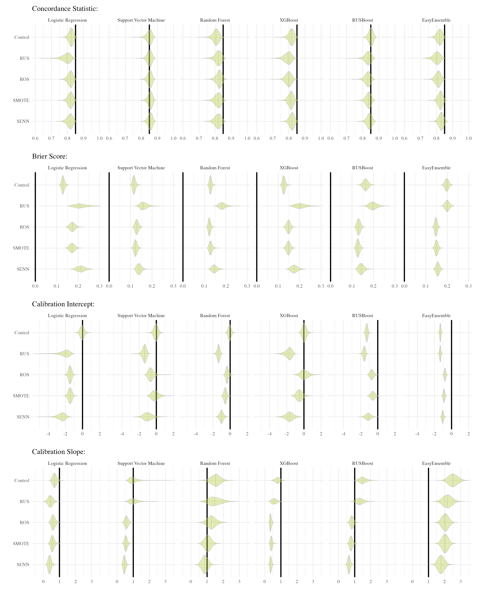
```

```{r, echo = F, fig.align="center", out.height= '70%', fig.cap = "Empirical performance metrics for each of 2000 simulation iterations in simulation scenario 12.  This simulation scenario is characterized by 8 predictors, half the required sample size (0.5N) and extremely imbalanced data (event fraction = 0.02). Empirical performance metrics were computed with raw predicted risks; no re-calibration. \\label{fig:violin_12}"}
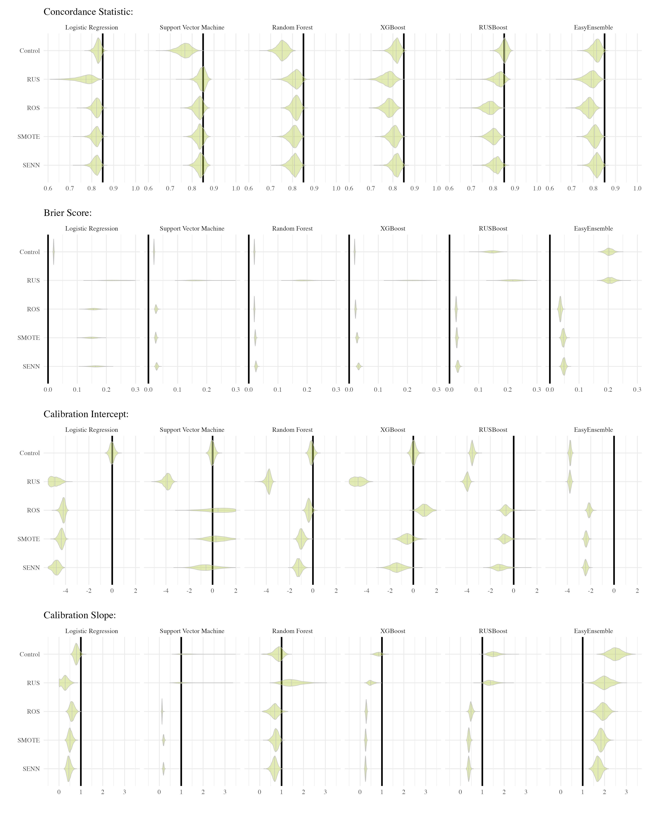
```

```{r, echo = F, fig.align="center", out.height= '70%', fig.cap = "Empirical performance metrics for each of 2000 simulation iterations in simulation scenario 13.  This simulation scenario is characterized by 8 predictors, adequate sample size (N) and class balanced data (event fraction = 0.5). Empirical performance metrics were computed with raw predicted risks; no re-calibration.\\label{fig:violin_13}"}
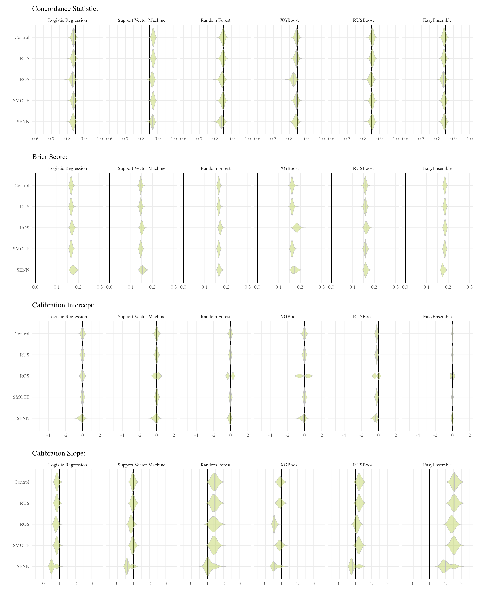
```

```{r, echo = F, fig.align="center", out.height= '70%', fig.cap = "Empirical performance metrics for each of 2000 simulation iterations in simulation scenario 14.  This simulation scenario is characterized by 8 predictors, adequate sample size (N) and moderately imbalanced data (event fraction = 0.2). Empirical performance metrics were computed with raw predicted risks; no re-calibration. \\label{fig:violin_14}"}
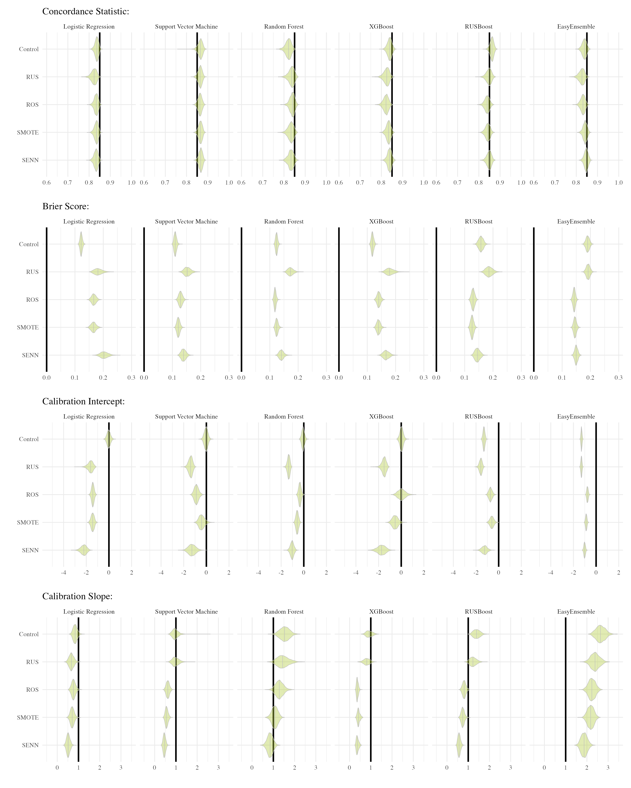
```

```{r, echo = F, fig.align="center", out.height= '70%', fig.cap = "Empirical performance metrics for each of 2000 simulation iterations in simulation scenario 15.  This simulation scenario is characterized by 8 predictors, adequate sample size (N) and extremely imbalanced data (event fraction = 0.02).  Empirical performance metrics were computed with raw predicted risks; no re-calibration. \\label{fig:violin_15}"}
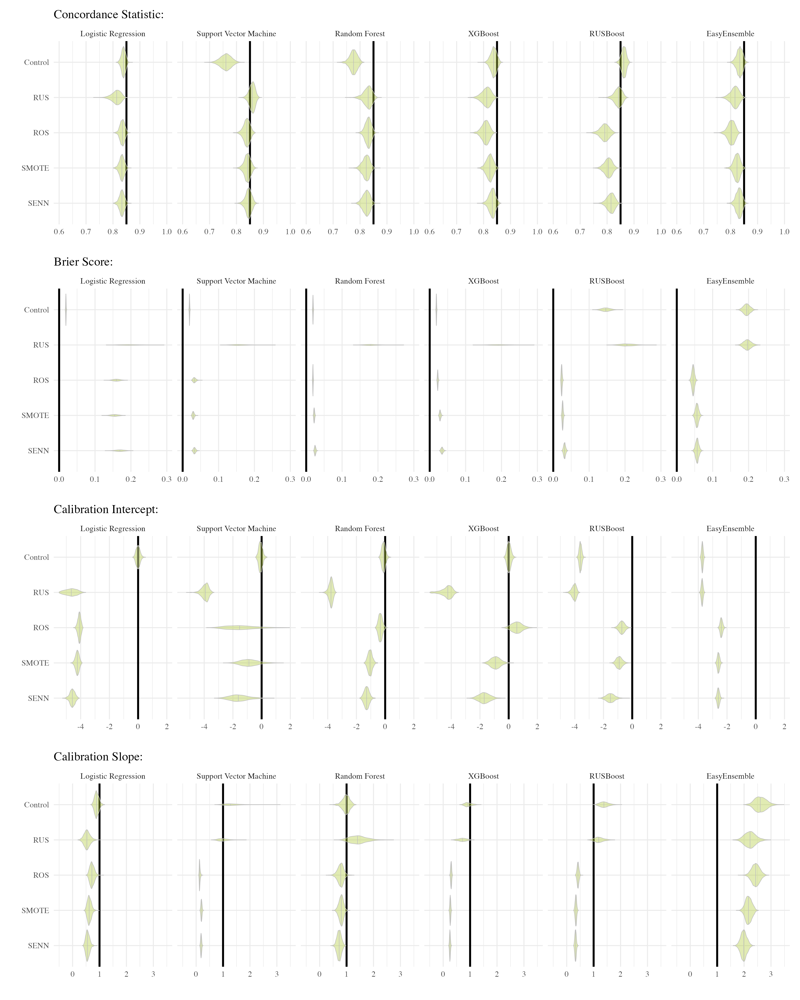
```

```{r, echo = F, fig.align="center", out.height= '70%', fig.cap = "Empirical performance metrics for each of 2000 simulation iterations in simulation scenario 16.  This simulation scenario is characterized by 8 predictors, double the required sample size (2N) and class balanced data (event fraction = 0.5). Empirical performance metrics were computed with raw predicted risks; no re-calibration. \\label{fig:violin_16}"}
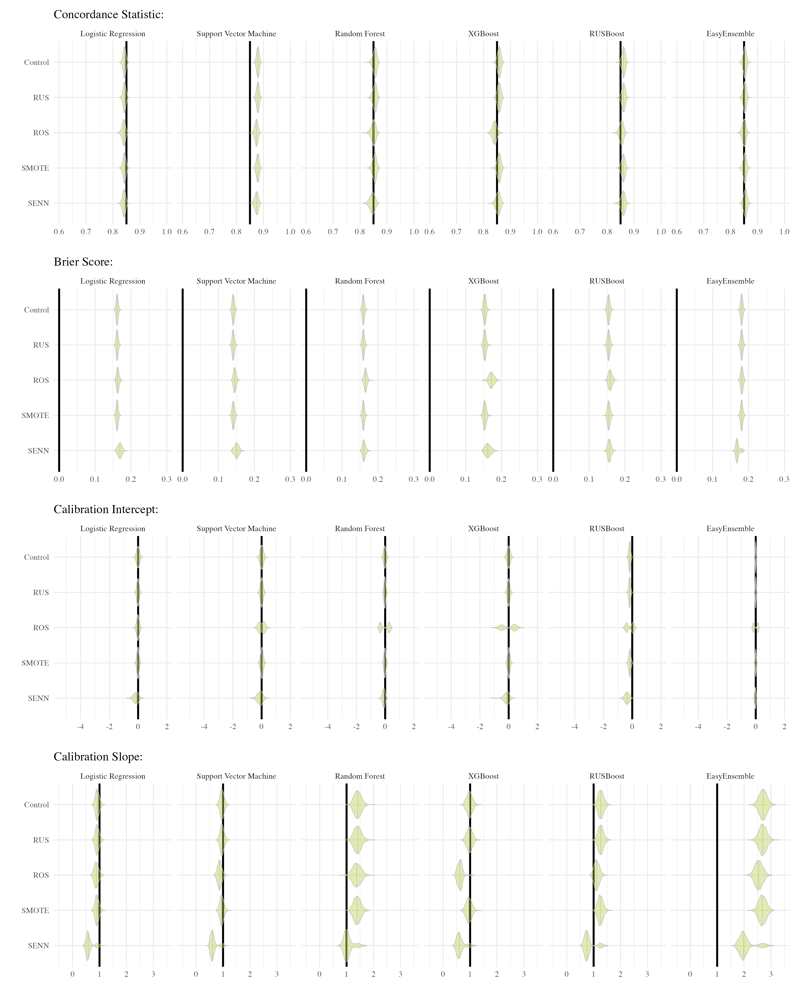
```

```{r, echo = F, fig.align="center", out.height= '75%', fig.cap = "Empirical performance metrics for each of 2000 simulation iterations in simulation scenario 17.  This simulation scenario is characterized by 8 predictors, double the required sample size (2N) and moderately imbalanced data (event fraction = 0.2). Empirical performance metrics were computed with raw predicted risks; no re-calibration. \\label{fig:violin_17}"}
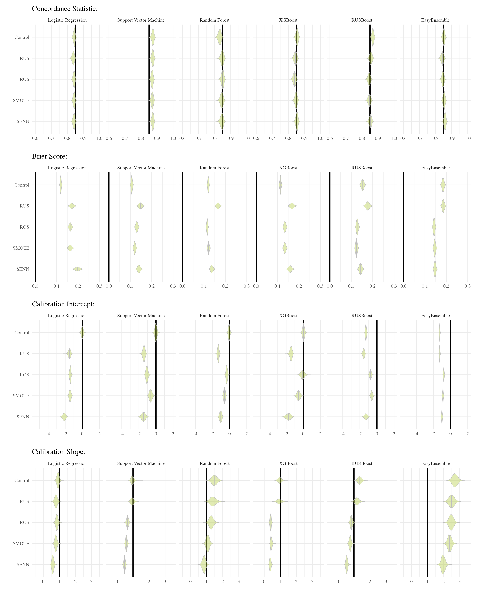
```

```{r, echo = F, fig.align="center", out.height= '70%', fig.cap = "Empirical performance metrics for each of 2000 simulation iterations in simulation scenario 18.  This simulation scenario is characterized by 8 predictors, double the required sample size (2N) and extremely imbalanced data (event fraction = 0.02). Empirical performance metrics were computed with raw predicted risks; no re-calibration.\\label{fig:violin_18}"}
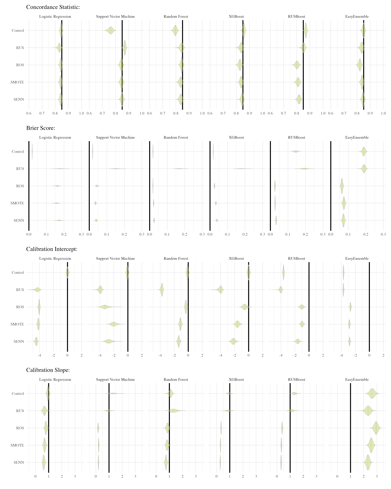
```

\clearpage 

## Violin Plots (after re-calibration)

```{r, echo = F, fig.align="center", out.height= '70%', fig.cap = "Empirical performance metrics for each of 2000 simulation iterations in simulation scenario 1.  This simulation scenario is characterized by 8 predictors, half the required sample size (0.5N) and class balanced data (event fraction = 0.5). Empirical performance metrics were computed with re-calibrated predicted risks. \\label{fig:recal_violin_1}"}
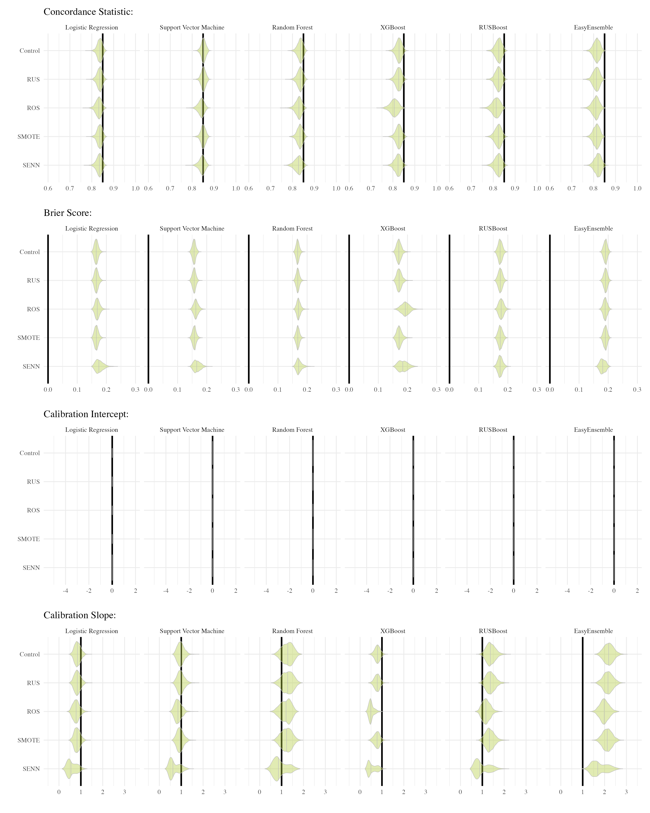
```

```{r, echo = F, fig.align="center", out.height= '70%', fig.cap = "Empirical performance metrics for each of 2000 simulation iterations in simulation scenario 2.  This simulation scenario is characterized by 8 predictors, half the required sample size (0.5N) and moderately imbalanced data (event fraction = 0.2). Empirical performance metrics were computed with re-calibrated predicted risks. \\label{fig:recal_violin_2}"}
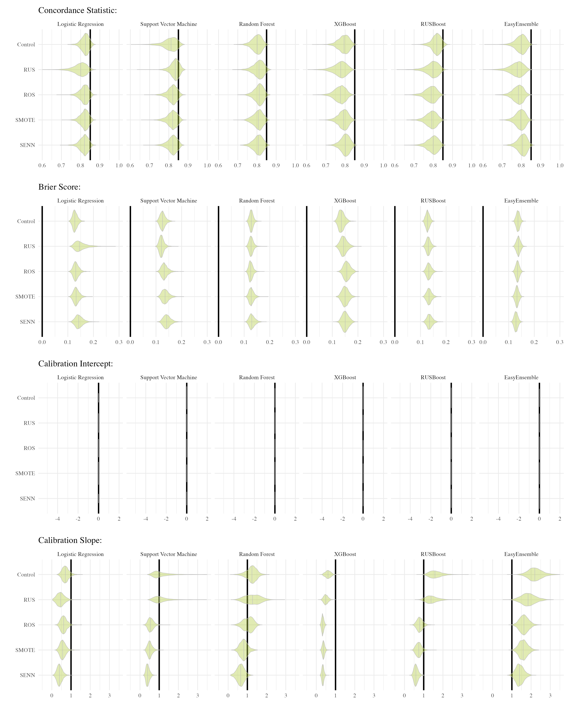
```

```{r, echo = F, fig.align="center", out.height= '70%', fig.cap = "Empirical performance metrics for each of 2000 simulation iterations in simulation scenario 3.  This simulation scenario is characterized by 8 predictors, half the required sample size (0.5N) and extremely imbalanced data (event fraction = 0.02). Empirical performance metrics were computed with re-calibrated predicted risks. \\label{fig:recal_violin_3}"}
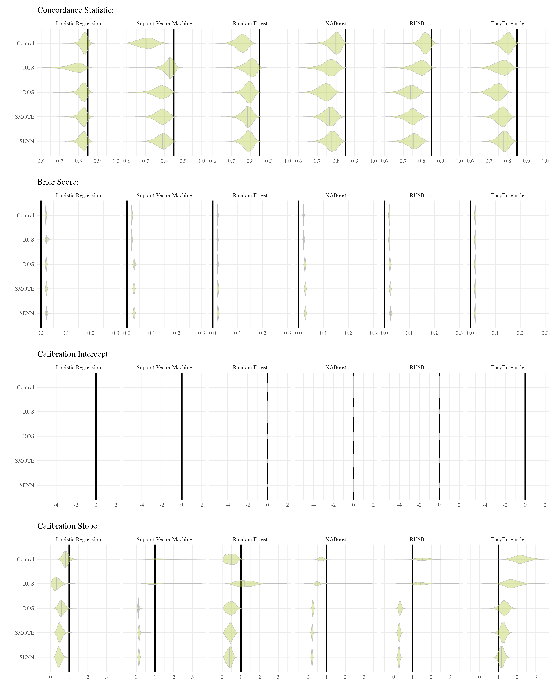
```

```{r, echo = F, fig.align="center", out.height= '70%', fig.cap = "Empirical performance metrics for each of 2000 simulation iterations in simulation scenario 4.  This simulation scenario is characterized by 8 predictors, adequate sample size (N) and class balanced data (event fraction = 0.5). Empirical performance metrics were computed with re-calibrated predicted risks. \\label{fig:recal_violin_4}"}
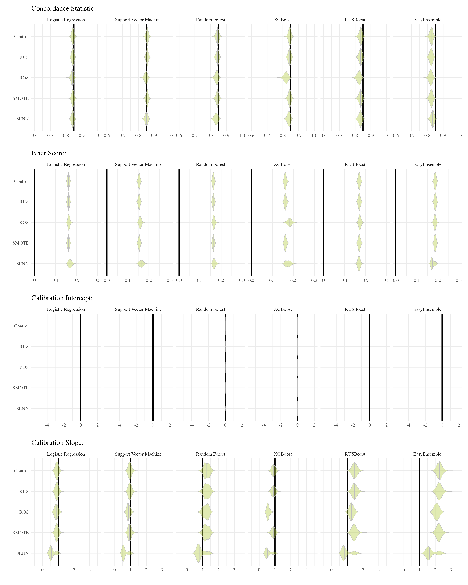
```

```{r, echo = F, fig.align="center", out.height= '70%', fig.cap = "Empirical performance metrics for each of 2000 simulation iterations in simulation scenario 5.  This simulation scenario is characterized by 8 predictors, adequate sample size (N) and moderately imbalanced data (event fraction = 0.2). Empirical performance metrics were computed with re-calibrated predicted risks. \\label{fig:recal_violin_5}"}

```

```{r, echo = F, fig.align="center", out.height= '70%', fig.cap = "Empirical performance metrics for each of 2000 simulation iterations in simulation scenario 6.  This simulation scenario is characterized by 8 predictors, adequate sample size (N) and extremely imbalanced data (event fraction = 0.02). Empirical performance metrics were computed with re-calibrated predicted risks. \\label{fig:recal_violin_6}"}
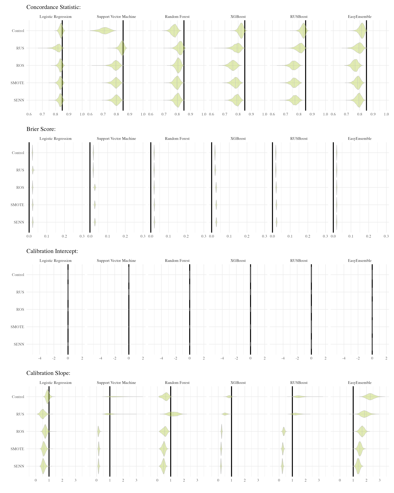
```

```{r, echo = F, fig.align="center", out.height= '70%', fig.cap = "Empirical performance metrics for each of 2000 simulation iterations in simulation scenario 7.  This simulation scenario is characterized by 8 predictors, double the required sample size (2N) and class balanced data (event fraction = 0.5). Empirical performance metrics were computed with re-calibrated predicted risks. \\label{fig:recal_violin_7}"}
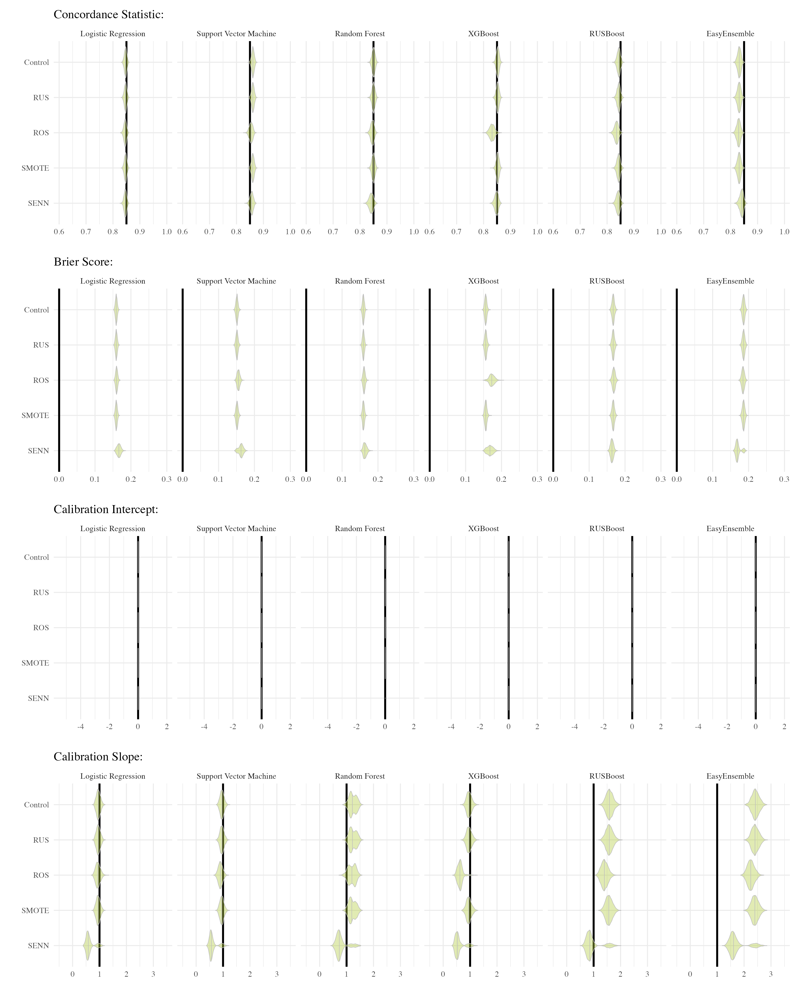
```

```{r, echo = F, fig.align="center", out.height= '70%', fig.cap = "Empirical performance metrics for each of 2000 simulation iterations in simulation scenario 8.  This simulation scenario is characterized by 8 predictors, double the required sample size (2N) and moderately imbalanced data (event fraction = 0.2). Empirical performance metrics were computed with re-calibrated predicted risks. \\label{fig:recal_violin_8}"}
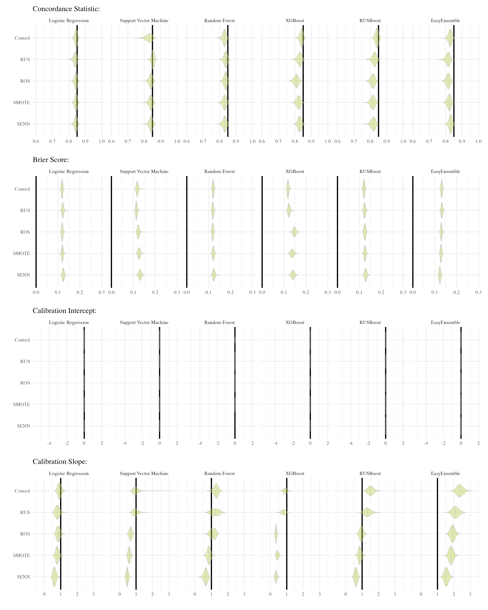
```

```{r, echo = F, fig.align="center", out.height= '70%', fig.cap = "Empirical performance metrics for each of 2000 simulation iterations in simulation scenario 9.  This simulation scenario is characterized by 8 predictors, double the required sample size (2N) and extremely imbalanced data (event fraction = 0.02). Empirical performance metrics were computed with re-calibrated predicted risks. \\label{fig:recal_violin_9}"}
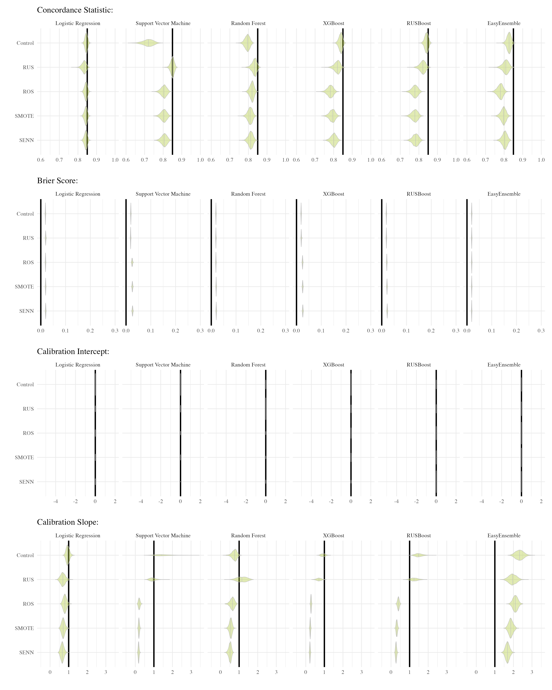
```

```{r, echo = F, fig.align="center", out.height= '70%', fig.cap = "Empirical performance metrics for each of 2000 simulation iterations in simulation scenario 10.  This simulation scenario is characterized by 8 predictors, half the required sample size (0.5N) and class balanced data (event fraction = 0.5). Empirical performance metrics were computed with re-calibrated predicted risks. \\label{fig:recal_violin_10}"}
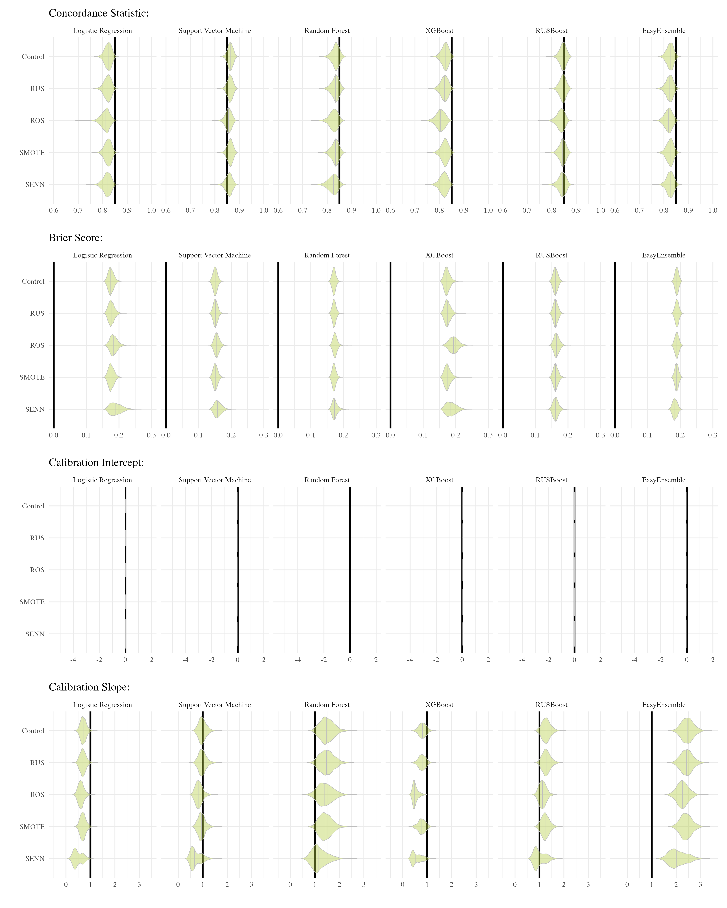
```

```{r, echo = F, fig.align="center", out.height= '70%', fig.cap = "Empirical performance metrics for each of 2000 simulation iterations in simulation scenario 11.  This simulation scenario is characterized by 8 predictors, half the required sample size (0.5N) and moderately imbalanced data (event fraction = 0.2). Empirical performance metrics were computed with re-calibrated predicted risks. \\label{fig:recal_violin_11}"}
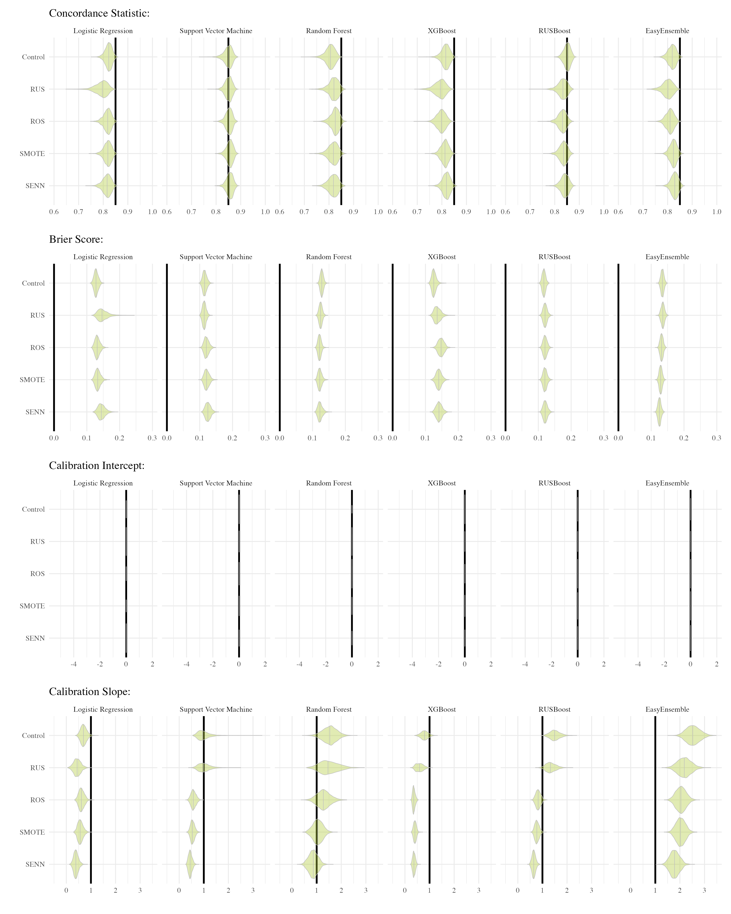
```

```{r, echo = F, fig.align="center", out.height= '70%', fig.cap = "Empirical performance metrics for each of 2000 simulation iterations in simulation scenario 12.  This simulation scenario is characterized by 8 predictors, half the required sample size (0.5N) and extremely imbalanced data (event fraction = 0.02). Empirical performance metrics were computed with re-calibrated predicted risks. \\label{fig:recal_violin_12}"}
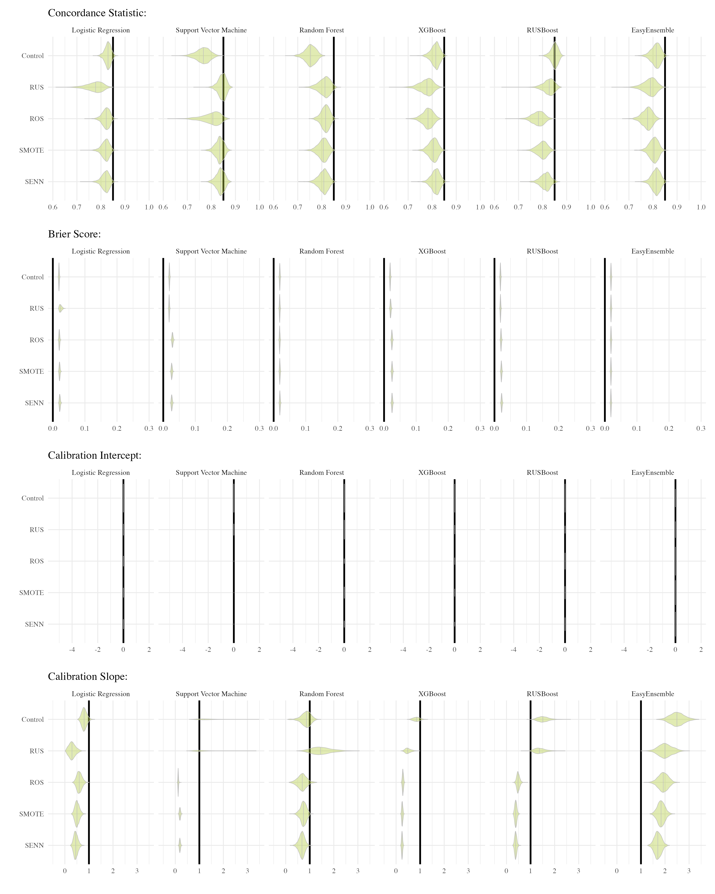
```

```{r, echo = F, fig.align="center", out.height= '70%', fig.cap = "Empirical performance metrics for each of 2000 simulation iterations in simulation scenario 13.  This simulation scenario is characterized by 8 predictors, adequate sample size (N) and class balanced data (event fraction = 0.5). Empirical performance metrics were computed with re-calibrated predicted risks.\\label{fig:rrecal_violin_13}"}
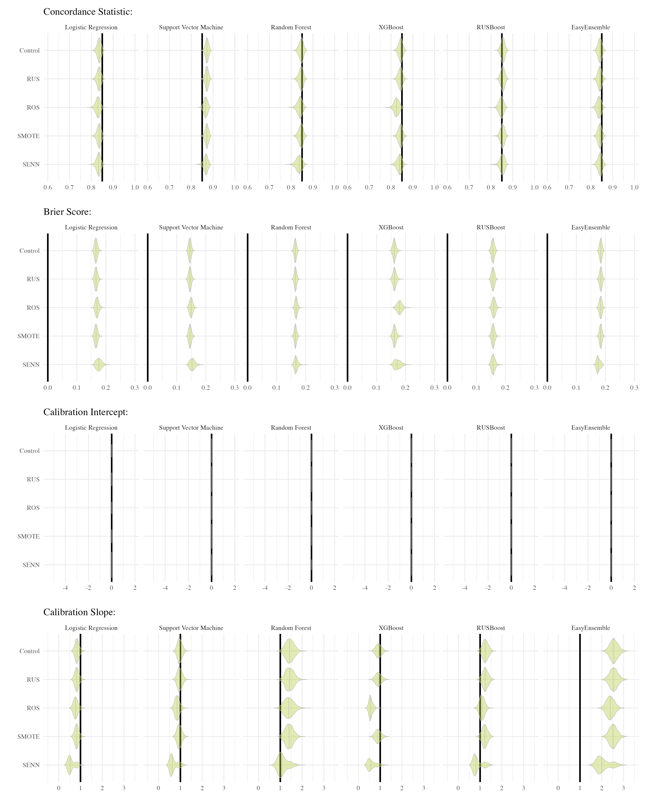
```

```{r, echo = F, fig.align="center", out.height= '70%', fig.cap = "Empirical performance metrics for each of 2000 simulation iterations in simulation scenario 14.  This simulation scenario is characterized by 8 predictors, adequate sample size (N) and moderately imbalanced data (event fraction = 0.2). Empirical performance metrics were computed with re-calibrated predicted risks. \\label{fig:recal_violin_14}"}
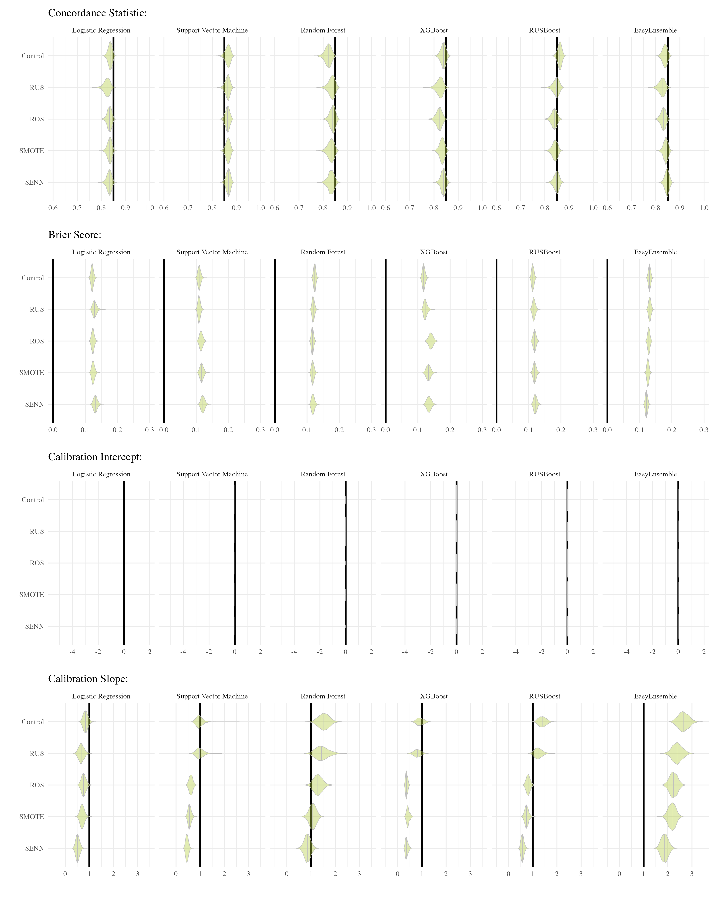
```

```{r, echo = F, fig.align="center", out.height= '70%', fig.cap = "Empirical performance metrics for each of 2000 simulation iterations in simulation scenario 15.  This simulation scenario is characterized by 8 predictors, adequate sample size (N) and extremely imbalanced data (event fraction = 0.02). Empirical performance metrics were computed with re-calibrated predicted risks. \\label{fig:recal_violin_15}"}
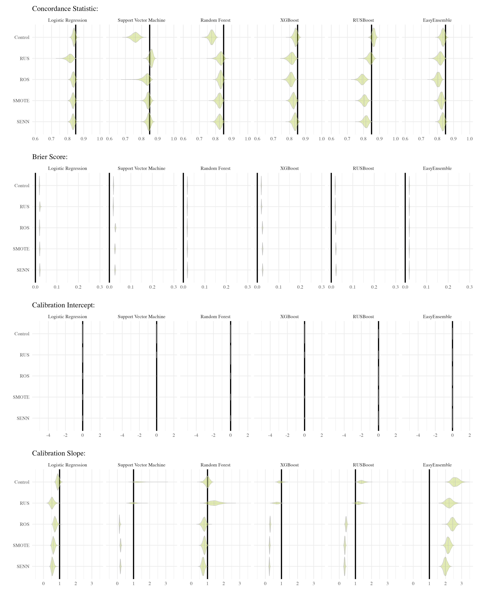
```

```{r, echo = F, fig.align="center", out.height= '70%', fig.cap = "Empirical performance metrics for each of 2000 simulation iterations in simulation scenario 16.  This simulation scenario is characterized by 8 predictors, double the required sample size (2N) and class balanced data (event fraction = 0.5). Empirical performance metrics were computed with re-calibrated predicted risks. \\label{fig:recal_violin_16}"}
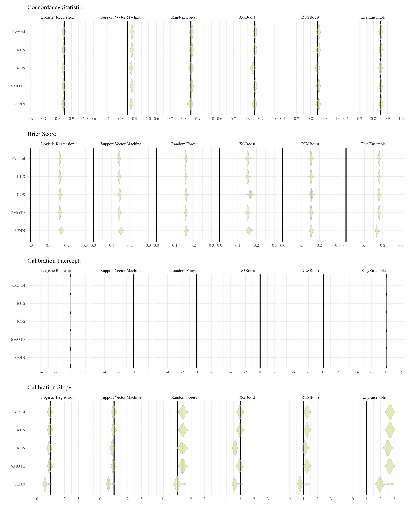
```

```{r, echo = F, fig.align="center", out.height= '70%', fig.cap = "Empirical performance metrics for each of 2000 simulation iterations in simulation scenario 17.  This simulation scenario is characterized by 8 predictors, double the required sample size (2N) and moderately imbalanced data (event fraction = 0.2). Empirical performance metrics were computed with re-calibrated predicted risks. \\label{fig:recal_violin_17}"}
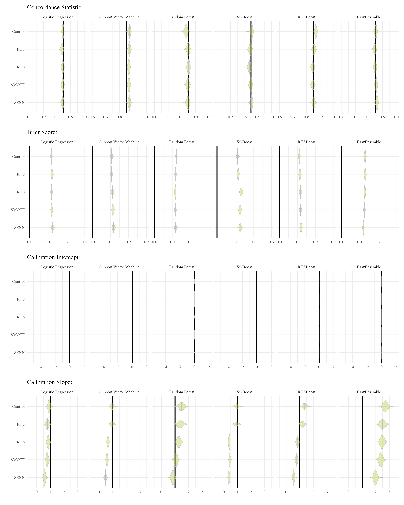
```

```{r, echo = F, fig.align="center", out.height= '70%', fig.cap = "Empirical performance metrics for each of 2000 simulation iterations in simulation scenario 18.  This simulation scenario is characterized by 8 predictors, double the required sample size (2N) and extremely imbalanced data (event fraction = 0.02). Empirical performance metrics were computed with re-calibrated predicted risks. \\label{fig:recal_violin_18}"}
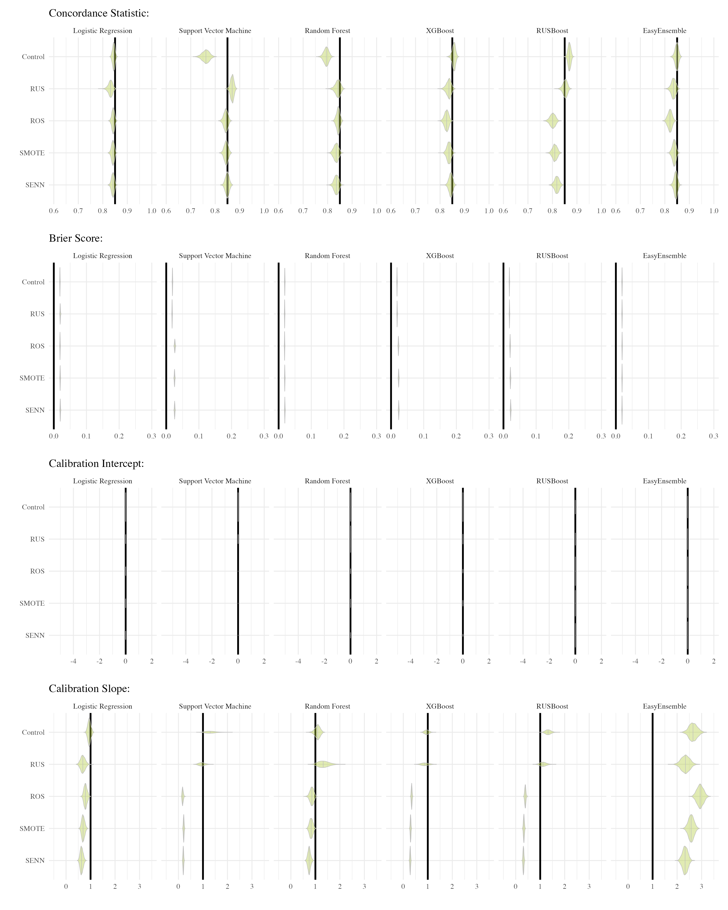
```
