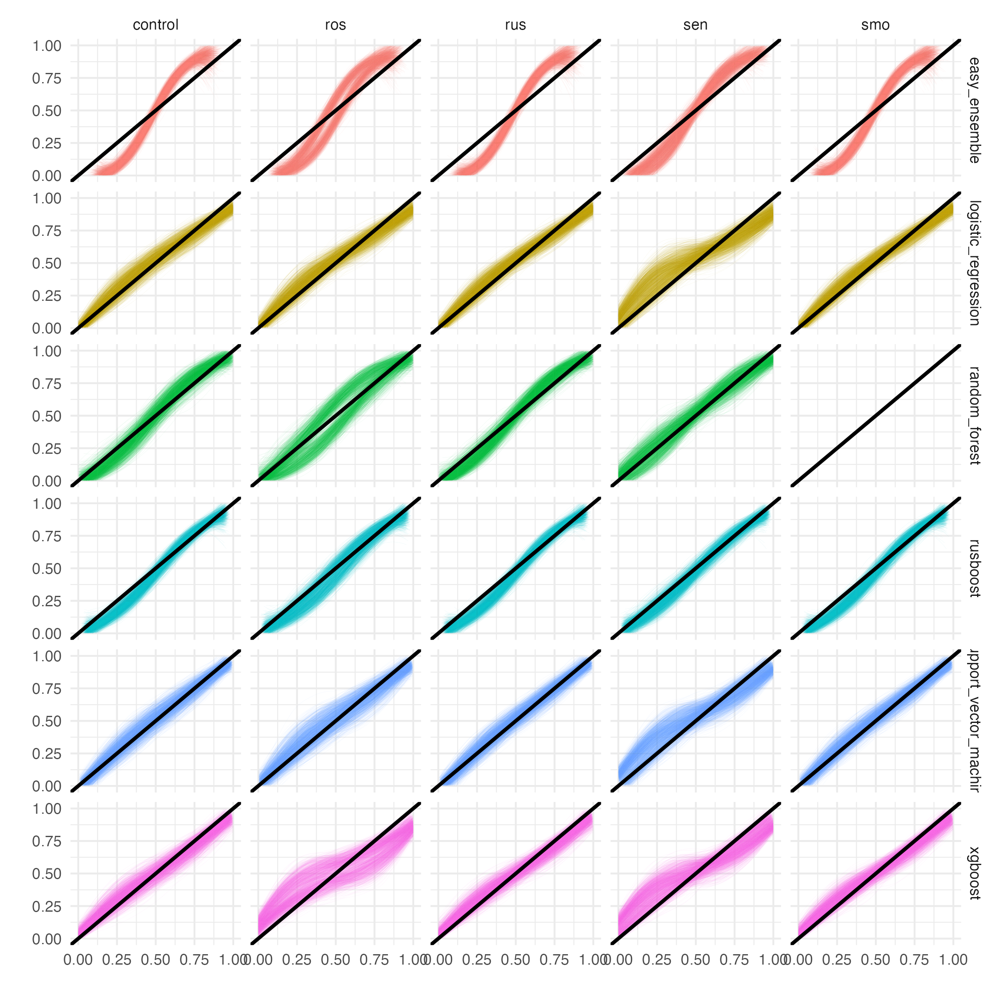
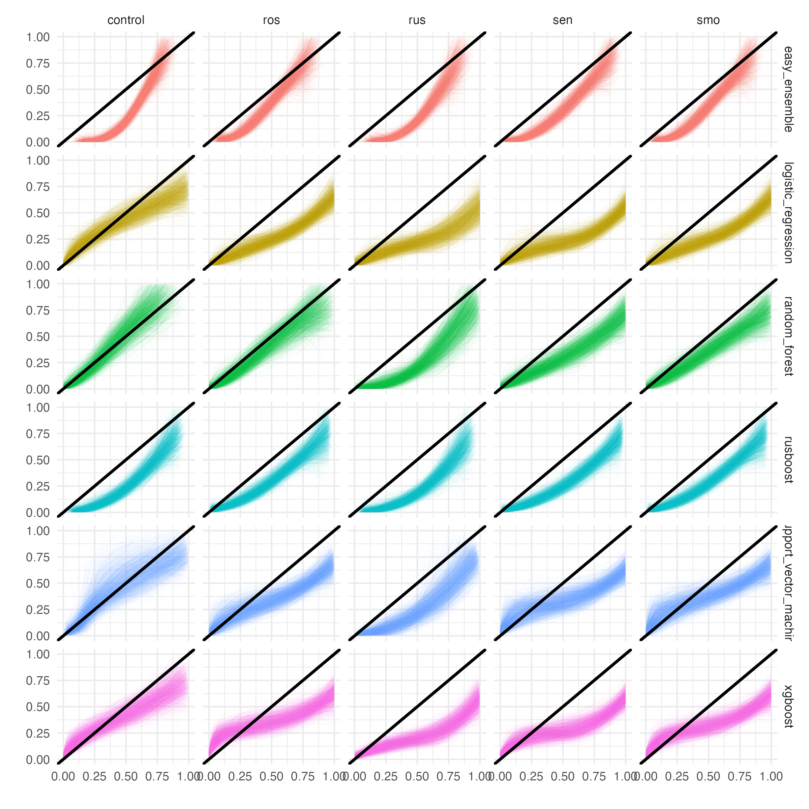

<style>  

.navbar {
  background-color: #F5F5DC;
  border-color: #F5F5DC;

}
.navbar-brand {
  color:black!important;
}
 
a {
  color:black!important;
}

a:hover{
  background-color: #ACD657!important;
}

.navbar-nav>li>a:focus{
  background-color: #ACD657!important;
}

.navbar-nav>li>a:not(active){
  background-color: #ededc2!important;
}

.nav-tabs-custom > .nav-tabs > li.active {
  border-top-color: #ACD657}

</style>   


```{r setup, include=FALSE}
library(flexdashboard)
library(tidyverse)
library(DT)

algorithms   <- c("logistic_regression", 
                  "support_vector_machine", 
                  "random_forest", 
                  "xgboost", 
                  "rusboost", 
                  "easy_ensemble")

corrections  <- c("control", 
                  "rus", 
                  "ros", 
                  "smo", 
                  "sen")

pairs <- 
  expand_grid(corrections, algorithms) %>% 
  mutate(pair_id = c(1:30)) %>% 
  relocate(pair_id)
```

# Scenario 1

Row {.tabset .tabset-fade}
--------------------------------------------------------------------------------
**Summary Statistics**
```{r, include = FALSE}
sc1 <- readRDS("./results/results_sc1.RData")
```

### Overall Summary 
```{r}
sc1$summary %>% 
  mutate(scenario = as.character(scenario)) %>% 
  mutate(across(where(is.numeric), round, 3)) %>%
  mutate(pair_id = as.numeric(pair_id)) %>% 
  arrange(pair_id, decending = F) %>% 
  merge(pairs, by = "pair_id") %>% 
  relocate(c(scenario, pair_id, corrections, algorithms)) %>%
  DT::datatable(rownames = FALSE)
```

### Progress
```{r}
sc1$rows_per_pair %>%
  DT::datatable(rownames = FALSE)
```

### Problematic Iterations
```{r}
sc1$problem_iterations %>% 
  rbind(sc1$any_na_row) %>% 
  relocate(c(scenario, pair_id, corrections, algorithms, warning, err)) %>% 
  mutate(across(where(is.numeric), round, 3)) %>%
  DT::datatable(rownames = FALSE, 
                 options = list(scrollX = TRUE, 
                                deferRender = TRUE,
                                scroller = TRUE,
                                columnDefs = list(list(width = '500px',targets = c(4,5,19,20))),
                                rowDefs = list(list(width = '5px')),
                                autoWidth=TRUE))
```


### Calibration Plots

```{r picture, echo = F, out.width = '95%'}

```

# Scenario 2

Row {.tabset .tabset-fade}
--------------------------------------------------------------------------------
**Summary Statistics**
```{r, include = FALSE}
sc2 <- readRDS("./results/results_sc2.RData")
```

### Overall Summary 
```{r}
sc2$summary %>% 
  mutate(scenario = as.character(scenario)) %>% 
  mutate(across(where(is.numeric), round, 3)) %>%
  mutate(pair_id = as.numeric(pair_id)) %>% 
  arrange(pair_id, decending = F) %>% 
  merge(pairs, by = "pair_id") %>% 
  relocate(c(scenario, pair_id, corrections, algorithms)) %>%
  DT::datatable(rownames = FALSE)
```

### Progress
```{r}
sc2$rows_per_pair %>%
  DT::datatable(rownames = FALSE)
```

### Problematic Iterations
```{r}
sc2$problem_iterations %>% 
  rbind(sc2$any_na_row) %>% 
  relocate(c(scenario, pair_id, corrections, algorithms, warning, err)) %>% 
  mutate(across(where(is.numeric), round, 3)) %>%
  DT::datatable(rownames = FALSE, 
                 options = list(scrollX = TRUE, 
                                deferRender = TRUE,
                                scroller = TRUE,
                                columnDefs = list(list(width = '500px',targets = c(4,5,19,20))),
                                rowDefs = list(list(width = '5px')),
                                autoWidth=TRUE))
```


### Calibration Plots

```{r, echo = F, out.width = '95%'}

```


# Scenario 3 
Row {.tabset .tabset-fade}
--------------------------------------------------------------------------------
**Summary Statistics**
```{r, include = FALSE}
sc3 <- readRDS("./results/results_sc3.RData")
```

### Overall Summary 
```{r}
sc3$summary %>% 
  mutate(scenario = as.character(scenario)) %>% 
  mutate(across(where(is.numeric), round, 3)) %>%
  mutate(pair_id = as.numeric(pair_id)) %>% 
  arrange(pair_id, decending = F) %>% 
  merge(pairs, by = "pair_id") %>% 
  relocate(c(scenario, pair_id, corrections, algorithms)) %>%
  DT::datatable(rownames = FALSE)
```

### Progress
```{r}
sc3$rows_per_pair %>%
  DT::datatable(rownames = FALSE)
```


### Problematic Iterations
```{r}
sc3$problem_iterations %>% 
  rbind(sc2$any_na_row) %>% 
  relocate(c(scenario, pair_id, corrections, algorithms, warning, err)) %>% 
  mutate(across(where(is.numeric), round, 3)) %>%
  DT::datatable(rownames = FALSE, 
                 options = list(scrollX = TRUE, 
                                deferRender = TRUE,
                                scroller = TRUE,
                                columnDefs = list(list(width = '500px',targets = c(4,5,19,20))),
                                rowDefs = list(list(width = '5px')),
                                autoWidth=TRUE))
```


# Scenario 4

Row {.tabset .tabset-fade}
--------------------------------------------------------------------------------
**Summary Statistics**
```{r, include = FALSE}
sc4 <- readRDS("./results/results_sc4.RData")
```

### Overall Summary 
```{r}
sc4$summary %>% 
  mutate(scenario = as.character(scenario)) %>% 
  mutate(across(where(is.numeric), round, 3)) %>%
  mutate(pair_id = as.numeric(pair_id)) %>% 
  arrange(pair_id, decending = F) %>% 
  merge(pairs, by = "pair_id") %>% 
  relocate(c(scenario, pair_id, corrections, algorithms)) %>%
  DT::datatable(rownames = FALSE)
```

### Progress
```{r}
sc4$rows_per_pair %>%
  DT::datatable(rownames = FALSE)
```

### Problematic Iterations
```{r}
sc4$problem_iterations %>% 
  rbind(sc2$any_na_row) %>% 
  relocate(c(scenario, pair_id, corrections, algorithms, warning, err)) %>% 
  mutate(across(where(is.numeric), round, 3)) %>%
  DT::datatable(rownames = FALSE, 
                 options = list(scrollX = TRUE, 
                                deferRender = TRUE,
                                scroller = TRUE,
                                columnDefs = list(list(width = '500px',targets = c(4,5,19,20))),
                                rowDefs = list(list(width = '5px')),
                                autoWidth=TRUE))
```


# Scenario 5

# Scenario 6

# Scenario 7 

# Scenario 8 

# Scenario 9