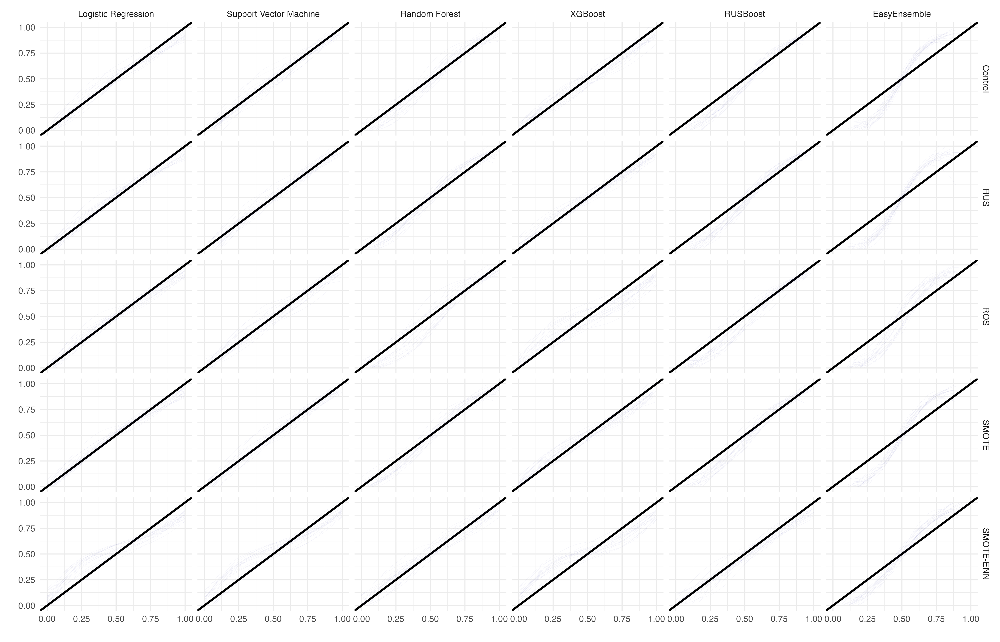
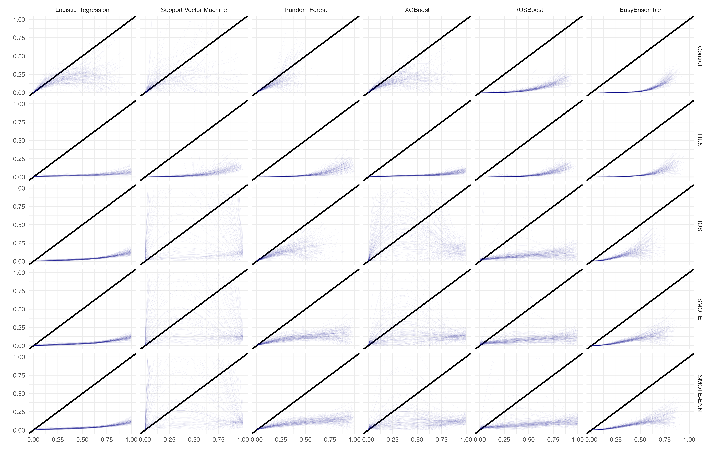
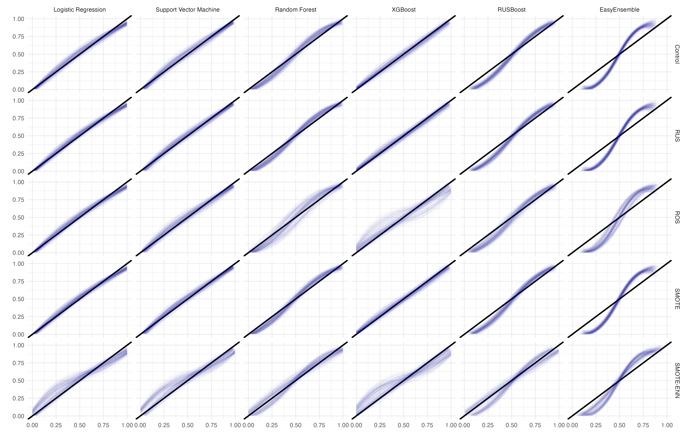
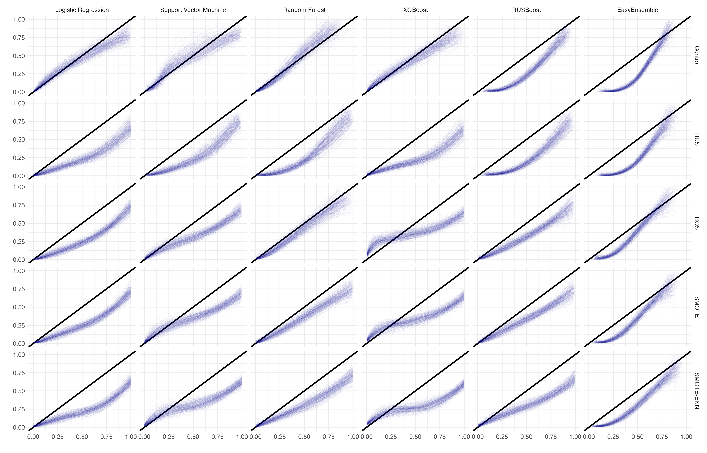

<style>  

.navbar {
  background-color: #F5F5DC;
  border-color: #F5F5DC;

}
.navbar-brand {
  color:black!important;
}
 
a {
  color:black!important;
}

a:hover{
  background-color: #ACD657!important;
}

.navbar-nav>li>a:focus{
  background-color: #ACD657!important;
}

.navbar-nav>li>a:not(active){
  background-color: #ededc2!important;
}

.nav-tabs-custom > .nav-tabs > li.active {
  border-top-color: #ededc2}

</style>   


```{r setup, include=FALSE}
library(flexdashboard)
library(tidyverse)
library(viridis)
library(patchwork)
library(DT)

source("./../../results/process_results.R")

algorithms   <- c("logistic_regression", 
                  "support_vector_machine", 
                  "random_forest", 
                  "xgboost", 
                  "rusboost", 
                  "easy_ensemble")

corrections  <- c("control", 
                  "rus", 
                  "ros", 
                  "smo", 
                  "sen")

pairs <- 
  expand_grid(corrections, algorithms) %>% 
  mutate(pair_id = c(1:30)) %>% 
  relocate(pair_id)
```

# Scenario 1 

Row {.tabset .tabset-fade}
--------------------------------------------------------------------------------
\
**Predictors = $8$, Event Fraction = $0.5$, Sample Size = $\frac{1}{2}N$**\
\
```{r, include = FALSE}
df <- readRDS("./results/results_sc1_new.RData")
```

### Overall Summary 
```{r}
df$summary %>% 
  mutate(scenario = as.character(scenario)) %>% 
  mutate(across(where(is.numeric), round, 3)) %>%
  mutate(pair_id = as.numeric(pair_id)) %>% 
  arrange(pair_id, decending = F) %>% 
  merge(pairs, by = "pair_id") %>%
  relocate(c(scenario, pair_id, corrections, algorithms)) %>%
  DT::datatable(rownames = FALSE)
```

### Problematic Iterations
```{r}
df$problem_iterations %>% 
  rbind(df$any_na_row) %>% 
  relocate(c(scenario, pair_id, correction, algorithm, warning, err)) %>% 
  mutate(across(where(is.numeric), round, 3)) %>%
  filter(algorithm != "logistic_regression") %>% 
  DT::datatable(rownames = FALSE, 
                 options = list(scrollX = TRUE, 
                                deferRender = TRUE,
                                scroller = TRUE,
                                columnDefs = list(list(width = '500px',targets = c(4,5,19,20))),
                                rowDefs = list(list(width = '5px')),
                                autoWidth=TRUE))
```

### Calibration Plots
```{r, echo = F, out.width = '95%'}

```

### Performance Metrics 

```{r fig.height = 8, fig.width = 10}
a <- pm_plot(df$overall_dataframe, method = "auc", 0.7, 1)

b <- pm_plot(df$overall_dataframe, method = "bri", -0.5, 0.5)

c <- pm_plot(df$overall_dataframe, method = "int", -2, 0.5)

d <- pm_plot(df$overall_dataframe, method = "slp", -0.5, 5)

a + b + c + d + plot_layout(ncol = 1)
```

# Scenario 2 

Row {.tabset .tabset-fade}
--------------------------------------------------------------------------------
**Summary Statistics**
```{r, include = FALSE}
df <- readRDS("./results/results_sc2_new.RData")
```

### Overall Summary 
```{r}
df$summary %>% 
  mutate(scenario = as.character(scenario)) %>% 
  mutate(across(where(is.numeric), round, 3)) %>%
  mutate(pair_id = as.numeric(pair_id)) %>% 
  arrange(pair_id, decending = F) %>% 
  merge(pairs, by = "pair_id") %>%
  relocate(c(scenario, pair_id, corrections, algorithms)) %>%
  DT::datatable(rownames = FALSE)
```

### Problematic Iterations
```{r}
df$problem_iterations %>% 
  rbind(df$any_na_row) %>% 
  relocate(c(scenario, pair_id, correction, algorithm, warning, err)) %>% 
  mutate(across(where(is.numeric), round, 3)) %>%
  filter(algorithm != "logistic_regression") %>% 
  DT::datatable(rownames = FALSE, 
                 options = list(scrollX = TRUE, 
                                deferRender = TRUE,
                                scroller = TRUE,
                                columnDefs = list(list(width = '500px',targets = c(4,5,19,20))),
                                rowDefs = list(list(width = '5px')),
                                autoWidth=TRUE))
```

### Calibration Plots
```{r, echo = F, out.width = '95%'}
knitr::include_graphics("./results/grid_plot_sc2.png")
```

### Performance Metrics 

```{r fig.height = 8, fig.width = 10}
a <- pm_plot(df$overall_dataframe, method = "auc", 0.7, 1)

b <- pm_plot(df$overall_dataframe, method = "bri", -0.5, 0.5)

c <- pm_plot(df$overall_dataframe, method = "int", -2, 0.5)

d <- pm_plot(df$overall_dataframe, method = "slp", -0.5, 5)

a + b + c + d + plot_layout(ncol = 1)
```

# Scenario 3 

Row {.tabset .tabset-fade}
--------------------------------------------------------------------------------
**Summary Statistics**
```{r, include = FALSE}
df <- readRDS("./results/results_sc3_new.RData")
```

### Overall Summary 
```{r}
df$summary %>% 
  mutate(scenario = as.character(scenario)) %>% 
  mutate(across(where(is.numeric), round, 3)) %>%
  mutate(pair_id = as.numeric(pair_id)) %>% 
  arrange(pair_id, decending = F) %>% 
  merge(pairs, by = "pair_id") %>%
  relocate(c(scenario, pair_id, corrections, algorithms)) %>%
  DT::datatable(rownames = FALSE)
```

### Problematic Iterations
```{r}
df$problem_iterations %>% 
  rbind(df$any_na_row) %>% 
  relocate(c(scenario, pair_id, correction, algorithm, warning, err)) %>% 
  mutate(across(where(is.numeric), round, 3)) %>%
  filter(algorithm != "logistic_regression") %>% 
  DT::datatable(rownames = FALSE, 
                 options = list(scrollX = TRUE, 
                                deferRender = TRUE,
                                scroller = TRUE,
                                columnDefs = list(list(width = '500px',targets = c(4,5,19,20))),
                                rowDefs = list(list(width = '5px')),
                                autoWidth=TRUE))
```

### Calibration Plots
```{r, echo = F, out.width = '95%'}

```

### Performance Metrics 

```{r fig.height = 8, fig.width = 10}
a <- pm_plot(df$overall_dataframe, method = "auc", 0.7, 1)

b <- pm_plot(df$overall_dataframe, method = "bri", -2, 0.5)

c <- pm_plot(df$overall_dataframe, method = "int", -4, 1)

d <- pm_plot(df$overall_dataframe, method = "slp", -1, 3)

a + b + c + d + plot_layout(ncol = 1)
```

# Scenario 4 

Row {.tabset .tabset-fade}
--------------------------------------------------------------------------------

**Summary Statistics**
```{r, include = FALSE}
df <- readRDS("./results/results_sc4_new.RData")
```

### Overall Summary 
```{r}
df$summary %>% 
  mutate(scenario = as.character(scenario)) %>% 
  mutate(across(where(is.numeric), round, 3)) %>%
  mutate(pair_id = as.numeric(pair_id)) %>% 
  arrange(pair_id, decending = F) %>% 
  merge(pairs, by = "pair_id") %>%
  relocate(c(scenario, pair_id, corrections, algorithms)) %>%
  DT::datatable(rownames = FALSE)
```

### Problematic Iterations
```{r}
df$problem_iterations %>% 
  rbind(df$any_na_row) %>% 
  relocate(c(scenario, pair_id, correction, algorithm, warning, err)) %>% 
  mutate(across(where(is.numeric), round, 3)) %>%
  filter(algorithm != "logistic_regression") %>% 
  DT::datatable(rownames = FALSE, 
                 options = list(scrollX = TRUE, 
                                deferRender = TRUE,
                                scroller = TRUE,
                                columnDefs = list(list(width = '500px',targets = c(4,5,19,20))),
                                rowDefs = list(list(width = '5px')),
                                autoWidth=TRUE))
```

### Calibration Plots
```{r, echo = F, out.width = '95%'}

```

### Performance Metrics 

```{r fig.height = 8, fig.width = 10}
a <- pm_plot(df$overall_dataframe, method = "auc", 0.7, 1)

b <- pm_plot(df$overall_dataframe, method = "bri", -0.5, 0.5)

c <- pm_plot(df$overall_dataframe, method = "int", -2, 0.5)

d <- pm_plot(df$overall_dataframe, method = "slp", -0.5, 5)

a + b + c + d + plot_layout(ncol = 1)
```

# Scenario 5 

Row {.tabset .tabset-fade}
--------------------------------------------------------------------------------

**Summary Statistics**
```{r, include = FALSE}
df <- readRDS("./results/results_sc5_new.RData")
```

### Overall Summary 
```{r}
df$summary %>% 
  mutate(scenario = as.character(scenario)) %>% 
  mutate(across(where(is.numeric), round, 3)) %>%
  mutate(pair_id = as.numeric(pair_id)) %>% 
  arrange(pair_id, decending = F) %>% 
  merge(pairs, by = "pair_id") %>%
  relocate(c(scenario, pair_id, corrections, algorithms)) %>%
  DT::datatable(rownames = FALSE)
```

### Problematic Iterations
```{r}
df$problem_iterations %>% 
  rbind(df$any_na_row) %>% 
  relocate(c(scenario, pair_id, correction, algorithm, warning, err)) %>% 
  mutate(across(where(is.numeric), round, 3)) %>%
  filter(algorithm != "logistic_regression") %>% 
  DT::datatable(rownames = FALSE, 
                 options = list(scrollX = TRUE, 
                                deferRender = TRUE,
                                scroller = TRUE,
                                columnDefs = list(list(width = '500px',targets = c(4,5,19,20))),
                                rowDefs = list(list(width = '5px')),
                                autoWidth=TRUE))
```

### Calibration Plots
```{r, echo = F, out.width = '95%'}

```

### Performance Metrics 

```{r fig.height = 8, fig.width = 10}
a <- pm_plot(df$overall_dataframe, method = "auc", 0.7, 1)

b <- pm_plot(df$overall_dataframe, method = "bri", -0.5, 0.5)

c <- pm_plot(df$overall_dataframe, method = "int", -2, 0.5)

d <- pm_plot(df$overall_dataframe, method = "slp", -0.5, 5)

a + b + c + d + plot_layout(ncol = 1)
```

# Scenario 6 
Row {.tabset .tabset-fade}
--------------------------------------------------------------------------------

**Summary Statistics**
```{r, include = FALSE}
df <- readRDS("./results/results_sc6_new.RData")
```

### Overall Summary 
```{r}
df$summary %>% 
  mutate(scenario = as.character(scenario)) %>% 
  mutate(across(where(is.numeric), round, 3)) %>%
  mutate(pair_id = as.numeric(pair_id)) %>% 
  arrange(pair_id, decending = F) %>% 
  merge(pairs, by = "pair_id") %>%
  relocate(c(scenario, pair_id, corrections, algorithms)) %>%
  DT::datatable(rownames = FALSE)
```

### Problematic Iterations
```{r}
df$problem_iterations %>% 
  rbind(df$any_na_row) %>% 
  relocate(c(scenario, pair_id, correction, algorithm, warning, err)) %>% 
  mutate(across(where(is.numeric), round, 3)) %>%
  filter(algorithm != "logistic_regression") %>% 
  DT::datatable(rownames = FALSE, 
                 options = list(scrollX = TRUE, 
                                deferRender = TRUE,
                                scroller = TRUE,
                                columnDefs = list(list(width = '500px',targets = c(4,5,19,20))),
                                rowDefs = list(list(width = '5px')),
                                autoWidth=TRUE))
```

### Calibration Plots


### Performance Metrics 

```{r fig.height = 8, fig.width = 10}
a <- pm_plot(df$overall_dataframe, method = "auc", 0.7, 1)

b <- pm_plot(df$overall_dataframe, method = "bri", -2, 0.5)

c <- pm_plot(df$overall_dataframe, method = "int", -4, 1)

d <- pm_plot(df$overall_dataframe, method = "slp", -1, 5)

a + b + c + d + plot_layout(ncol = 1)
```

# Scenario 7 

Row {.tabset .tabset-fade}
--------------------------------------------------------------------------------

**Summary Statistics**
```{r, include = FALSE}
df <- readRDS("./results/results_sc7_new.RData")
```

### Overall Summary 
```{r}
df$summary %>% 
  mutate(scenario = as.character(scenario)) %>% 
  mutate(across(where(is.numeric), round, 3)) %>%
  mutate(pair_id = as.numeric(pair_id)) %>% 
  arrange(pair_id, decending = F) %>% 
  merge(pairs, by = "pair_id") %>%
  relocate(c(scenario, pair_id, corrections, algorithms)) %>%
  DT::datatable(rownames = FALSE)
```

### Problematic Iterations
```{r}
df$problem_iterations %>% 
  rbind(df$any_na_row) %>% 
  relocate(c(scenario, pair_id, correction, algorithm, warning, err)) %>% 
  mutate(across(where(is.numeric), round, 3)) %>%
  filter(algorithm != "logistic_regression") %>% 
  DT::datatable(rownames = FALSE, 
                 options = list(scrollX = TRUE, 
                                deferRender = TRUE,
                                scroller = TRUE,
                                columnDefs = list(list(width = '500px',targets = c(4,5,19,20))),
                                rowDefs = list(list(width = '5px')),
                                autoWidth=TRUE))
```

### Calibration Plots


### Performance Metrics 

```{r fig.height = 8, fig.width = 10}
a <- pm_plot(df$overall_dataframe, method = "auc", 0.7, 1)

b <- pm_plot(df$overall_dataframe, method = "bri", -0.5, 0.5)

c <- pm_plot(df$overall_dataframe, method = "int", -2, 0.5)

d <- pm_plot(df$overall_dataframe, method = "slp", -0.5, 5)

a + b + c + d + plot_layout(ncol = 1)
```


# Scenario 8 

Row {.tabset .tabset-fade}
--------------------------------------------------------------------------------

**Summary Statistics**
```{r, include = FALSE}
df <- readRDS("./results/results_sc8_new.RData")
```

### Overall Summary 
```{r}
df$summary %>% 
  mutate(scenario = as.character(scenario)) %>% 
  mutate(across(where(is.numeric), round, 3)) %>%
  mutate(pair_id = as.numeric(pair_id)) %>% 
  arrange(pair_id, decending = F) %>% 
  merge(pairs, by = "pair_id") %>%
  relocate(c(scenario, pair_id, corrections, algorithms)) %>%
  DT::datatable(rownames = FALSE)
```

### Problematic Iterations
```{r}
df$problem_iterations %>% 
  rbind(df$any_na_row) %>% 
  relocate(c(scenario, pair_id, correction, algorithm, warning, err)) %>% 
  mutate(across(where(is.numeric), round, 3)) %>%
  filter(algorithm != "logistic_regression") %>% 
  DT::datatable(rownames = FALSE, 
                 options = list(scrollX = TRUE, 
                                deferRender = TRUE,
                                scroller = TRUE,
                                columnDefs = list(list(width = '500px',targets = c(4,5,19,20))),
                                rowDefs = list(list(width = '5px')),
                                autoWidth=TRUE))
```

### Calibration Plots


### Performance Metrics 

```{r fig.height = 8, fig.width = 10}
a <- pm_plot(df$overall_dataframe, method = "auc", 0.7, 1)

b <- pm_plot(df$overall_dataframe, method = "bri", -0.5, 0.5)

c <- pm_plot(df$overall_dataframe, method = "int", -2, 1)

d <- pm_plot(df$overall_dataframe, method = "slp", -0.5, 5)

a + b + c + d + plot_layout(ncol = 1)
```


# Scenario 9 

Row {.tabset .tabset-fade}
--------------------------------------------------------------------------------

**Summary Statistics**
```{r, include = FALSE}
df <- readRDS("./results/results_sc9_new.RData")
```

### Overall Summary 
```{r}
df$summary %>% 
  mutate(scenario = as.character(scenario)) %>% 
  mutate(across(where(is.numeric), round, 3)) %>%
  mutate(pair_id = as.numeric(pair_id)) %>% 
  arrange(pair_id, decending = F) %>% 
  merge(pairs, by = "pair_id") %>%
  relocate(c(scenario, pair_id, corrections, algorithms)) %>%
  DT::datatable(rownames = FALSE)
```

### Problematic Iterations
```{r}
df$problem_iterations %>% 
  rbind(df$any_na_row) %>% 
  relocate(c(scenario, pair_id, correction, algorithm, warning, err)) %>% 
  mutate(across(where(is.numeric), round, 3)) %>%
  filter(algorithm != "logistic_regression") %>% 
  DT::datatable(rownames = FALSE, 
                 options = list(scrollX = TRUE, 
                                deferRender = TRUE,
                                scroller = TRUE,
                                columnDefs = list(list(width = '500px',targets = c(4,5,19,20))),
                                rowDefs = list(list(width = '5px')),
                                autoWidth=TRUE))
```

### Calibration Plots


### Performance Metrics 

```{r fig.height = 8, fig.width = 10}
a <- pm_plot(df$overall_dataframe, method = "auc", 0.7, 1)

b <- pm_plot(df$overall_dataframe, method = "bri", -8, 0.5)

c <- pm_plot(df$overall_dataframe, method = "int", -4, 0.5)

d <- pm_plot(df$overall_dataframe, method = "slp", -1, 5)

a + b + c + d + plot_layout(ncol = 1)
```


